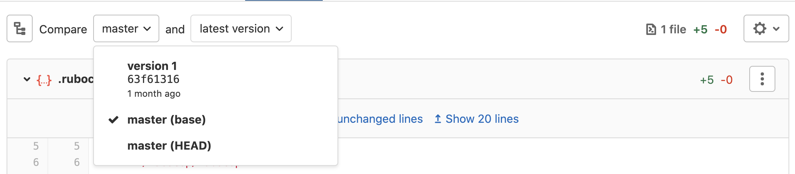

# Working with diffs

We rely on different sources to present diffs. These include:

- Gitaly service
- Database (through `merge_request_diff_files`)
- Redis (cached highlighted diffs)

## Deep Dive

<!-- vale gitlab.Spelling = NO -->

In January 2019, Oswaldo Ferreira hosted a Deep Dive (GitLab team members only:
`https://gitlab.com/gitlab-org/create-stage/issues/1`) on GitLab Diffs and Commenting on Diffs
functionality to share domain-specific knowledge with anyone who may work in this part of the
codebase in the future:

<!-- vale gitlab.Spelling = YES -->

- <i class="fa fa-youtube-play youtube" aria-hidden="true"></i>
  [Recording on YouTube](https://www.youtube.com/watch?v=K6G3gMcFyek)
- Slides on [Google Slides](https://docs.google.com/presentation/d/1bGutFH2AT3bxOPZuLMGl1ANWHqFnrxwQwjiwAZkF-TU/edit)
- [PDF slides](https://gitlab.com/gitlab-org/create-stage/uploads/b5ad2f336e0afcfe0f99db0af0ccc71a/)

Everything covered in this deep dive was accurate as of GitLab 11.7, and while specific details may
have changed since then, it should still serve as a good introduction.

## Architecture overview

### Merge request diffs

When refreshing a Merge Request (pushing to a source branch, force-pushing to target branch, or if the target branch now contains any commits from the MR)
we fetch the comparison information using `Gitlab::Git::Compare`, which fetches `base` and `head` data using Gitaly and diff between them through
`Gitlab::Git::Diff.between`.
The diffs fetching process _limits_ single file diff sizes and the overall size of the whole diff through a series of constant values. Raw diff files are
then persisted on `merge_request_diff_files` table.

Even though diffs larger than 10% of the value of `ApplicationSettings#diff_max_patch_bytes` are collapsed,
we still keep them on PostgreSQL. However, diff files larger than defined _safety limits_
(see the [Diff limits section](#diff-limits)) are _not_ persisted in the database.

In order to present diffs information on the Merge Request diffs page, we:

1. Fetch all diff files from database `merge_request_diff_files`
1. Fetch the _old_ and _new_ file blobs in batch to:
   - Highlight old and new file content
   - Know which viewer it should use for each file (text, image, deleted, etc)
   - Know if the file content changed
   - Know if it was stored externally
   - Know if it had storage errors
1. If the diff file is cacheable (text-based), it's cached on Redis
   using `Gitlab::Diff::FileCollection::MergeRequestDiff`

### Note diffs

When commenting on a diff (any comparison), we persist a truncated diff version
on `NoteDiffFile` (which is associated with the actual `DiffNote`). So instead
of hitting the repository every time we need the diff of the file, we:

1. Check whether we have the `NoteDiffFile#diff` persisted and use it
1. Otherwise, if it's a current MR revision, use the persisted
   `MergeRequestDiffFile#diff`
1. In the last scenario, go the repository and fetch the diff

## Diff limits

As explained above, we limit single diff files and the size of the whole diff. There are scenarios where we collapse the diff file,
and cases where the diff file is not presented at all, and the user is guided to the Blob view.

### Diff collection limits

Limits that act onto all diff files collection. Files number, lines number and files size are considered.

```ruby
Gitlab::Git::DiffCollection.collection_limits[:safe_max_files] = Gitlab::Git::DiffCollection::DEFAULT_LIMITS[:max_files] = 100
```

File diffs are collapsed (but are expandable) if 100 files have already been rendered.

```ruby
Gitlab::Git::DiffCollection.collection_limits[:safe_max_lines] = Gitlab::Git::DiffCollection::DEFAULT_LIMITS[:max_lines] = 5000
```

File diffs are collapsed (but be expandable) if 5000 lines have already been rendered.

```ruby
Gitlab::Git::DiffCollection.collection_limits[:safe_max_bytes] = Gitlab::Git::DiffCollection.collection_limits[:safe_max_files] * 5.kilobytes = 500.kilobytes
```

File diffs are collapsed (but be expandable) if 500 kilobytes have already been rendered.

```ruby
Gitlab::Git::DiffCollection.collection_limits[:max_files] = Commit::DIFF_HARD_LIMIT_FILES = 1000
```

No more files are rendered at all if 1000 files have already been rendered.

```ruby
Gitlab::Git::DiffCollection.collection_limits[:max_lines] = Commit::DIFF_HARD_LIMIT_LINES = 50000
```

No more files are rendered at all if 50,000 lines have already been rendered.

```ruby
Gitlab::Git::DiffCollection.collection_limits[:max_bytes] = Gitlab::Git::DiffCollection.collection_limits[:max_files] * 5.kilobytes = 5000.kilobytes
```

No more files are rendered at all if 5 megabytes have already been rendered.

All collection limit parameters are sent and applied on Gitaly. That is, after the limit is surpassed,
Gitaly only returns the safe amount of data to be persisted on `merge_request_diff_files`.

### Individual diff file limits

Limits that act onto each diff file of a collection. Files number, lines number and files size are considered.

#### Expandable patches (collapsed)

Diff patches are collapsed when surpassing 10% of the value set in `ApplicationSettings#diff_max_patch_bytes`.
That is, it's equivalent to 10kb if the maximum allowed value is 100kb.
The diff is persisted and expandable if the patch size doesn't
surpass `ApplicationSettings#diff_max_patch_bytes`.

Although this nomenclature (Collapsing) is also used on Gitaly, this limit is only used on GitLab (hardcoded - not sent to Gitaly).
Gitaly only returns `Diff.Collapsed` (RPC) when surpassing collection limits.

#### Not expandable patches (too large)

The patch not be rendered if it's larger than `ApplicationSettings#diff_max_patch_bytes`.
Users see a `Changes are too large to be shown.` message and a button to view only that file in that commit.

```ruby
Commit::DIFF_SAFE_LINES = Gitlab::Git::DiffCollection::DEFAULT_LIMITS[:max_lines] = 5000
```

File diff is suppressed (technically different from collapsed, but behaves the same, and is expandable) if it has more than 5000 lines.

This limit is hardcoded and only applied on GitLab.

## Viewers

Diff Viewers, which can be found on `models/diff_viewer/*` are classes used to map metadata about each type of Diff File. It has information
whether it's a binary, which partial should be used to render it or which File extensions this class accounts for.

`DiffViewer::Base` validates _blobs_ (old and new versions) content, extension and file type in order to check if it can be rendered.

## Merge request diffs against the `HEAD` of the target branch

Historically, merge request diffs have been calculated by `git diff target...source` which compares the
`HEAD` of the source branch with the merge base (or a common ancestor) of the target branch and the source's.
This solution works well until the target branch starts containing some of the
changes introduced by the source branch: Consider the following case, in which the source branch
is `feature_a` and the target is `main`:

1. Checkout a new branch `feature_a` from `main` and remove `file_a` and `file_b` in it.
1. Add a commit that removes `file_a` to `main`.

The merge request diff still contains the `file_a` removal while the actual diff compared to
`main`'s `HEAD` has only the `file_b` removal. The diff with such redundant
changes is harder to review.

In order to display an up-to-date diff, in GitLab 12.9 we
[introduced](https://gitlab.com/gitlab-org/gitlab/-/issues/27008) merge request
diffs compared against `HEAD` of the target branch: the
target branch is artificially merged into the source branch, then the resulting
merge ref is compared to the source branch in order to calculate an accurate
diff.

Until we complete the epics ["use merge refs for diffs"](https://gitlab.com/groups/gitlab-org/-/epics/854)
and ["merge conflicts in diffs"](https://gitlab.com/groups/gitlab-org/-/epics/4893),
both options `main (base)` and `main (HEAD)` are available to be displayed in merge requests:



The `main (HEAD)` option is meant to replace `main (base)` in the future.

In order to support comments for both options, diff note positions are stored for
both `main (base)` and `main (HEAD)` versions ([introduced](https://gitlab.com/gitlab-org/gitlab/-/issues/198457) in 12.10).
The position for `main (base)` version is stored in `Note#position` and
`Note#original_position` columns, for `main (HEAD)` version `DiffNotePosition`
has been introduced.

One of the key challenges to deal with when working on merge ref diffs are merge
conflicts. If the target and source branch contains a merge conflict, the branches
cannot be automatically merged. The
<i class="fa fa-youtube-play youtube" aria-hidden="true"></i> [recording on YouTube](https://www.youtube.com/watch?v=GFXIFA4ZuZw&feature=youtu.be&ab_channel=GitLabUnfiltered)
is a quick introduction to the problem and the motivation behind the [epic](https://gitlab.com/groups/gitlab-org/-/epics/854).

In 13.5 a solution for both-modified merge
conflict has been
[introduced](https://gitlab.com/gitlab-org/gitlab/-/issues/232484). However,
there are more classes of merge conflicts that are to be
[addressed](https://gitlab.com/groups/gitlab-org/-/epics/4893) in the future.
