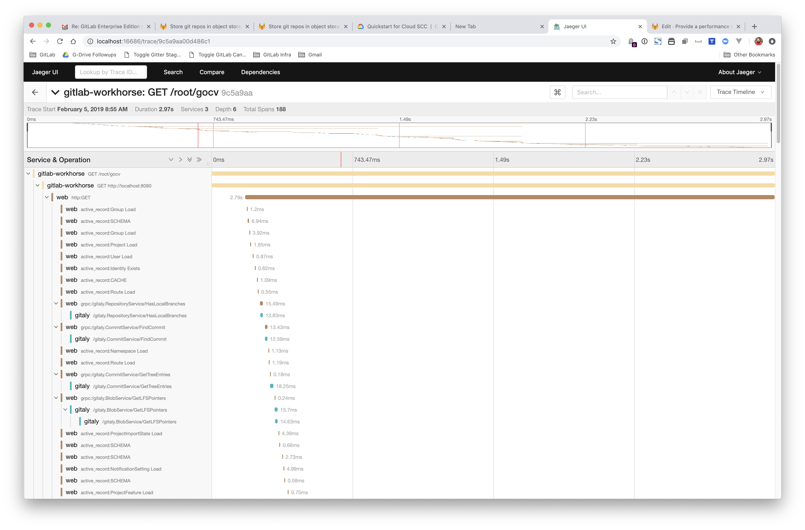

# Distributed Tracing - development guidelines **(FREE)**

GitLab is instrumented for distributed tracing. Distributed Tracing in GitLab is currently considered **experimental**, as it has not yet been tested at scale on GitLab.com.

According to [Open Tracing](https://opentracing.io/docs/overview/what-is-tracing/):

> Distributed tracing, also called distributed request tracing, is a method used to profile and
> monitor applications, especially those built using a microservices architecture. Distributed
> tracing helps to pinpoint where failures occur and what causes poor performance.

Distributed tracing is especially helpful in understanding the life cycle of a request as it passes
through the different components of the GitLab application. At present, Workhorse, Rails, Sidekiq,
and Gitaly support tracing instrumentation.

Distributed tracing adds minimal overhead when disabled, but imposes only small overhead when
enabled and is therefore capable in any environment, including production. For this reason, it can
be useful in diagnosing production issues, particularly performance problems.

## Using Correlation IDs to investigate distributed requests

The GitLab application passes correlation IDs between the various components in a request. A
correlation ID is a token, unique to a single request, used to correlate a single request between
different GitLab subsystems (for example, Rails, Workhorse). Since correlation IDs are included in
log output, Engineers can use the correlation ID to correlate logs from different subsystems and
better understand the end-to-end path of a request through the system. When a request traverses
process boundaries, the correlation ID is injected into the outgoing request. This enables
the propagation of the correlation ID to each downstream subsystem.

Correlation IDs are normally generated in the Rails application in response to
certain web requests. Some user facing systems don't generate correlation IDs in
response to user requests (for example, Git pushes over SSH).

### Developer guidelines for working with correlation IDs

When integrating tracing into a new system, developers should avoid making
certain assumptions about correlation IDs. The following guidelines apply to
all subsystems at GitLab:

- Correlation IDs are always optional.
  - Never have non-tracing features depend on the existence of a correlation ID
    from an upstream system.
- Correlation IDs are always free text.
  - Correlation IDs should never be used to pass context (for example, a username or an IP address).
  - Correlation IDs should never be _parsed_, or manipulated in other ways (for example, split).

The [LabKit library](https://gitlab.com/gitlab-org/labkit) provides a standardized interface for working with GitLab
correlation IDs in the Go programming language. LabKit can be used as a
reference implementation for developers working with tracing and correlation IDs
on non-Go GitLab subsystems.

## Enabling distributed tracing

GitLab uses the `GITLAB_TRACING` environment variable to configure distributed tracing. The same
configuration is used for all components (e.g., Workhorse, Rails, etc).

When `GITLAB_TRACING` is not set, the application isn't instrumented, meaning that there is
no overhead at all.

To enable `GITLAB_TRACING`, a valid _"configuration-string"_ value should be set, with a URL-like
form:

```shell
GITLAB_TRACING=opentracing://<driver>?<param_name>=<param_value>&<param_name_2>=<param_value_2>
```

In this example, we have the following hypothetical values:

- `driver`: the driver. [GitLab supports
  `jaeger`](../operations/tracing.md). In future, other
  tracing implementations may also be supported.
- `param_name`, `param_value`: these are driver specific configuration values. Configuration
  parameters for Jaeger are documented [further on in this
  document](#2-configure-the-gitlab_tracing-environment-variable) they should be URL encoded.
  Multiple values should be separated by `&` characters like a URL.

## Using Jaeger in the GitLab Development Kit

The first tracing implementation that GitLab supports is Jaeger, and the [GitLab Development
Kit](https://gitlab.com/gitlab-org/gitlab-development-kit/) supports distributed tracing with
Jaeger out-of-the-box.

The easiest way to access tracing from a GDK environment is through the
[performance-bar](../administration/monitoring/performance/performance_bar.md). This can be shown
by typing `p` `b` in the browser window.

Once the performance bar is enabled, click on the **Trace** link in the performance bar to go to
the Jaeger UI.

The Jaeger search UI returns a query for the `Correlation-ID` of the current request. Normally,
this search should return a single trace result. Clicking this result shows the detail of the
trace in a hierarchical time-line.



## Using Jaeger without the GitLab Developer Kit

Distributed Tracing can be enabled in non-GDK development environments as well as production or
staging environments, for troubleshooting. Please note that at this time, this functionality is
experimental, and not supported in production environments at present. In this first release, it is intended to be
used for debugging in development environments only.

Jaeger tracing can be enabled through a three-step process:

1. [Start Jaeger](#1-start-jaeger).
1. [Configure the `GITLAB_TRACING` environment variable](#2-configure-the-gitlab_tracing-environment-variable).
1. [Start the GitLab application](#3-start-the-gitlab-application).
1. [Go to the Jaeger Search UI in your browser](#4-open-the-jaeger-search-ui).

### 1. Start Jaeger

Jaeger has many configuration options, but is very easy to start in an "all-in-one" mode which uses
memory for trace storage (and is therefore non-persistent). The main advantage of "all-in-one" mode
being ease of use.

For more detailed configuration options, refer to the [Jaeger
documentation](https://www.jaegertracing.io/docs/1.9/getting-started/).

#### Using Docker

If you have Docker available, the easier approach to running the Jaeger all-in-one is through
Docker, using the following command:

```shell
$ docker run \
  --rm \
  -e COLLECTOR_ZIPKIN_HTTP_PORT=9411  \
  -p 5775:5775/udp \
  -p 6831:6831/udp \
  -p 6832:6832/udp \
  -p 5778:5778 \
  -p 16686:16686 \
  -p 14268:14268 \
  -p 9411:9411 \
  jaegertracing/all-in-one:latest
```

#### Using the Jaeger process

Without Docker, the all-in-one process is still easy to setup.

1. Download the [latest Jaeger release](https://github.com/jaegertracing/jaeger/releases) for your
   platform.
1. Extract the archive and run the `bin/all-in-one` process.

This should start the process with the default listening ports.

### 2. Configure the `GITLAB_TRACING` environment variable

Once you have Jaeger running, configure the `GITLAB_TRACING` variable with the
appropriate configuration string.

If you're running everything on the same host, use the following value:

```shell
export GITLAB_TRACING="opentracing://jaeger?http_endpoint=http%3A%2F%2Flocalhost%3A14268%2Fapi%2Ftraces&sampler=const&sampler_param=1"
```

This configuration string uses the Jaeger driver `opentracing://jaeger` with the following options:

| Name | Value | Description |
|------|-------|-------------|
| `http_endpoint` | `http://localhost:14268/api/traces` | Configures Jaeger to send trace information to the HTTP endpoint running on `http://localhost:14268/`. Alternatively, the `upd_endpoint` can be used. |
| `sampler` | `const` | Configures Jaeger to use the constant sampler (either on or off). |
| `sampler_param` | `1` | Configures the `const` sampler to sample _all_ traces. Using `0` would sample _no_ traces. |

**Other parameter values are also possible:**

| Name | Example | Description |
|------|-------|-------------|
| `udp_endpoint` | `localhost:6831` | This is the default. Configures Jaeger to send trace information to the UDP listener on port `6831` using compact thrift protocol. Note that we've experienced some issues with the [Jaeger Client for Ruby](https://github.com/salemove/jaeger-client-ruby) when using this protocol. |
| `sampler` | `probabalistic` | Configures Jaeger to use a probabilistic random sampler. The rate of samples is configured by the `sampler_param` value. |
| `sampler_param` | `0.01` | Use a ratio of `0.01` to configure the `probabalistic` sampler to randomly sample _1%_ of traces. |
| `service_name` | `api` | Override the service name used by the Jaeger backend. This parameter takes precedence over the application-supplied value. |

NOTE:
The same `GITLAB_TRACING` value should to be configured in the environment
variables for all GitLab processes, including Workhorse, Gitaly, Rails, and Sidekiq.

### 3. Start the GitLab application

After the `GITLAB_TRACING` environment variable is exported to all GitLab services, start the
application.

When `GITLAB_TRACING` is configured properly, the application logs this on startup:

```shell
13:41:53 gitlab-workhorse.1      | 2019/02/12 13:41:53 Tracing enabled
...
13:41:54 gitaly.1                | 2019/02/12 13:41:54 Tracing enabled
...
```

If `GITLAB_TRACING` is not configured correctly, this issue is logged:

```shell
13:43:45 gitaly.1                | 2019/02/12 13:43:45 skipping tracing configuration step: tracer: unable to load driver mytracer
```

By default, GitLab ships with the Jaeger tracer, but other tracers can be included at compile time.
Details of how this can be done are included in the [LabKit tracing
documentation](https://pkg.go.dev/gitlab.com/gitlab-org/labkit/tracing).

If no log messages about tracing are emitted, the `GITLAB_TRACING` environment variable is likely
not set.

### 4. Open the Jaeger Search UI

By default, the Jaeger search UI is available at <http://localhost:16686/search>.

NOTE:
Don't forget that you must generate traces by using the application before
they appear in the Jaeger UI.
