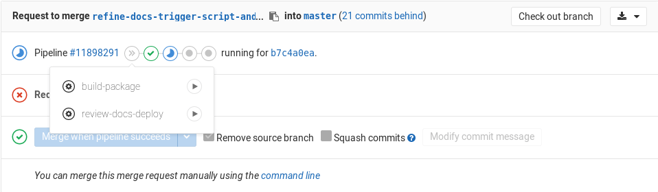

# GitLab Documentation guidelines

GitLab's documentation is [intended as the single source of truth (SSOT)](https://about.gitlab.com/handbook/documentation/) for information about how to configure, use, and troubleshoot GitLab. The documentation contains use cases and usage instructions for every GitLab feature, organized by product area and subject. This includes topics and workflows that span multiple GitLab features, and the use of GitLab with other applications.

In addition to this page, the following resources can help you craft and contribute documentation:

- [Style Guide](styleguide.md) - What belongs in the docs, language guidelines, Markdown standards to follow, and more.
- [Structure and template](structure.md) - Learn the typical parts of a doc page and how to write each one.
- [Documentation process](workflow.md).
- [Markdown Guide](../../user/markdown.md) - A reference for all Markdown syntax supported by GitLab.
- [Site architecture](site_architecture/index.md) - How <https://docs.gitlab.com> is built.

## Source files and rendered web locations

Documentation for GitLab, GitLab Runner, Omnibus GitLab and Charts is published to <https://docs.gitlab.com>. Documentation for GitLab is also published within the application at `/help` on the domain of the GitLab instance.
At `/help`, only help for your current edition and version is included. Help for other versions is available at <https://docs.gitlab.com/archives/>.

The source of the documentation exists within the codebase of each GitLab application in the following repository locations:

| Project | Path |
| --- | --- |
| [GitLab](https://gitlab.com/gitlab-org/gitlab/) | [`/doc`](https://gitlab.com/gitlab-org/gitlab/tree/master/doc) |
| [GitLab Runner](https://gitlab.com/gitlab-org/gitlab-runner/) | [`/docs`](https://gitlab.com/gitlab-org/gitlab-runner/tree/master/docs) |
| [Omnibus GitLab](https://gitlab.com/gitlab-org/omnibus-gitlab/) | [`/doc`](https://gitlab.com/gitlab-org/gitlab/tree/master/doc) |
| [Charts](https://gitlab.com/gitlab-org/charts/gitlab) | [`/doc`](https://gitlab.com/gitlab-org/charts/gitlab/tree/master/doc) |

Documentation issues and merge requests are part of their respective repositories and all have the label `Documentation`.

### Branch naming

The [CI pipeline for the main GitLab project](../pipelines.md) is configured to automatically
run only the jobs that match the type of contribution. If your contribution contains
**only** documentation changes, then only documentation-related jobs will be run, and
the pipeline will complete much faster than a code contribution.

If you are submitting documentation-only changes to Runner, Omnibus, or Charts,
the fast pipeline is not determined automatically. Instead, create branches for
docs-only merge requests using the following guide:

| Branch name           | Valid example                |
|:----------------------|:-----------------------------|
| Starting with `docs/` | `docs/update-api-issues`     |
| Starting with `docs-` | `docs-update-api-issues`     |
| Ending in `-docs`     | `123-update-api-issues-docs` |

## Contributing to docs

[Contributions to GitLab docs](workflow.md) are welcome from the entire GitLab community.

To ensure that GitLab docs are current, there are special processes and responsibilities for all [feature changes](feature-change-workflow.md)—i.e. development work that impacts the appearance, usage, or administration of a feature.

However, anyone can contribute [documentation improvements](improvement-workflow.md) that are not associated with a feature change. For example, adding a new doc on how to accomplish a use case that's already possible with GitLab or with third-party tools and GitLab.

## Markdown and styles

[GitLab docs](https://gitlab.com/gitlab-org/gitlab-docs) uses [GitLab Kramdown](https://gitlab.com/gitlab-org/gitlab_kramdown)
as its Markdown rendering engine. See the [GitLab Markdown Guide](https://about.gitlab.com/handbook/product/technical-writing/markdown-guide/) for a complete Kramdown reference.

Adhere to the [Documentation Style Guide](styleguide.md). If a style standard is missing, you are welcome to suggest one via a merge request.

## Folder structure and files

See the [Structure](styleguide.md#structure) section of the [Documentation Style Guide](styleguide.md).

## Changing document location

Changing a document's location requires specific steps to ensure that
users can seamlessly access the new doc page, whether they are accessing content
on a GitLab instance domain at `/help` or at <https://docs.gitlab.com>. Be sure to assign a
technical writer if you have any questions during the process (such as
whether the move is necessary), and ensure that a technical writer reviews this
change prior to merging.

If you indeed need to change a document's location, do not remove the old
document, but instead replace all of its content with a new line:

```md
This document was moved to [another location](path/to/new_doc.md).
```

where `path/to/new_doc.md` is the relative path to the root directory `doc/`.

For example, if you move `doc/workflow/lfs/lfs_administration.md` to
`doc/administration/lfs.md`, then the steps would be:

1. Copy `doc/workflow/lfs/lfs_administration.md` to `doc/administration/lfs.md`
1. Replace the contents of `doc/workflow/lfs/lfs_administration.md` with:

   ```md
   This document was moved to [another location](../../administration/lfs.md).
   ```

1. Find and replace any occurrences of the old location with the new one.
   A quick way to find them is to use `git grep`. First go to the root directory
   where you cloned the `gitlab` repository and then do:

   ```sh
   git grep -n "workflow/lfs/lfs_administration"
   git grep -n "lfs/lfs_administration"
   ```

NOTE: **Note:**
If the document being moved has any Disqus comments on it, there are extra steps
to follow documented just [below](#redirections-for-pages-with-disqus-comments).

Things to note:

- Since we also use inline documentation, except for the documentation itself,
  the document might also be referenced in the views of GitLab (`app/`) which will
  render when visiting `/help`, and sometimes in the testing suite (`spec/`).
  You must search these paths for references to the doc and update them as well.
- The above `git grep` command will search recursively in the directory you run
  it in for `workflow/lfs/lfs_administration` and `lfs/lfs_administration`
  and will print the file and the line where this file is mentioned.
  You may ask why the two greps. Since we use relative paths to link to
  documentation, sometimes it might be useful to search a path deeper.
- The `*.md` extension is not used when a document is linked to GitLab's
  built-in help page, that's why we omit it in `git grep`.
- Use the checklist on the "Change documentation location" MR description template.

### Alternative redirection method

You can also replace the content
of the old file with a frontmatter containing a redirect link:

```yaml
---
redirect_to: '../path/to/file/README.md'
---
```

It supports both full and relative URLs, e.g. `https://docs.gitlab.com/ee/path/to/file.html`, `../path/to/file.html`, `path/to/file.md`. Note that any `*.md` paths will be compiled to `*.html`.

NOTE: **Note:**
This redirection method will not provide a redirect fallback on GitLab `/help`. When using
it, make sure to add a link to the new page on the doc, otherwise it's a dead end for users that
land on the doc via `/help`.

### Redirections for pages with Disqus comments

If the documentation page being relocated already has Disqus comments,
we need to preserve the Disqus thread.

Disqus uses an identifier per page, and for <https://docs.gitlab.com>, the page identifier
is configured to be the page URL. Therefore, when we change the document location,
we need to preserve the old URL as the same Disqus identifier.

To do that, add to the frontmatter the variable `disqus_identifier`,
using the old URL as value. For example, let's say I moved the document
available under `https://docs.gitlab.com/my-old-location/README.html` to a new location,
`https://docs.gitlab.com/my-new-location/index.html`.

Into the **new document** frontmatter add the following:

```yaml
---
disqus_identifier: 'https://docs.gitlab.com/my-old-location/README.html'
---
```

Note: it is necessary to include the file name in the `disqus_identifier` URL,
even if it's `index.html` or `README.html`.

## Merge requests for GitLab documentation

Before getting started, make sure you read the introductory section
"[contributing to docs](#contributing-to-docs)" above and the
[documentation workflow](workflow.md).

- Use the current [merge request description template](https://gitlab.com/gitlab-org/gitlab/blob/master/.gitlab/merge_request_templates/Documentation.md)
- Label the MR `Documentation`
- Assign the correct milestone (see note below)

Documentation will be merged if it is an improvement on existing content,
represents a good-faith effort to follow the template and style standards,
and is believed to be accurate.

Further needs for what would make the doc even better should be immediately addressed
in a follow-up MR or issue.

NOTE: **Note:**
If the release version you want to add the documentation to has already been
frozen or released, use the label `Pick into X.Y` to get it merged into
the correct release. Avoid picking into a past release as much as you can, as
it increases the work of the release managers.

## GitLab `/help`

Every GitLab instance includes the documentation, which is available at `/help`
(`https://gitlab.example.com/help`). For example, <https://gitlab.com/help>.

There are [plans](https://gitlab.com/groups/gitlab-org/-/epics/693) to end this
practice and instead link out from the GitLab application to <https://docs.gitlab.com> URLs.

The documentation available online on <https://docs.gitlab.com> is continuously
deployed every hour from the `master` branch of GitLab, Omnibus, and Runner. Therefore,
once a merge request gets merged, it will be available online on the same day.
However, they will be shipped (and available on `/help`) within the milestone assigned
to the MR.

For instance, let's say your merge request has a milestone set to 11.3, which
will be released on 2018-09-22. If it gets merged on 2018-09-15, it will be
available online on 2018-09-15, but, as the feature freeze date has passed, if
the MR does not have a "pick into 11.3" label, the milestone has to be changed
to 11.4 and it will be shipped with all GitLab packages only on 2018-10-22,
with GitLab 11.4. Meaning, it will only be available under `/help` from GitLab
11.4 onwards, but available on <https://docs.gitlab.com/> on the same day it was merged.

### Linking to `/help`

When you're building a new feature, you may need to link the documentation
from GitLab, the application. This is normally done in files inside the
`app/views/` directory with the help of the `help_page_path` helper method.

In its simplest form, the HAML code to generate a link to the `/help` page is:

```haml
= link_to 'Help page', help_page_path('user/permissions')
```

The `help_page_path` contains the path to the document you want to link to with
the following conventions:

- it is relative to the `doc/` directory in the GitLab repository
- the `.md` extension must be omitted
- it must not end with a slash (`/`)

Below are some special cases where should be used depending on the context.
You can combine one or more of the following:

1. **Linking to an anchor link.** Use `anchor` as part of the `help_page_path`
   method:

   ```haml
   = link_to 'Help page', help_page_path('user/permissions', anchor: 'anchor-link')
   ```

1. **Opening links in a new tab.** This should be the default behavior:

   ```haml
   = link_to 'Help page', help_page_path('user/permissions'), target: '_blank'
   ```

1. **Linking to a circle icon.** Usually used in settings where a long
   description cannot be used, like near checkboxes. You can basically use
   any font awesome icon, but prefer the `question-circle`:

   ```haml
   = link_to icon('question-circle'), help_page_path('user/permissions')
   ```

1. **Using a button link.** Useful in places where text would be out of context
   with the rest of the page layout:

   ```haml
   = link_to 'Help page', help_page_path('user/permissions'),  class: 'btn btn-info'
   ```

1. **Using links inline of some text.**

   ```haml
   Description to #{link_to 'Help page', help_page_path('user/permissions')}.
   ```

1. **Adding a period at the end of the sentence.** Useful when you don't want
   the period to be part of the link:

   ```haml
   = succeed '.' do
     Learn more in the
     = link_to 'Help page', help_page_path('user/permissions')
   ```

### GitLab `/help` tests

Several [rspec tests](https://gitlab.com/gitlab-org/gitlab/blob/master/spec/features/help_pages_spec.rb)
are run to ensure GitLab documentation renders and works correctly. In particular, that [main docs landing page](../../README.md) will work correctly from `/help`.
For example, [GitLab.com's `/help`](https://gitlab.com/help).

## Docs site architecture

See the [Docs site architecture](site_architecture/index.md) page to learn
how we build and deploy the site at <https://docs.gitlab.com> and
to review all the assets and libraries in use.

### Global navigation

See the [Global navigation](site_architecture/global_nav.md) doc for information
on how the left-side navigation menu is built and updated.

## Previewing the changes live

NOTE: **Note:**
To preview your changes to documentation locally, follow this
[development guide](https://gitlab.com/gitlab-org/gitlab-docs/blob/master/README.md#development-when-contributing-to-gitlab-documentation) or [these instructions for GDK](https://gitlab.com/gitlab-org/gitlab-development-kit/blob/master/doc/howto/gitlab_docs.md).

The live preview is currently enabled for the following projects:

- <https://gitlab.com/gitlab-org/gitlab>
- <https://gitlab.com/gitlab-org/gitlab-runner>

If your merge request has docs changes, you can use the manual `review-docs-deploy` job
to deploy the docs review app for your merge request.
You will need at least Maintainer permissions to be able to run it.



NOTE: **Note:**
You will need to push a branch to those repositories, it doesn't work for forks.

The `review-docs-deploy*` job will:

1. Create a new branch in the [`gitlab-docs`](https://gitlab.com/gitlab-org/gitlab-docs)
   project named after the scheme: `docs-preview-$DOCS_GITLAB_REPO_SUFFIX-$CI_MERGE_REQUEST_IID`,
   where `DOCS_GITLAB_REPO_SUFFIX` is the suffix for each product, e.g, `ee` for
   EE, `omnibus` for Omnibus GitLab, etc, and `CI_MERGE_REQUEST_IID` is the ID
   of the respective merge request.
1. Trigger a cross project pipeline and build the docs site with your changes.

In case the review app URL returns 404, this means that either the site is not
yet deployed, or something went wrong with the remote pipeline. Give it a few
minutes and it should appear online, otherwise you can check the status of the
remote pipeline from the link in the merge request's job output.
If the pipeline failed or got stuck, drop a line in the `#docs` chat channel.

TIP: **Tip:**
Someone with no merge rights to the GitLab projects (think of forks from
contributors) cannot run the manual job. In that case, you can
ask someone from the GitLab team who has the permissions to do that for you.

NOTE: **Note:**
Make sure that you always delete the branch of the merge request you were
working on. If you don't, the remote docs branch won't be removed either,
and the server where the Review Apps are hosted will eventually be out of
disk space.

### Troubleshooting review apps

In case the review app URL returns 404, follow these steps to debug:

1. **Did you follow the URL from the merge request widget?** If yes, then check if
   the link is the same as the one in the job output.
1. **Did you follow the URL from the job output?** If yes, then it means that
   either the site is not yet deployed or something went wrong with the remote
   pipeline. Give it a few minutes and it should appear online, otherwise you
   can check the status of the remote pipeline from the link in the job output.
   If the pipeline failed or got stuck, drop a line in the `#docs` chat channel.

### Technical aspects

If you want to know the in-depth details, here's what's really happening:

1. You manually run the `review-docs-deploy` job in a merge request.
1. The job runs the [`scripts/trigger-build-docs`](https://gitlab.com/gitlab-org/gitlab/blob/master/scripts/trigger-build-docs)
   script with the `deploy` flag, which in turn:
   1. Takes your branch name and applies the following:
      - The `docs-preview-` prefix is added.
      - The product slug is used to know the project the review app originated
        from.
      - The number of the merge request is added so that you can know by the
        `gitlab-docs` branch name the merge request it originated from.
   1. The remote branch is then created if it doesn't exist (meaning you can
      re-run the manual job as many times as you want and this step will be skipped).
   1. A new cross-project pipeline is triggered in the docs project.
   1. The preview URL is shown both at the job output and in the merge request
      widget. You also get the link to the remote pipeline.
1. In the docs project, the pipeline is created and it
   [skips the test jobs](https://gitlab.com/gitlab-org/gitlab-docs/blob/8d5d5c750c602a835614b02f9db42ead1c4b2f5e/.gitlab-ci.yml#L50-55)
   to lower the build time.
1. Once the docs site is built, the HTML files are uploaded as artifacts.
1. A specific Runner tied only to the docs project, runs the Review App job
   that downloads the artifacts and uses `rsync` to transfer the files over
   to a location where NGINX serves them.

The following GitLab features are used among others:

- [Manual actions](../../ci/yaml/README.md#whenmanual)
- [Multi project pipelines](../../ci/multi_project_pipeline_graphs.md)
- [Review Apps](../../ci/review_apps/index.md)
- [Artifacts](../../ci/yaml/README.md#artifacts)
- [Specific Runner](../../ci/runners/README.md#locking-a-specific-runner-from-being-enabled-for-other-projects)
- [Pipelines for merge requests](../../ci/merge_request_pipelines/index.md)

## Testing

We treat documentation as code, and so use tests in our CI pipeline to maintain the
standards and quality of the docs. The current tests, which run in CI jobs when a
merge request with new or changed docs is submitted, are:

- [`docs lint`](https://gitlab.com/gitlab-org/gitlab/blob/master/.gitlab/ci/docs.gitlab-ci.yml#L48):
  Runs several tests on the content of the docs themselves:
  - [`lint-doc.sh` script](https://gitlab.com/gitlab-org/gitlab/blob/master/scripts/lint-doc.sh)
    checks that:
    - All cURL examples use the long flags (ex: `--header`, not `-H`).
    - The `CHANGELOG.md` does not contain duplicate versions.
    - No files in `doc/` are executable.
    - No new `README.md` was added.
  - [markdownlint](#markdownlint).
  - Nanoc tests, which you can [run locally](#previewing-the-changes-live) before
    pushing to GitLab by executing the command `bundle exec nanoc check internal_links`
    (or `internal_anchors`) on your local [`gitlab-docs`](https://gitlab.com/gitlab-org/gitlab-docs) directory:
    - [`internal_links`](https://gitlab.com/gitlab-org/gitlab/blob/master/.gitlab/ci/docs.gitlab-ci.yml#L67)
      checks that all internal links (ex: `[link](../index.md)`) are valid.
    - [`internal_anchors`](https://gitlab.com/gitlab-org/gitlab/blob/master/.gitlab/ci/docs.gitlab-ci.yml#L69)
      checks that all internal anchors (ex: `[link](../index.md#internal_anchor)`)
      are valid.
- If any code or the `doc/README.md` file is changed, a full pipeline will run, which
  runs tests for [`/help`](#gitlab-help-tests).

### Linting

To help adhere to the [documentation style guidelines](styleguide.md), and improve the content
added to documentation, consider locally installing and running documentation linters. This will
help you catch common issues before raising merge requests for review of documentation.

The following are some suggested linters you can install locally and sample configuration:

- [`proselint`](#proselint)
- [markdownlint](#markdownlint), which is the same as the test run in [`docs-lint`](#testing)

NOTE: **Note:**
This list does not limit what other linters you can add to your local documentation writing toolchain.

#### `proselint`

`proselint` checks for common problems with English prose. It provides a
 [plethora of checks](http://proselint.com/checks/) that are helpful for technical writing.

`proselint` can be used [on the command line](http://proselint.com/utility/), either on a single
 Markdown file or on all Markdown files in a project. For example, to run `proselint` on all
 documentation in the [`gitlab` project](https://gitlab.com/gitlab-org/gitlab), run the
 following commands from within the `gitlab` project:

```sh
cd doc
proselint **/*.md
```

`proselint` can also be run from within editors using plugins. For example, the following plugins
 are available:

- [Sublime Text](https://packagecontrol.io/packages/SublimeLinter-contrib-proselint)
- [Visual Studio Code](https://marketplace.visualstudio.com/items?itemName=PatrykPeszko.vscode-proselint)
- [Others](https://github.com/amperser/proselint#plugins-for-other-software)

##### Sample `proselint` configuration

All of the checks are good to use. However, excluding the `typography.symbols` and `misc.phrasal_adjectives` checks will reduce
noise. The following sample `proselint` configuration disables these checks:

```json
{
  "checks": {
    "typography.symbols": false,
    "misc.phrasal_adjectives": false
  }
}
```

A file with `proselint` configuration must be placed in a
[valid location](https://github.com/amperser/proselint#checks). For example, `~/.config/proselint/config`.

#### markdownlint

[markdownlint](https://github.com/DavidAnson/markdownlint) checks that Markdown
syntax follows [certain rules](https://github.com/DavidAnson/markdownlint/blob/master/doc/Rules.md#rules),
and is used by the [`docs-lint` test](#testing) with a [configuration file](#markdownlint-configuration).
Our [Documentation Style Guide](styleguide.md#markdown) and [Markdown Guide](https://about.gitlab.com/handbook/product/technical-writing/markdown-guide/)
elaborate on which choices must be made when selecting Markdown syntax for GitLab
documentation. This tool helps catch deviations from those guidelines.

markdownlint can be used [on the command line](https://github.com/igorshubovych/markdownlint-cli#markdownlint-cli--),
either on a single Markdown file or on all Markdown files in a project. For example, to run
markdownlint on all documentation in the [`gitlab` project](https://gitlab.com/gitlab-org/gitlab),
run the following commands from within your `gitlab` project root directory, which will
automatically detect the [`.markdownlint.json`](#markdownlint-configuration) config
file in the root of the project, and test all files in `/doc` and its subdirectories:

```sh
markdownlint 'doc/**/*.md'
```

If you wish to use a different config file, use the `-c` flag:

```sh
markdownlint -c <config-file-name> 'doc/**/*.md'
```

markdownlint can also be run from within text editors using [plugins/extensions](https://github.com/DavidAnson/markdownlint#related),
such as:

- [Sublime Text](https://packagecontrol.io/packages/SublimeLinter-contrib-markdownlint)
- [Visual Studio Code](https://marketplace.visualstudio.com/items?itemName=DavidAnson.vscode-markdownlint)
- [Atom](https://atom.io/packages/linter-node-markdownlint)

It is best to use the [same configuration file](#markdownlint-configuration) as what
is in use in the four repos that are the sources for <https://docs.gitlab.com>. Each
plugin/extension has different requirements regarding the configuration file, which
is explained in each editor's docs.

##### markdownlint configuration

Each formatting issue that markdownlint checks has an associated
[rule](https://github.com/DavidAnson/markdownlint/blob/master/doc/Rules.md#rules).
These rules are configured in the `.markdownlint.json` files located in the root of
four repos that are the sources for <https://docs.gitlab.com>:

- <https://gitlab.com/gitlab-org/gitlab/blob/master/.markdownlint.json>
- <https://gitlab.com/gitlab-org/gitlab-runner/blob/master/.markdownlint.json>
- <https://gitlab.com/gitlab-org/omnibus-gitlab/blob/master/.markdownlint.json>
- <https://gitlab.com/charts/gitlab/blob/master/.markdownlint.json>

By default all rules are enabled, so the configuration file is used to disable unwanted
rules, and also to configure optional parameters for enabled rules as needed. You can
also check [the issue](https://gitlab.com/gitlab-org/gitlab-foss/issues/64352) that
tracked the changes required to implement these rules, and details which rules were
on or off when markdownlint was enabled on the docs.

## Danger Bot

GitLab uses [Danger](https://github.com/danger/danger) for some elements in
code review. For docs changes in merge requests, whenever a change to files under `/doc`
is made, Danger Bot leaves a comment with further instructions about the documentation
process. This is configured in the Dangerfile in the GitLab repo under
[/danger/documentation/](https://gitlab.com/gitlab-org/gitlab/tree/master/danger/documentation).
