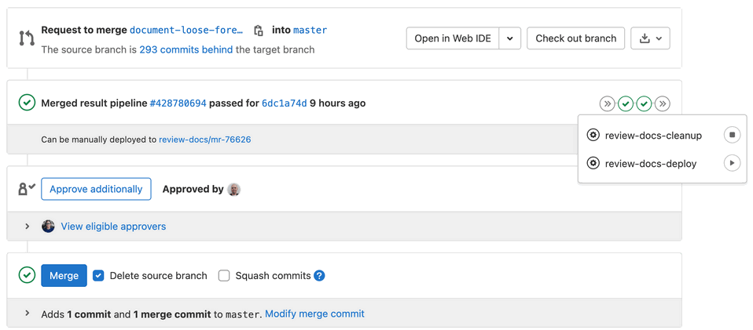

# Documentation review apps

If you're a GitLab team member and your merge request contains documentation changes, you can use a review app to preview
how they would look if they were deployed to the [GitLab Docs site](https://docs.gitlab.com).

Review apps are enabled for the following projects:

- [GitLab](https://gitlab.com/gitlab-org/gitlab)
- [Omnibus GitLab](https://gitlab.com/gitlab-org/omnibus-gitlab)
- [GitLab Runner](https://gitlab.com/gitlab-org/gitlab-runner)
- [GitLab Charts](https://gitlab.com/gitlab-org/charts/gitlab)
- [GitLab Operator](https://gitlab.com/gitlab-org/cloud-native/gitlab-operator)

Alternatively, check the [`gitlab-docs` development guide](https://gitlab.com/gitlab-org/gitlab-docs/blob/main/README.md#development-when-contributing-to-gitlab-documentation)
or [the GDK documentation](https://gitlab.com/gitlab-org/gitlab-development-kit/blob/main/doc/howto/gitlab_docs.md)
to render and preview the documentation locally.

## How to trigger a review app

If a merge request has documentation changes, use the `review-docs-deploy` manual job
to deploy the documentation review app for your merge request.



The `review-docs-deploy*` job triggers a cross project pipeline and builds the
docs site with your changes. When the pipeline finishes, the review app URL
appears in the merge request widget. Use the app to go to your changes.

The `review-docs-cleanup` job is triggered automatically on merge. This job deletes the review app.

You must have the Developer role in the project. Users without the Developer role, such
as external contributors, cannot run the manual job. In that case, ask someone from
the GitLab team to run the job.

## Technical aspects

If you want to know the in-depth details, here's what's really happening:

1. You manually run the `review-docs-deploy` job in a merge request.
1. The job downloads and runs the [`scripts/trigger-build.rb`](https://gitlab.com/gitlab-org/gitlab/-/blob/master/scripts/trigger-build.rb)
   script with the `docs deploy` flag, which triggers the "Triggered from `gitlab-org/gitlab` 'review-docs-deploy' job"
   pipeline trigger in the `gitlab-org/gitlab-docs` project for the `$DOCS_BRANCH` (defaults to `main`).
1. The preview URL is shown both at the job output and in the merge request
   widget. You also get the link to the remote pipeline.
1. In the `gitlab-org/gitlab-docs` project, the pipeline is created and it
   [skips most test jobs](https://gitlab.com/gitlab-org/gitlab-docs/-/blob/d41ca9323f762132780d2d072f845d28817a5383/.gitlab/ci/rules.gitlab-ci.yml#L101-103)
   to lower the build time.
1. After the docs site is built, the HTML files are uploaded as artifacts to
   a GCP bucket (see [issue `gitlab-com/gl-infra/reliability#11021`](https://gitlab.com/gitlab-com/gl-infra/reliability/-/issues/11021)
   for the implementation details).

The following GitLab features are used among others:

- [Manual jobs](../../ci/jobs/job_control.md#create-a-job-that-must-be-run-manually)
- [Multi project pipelines](../../ci/pipelines/downstream_pipelines.md#multi-project-pipelines)
- [Review apps](../../ci/review_apps/index.md)
- [Artifacts](../../ci/yaml/index.md#artifacts)
- [Merge request pipelines](../../ci/pipelines/merge_request_pipelines.md)

## How to add a new documentation review app

In case a documentation review app is missing from one of the documentation
projects, you can use the following CI/CD template to add a manually triggered review app:

```yaml
# Set up documentation review apps
# https://docs.gitlab.com/ee/development/documentation/review_apps.html
.review-docs:
  image: ruby:3.1-alpine
  needs: []
  before_script:
    - gem install gitlab --no-doc
    # We need to download the script rather than clone the repo since the
    # review-docs-cleanup job will not be able to run when the branch gets
    # deleted (when merging the MR).
    - apk add --update openssl
    - wget https://gitlab.com/gitlab-org/gitlab/-/raw/master/scripts/trigger-build.rb
    - chmod 755 trigger-build.rb
  variables:
    GIT_STRATEGY: none
    DOCS_REVIEW_APPS_DOMAIN: docs.gitlab-review.app
    # By default, deploy the Review App using the `main` branch of the `gitlab-org/gitlab-docs` project
    DOCS_BRANCH: main
  when: manual
  allow_failure: true

# Trigger a docs build in gitlab-docs
# Useful to preview the docs changes live
# https://docs.gitlab.com/ee/development/documentation/index.html#previewing-the-changes-live
review-docs-deploy:
  extends:
    - .review-docs
  environment:
    name: review-docs/mr-${CI_MERGE_REQUEST_IID}
    # DOCS_REVIEW_APPS_DOMAIN and DOCS_GITLAB_REPO_SUFFIX are CI variables
    # Discussion: https://gitlab.com/gitlab-org/gitlab-foss/merge_requests/14236/diffs#note_40140693
    auto_stop_in: 2 weeks
    url: https://${DOCS_BRANCH}-${DOCS_GITLAB_REPO_SUFFIX}-${CI_MERGE_REQUEST_IID}.${DOCS_REVIEW_APPS_DOMAIN}/${DOCS_GITLAB_REPO_SUFFIX}
    on_stop: review-docs-cleanup
  script:
  - ./trigger-build.rb docs deploy

# Cleanup remote environment of gitlab-docs
review-docs-cleanup:
  extends:
    - .review-docs
  environment:
    name: review-docs/mr-${CI_MERGE_REQUEST_IID}
    action: stop
  script:
  - ./trigger-build.rb docs cleanup
```

You may need to add some rules when those jobs run, it depends on the project.
You can find the current implementations:

- [GitLab](https://gitlab.com/gitlab-org/gitlab/-/blob/master/.gitlab/ci/docs.gitlab-ci.yml)
- [Omnibus GitLab](https://gitlab.com/gitlab-org/omnibus-gitlab/-/blob/ee8699658c8a7d4c635ad503ef0b825ac592dc4b/gitlab-ci-config/gitlab-com.yml#L367-391)
- [GitLab Runner](https://gitlab.com/gitlab-org/gitlab-runner/-/blob/main/.gitlab/ci/docs.gitlab-ci.yml)
- [GitLab Charts](https://gitlab.com/gitlab-org/charts/gitlab/-/blob/aae7ee8d23a60d6025eec7d1a864ce244f21cd85/.gitlab-ci.yml#L629-679)
- [GitLab Operator](https://gitlab.com/gitlab-org/cloud-native/gitlab-operator/-/blob/5fa29607cf9286b510148a8f5fef7595dca34186/.gitlab-ci.yml#L180-228)

## Troubleshooting review apps

### `NoSuchKey The specified key does not exist`

If you see the following message in a review app, either the site is not
yet deployed, or something went wrong with the downstream pipeline in `gitlab-docs`.

```plaintext
NoSuchKeyThe specified key does not exist.No such object: <URL>
```

In that case, you can:

- Wait a few minutes and the review app should appear online.
- Check the `review-docs-deploy` job's log and verify the URL. If the URL shown in the merge
  request UI is different than the job log, try the one from the job log.
- Check the status of the remote pipeline from the link in the merge request's job output.
  If the pipeline failed or got stuck, GitLab team members can ask for help in the `#docs`
  internal Slack channel. Contributors can ping a
  [technical writer](https://handbook.gitlab.com/handbook/product/ux/technical-writing/#assignments-to-devops-stages-and-groups)
  in the merge request.
