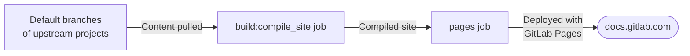
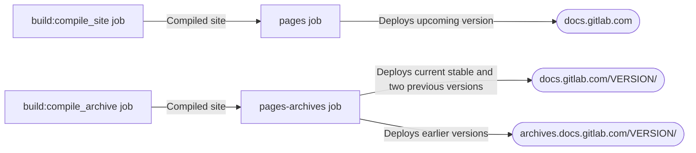

## Deployment environments

The [GitLab documentation site](https://docs.gitlab.com) is a static site hosted by [GitLab Pages](../../../user/project/pages/_index.md).
The deployment is done by the [Pages deploy jobs](#pages-deploy-jobs).

The website hosts documentation only for the [supported](https://about.gitlab.com/support/statement-of-support/#version-support) GitLab versions.

Documentation for older versions is available:

- Online at the [GitLab Docs Archives](https://archives.docs.gitlab.com).
- Offline or for self-hosted use at the [GitLab Docs Archives](https://docs.gitlab.com/archives/) as downloadable Docker packages.

## Parts of release process

The documentation [release process](https://gitlab.com/gitlab-org/technical-writing/docs-gitlab-com/-/blob/main/doc/releases.md)
involves:

- Merge requests, to make changes to the `main` and relevant stable branches.
- Pipelines, which:
  - Build the documentation using Hugo.
  - Deploy to GitLab Pages.
  - Build Docker images used for testing and building.
- Docker images in the [`docs-gitlab-com` container registry](https://gitlab.com/gitlab-org/technical-writing/docs-gitlab-com/container_registry) used for the build environment.

## Stable branches

A stable branch (for example, `17.2`) is created in the documentation project for each GitLab release.
This branch pulls content from the corresponding stable branches of included projects:

- The stable branch from the `gitlab` project (for example, `17-2-stable-ee`).
- The stable branch from the `gitlab-runner` project (for example, `17-2-stable`).
- The stable branch from the `omnibus-gitlab` project (for example, `17-2-stable`).
- The stable branch from the `charts/gitlab` project (for example, `7-2-stable`).
  `charts/gitlab` versions are [mapped](https://docs.gitlab.com/charts/installation/version_mappings.html) to GitLab versions.
- The default branch for the `gitlab-org/cloud-native/gitlab-operator`.
- The default branch for the `cli` project.

The Technical Writing team [creates the stable branch](https://gitlab.com/gitlab-org/technical-writing/docs-gitlab-com/-/blob/main/.gitlab/issue_templates/release.md?ref_type=heads#create-a-stable-branch-and-docker-image-for-the-release) for the `docs-gitlab-com` project, which makes use of the stable branches created by other teams.

## Stable documentation

When merge requests that target stable branches of `docs-gitlab-com` are merged,
a pipeline builds the documentation using Hugo and deploys it as a [parallel deployment](../../../user/project/pages/_index.md#parallel-deployments).

Documentation is hosted at the following locations:

- The current stable version and two previous minor versions at `docs.gitlab.com/VERSION/`.
- Earlier versions at `archives.docs.gitlab.com/VERSION/`.

When a new minor version is released, the oldest version on `docs.gitlab.com` gets moved to `archives.docs.gitlab.com`.

The [`image:docs-single`](https://gitlab.com/gitlab-org/technical-writing/docs-gitlab-com/-/blob/main/.gitlab/ci/docker-images.gitlab-ci.yml#L72)
job in each pipeline runs automatically. It takes what is built, and pushes it to the
[archives container registry](https://gitlab.com/gitlab-org/technical-writing/docs-gitlab-com/container_registry/8244403) for use in building and testing environments.

### Rebuild stable documentation images

To rebuild any of the stable documentation images, create a [new pipeline](https://gitlab.com/gitlab-org/technical-writing/docs-gitlab-com/-/pipelines/new)
for the stable branch to rebuild. You might do this:

- To include new documentation changes from an upstream stable branch. For example,
  rebuild the `17.9` documentation to include changes subsequently merged in the `gitlab` project's
  [`17-9-stable-ee`](https://gitlab.com/gitlab-org/gitlab/-/tree/17-9-stable-ee) branch.
- To incorporate changes made to the `docs-gitlab-com` project itself to a stable branch. For example, CSS style changes.

## Latest documentation

The latest (upcoming and unreleased) documentation is built from the default branch (`main`) of `docs-gitlab-com` and deployed to `docs.gitlab.com`.

The process involves:

- Building the site (`build:compile_site` job):
  - Pulls content from default branches of upstream projects (`gitlab`, `gitlab-runner`, `omnibus-gitlab`, `gitlab-operator` and `charts`).
  - Compiles the site using Hugo.

- Deploying the site (`pages` job):
  - Takes the compiled site.
  - Deploys it to `docs.gitlab.com` with GitLab Pages.

The process runs automatically when changes are merged to the default branch.
This ensures `docs.gitlab.com` always shows the latest documentation for the upcoming release.

Docker images are used in the build process, but only as part of the build environment, not for serving the documentation.

## Pages deploy jobs

The deployment of all documentation versions is handled by two GitLab Pages jobs:

- [`pages`](https://gitlab.com/gitlab-org/technical-writing/docs-gitlab-com/-/blob/main/.gitlab/ci/deploy.gitlab-ci.yml#L5) job:
  - Deploys the upcoming unreleased version to `docs.gitlab.com`.
  - Triggered by pipelines on the default branch (`main`).
  - Takes compiled site from `build:compile_site` job.

- [`pages-archives`](https://gitlab.com/gitlab-org/technical-writing/docs-gitlab-com/-/blob/main/.gitlab/ci/deploy.gitlab-ci.yml#L38) job:
  - Deploys stable versions:
    - The current stable version and two previous minor versions at `docs.gitlab.com/VERSION/`.
    - Earlier versions at `archives.docs.gitlab.com/VERSION/` using the [`gitlab-docs-archives`](https://gitlab.com/gitlab-org/gitlab-docs-archives/-/branches) project.
  - Takes compiled site from `build:compile_archive` job.

For example, a [pipeline](https://gitlab.com/gitlab-org/technical-writing/docs-gitlab-com/-/pipelines/1681025501) that contains the
[`pages`](https://gitlab.com/gitlab-org/technical-writing/docs-gitlab-com/-/jobs/9199739351) job.

### Manually deploy to production

Documentation is deployed to production automatically when changes are merged to the appropriate branches.
However, maintainers can [manually](../../../ci/pipelines/schedules.md#run-manually) trigger a deployment if needed:

1. Go to the [Pipeline schedules](https://gitlab.com/gitlab-org/technical-writing/docs-gitlab-com/-/pipeline_schedules) page.
1. Next to `Build docs.gitlab.com every hour`, select **Run schedule pipeline** ().

The updated documentation is available in production after the `pages` and `pages:deploy` jobs
complete in the new pipeline.

If you do not have the Maintainer role to perform this task, ask for help in the
`#docs` Slack channel.

## Docker files

The [`dockerfiles`](https://gitlab.com/gitlab-org/technical-writing/docs-gitlab-com/-/tree/main/dockerfiles?ref_type=heads) directory
contains Dockerfiles needed to build, test, and deploy <https://docs.gitlab.com>.
