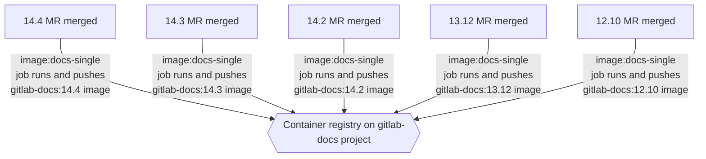
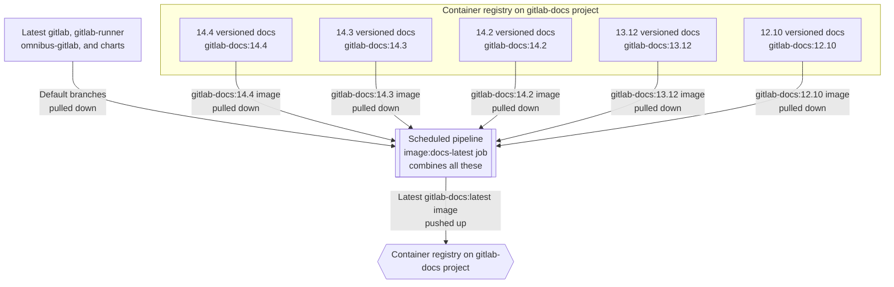
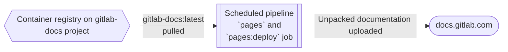

## Deployment environments

The [GitLab documentation site](https://docs.gitlab.com/) is a static site hosted by [GitLab Pages](../../../user/project/pages/_index.md). The deployment is done by the [Pages deploy job](#pages-deploy-job).

The website hosts documentation only for the [currently supported](../../../policy/maintenance.md) GitLab versions. Documentation for older versions is built and uploaded as Docker images to be downloaded from [GitLab Docs archives](https://docs.gitlab.com/archives/).

## Parts of release process

The documentation [release process](https://gitlab.com/gitlab-org/gitlab-docs/-/blob/main/doc/releases.md)
involves:

- Merge requests, to make changes to the `main` and relevant stable branches.
- Pipelines, to build and deploy Docker images to the [`gitlab-docs` container registry](https://gitlab.com/gitlab-org/gitlab-docs/container_registry)
  for the relevant stable branches.
- Docker images used to build and deploy all the online documentation, including stable versions and the latest documentation.

Documentation deployments have dependencies on pipelines and Docker images as follows:

- The latest documentation pipelines and images depend on the stable documentation pipelines and images.
- The Pages deployment pipelines depend on the latest documentation images (which, in turn, depend on the stable
  pipelines and images.)

For general information on using Docker with CI/CD pipelines, see [Docker integration](../../../ci/docker/_index.md).

## Stable branches

Pipelines for stable branches in the documentation project pull the relevant stable branches of included projects. For example, the documentation for stable version `14.4` is built from the [`14.4`](https://gitlab.com/gitlab-org/gitlab-docs/-/tree/14.4) branch of the `gitlab-docs` project, which then includes:

- The [`14-4-stable-ee`](https://gitlab.com/gitlab-org/gitlab/-/tree/14-4-stable-ee) branch of the `gitlab` project.
- The [`14-4-stable`](https://gitlab.com/gitlab-org/gitlab-runner/-/tree/14-4-stable) branch of the `gitlab-runner` project.
- The [`14-4-stable`](https://gitlab.com/gitlab-org/omnibus-gitlab/-/tree/14-4-stable) branch of the `omnibus-gitlab` project.
- The [`5-4-stable`](https://gitlab.com/gitlab-org/charts/gitlab/-/tree/5-4-stable) branch of the `charts/gitlab` project.
  `charts/gitlab` versions are [mapped](https://docs.gitlab.com/charts/installation/version_mappings.html) to GitLab
  versions.

The Technical Writing team
[creates the stable branch](https://gitlab.com/gitlab-org/gitlab-docs/-/blob/main/doc/releases.md#create-stable-branch-and-docker-image-for-release)
for the `gitlab-docs` project, which makes use of the stable branches created by other teams.

## Stable documentation

When merge requests are merged that target stable branches of `gitlab-docs`, a pipeline builds
that stable documentation and deploys it to the registry. For example:

- [14.4 merge request pipeline](https://gitlab.com/gitlab-org/gitlab-docs/-/pipelines/394459635).
- [14.3 merge request pipeline](https://gitlab.com/gitlab-org/gitlab-docs/-/pipelines/393774811).
- [14.2 merge request pipeline](https://gitlab.com/gitlab-org/gitlab-docs/-/pipelines/393774758).
- [13.12 merge request pipeline](https://gitlab.com/gitlab-org/gitlab-docs/-/pipelines/395365202).
- [12.10 merge request pipeline](https://gitlab.com/gitlab-org/gitlab-docs/-/pipelines/395365405).

In particular, the [`image:docs-single` job](https://gitlab.com/gitlab-org/gitlab-docs/-/blob/4c18963fe0a414ad62f55b9e18f922588b2dd155/.gitlab-ci.yml#L655) in each pipeline runs automatically.
It takes what is built, and pushes it to the [container registry](https://gitlab.com/gitlab-org/gitlab-docs/container_registry/631635).



### Rebuild stable documentation images

To rebuild any of the stable documentation images, create a [new pipeline](https://gitlab.com/gitlab-org/gitlab-docs/-/pipelines/new)
for the stable branch of the image to rebuild. You might do this:

- To include new documentation changes from an upstream stable branch into a stable version Docker image. For example,
  rebuild the `14.4` Docker image to include changes subsequently merged in the `gitlab` project's
  [`14-4-stable-ee`](https://gitlab.com/gitlab-org/gitlab/-/tree/14-4-stable-ee) branch.
- To incorporate changes made to the `gitlab-docs` project itself to a stable branch. For example:
  - CSS style changes.
  - Changes to the [version menu for a new release](https://gitlab.com/gitlab-org/gitlab-docs/-/blob/main/doc/releases.md#update-dropdown-for-online-versions).

## Latest documentation

We build a Docker image (tagged `latest`) that contains:

- The latest online version of the documentation.
- The documentation from the stable branches of upstream projects.

The [`image:docs-latest` job](https://gitlab.com/gitlab-org/gitlab-docs/-/blob/4c18963fe0a414ad62f55b9e18f922588b2dd155/.gitlab-ci.yml#L678):

- Pulls the latest documentation from the default branches of the relevant upstream projects.
- Pulls the Docker images previously built by the `image:docs-single` jobs.
- Must be run manually on a scheduled pipeline.

For example, [a pipeline](https://gitlab.com/gitlab-org/gitlab-docs/-/pipelines/399233948) containing the
[`image:docs-latest` job](https://gitlab.com/gitlab-org/gitlab-docs/-/jobs/1733948330):



## Pages deploy job

[GitLab Docs](https://docs.gitlab.com) is a [Pages site](../../../user/project/pages/_index.md) and documentation updates
for it must be deployed to become available.

The [`pages`](https://gitlab.com/gitlab-org/gitlab-docs/-/blob/4c18963fe0a414ad62f55b9e18f922588b2dd155/.gitlab-ci.yml#L491)
job runs automatically when a pipeline runs on the default branch (`main`).
It runs the necessary commands to combine:

- A very up-to-date build of the `gitlab-docs` site code.
- The latest docs from the default branches of the upstream projects.
- The documentation from `image:docs-latest`.

For example, [a pipeline](https://gitlab.com/gitlab-org/gitlab-docs/-/pipelines/399233948) containing the
[`pages` job](https://gitlab.com/gitlab-org/gitlab-docs/-/jobs/1733948332).



### Manually deploy to production

GitLab Docs is deployed to production whenever the `Build docs.gitlab.com every hour` scheduled pipeline runs. By
default, this pipeline runs every hour.

Maintainers can [manually](../../../ci/pipelines/schedules.md#run-manually) run this pipeline to force a deployment to
production:

1. Go to the [scheduled pipelines](https://gitlab.com/gitlab-org/gitlab-docs/-/pipeline_schedules) for `gitlab-docs`.
1. Next to `Build docs.gitlab.com every hour`, select **Play** (**{play}**).

The updated documentation is available in production after the `pages` and `pages:deploy` jobs
complete in the new pipeline.

If you do not have the Maintainer role to perform this task, ask for help in the
`#docs` Slack channel.

## Docker files

The [`dockerfiles` directory](https://gitlab.com/gitlab-org/gitlab-docs/-/tree/main/dockerfiles) contains Dockerfiles needed
to build, test, and deploy <https://docs.gitlab.com>.

## Troubleshooting

### Not a known icon in `@gitlab-org/gitlab-svg`

If you attempt to use an icon in the UI or documentation and receive this error
in the `docs-lint links` job, the `html-lint` Docker image needs an update:

```plaintext
ArgumentError: example-image is not a known icon in @gitlab-org/gitlab-svg
926lib/helpers/icons_helper.rb:22:in `icon':
example-image is not a known icon in @gitlab-org/gitlab-svg (ArgumentError)
```

Use the `#docs` channel in Slack to request a member of the Technical Writing team
update the Docker image. For more information, see the
[internal Technical Writing team documentation](https://gitlab.com/gitlab-org/gitlab-docs/-/blob/main/doc/troubleshooting.md?ref_type=heads#error-argumenterror-icon-name-is-not-a-known-icon-in-gitlab-orggitlab-svg).
