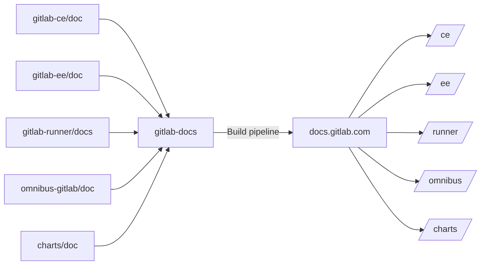

# Documentation site architecture

Learn how we build and architecture [`gitlab-docs`](https://gitlab.com/gitlab-org/gitlab-docs)
and deploy it to <https://docs.gitlab.com>.

## Repository

While the source of the documentation content is stored in GitLab's respective product
repositories, the source that is used to build the documentation site _from that content_
is located at <https://gitlab.com/gitlab-org/gitlab-docs>.

The following diagram illustrates the relationship between the repositories
from where content is sourced, the `gitlab-docs` project, and the published output.

See the [README there](https://gitlab.com/gitlab-org/gitlab-docs/blob/master/README.md)
for detailed information.

## Assets

To provide an optimized site structure, design, and a search-engine friendly
website, along with a discoverable documentation, we use a few assets for
the GitLab Documentation website.

### Libraries

- [Bootstrap 4.3.1 components](https://getbootstrap.com/docs/4.3/components/)
- [Bootstrap 4.3.1 JS](https://getbootstrap.com/docs/4.3/getting-started/javascript/)
- [jQuery](https://jquery.com/) 3.3.1
- [Clipboard JS](https://clipboardjs.com/)
- [Font Awesome 4.7.0](https://fontawesome.com/v4.7.0/icons/)

### SEO

- [Schema.org](https://schema.org/)
- [Google Analytics](https://marketingplatform.google.com/about/analytics/)
- [Google Tag Manager](https://developers.google.com/tag-manager/)

## Global navigation

Read through the global navigation](global_nav.md) documentation to understand:

- How the global navigation is built.
- How to add new navigation items.

## Deployment

The docs site is deployed to production with GitLab Pages, and previewed in
merge requests with Review Apps.

The deployment aspects will be soon transferred from the [original document](https://gitlab.com/gitlab-org/gitlab-docs/blob/master/README.md)
to this page.

<!--
## Repositories

TBA

## Search engine

TBA

## Versions

TBA

## Helpers

TBA
-->
