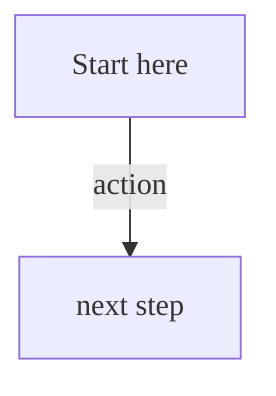

This document defines the standards for GitLab documentation, including grammar, formatting, and more.
For guidelines on specific words, see [the word list](word_list.md).

## The GitLab voice

The GitLab brand guidelines define the
[voice used by the larger organization](https://design.gitlab.com/brand-overview/introduction/#brand-personality).

Building on that guidance, the voice in the GitLab documentation strives to be concise,
direct, and precise. The goal is to provide information that's easy to search and scan.

The voice in the documentation should be conversational but brief, friendly but succinct.

## Documentation is the single source of truth (SSoT)

The GitLab documentation is the SSoT for all product information related to implementation,
use, and troubleshooting. The documentation evolves continuously. It is updated with
new products and features, and with improvements for clarity, accuracy, and completeness.

This policy prevents information silos, making it easier to find information
about GitLab products. It also informs decisions about the kinds of content
included in the documentation.

## Topic types

GitLab uses [topic types](../topic_types/_index.md) to organize the product documentation.

Topic types help users digest information more quickly. They also help address these issues:

- **Content is hard to find.** The GitLab docs are comprehensive and include a large amount of
  useful information. Topic types create repeatable patterns that make the content easier
  to scan and parse.
- **Content is often written from the contributor's point of view.** The GitLab docs
  are written by a variety of contributors. Topic types (tasks, specifically) help put
  information into a format that is geared toward helping others, rather than
  documenting how a feature was implemented.

## Docs-first methodology

The product documentation should be a complete and trusted resource.

- If the answer to a question exists in documentation, share the link to the
  documentation instead of rephrasing the information.
- When you encounter information that's not available in GitLab documentation,
  create a merge request (MR) to add the information to the
  documentation. Then share the MR to communicate the information.

The more we reflexively add information to the documentation, the more
the documentation helps others efficiently accomplish tasks and solve problems.

## Writing for localization

The GitLab documentation is not localized, but we follow guidelines that help us write for a global audience.

[The GitLab voice](#the-gitlab-voice) dictates that we write clearly and directly with translation in mind.
Our style guide, [word list](word_list.md), and [Vale rules](../testing/_index.md) ensure consistency in the documentation.

When documentation is translated into other languages, the meaning of each word must be clear.
The increasing use of machine translation, GitLab Duo Chat, and other AI tools
means that consistency is even more important.

The following rules can help documentation be translated more efficiently.

Avoid:

- Phrases that hide the subject like [**there is** and **there are**](word_list.md#there-is-there-are).
- Ambiguous pronouns like [**it**](word_list.md#it).
- Words that end in [**-ing**](word_list.md#-ing-words).
- Words that can be confused with one another like [**since**](word_list.md#since) and **because**.
- Latin abbreviations like [**e.g.**](word_list.md#eg) and [**i.e.**](word_list.md#ie).
- Culture-specific references like **kill two birds with one stone**.

Use:

- Standard [text for links](#text-for-links).
- [Lists](#lists) and [tables](#tables) instead of complex sentences and paragraphs.
- Common abbreviations like [**AI**](word_list.md#ai-artificial-intelligence) and
  [**CI/CD**](word_list.md#cicd) and abbreviations you've previously spelled out.

Also, keep the following guidance in mind:

- Be consistent with [feature names](#feature-names) and how to interact with them.
- Break up noun strings. For example, instead of **project integration custom settings**,
  use **custom settings for project integrations**.
- Format [dates and times](https://learn.microsoft.com/en-us/style-guide/a-z-word-list-term-collections/term-collections/date-time-terms)
  consistently and for an international audience.
- Use [illustrations](#illustrations), including screenshots, sparingly.
- For [UI text](#ui-text), allow for up to 30% expansion and contraction in translation.
  To see how much a string expands or contracts in another language, paste the string
  into [Google Translate](https://translate.google.com/) and review the results.
  You can ask a colleague who speaks the language to verify if the translation is clear.

## Markdown

All GitLab documentation is written in [Markdown](https://en.wikipedia.org/wiki/Markdown).

The [documentation website](https://docs.gitlab.com) uses [GitLab Kramdown](https://gitlab.com/gitlab-org/ruby/gems/gitlab_kramdown),
a "flavored" Kramdown engine to render pages from Markdown to HTML. The use of Kramdown
features is limited by our linters, so, use regular Markdown and follow the rules in the
linked style guide. You can't use Kramdown-specific markup (for example, `{:.class}`).

For a complete Kramdown reference, see the
[GitLab Markdown Guide](https://handbook.gitlab.com/docs/markdown-guide/).

The Markdown format is tested by using [markdownlint](../testing/markdownlint.md) and [Vale](../testing/vale.md).

### HTML in Markdown

Hard-coded HTML is valid, although it's discouraged for a few reasons:

- Custom markup has potential to break future site-wide changes or design system updates.
- Custom markup does not have test coverage to ensure consistency across the site.
- Custom markup might not be responsive or accessible.
- Custom markup might not adhere to Pajamas guidelines.
- HTML and CSS in Markdown do not render on `/help`.
- Hand-coding HTML can be error-prone. It's possible to break the page layout or other components with malformed HTML.

HTML is permitted if:

- There's no equivalent markup in Markdown.
- The content is reviewed and approved by a technical writer.
- There is an urgent need for the custom element that cannot wait for implementation by Technical Writing engineers.

If you have an idea or request for a new element that would be useful on the Docs site, please
submit a [feature request](https://gitlab.com/gitlab-org/gitlab-docs/-/issues/new?issuable_template=Default).

### Heading levels in Markdown

Each documentation page begins with a level 1 heading (`#`). This becomes the `h1` element when
the page is rendered to HTML. There can be only **one** level 1 heading per page.

- For each subsection, increment the heading level. In other words, increment the number of `#` characters
  in front of the topic title.
- Avoid heading levels greater than `H5` (`#####`). If you need more than five heading levels, move the topics to a new page instead.
  Heading levels greater than `H5` do not display in the right sidebar navigation.
- Do not skip a level. For example: `##` > `####`.
- Leave one blank line before and after the topic title.
- If you use code in topic titles, ensure the code is in backticks.
- Do not use bold text in topic titles.

## Language

GitLab documentation should be clear and easy to understand.

- Avoid unnecessary words.
- Be clear, concise, and stick to the goal of the topic.
- Write in US English with US grammar. (Tested in [`British.yml`](https://gitlab.com/gitlab-org/gitlab/-/blob/master/doc/.vale/gitlab_base/British.yml).)

### Active voice

In most cases, text is easier to understand and to translate if you use active voice instead of passive.

For example, use:

- The developer writes code for the application.

Instead of:

- Application code is written by the developer.

Sometimes, using `GitLab` as the subject can be awkward. For example, `GitLab exports the report`.
In this case, you can use passive voice instead. For example, `The report is exported`.

### Customer perspective

Focus on the functionality and benefits that GitLab brings to customer,
rather than what GitLab has created.

For example, use:

- Use merge requests to compare code in the source and target branches.

Instead of:

- GitLab allows you to compare code.
- GitLab created the ability to let you compare code.
- Merge requests let you compare code.

Words that indicate you are not writing from a customer perspective are
[allow and enable](word_list.md#allow-enable). Try instead to use
[you](word_list.md#you-your-yours) and to speak directly to the user.

### Building trust

Product documentation should be focused on providing clear, concise information,
without the addition of sales or marketing text.

- Do not use words like [easily](word_list.md#easily) or [simply](word_list.md#simply-simple).
- Do not use marketing phrases like "This feature will save you time and money."

Instead, focus on facts and achievable goals. Be specific. For example:

- The build time can decrease when you use this feature.
- You can use this feature to save time when you create a project. The API creates the file and you
  do not need to manually intervene.

### Capitalization

As a company, we tend toward lowercase.

#### Topic titles

Use sentence case for topic titles. For example:

- `# Use variables to configure pipelines`
- `## Use the To-Do List`

#### UI text

When referring to specific user interface text, like a button label, page, tab,
or menu item, use the same capitalization that's displayed in the user interface.

If you think the user interface text contains style mistakes,
create an issue or an MR to propose a change to the user interface text.

#### Feature names

Feature names should be lowercase.

However, in a few rare cases, features can be title case. These exceptions are:

- Added as a proper name to [markdownlint](https://gitlab.com/gitlab-org/gitlab/-/blob/master/.markdownlint.yml),
  so they can be consistently applied across all documentation.
- Added to the [word list](word_list.md).

If the term is not in the word list, ask a GitLab Technical Writer for advice.
For assistance naming a feature and ensuring it meets GitLab standards, see
[the handbook](https://handbook.gitlab.com/handbook/product/categories/gitlab-the-product/#naming-features).

Do not match the capitalization of terms or phrases on the [Features page](https://about.gitlab.com/features/)
or [`features.yml`](https://gitlab.com/gitlab-com/www-gitlab-com/blob/master/data/features.yml)
by default.

#### Other terms

Capitalize names of:

- GitLab [product tiers](https://about.gitlab.com/pricing/). For example,
  GitLab Free and GitLab Ultimate.
- Third-party organizations, software, and products. For example, Prometheus,
  Kubernetes, Git, and The Linux Foundation.
- Methods or methodologies. For example, Continuous Integration,
  Continuous Deployment, Scrum, and Agile.

Follow the capitalization style listed at the authoritative source
for the entity, which may use non-standard case styles. For example: GitLab and
npm.

### Fake user information

You may need to include user information in entries such as a REST call or user profile.
Do not use real user information or email addresses in GitLab documentation.

For text:

- Use diverse or non-gendered names with common surnames, like `Sidney Jones`, `Zhang Wei`, or `Alex Garcia`.
- Make fake email addresses end in `example.com`.

For screenshots:

- Temporarily edit the page before you take the screenshot:

  1. Right-click the text you want to change.
  1. Select **Inspect**.
  1. In the **Elements** dialog, edit the HTML to replace text that contains real user information with example data.
  1. Close the dialog. All of the user data in the web page should now be replaced with the example data you entered.
  1. Take the screenshot.

- Alternatively, you can create example accounts in a test environment, and take the screenshot there.
- If you can't easily reproduce the environment, you can blur the user data by using an image editing tool like Preview on macOS.

### Fake URLs

When including sample URLs in the documentation, use:

- `example.com` when the domain name is generic.
- `gitlab.example.com` when referring only to GitLab Self-Managed.
  Use `gitlab.com` for GitLab.com.

### Fake tokens

There may be times where a token is needed to demonstrate an API call using
cURL or a variable used in CI. It is strongly advised not to use real tokens in
documentation even if the probability of a token being exploited is low.

You can use these fake tokens as examples:

| Token type            | Token value                                                        |
|:----------------------|:-------------------------------------------------------------------|
| Personal access token | `<your_access_token>`                                             |
| Application ID        | `2fcb195768c39e9a94cec2c2e32c59c0aad7a3365c10892e8116b5d83d4096b6` |
| Application secret    | `04f294d1eaca42b8692017b426d53bbc8fe75f827734f0260710b83a556082df` |
| CI/CD variable        | `Li8j-mLUVA3eZYjPfd_H`                                             |
| Project runner token  | `yrnZW46BrtBFqM7xDzE7dddd`                                         |
| Instance runner token | `6Vk7ZsosqQyfreAxXTZr`                                             |
| Trigger token         | `be20d8dcc028677c931e04f3871a9b`                                   |
| Webhook secret token  | `6XhDroRcYPM5by_h-HLY`                                             |
| Health check token    | `Tu7BgjR9qeZTEyRzGG2P`                                             |

### Contractions

Contractions are encouraged, and can create a friendly and informal tone,
especially in tutorials, instructional documentation, and
[user interfaces](https://design.gitlab.com/content/punctuation/#contractions).

Some contractions, however, should be avoided:

<!-- vale gitlab_base.Possessive = NO -->

| Do not use a contraction      | Example                                          | Use instead                                                      |
|-------------------------------|--------------------------------------------------|------------------------------------------------------------------|
| With a proper noun and a verb | **Terraform's** a helpful tool.                  | **Terraform** is a helpful tool.                                  |
| To emphasize a negative       | **Don't** install X with Y.                      | **Do not** install X with Y.                                     |
| In reference documentation    | **Don't** set a limit.                           | **Do not** set a limit.                                          |
| In error messages             | Requests to localhost **aren't** allowed.        | Requests to localhost **are not** allowed.                       |

<!-- vale gitlab_base.Possessive = YES -->

### Possessives

Try to avoid using possessives (`'s`) for proper nouns, like organization or product names.

For example, instead of `Docker's CLI`, use `the Docker CLI`.

For details, see [the Google documentation style guide](https://developers.google.com/style/possessives#product,-feature,-and-company-names).

### Prepositions

Use prepositions at the end of the sentence when needed.
Dangling or stranded prepositions are fine. For example:

- You can leave the group you're a member of.
- Share the credentials with users you want to give access to.

These constructions are more casual than the alternatives:

- You can leave the group of which you're a member.
- Share the credentials with users to which you want to give access.

### Acronyms

If you use an acronym, spell it out on first use on a page. You do not need to spell it out more than once on a page.

- **Titles:** Try to avoid acronyms in topic titles, especially if the acronym is not widely used.
- **Plurals:** Try not to make acronyms plural. For example, use `YAML files`, not `YAMLs`. If you must make an acronym plural, do not use an apostrophe. For example, use `APIs`, not `API's`.
- **Possessives:** Use caution when making an acronym possessive. If possible,
  write the sentence to avoid making the acronym possessive. If you must make the
  acronym possessive, consider spelling out the words.

### Numbers

For numbers in text, spell out zero through nine and use numbers for 10 and greater. For more information, see the [Microsoft Style Guide](https://learn.microsoft.com/en-us/style-guide/numbers).

## Text

- [Write in Markdown](#markdown).
- Insert an empty line for new paragraphs.
- Insert an empty line between different markups (for example, after every
  paragraph, heading, list, and so on). Example:

  ```markdown
  ## Heading

  Paragraph.

  - List item 1
  - List item 2
  ```

### Line length

To make the source content easy to read, and to more easily compare diffs,
follow these best practices when possible.

- Split long lines at approximately 100 characters.
- Start each new sentence on a new line.

### Comments

To embed comments within Markdown, use standard HTML comments that are not rendered
when published. Example:

```html
<!-- This is a comment that is not rendered -->
```

### Punctuation

Follow these guidelines for punctuation.

<!-- vale gitlab_base.Repetition = NO -->

- End full sentences with a period, including full sentences in tables.
- Use serial (Oxford) commas before the final **and** or **or** in a list of three or more items. (Tested in [`OxfordComma.yml`](https://gitlab.com/gitlab-org/gitlab/-/blob/master/doc/.vale/gitlab_base/OxfordComma.yml).)

<!-- vale gitlab_base.Repetition = YES -->

When spacing content:

- Use one space between sentences. (Use of more than one space is tested in [`SentenceSpacing.yml`](https://gitlab.com/gitlab-org/gitlab/-/blob/master/doc/.vale/gitlab_base/SentenceSpacing.yml).)
- Do not use non-breaking spaces. Use standard spaces instead. (Tested in [`lint-doc.sh`](https://gitlab.com/gitlab-org/gitlab/-/blob/master/scripts/lint-doc.sh).)
- Do not use tabs for indentation. Use spaces instead. You can configure your code editor to output spaces instead of tabs when pressing the <kbd>Tab</kbd> key.

Do not use these punctuation characters:

- `;` (semicolon): Use two sentences instead.
- `–` (en dash) or `—` (em dash): Use separate sentences, or commas, instead.
- `“` `”` `‘` `’`: Double or single typographer's ("curly") quotation marks. Use straight quotes instead. (Tested in [`NonStandardQuotes.yml`](https://gitlab.com/gitlab-org/gitlab/-/blob/master/doc/.vale/gitlab_base/NonStandardQuotes.yml).)

### Placeholder text

In a code block, you might want to provide a command or configuration that
uses specific values.

In these cases, use [`<` and `>`](https://en.wikipedia.org/wiki/Usage_message#Pattern)
to call out where a reader must replace text with their own value.

For example:

```shell
cp <your_source_directory> <your_destination_directory>
```

If the placeholder is not in a code block, use `<` and `>` and wrap the placeholder
in a single backtick. For example:

```plaintext
Select **Grant admin consent for `<application_name>`**.
```

### Quotation marks

Only use quotation marks when quoting direct text, and use double quotes (`"`).
For guidance about writing UI elements and in-line code, see [Text formatting](#text-formatting).

Do not put punctuation inside quotation marks, unless it is part of the quoted text.

## Text formatting

When formatting text, use:

- [Bold](#bold) for UI elements and pages.
- [Inline code style](#inline-code) for inputs, outputs, code, and similar.
- [Code blocks](#code-blocks) for command line examples, and multi-line inputs, outputs, code, and similar.
- [`<kbd>`](#keyboard-commands) for keyboard commands.

### Bold

Use bold for:

- UI elements with a visible label. Match the text and capitalization of the label.
- Navigation paths.

UI elements include:

- Buttons
- Checkboxes
- Settings
- Menus
- Pages
- Tabs

For example:

- Select **Cancel**.
- On the **Issues** page...
- On the **Pipelines** tab...

To make text bold, wrap it with double asterisks (`**`). For example:

```markdown
1. Select **Cancel**.
```

When using bold format for UI elements or keywords, place any punctuation outside the bold tag.
This rule includes periods, commas, colons, and right-angle brackets (`>`).

The punctuation is part of the sentence structure rather than the UI element or keyword that you're emphasizing.

Include punctuation in the bold tag when it's part of the UI element or keyword itself.

For example:

- `**Option**: This an option description.`
- `Select **Overview** > **Users**.`

### Inline code

Inline code is text that's wrapped in single backticks (`` ` ``). For example:

```markdown
In the **Name** text box, enter `test`.
```

Use inline code for:

- Text a user enters in the UI.
- Short inputs and outputs like `true`, `false`, `Job succeeded`, and similar.
- Filenames, configuration parameters, keywords, and code. For example,
  `.gitlab-ci.yml`, `--version`, or `rules:`.
- Short error messages.
- API and HTTP methods (`POST`).
- HTTP status codes. Full (`404 File Not Found`) and abbreviated (`404`).
- HTML elements. For example, `<sup>`. Include the angle brackets.

For example:

- In the **Name** text box, enter `test`.
- Use the `rules:` CI/CD keyword to control when to add jobs to a pipeline.
- Send a `DELETE` request to delete the runner. Send a `POST` request to create one.
- The job log displays `Job succeeded` when complete.

### Code blocks

Code blocks separate code text from regular text, and can be copy-pasted by users.

Use code blocks for:

- CLI and [cURL commands](../restful_api_styleguide.md#curl-commands).
- Multi-line inputs, outputs, and code samples that are too large for [inline code](#inline-code).

To add a code block, add triple backticks (```` ``` ````) above and below the text,
with a syntax name at the top for proper syntax highlighting. For example:

````markdown
```markdown
This is a code block using Markdown to demonstrate **bold** and `backticks`.
```
````

When using code blocks:

- Add a blank line above and below code blocks.
- Use one of the [supported syntax names](https://github.com/rouge-ruby/rouge/wiki/List-of-supported-languages-and-lexers).
  Use `plaintext` if no better option is available.
- Use quadruple backticks (````` ```` `````) when the code block contains another (nested) code block
  which has triple backticks already. The example above uses quadruple backticks internally
  to illustrate the code block format.

### Keyboard commands

Use the HTML `<kbd>` tag when referring to keystroke presses. For example:

```plaintext
To stop the command, press <kbd>Control</kbd>+<kbd>C</kbd>.
```

This example renders as:

To stop the command, press <kbd>Control</kbd>+<kbd>C</kbd>.

### Italics and emphasis

Avoid using [italics for emphasis](../../../user/markdown.md#emphasis) in product documentation.
Instead, write content that is clear enough that emphasis is not needed. GitLab and
<https://docs.gitlab.com> use a sans-serif font, but italic text [does not stand out in a page using sans-serif](https://practicaltypography.com/bold-or-italic.html).

## Lists

Use lists to present information in a format that is easier to scan.

- Make all items in the list parallel.
  For example, do not start some items with nouns and others with verbs.
- Start all items with a capital letter.
- Give all items the same punctuation.
- Do not use a period if the item is not a full sentence.
- Use a period after every full sentence.
  Do not use semicolons or commas.
- Add a colon (`:`) after the introductory phrase.
  For example:

  ```markdown
  You can:

  - Do this thing.
  - Do this other thing.
  ```

### Choose between an ordered or unordered list

Use ordered lists for a sequence of steps. For example:

```markdown
Follow these steps to do something.

1. First, do the first step.
1. Then, do the next step.
1. Finally, do the last step.
```

Use an unordered lists when the steps do not need to be completed in order. For example:

```markdown
These things are imported:

- Thing 1
- Thing 2
- Thing 3
```

### List markup

- Use dashes (`-`) for unordered lists instead of asterisks (`*`).
- Start every item in an ordered list with `1.`. When rendered, the list items
  are sequential.
- Leave a blank line before and after a list.
- Begin a line with spaces (not tabs) to denote a [nested sub-item](#nesting-inside-a-list-item).

### Nesting inside a list item

You can nest items under a list item, so they render with the same
indentation as the list item. You can do this with:

- [Code blocks](#code-blocks)
- [Blockquotes](#blockquotes)
- [Alert boxes](#alert-boxes)
- [Illustrations](#illustrations)
- [Tabs](#tabs)

Nested items should always align with the first character of the list
item. For unordered lists (using `-`), use two spaces for each level of
indentation:

````markdown
- Unordered list item 1

  A line nested using 2 spaces to align with the `U` above.

- Unordered list item 2

  > A quote block that will nest
  > inside list item 2.

- Unordered list item 3

  ```plaintext
  a code block that nests inside list item 3
  ```

- Unordered list item 4

  
````

For ordered lists, use three spaces for each level of indentation:

````markdown
1. Ordered list item 1

   A line nested using 3 spaces to align with the `O` above.
````

You can nest lists in other lists.

```markdown
1. Ordered list item one.
1. Ordered list item two.
   - Nested unordered list item one.
   - Nested unordered list item two.
1. Ordered list item three.

- Unordered list item one.
- Unordered list item two.
  1. Nested ordered list item one.
  1. Nested ordered list item two.
- Unordered list item three.
```

## Tables

Tables should be used to describe complex information in a straightforward
manner. In many cases, an unordered list is sufficient to describe a
list of items with a single, simple description per item. But, if you have data
that's best described by a matrix, tables are the best choice.

### Creation guidelines

To keep tables accessible and scannable, tables should not have any
empty cells. If there is no otherwise meaningful value for a cell, consider entering
**N/A** for 'not applicable' or **None**.

To help keep tables easier to maintain, you can:

- Add additional spaces to make the column widths consistent. For example:

  ```markdown
  | App name | Description         | Requirements |
  |----------|---------------------|--------------|
  | App 1    | Description text 1. | A, B, and C. |
  | App 2    | Description text 2. | None         |
  ```

- Skip the additional spaces in the rightmost column for tables that are very wide.
  For example:

  ```markdown
  | Setting   | Default | Description |
  |-----------|---------|-------------|
  | Setting 1 | `1000`  | A short description. |
  | Setting 2 | `2000`  | A long description that would make the table too wide and add too much whitespace if every cell in this column was aligned. |
  | Setting 3 | `0`     | Another short description. |
  ```

### Editor extensions for table formatting

To ensure consistent table formatting across all Markdown files, consider formatting your tables
with the VS Code [Markdown Table Formatter](https://github.com/fcrespo82/vscode-markdown-table-formatter).
To configure this extension to follow the guidelines above, enable the **Follow header row length** setting.
To enable the setting:

- In the UI:

  1. In the VS Code menu, go to **Code > Settings > Settings**.
  1. Search for `Limit Last Column Length`.
  1. In the **Limit Last Column Length** dropdown list, select **Follow header row length**.

- In your VS Code `settings.json`, add a new line with:

  ```json
  {
    "markdown-table-formatter.limitLastColumnLength": "Follow header row length"
  }
  ```

To format a table with this extension, select the entire table, right-click the selection,
and select **Format Selection With**. Select **Markdown Table Formatter** in the VS Code Command Palette.

Alternatively, if you use Sublime Text you can try the [Markdown Table Formatter](https://packagecontrol.io/packages/Markdown%20Table%20Formatter)
plugin, but it does not have a **Follow header row length** setting.

### Updates to existing tables

When you add or edit rows in an existing table, the cells in the new rows might be wider.
If you realign the columns to account for the width, the diff becomes difficult to read,
because the entire table shows as modified.

Markdown tables naturally fall out of alignment over time, but still render correctly
on `docs.gitlab.com`. The technical writing team can realign cells the next time
the page is refactored.

### Table headers

Use sentence case for table headers. For example, `Keyword value` or `Project name`.

### Feature tables

When creating tables of lists of features (such the features
available to each role on the [Permissions](../../../user/permissions.md#project-members-permissions)
page), use these phrases:

| Option | Markdown                 | Displayed result       |
|--------|--------------------------|------------------------|
| No     | `**{dotted-circle}** No` | **{dotted-circle}** No |
| Yes    | `**{check-circle}** Yes` | **{check-circle}** Yes |

Don't use `**{dotted-circle}**` and `**{check-circle}**` in API documentation.
Instead, follow the [API topic template](../restful_api_styleguide.md#api-topic-template).

### Footnotes

Use footnotes below tables only when you cannot include the content in the table itself.
For example, use footnotes when you must:

- Provide the same information in several table cells.
- Include content that would disrupt the table's layout.

#### Footnote format

In the table, use the HTML superscript tag `<sup>` for each footnote.
Put the tag at the end of the sentence. Leave one space between the sentence and the tag.

For example:

```markdown
| App name | Description                    |
|:---------|:-------------------------------|
| App A    | Description text. <sup>1</sup> |
| App B    | Description text. <sup>2</sup> |
```

When you add a footnote, do not re-sort the existing tags in the table.

For the footnotes below the table, use `**Footnotes:**` followed by an ordered list.

For example:

```markdown
**Footnotes:**

1. This is the first footnote.
1. This is the second footnote.
```

The table and footnotes would render as follows:

| App name | Description                    |
|:---------|:-------------------------------|
| App A    | Description text. <sup>1</sup> |
| App B    | Description text. <sup>2</sup> |

**Footnotes:**

1. This is the first footnote.
1. This is the second footnote.

##### Five or more footnotes

If you have five or more footnotes that you cannot include in the table itself,
you can use consecutive numbers for the list items.
If you use consecutive numbers, you must disable Markdown rule `029`:

```markdown
**Footnotes:**

<!-- Disable ordered list rule https://github.com/DavidAnson/markdownlint/blob/main/doc/Rules.md#md029---ordered-list-item-prefix -->
<!-- markdownlint-disable MD029 -->

1. This is the first footnote.
2. This is the second footnote.
3. This is the third footnote.
4. This is the fourth footnote.
5. This is the fifth footnote.

<!-- markdownlint-enable MD029 -->
```

## Links

Links help the docs adhere to the
[single source of truth](#documentation-is-the-single-source-of-truth-ssot) principle.

However, you should avoid putting too many links on any page. Too many links can hinder readability.

- Do not duplicate links on the same page. For example, on **Page A**, do not link to **Page B** multiple times.
- Do not use links in headings. Headings that contain links cause errors.
- Avoid multiple links in a single paragraph.
- Avoid multiple links in a single task.
- On any one page, try not to use more than 15 links to other pages.
- Consider using [Related topics](../topic_types/_index.md#related-topics) to reduce links that interrupt the flow of a task.
- Try to avoid anchor links to sections on the same page. Let users rely on the right navigation instead.

### Links in the same repository

To link to another documentation (`.md`) file in the same repository:

- Use an inline link with a relative file path. For example, `[GitLab.com settings](../user/gitlab_com/index.md)`.
- Put the entire link on a single line, even if the link is very long. ([Vale](../testing/vale.md) rule: [`MultiLineLinks.yml`](https://gitlab.com/gitlab-org/gitlab/-/blob/master/doc/.vale/gitlab_base/MultiLineLinks.yml)).

To link to a file outside of the documentation files, for example to link from development
documentation to a specific code file, you can:

- Use a full URL. For example: ``[`app/views/help/show.html.haml`](https://gitlab.com/gitlab-org/gitlab/-/blob/master/app/views/help/show.html.haml)``
- (Optional) Use a full URL with a specific ref. For example: ``[`app/views/help/show.html.haml`](https://gitlab.com/gitlab-org/gitlab/-/blob/6d01aa9f1cfcbdfa88edf9d003bd073f1a6fff1d/app/views/help/show.html.haml)``

### Links in separate repositories

To link to a page in a different repository, use a full URL.
For example, to link from a page in the GitLab repository to the Charts repository,
use a URL like `[GitLab Charts documentation](https://docs.gitlab.com/charts/)`.

### Anchor links

Each topic title has an anchor link. For example, a topic with the title
`## This is an example` has the anchor `#this-is-an-example`.

The first topic title on a page (the `h1`) has an anchor link,
but do not use it. Link to the page instead.

With Kramdown, you can add a custom ID to an HTML element, but these IDs
don't work in `/help`, so you should not use them.

When you change topic title text, the anchor link changes. To avoid broken links:

- Do not use step numbers in topic titles.
- When possible, do not use words that might change in the future.

#### Changing links and titles

When you change a topic title, the anchor link changes. If other documentation pages
or code files link to this anchor, [pipeline jobs could fail](../testing/_index.md).

Consider [running the link checks locally](../testing/links.md) before pushing your changes
to prevent failing pipelines.

### Text for links

Follow these guidelines for link text.

#### Standard text

As much as possible, use text that follows one of these patterns:

- `For more information, see [link text](link.md)`.
- `To [DO THIS THING], see [link text](link.md)`

For example:

- `For more information, see [merge requests](link.md).`
- `To create a review app, see [review apps](link.md).`

You can expand on this text by using phrases like
`For more information about this feature, see...`

Do not use the following constructions:

- `Learn more about...`
- `To read more...`.
- `For more information, see the [Merge requests](link.md) page.`
- `For more information, see the [Merge requests](link.md) documentation.`

#### Descriptive text rather than `here`

Use descriptive text for links, rather than words like `here` or `this page.`

For example, instead of:

- `For more information, see [this page](link.md).`
- `For more information, go [here](link.md).`

Use:

- `For more information, see [merge requests](link.md)`.

#### Links to issues

When linking to an issue, include the issue number in the link. For example:

- `For more information, see [issue 12345](link.md).`

Do not use the pound sign (`issue #12345`).

### Links to external documentation

When possible, avoid links to external documentation. These links can easily become outdated, and are difficult to maintain.

- [They lead to link rot](https://en.wikipedia.org/wiki/Link_rot).
- [They create issues with maintenance](https://gitlab.com/gitlab-org/gitlab/-/issues/368300).

Sometimes links are required. They might clarify troubleshooting steps or help prevent duplication of content.
Sometimes they are more precise and will be maintained more actively.

For each external link you add, weigh the customer benefit with the maintenance difficulties.

### Confidential or restricted access links

Don't link directly to:

- [Confidential issues](../../../user/project/issues/confidential_issues.md).
- Internal handbook pages.
- Project features that require [special permissions](../../../user/permissions.md)
  to view.

These links fail for:

- Those without sufficient permissions.
- Automated link checkers.

If you must use one of these links:

- If the link is to a confidential issue or internal handbook page, mention that the issue or page is visible only to GitLab team members.
- If the link requires a specific role or permissions, mention that information.
- Put the link in backticks so that it does not cause link checkers to fail.

Examples:

- ```markdown
  GitLab team members can view more information in this confidential issue:
  `https://gitlab.com/gitlab-org/gitlab/-/issues/<issue_number>`
  ```

- ```markdown
  GitLab team members can view more information in this internal handbook page:
  `https://internal.gitlab.com/handbook/<link>`
  ```

- ```markdown
  Users with the Maintainer role for the project can use the pipeline editor:
  `https://gitlab.com/gitlab-org/gitlab/-/ci/editor`
  ```

### Link to specific lines of code

When linking to specific lines in a file, link to a commit instead of to the
branch. Lines of code change over time. Linking to a line by using
the commit link ensures the user lands on the line you're referring to. The
**Permalink** button, displayed when viewing a file in a project,
provides a link to the most recent commit of that file.

- Do: `[link to line 3](https://gitlab.com/gitlab-org/gitlab/-/blob/11f17c56d8b7f0b752562d78a4298a3a95b5ce66/.gitlab/issue_templates/Feature%20proposal.md#L3)`
- Don't: `[link to line 3](https://gitlab.com/gitlab-org/gitlab/-/blob/master/.gitlab/issue_templates/Feature%20proposal.md#L3).`

If that linked expression has changed line numbers due to additional
commits, you can still search the file for that query. In this case, update the
document to ensure it links to the most recent version of the file.

## Navigation

When documenting how to navigate the GitLab UI:

- Always use location, then action.
  - From the **Visibility** dropdown list (location), select **Public** (action).
- Be brief and specific. For example:
  - Do: Select **Save**.
  - Do not: Select **Save** for the changes to take effect.
- If a step must include a reason, start the step with it. This helps the user scan more quickly.
  - Do: To view the changes, in the merge request, select the link.
  - Do not: Select the link in the merge request to view the changes.

### Names for menus

Use these terms when referring to the main GitLab user interface
elements:

- **Left sidebar**: This is the navigation sidebar on the left of the user
  interface.
  - Do not use the phrase `context switcher` or `switch contexts`. Instead, try to direct the user to the exact location with a set of repeatable steps.
  - Do not use the phrase `the **Explore** menu` or `the **Your work** sidebar`. Instead, use `the left sidebar`.
- **Right sidebar**: This is the navigation sidebar on the right of the user
  interface, specific to the open issue, merge request, or epic.

### Names for UI elements

All UI elements [should be **bold**](#bold).

Guidance for individual UI elements is in [the word list](word_list.md).

### How to write navigation task steps

To be consistent, use these examples to write navigation steps in a task topic.
Although alternative steps might exist, including items pinned by default,
use these steps instead.

To open project settings:

```markdown
1. On the left sidebar, select **Search or go to** and find your project.
1. Select **Settings > CI/CD**.
1. Expand **General pipelines**.
```

To open group settings:

```markdown
1. On the left sidebar, select **Search or go to** and find your group.
1. Select **Settings > CI/CD**.
1. Expand **General pipelines**.
```

To open settings for a top-level group:

```markdown
1. On the left sidebar, select **Search or go to** and find your group.
   This group must be at the top level.
1. Select **Settings > CI/CD**.
1. Expand **General pipelines**.
```

To open either project or group settings:

```markdown
1. On the left sidebar, select **Search or go to** and find your project or group.
1. Select **Settings > CI/CD**.
1. Expand **General pipelines**.
```

To create a project:

```markdown
1. On the left sidebar, at the top, select **Create new** (**{plus}**) and **New project/repository**.
```

To create a group:

```markdown
1. On the left sidebar, at the top, select **Create new** (**{plus}**) and **New group**.
```

To open the **Admin** area:

```markdown
1. On the left sidebar, at the bottom, select **Admin**.
1. Select **Settings > CI/CD**.
```

You do not need to repeat `On the left sidebar` in your second step.

To open the **Your work** menu item:

```markdown
1. On the left sidebar, select **Search or go to**.
1. Select **Your work**.
```

To select your avatar:

```markdown
1. On the left sidebar, select your avatar.
```

To save the selection in some dropdown lists:

```markdown
1. Go to your issue.
1. On the right sidebar, in the **Iteration** section, select **Edit**.
1. From the dropdown list, select the iteration to associate this issue with.
1. Select any area outside the dropdown list.
```

To view all your projects:

```markdown
1. On the left sidebar, select **Search or go to**.
1. Select **View all my projects**.
```

To view all your groups:

```markdown
1. On the left sidebar, select **Search or go to**.
1. Select **View all my groups**.
```

### Optional steps

If a step is optional, start the step with the word `Optional` followed by a period.

For example:

```markdown
1. Optional. Enter a description for the job.
```

### Recommended steps

If a step is recommended, start the step with the word `Recommended` followed by a period.

For example:

```markdown
1. Recommended. Enter a description for the job.
```

### Documenting keyboard shortcuts and commands

Write UI instructions instead of keyboard commands when both options exist.
This guideline applies to GitLab and third-party applications, like VS Code.

Keyboard commands for GitLab are documented in [GitLab keyboard shortcuts](../../../user/shortcuts.md).

### Documenting multiple fields at once

If the UI text sufficiently explains the fields in a section, do not include a task step for every field.
Instead, summarize multiple fields in a single task step.

Use the phrase **Complete the fields**.

For example:

1. On the left sidebar, select **Search or go to** and find your project.
1. Select **Settings > Repository**.
1. Expand **Push rules**.
1. Complete the fields.

If you are documenting multiple fields and only one field needs explanation, do it in the same step:

1. Expand **Push rules**.
1. Complete the fields. **Branch name** must be a regular expression.

To describe multiple fields, use unordered list items:

1. Expand **General pipelines**.
1. Complete the fields.
   - **Branch name** must be a regular expression.
   - **User** must be a user with at least the **Maintainer** role.

## Illustrations

GitLab documentation uses two illustration types:

- Screenshots, used to show a portion of the GitLab user interface.
- Diagrams, used to illustrate processes or relationships between entities.

Illustrations can help the reader understand a concept, where they are in a complicated process,
or how they should interact with the application. Use illustrations sparingly because:

- They become outdated.
- They are difficult and expensive to localize.
- They cannot be read by screen readers.

If you must use illustrations in documentation, they should:

- Supplement the text, not replace it.
  The reader should not have to rely only on the illustration to get the needed information.
- Have an introductory sentence in the preceding text.
  For example, `The following diagram illustrates the product analytics flow:`.
- Be accessible. For more information, see the guidelines specific to screenshots and diagrams.
- Exclude personally identifying information.

### Screenshots

Use screenshots to show a portion of the GitLab user interface, if some relevant information
can't be conveyed in text.

#### Capture the screenshot

When you take screenshots:

- **Ensure it provides value.** Don't use `lorem ipsum` text.
  Try to replicate how the feature would be used in a real-world scenario, and
  [use realistic text](#fake-user-information).
- **Capture only the relevant UI.** Don't include unnecessary white
  space or areas of the UI that don't help illustrate the point. The
  sidebars in GitLab can change, so don't include
  them in screenshots unless absolutely necessary.
- **Keep it small.** If you don't need to show the full width of the screen, don't.
  Reduce the size of your browser window as much as possible to keep elements close
  together and reduce empty space. Try to keep the screenshot dimensions as small as possible.
- **Review how the image renders on the page.** Preview the image locally or use the
  review app in the merge request. Make sure the image isn't blurry or overwhelming.
- **Be consistent.** Coordinate screenshots with the other screenshots already on
  a documentation page for a consistent reading experience. Ensure your navigation theme
  is **Indigo** and the syntax highlighting theme is **Light**. These are the default preferences.

#### Add callouts

If you need to emphasize an area in a screenshot, use an arrow.

- For color, use `#EE2604`. If you use the Preview application on macOS, this is the default red.
- For the line width, use 3 pt. If you use the Preview application on macOS, this is the third line in the list.
- Use the arrow style shown in the following image.
- If you have multiple arrows, make them parallel when possible.


#### Image requirements

- Resize any wide or tall screenshots.
  - Width should be 1000 pixels or less.
  - Height should be 500 pixels or less.
  - Make sure the screenshot is still clear after being resized and compressed.
- All images **must** be [compressed](#compress-images) to 100 KB or less.
  In many cases, 25-50 KB or less is often possible without reducing image quality.
- Save the image with a lowercase filename that's descriptive of the feature
  or concept in the image:
  - If the image is of the GitLab interface, append the GitLab version to the filename,
    based on this format: `image_name_vX_Y.png`. For example, for a screenshot taken
    from the pipelines page of GitLab 11.1, a valid name is `pipelines_v11_1.png`.
  - If you're adding an illustration that doesn't include parts of the user interface,
    add the release number corresponding to the release the image was added to.
    For an MR added to 11.1's milestone, a valid name for an illustration is `devops_diagram_v11_1.png`.
- Place images in a separate directory named `img/` in the same directory where
  the `.md` document that you're working on is located.
- Consider using PNG images instead of JPEG.
- Compress GIFs with <https://ezgif.com/optimize> or similar tool.

See also how to link and embed [videos](#videos) to illustrate the documentation.

#### Compress images

You should always compress any new images you add to the documentation. One
known tool is [`pngquant`](https://pngquant.org/), which is cross-platform and
open source. Install it by visiting the official website and following the
instructions for your OS.

If you use macOS and want all screenshots to be compressed automatically, read
[One simple trick to make your screenshots 80% smaller](https://about.gitlab.com/blog/2020/01/30/simple-trick-for-smaller-screenshots/).

GitLab has a [Ruby script](https://gitlab.com/gitlab-org/gitlab/-/blob/master/bin/pngquant)
that you can use to simplify the manual process. In the root directory of your local
copy of `https://gitlab.com/gitlab-org/gitlab`, run in a terminal:

- Before compressing, if you want, check that all documentation PNG images have
  been compressed:

  ```shell
  bin/pngquant lint
  ```

- Compress all documentation PNG images using `pngquant`:

  ```shell
  bin/pngquant compress
  ```

- Compress specific files:

  ```shell
  bin/pngquant compress doc/user/img/award_emoji_select.png doc/user/img/markdown_logo.png
  ```

- Compress all PNG files in a specific directory:

  ```shell
  bin/pngquant compress doc/user/img
  ```

#### Animated images

Avoid using animated images (such as animated GIFs). They can be distracting
and annoying for users.

If you're describing a complicated interaction in the user interface and want to
include a visual representation to help readers understand it, you can:

- Use a static image (screenshot) and if necessary, add callouts to emphasize an area of the screen.
- Create a short video of the interaction and link to it.

#### Add the image link to content

The Markdown code for including an image in a document is:
``

#### Alternative text

Alt text provides an accessible experience.
Screen readers use alt text to describe the image, and alt text displays
if an image fails to download.

Alt text should describe the context of the image, not the content. Add context that
relates to the topic of the page or section. Consider what you would say about the image
if you were helping someone read and interact with the page and they couldn't see it.

Do:

``

Do not:

``

When writing alt text:

- Write short, descriptive alt text in 155 characters or fewer.
  Screen readers typically stop reading after this many characters.
- If the image has complex information like a workflow diagram, use short alt text
  to identify the image and include detailed information in the text.
- Use punctuation.
- Do not use a period if the text is not a full sentence.
- Use a period after every full sentence.
- Use sentence case and avoid using all caps.
  Some screen readers read capitals as individual letters.
- Do not use phrases like **Image of** or **Graphic of**.
- Do not use a string of keywords.
  Include keywords in the text to enhance context.
- Introduce the image in the topic, not the alt text.
- Try to avoid repeating text you've already used in the topic.
- Do not use inline styling like bold, italics, or backticks.
  Screen readers read `**text**` as `star star text star star`.
- Use an empty alt text tag (`alt=""`) instead of omitting the tag altogether when the image does not add any unique information to the page. For example, when the image is decorative or is already fully described in the body text or caption. An empty alt tag tells assistive technologies that you have omitted the text intentionally, while a missing alt tag is ambiguous.

#### Automatic screenshot generator

You can use an automatic screenshot generator to take and compress screenshots.

1. Set up the [GitLab Development Kit (GDK)](https://gitlab.com/gitlab-org/gitlab-development-kit/blob/main/doc/howto/gitlab_docs.md).
1. Go to the subdirectory with your cloned GitLab repository, typically `gdk/gitlab`.
1. Make sure that your GDK database is fully migrated: `bin/rake db:migrate RAILS_ENV=development`.
1. Install `pngquant`, see the tool website for more information: [`pngquant`](https://pngquant.org/)
1. Run `scripts/docs_screenshots.rb spec/docs_screenshots/<name_of_screenshot_generator>.rb <milestone-version>`.
1. Identify the location of the screenshots, based on the `gitlab/doc` location defined by the `it` parameter in your script.
1. Commit the newly created screenshots.

##### Extending the tool

To add an additional screenshot generator:

1. In the `spec/docs_screenshots` directory, add a new file with a `_docs.rb` extension.
1. Add the following information to your file:

   ```ruby
   require 'spec_helper'

   RSpec.describe '<What I am taking screenshots of>', :js do
     include DocsScreenshotHelpers # Helper that enables the screenshots taking mechanism

     before do
       page.driver.browser.manage.window.resize_to(1366, 1024) # length and width of the page
     end
   ```

1. To each `it` block, add the path where the screenshot is saved:

   ```ruby
   it '<path/to/images/directory>'
   ```

You can take a screenshot of a page with `visit <path>`.
To avoid blank screenshots, use `expect` to wait for the content to load.

###### Single-element screenshots

You can take a screenshot of a single element.

- Add the following to your screenshot generator file:

  ```ruby
  screenshot_area = find('<element>') # Find the element
  scroll_to screenshot_area # Scroll to the element
  expect(screenshot_area).to have_content '<content>' # Wait for the content you want to capture
  set_crop_data(screenshot_area, <padding>) # Capture the element with added padding
  ```

Use `spec/docs_screenshots/container_registry_docs.rb` as a guide to create your own scripts.

### Diagrams

Use a diagram to illustrate a process or the relationship between entities, if the information is too
complex to be understood from text only.

To create a diagram, use [Mermaid](https://mermaid.js.org/#/), which has the following advantages:

- The Mermaid format is easier to maintain because the:
  - Diagram definition is stored as a code block in the documentation's Markdown source.
  - Diagram is rendered dynamically at runtime.
  - Text content in the diagram (such as feature names) can be found with text search
    tools and edited.
- The diagram is rendered as a scalable image, better suited to various output devices and sizes.

To learn how to create diagrams with the [Mermaid syntax](https://mermaid.js.org/intro/syntax-reference.html),
see the [Mermaid user guide](https://mermaid.js.org/intro/getting-started.html)
and the examples on the Mermaid site.

#### Guidelines

To create accessible and easily maintainable diagrams, follow these guidelines:

- Keep diagrams simple and focused. Include only essential elements and information.
- Use different but consistent visual cues (such as shape, color, and font) to distinguish between categories:

  - Rectangles for processes or steps.
  - Diamonds for decision points.
  - Solid lines for direct relationships between elements.
  - Dotted lines for indirect relationship between elements.
  - Arrows for flow or direction in a process.
  - GitLab Sans font.

- Add clear labels and brief descriptions to diagram elements.
- Include a title and brief description for the diagram.
- For complex processes, consider creating multiple simple diagrams instead of one large diagram.
- Validate diagrams work well when viewed on different devices and screen sizes.
- Do not include links. Links embedded in diagrams with [`click` actions](https://mermaid.js.org/syntax/classDiagram.html#interaction) are not testable with our link checking tools.
- Update diagrams along with documentation or code when processes change to maintain accuracy.

#### Create a diagram

To create a diagram for GitLab documentation:

1. In the [Mermaid Live Editor](https://mermaid.live/), create the diagram.
1. Copy the content of the **Code** pane and paste it in the Markdown file, wrapped in a `mermaid` code block. For more
   details, see [GitLab Flavored Markdown for Mermaid](../../../user/markdown.md#mermaid).
1. To add GitLab font styling to your diagram, between the Mermaid code block declaration
and the type of diagram, add the following line:

   ```plaintext
   %%{init: { "fontFamily": "GitLab Sans" }}%%
   ```

1. On the next line after declaring the type of diagram
  (like `flowchart` or `sequenceDiagram`), add the following lines for accessibility:

   ```yaml
   accTitle: your diagram title here
   accDescr: describe what your diagram does in a single sentence, with no line breaks.
   ```

   Make sure the title and description follow the [alternative text guidelines](#alternative-text).

For example, this flowchart contains both accessibility and font information:

````markdown

````

## Emoji

Don't use the Markdown emoji format, for example `:smile:`, for any purpose. Use
[GitLab SVG icons](#gitlab-svg-icons) instead.

Use of emoji in Markdown requires GitLab Flavored Markdown, which is not supported by Kramdown,
the Markdown rendering engine used for GitLab documentation.

## GitLab SVG icons

You can use icons from the [GitLab SVG library](https://gitlab-org.gitlab.io/gitlab-svgs/)
directly in the documentation. For example, `**{tanuki}**` renders as: **{tanuki}**.

In most cases, you should avoid using the icons in text.
However, you can use an icon when hover text is the only
available way to describe a UI element. For example, **Delete** or **Edit** buttons
often have hover text only.

When you do use an icon, start with the hover text and follow it with the SVG reference in parentheses.

- Avoid: `Select **{pencil}** **Edit**.` This generates as: Select **{pencil}** **Edit**.
- Use instead: `Select **Edit** (**{pencil}**).` This generates as: Select **Edit** (**{pencil}**).

Do not use words to describe the icon:

- Avoid: `Select **Erase job log** (the trash icon).`
- Use instead: `Select **Erase job log** (**{remove}**).` This generates as: Select **Erase job log** (**{remove}**).

When the button doesn't have any hover text, you can describe the icon.
Follow up by creating a
[UX bug issue](https://gitlab.com/gitlab-org/gitlab/-/issues/new?issuable_template=Bug)
to add hover text to the button to improve accessibility.

- Avoid: `Select **{ellipsis_v}**.`
- Use instead: `Select the vertical ellipsis (**{ellipsis_v}**).` This generates as: Select the vertical ellipsis (**{ellipsis_v}**).

## Videos

Adding GitLab YouTube video tutorials to the documentation is highly
encouraged, unless the video is outdated. Videos should not replace
documentation, but complement or illustrate it. If content in a video is
fundamental to a feature and its key use cases, but isn't adequately
covered in the documentation, you should:

- Add this detail to the documentation text.
- Create an issue to review the video and update the page.

Do not upload videos to the product repositories. [Link](#link-to-video) or
[embed](#embed-videos) them instead.

### Link to video

To link to a video, include a YouTube icon so that readers can scan the page
for videos before reading. Include the video's publication date after the link, to help identify
videos that might be out-of-date.

```markdown
<i class="fa fa-youtube-play youtube" aria-hidden="true"></i>
For an overview, see [Video Title](https://link-to-video).
<!-- Video published on YYYY-MM-DD -->
```

You can link any up-to-date video that's useful to the GitLab user.

### Embed videos

The [GitLab documentation site](https://docs.gitlab.com) supports embedded
videos.

You can embed videos from [the official YouTube account for GitLab](https://www.youtube.com/channel/UCnMGQ8QHMAnVIsI3xJrihhg) only.
For videos from other sources, [link](#link-to-video) them instead.

In most cases, [link to a video](#link-to-video), because
embedded videos take up a lot of space on the page and can be distracting to readers.

To embed a video:

1. Copy the code from this procedure and paste it into your Markdown file. Leave a
   blank line above and below it. Do not edit the code (don't remove or add any spaces).
1. In YouTube, visit the video URL you want to display. Copy the regular URL
   from your browser (`https://www.youtube.com/watch?v=VIDEO-ID`) and replace
   the video title and link in the line under `<div class="video-fallback">`.
1. In YouTube, select **Share**, and then select **Embed**.
1. Copy the `<iframe>` source (`src`) **URL only**
   (`https://www.youtube-nocookie.com/embed/VIDEO-ID`),
   and paste it, replacing the content of the `src` field in the
   `iframe` tag.
1. Include the video's publication date below the link, to help identify
   videos that might be out-of-date.

```html
leave a blank line here
<div class="video-fallback">
  See the video: <a href="https://www.youtube.com/watch?v=MqL6BMOySIQ">Video title</a>.
</div>
<figure class="video-container">
  <iframe src="https://www.youtube-nocookie.com/embed/MqL6BMOySIQ" frameborder="0" allowfullscreen> </iframe>
</figure>
<!-- Video published on YYYY-MM-DD -->
leave a blank line here
```

This is how it renders on the GitLab documentation site:

<div class="video-fallback">
  See the video: <a href="https://www.youtube.com/watch?v=enMumwvLAug">What is GitLab</a>.
</div>
<figure class="video-container">
  <iframe src="https://www.youtube-nocookie.com/embed/MqL6BMOySIQ" frameborder="0" allowfullscreen> </iframe>
</figure>

With this formatting:

- The `figure` tag is required for semantic SEO and the `video-container`
  class is necessary to make sure the video is responsive and displays on
  different mobile devices.
- The `<div class="video-fallback">` is a fallback necessary for
  `/help`, because the GitLab Markdown processor doesn't support iframes. It's
  hidden on the documentation site, but is displayed by `/help`.
- The `www.youtube-nocookie.com` domain enables the [Privacy Enhanced Mode](https://support.google.com/youtube/answer/171780?hl=en#zippy=%2Cturn-on-privacy-enhanced-mode)
  of the YouTube embedded player. This mode allows users with restricted cookie preferences to view embedded videos.

## Link to click-through demos

Linking to click-through demos should follow similar guidelines to [videos](#videos).

```markdown
For a click-through demo, see [Demo Title](https://link-to-demo).
<!-- Demo published on YYYY-MM-DD -->
```

## Alert boxes

Use alert boxes to call attention to information. Use them sparingly, and never have an alert box immediately follow another alert box.

Alert boxes are generated when one of these words is followed by a line break:

- `FLAG:`
- `NOTE:`
- `WARNING:`
- `DISCLAIMER:`
- `DETAILS:`

For example:

```markdown
NOTE:
This is something to note.
```

To display an alert box for multiple paragraphs, lists, or headings, use
[blockquotes](#blockquotes) instead.

Alert boxes render only on the GitLab documentation site (<https://docs.gitlab.com>).
In the GitLab product help, alert boxes appear as plain text.

### Flag

Use this alert type to describe a feature's availability. For information about how to format
`FLAG` alerts, see [Document features deployed behind feature flags](../feature_flags.md).

### Note

Use notes sparingly. Too many notes can make topics difficult to scan.

Instead of adding a note:

- Re-write the sentence as part of a paragraph.
- Put the information into its own paragraph.
- Put the content under a new topic title.

If you must use a note, use this format:

```markdown
NOTE:
This is something to note.
```

It renders on the GitLab documentation site as:

NOTE:
This is something to note.

### Warning

Use a warning to indicate deprecated features, or to provide a warning about
procedures that have the potential for data loss.

```markdown
WARNING:
This is something to be warned about.
```

It renders on the GitLab documentation site as:

WARNING:
This is something to be warned about.

### Disclaimer

If you **must** write about features we have not yet delivered, put this exact disclaimer about forward-looking statements near the content it applies to.

```markdown
DISCLAIMER:
This page contains information related to upcoming products, features, and functionality.
It is important to note that the information presented is for informational purposes only.
Please do not rely on this information for purchasing or planning purposes.
The development, release, and timing of any products, features, or functionality may be subject to change or delay and remain at the
sole discretion of GitLab Inc.
```

It renders on the GitLab documentation site as:

DISCLAIMER:
This page contains information related to upcoming products, features, and functionality.
It is important to note that the information presented is for informational purposes only.
Please do not rely on this information for purchasing or planning purposes.
The development, release, and timing of any products, features, or functionality may be subject to change or delay and remain at the
sole discretion of GitLab Inc.

If all of the content on the page is not available, use the disclaimer about forward-looking statements once at the top of the page.

If the content in a topic is not ready, use the disclaimer in the topic.

For more information, see [Promising features in future versions](#promising-features-in-future-versions).

### Details

`DETAILS:` alert boxes are used for [product availability details](#product-availability-details).

## Blockquotes

For highlighting a text inside a blockquote, use this format:

```markdown
> This is a blockquote.
```

It renders on the GitLab documentation site as:

> This is a blockquote.

If the text spans multiple lines, you can split them.

For multiple paragraphs, use the symbol `>` before every line:

```markdown
> This is the first paragraph.
>
> This is the second paragraph.
>
> - This is a list item
> - Second item in the list
```

It renders on the GitLab documentation site as:

> This is the first paragraph.
>
> This is the second paragraph.
>
> - This is a list item
> - Second item in the list

## Tabs
<!-- markdownlint-disable tabs-blank-lines -->

On the docs site, you can format text so it's displayed as tabs.

WARNING:
Do not put version history bullets, topic headings, HTML, or tabs in tabs. Only use paragraphs, lists, alert boxes, and code blocks. Other styles might not render properly. When in doubt, keep things simple.

To create a set of tabs, follow this example:

```plaintext
::Tabs

:::TabTitle Tab One

Here's some content in tab one.

:::TabTitle Tab Two

Here's some other content in tab two.

::EndTabs
```
<!-- markdownlint-enable tabs-blank-lines -->

This code renders on the GitLab documentation site as:

::Tabs

:::TabTitle Tab One

Here's some content in tab one.

:::TabTitle Tab Two

Here's some other content in tab two.

::EndTabs

For tab titles, be brief and consistent. Ensure they are parallel, and start each with a capital letter.
For example:

- `Linux package (Omnibus)`, `Helm chart (Kubernetes)` (when documenting configuration edits, follow the
  [configuration edits guide](#how-to-document-different-installation-methods))
- `15.1 and earlier`, `15.2 and later`

Until we implement automated testing for broken links to tabs ([Issue 1355](https://gitlab.com/gitlab-org/gitlab-docs/-/issues/1355)), do not link directly to a single tab, even though they do have unique URL parameters.

See [Pajamas](https://design.gitlab.com/components/tabs/#guidelines) for more
details on tabs.

## Plagiarism

Do not copy and paste content from other sources unless it is a limited
quotation with the source cited. Typically it is better to rephrase
relevant information in your own words or link out to the other source.

## Promising features in future versions

Do not promise to deliver features in a future release. For example, avoid phrases like,
"Support for this feature is planned."

We cannot guarantee future feature work, and promises
like these can raise legal issues. Instead, say that an issue exists.
For example:

- Support for improvements is proposed in `[issue <issue_number>](https://link-to-issue)`.
- You cannot do this thing, but `[issue 12345](https://link-to-issue)` proposes to change this behavior.

You can say that we plan to remove a feature.

If you must document a future feature, use the [disclaimer](#disclaimer).

## Products and features

Refer to the information in this section when describing products and features
in the GitLab product documentation.

### Avoid line breaks in names

If a feature or product name contains spaces, don't split the name with a line break.
When names change, it is more complicated to search or grep text that has line breaks.

### Product availability details

Product availability details provide information about a feature and are displayed under the topic title.

Read more about [product availability details](availability_details.md).

## Specific sections

Certain styles should be applied to specific sections. Styles for specific
sections are outlined in this section.

### Help and feedback section

This section is displayed at the end of each document and can be omitted
by adding a key into the front matter:

```yaml
---
feedback: false
---
```

The default is to leave it there. If you want to omit it from a document, you
must check with a technical writer before doing so.

The click events in the feedback section are tracked with Google Tag Manager.
The conversions can be viewed on Google Analytics by navigating to
**Behavior > Events > Top events > docs**.

### GitLab restart

When a restart or reconfigure of GitLab is required, avoid duplication by linking
to [`doc/administration/restart_gitlab.md`](../../../administration/restart_gitlab.md)
with text like this, replacing 'reconfigure' with 'restart' as needed:

```markdown
Save the file and [reconfigure GitLab](../../../administration/restart_gitlab.md)
for the changes to take effect.
```

If the document resides outside of the `doc/` directory, use the full path
instead of the relative link:
`https://docs.gitlab.com/ee/administration/restart_gitlab.html`.

### How to document different installation methods

GitLab supports five official installation methods. If you're referring to
words as part of sentences and titles, use the following phrases:

- Linux package
- Helm chart
- GitLab Operator
- Docker
- Self-compiled

It's OK to add the explanatory parentheses when
[using tabs](#use-tabs-to-describe-a-gitlab-self-managed-configuration-procedure):

- Linux package (Omnibus)
- Helm chart (Kubernetes)
- GitLab Operator (Kubernetes)
- Docker
- Self-compiled (source)

### Use tabs to describe a GitLab Self-Managed configuration procedure

Configuration procedures can require users to edit configuration files, reconfigure
GitLab, or restart GitLab. In this case:

- Use [tabs](#tabs) to differentiate among the various installation methods.
- Use the installation methods names exactly as described in the previous list.
- Use them in the order described below.
- Indent the code blocks to line up with the list item they belong to.
- Use the appropriate syntax highlighting for each code block (`ruby`, `shell`, or `yaml`).
- For the YAML files, always include the parent settings.
- The final step to reconfigure or restart GitLab can be used verbatim since it's
  the same every time.

When describing a configuration edit, you can use and edit to your liking the
following snippet:

<!-- markdownlint-disable tabs-blank-lines -->
````markdown
::Tabs

:::TabTitle Linux package (Omnibus)

1. Edit `/etc/gitlab/gitlab.rb`:

   ```ruby
   external_url "https://gitlab.example.com"
   ```

1. Save the file and reconfigure GitLab:

   ```shell
   sudo gitlab-ctl reconfigure
   ```

:::TabTitle Helm chart (Kubernetes)

1. Export the Helm values:

   ```shell
   helm get values gitlab > gitlab_values.yaml
   ```

1. Edit `gitlab_values.yaml`:

   ```yaml
   global:
     hosts:
       gitlab:
         name: gitlab.example.com
   ```

1. Save the file and apply the new values:

   ```shell
   helm upgrade -f gitlab_values.yaml gitlab gitlab/gitlab
   ```

:::TabTitle Docker

1. Edit `docker-compose.yml`:

   ```yaml
   version: "3.6"
   services:
     gitlab:
       environment:
         GITLAB_OMNIBUS_CONFIG: |
           external_url "https://gitlab.example.com"
   ```

1. Save the file and restart GitLab:

   ```shell
   docker compose up -d
   ```

:::TabTitle Self-compiled (source)

1. Edit `/home/git/gitlab/config/gitlab.yml`:

   ```yaml
   production: &base
     gitlab:
       host: "gitlab.example.com"
   ```

1. Save the file and restart GitLab:

   ```shell
   # For systems running systemd
   sudo systemctl restart gitlab.target

   # For systems running SysV init
   sudo service gitlab restart
   ```

::EndTabs
````
<!-- markdownlint-enable tabs-blank-lines -->

It renders as:

::Tabs

:::TabTitle Linux package (Omnibus)

1. Edit `/etc/gitlab/gitlab.rb`:

   ```ruby
   external_url "https://gitlab.example.com"
   ```

1. Save the file and reconfigure GitLab:

   ```shell
   sudo gitlab-ctl reconfigure
   ```

:::TabTitle Helm chart (Kubernetes)

1. Export the Helm values:

   ```shell
   helm get values gitlab > gitlab_values.yaml
   ```

1. Edit `gitlab_values.yaml`:

   ```yaml
   global:
     hosts:
       gitlab:
         name: gitlab.example.com
   ```

1. Save the file and apply the new values:

   ```shell
   helm upgrade -f gitlab_values.yaml gitlab gitlab/gitlab
   ```

:::TabTitle Docker

1. Edit `docker-compose.yml`:

   ```yaml
   version: "3.6"
   services:
     gitlab:
       environment:
         GITLAB_OMNIBUS_CONFIG: |
           external_url "https://gitlab.example.com"
   ```

1. Save the file and restart GitLab:

   ```shell
   docker compose up -d
   ```

:::TabTitle Self-compiled (source)

1. Edit `/home/git/gitlab/config/gitlab.yml`:

   ```yaml
   production: &base
     gitlab:
       host: "gitlab.example.com"
   ```

1. Save the file and restart GitLab:

   ```shell
   # For systems running systemd
   sudo systemctl restart gitlab.target

   # For systems running SysV init
   sudo service gitlab restart
   ```

::EndTabs
