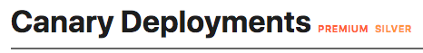

# Documentation Style Guide

This document defines the standards for GitLab documentation, including grammar, formatting, word use, and more.

For style questions, mention `@tw-style` in an issue or merge request. If you have access to the GitLab Slack workspace,
use the `#docs-processes` channel.

In addition to this page, the following resources can help you craft and contribute to documentation:

- [Doc contribution guidelines](../index.md)
- [A-Z word list](word_list.md)
- [Doc style and consistency testing](../testing.md)
- [UI text guidelines](https://design.gitlab.com/content/error-messages/)
- [GitLab Handbook style guidelines](https://about.gitlab.com/handbook/communication/#writing-style-guidelines)
- [Microsoft Style Guide](https://docs.microsoft.com/en-us/style-guide/welcome/)
- [Google Developer Documentation Style Guide](https://developers.google.com/style)
- [Recent updates to this guide](https://gitlab.com/dashboard/merge_requests?scope=all&state=merged&label_name[]=tw-style&not[label_name][]=docs%3A%3Afix)

## Documentation is the single source of truth (SSOT)

The GitLab documentation is the SSOT for all
information related to GitLab implementation, usage, and troubleshooting. It evolves
continuously, in keeping with new products and features, and with improvements
for clarity, accuracy, and completeness.

This policy prevents information silos, making it easier to find information
about GitLab products.

It also informs decisions about the kinds of content we include in our
documentation.

### The documentation includes all information

Include problem-solving actions that may address rare cases or be considered
_risky_, but provide proper context through fully-detailed
warnings and caveats. This kind of content should be included as it could be
helpful to others and, when properly explained, its benefits outweigh the risks.
If you think you have found an exception to this rule, contact the
Technical Writing team.

GitLab adds all troubleshooting information to the documentation, no matter how
unlikely a user is to encounter a situation.

GitLab Support maintains their own
[troubleshooting content](../../../administration/index.md#support-team-docs)
in the GitLab documentation.

### The documentation includes all media types

Include any media types/sources if the content is relevant to readers. You can
freely include or link presentations, diagrams, and videos. No matter who
it was originally composed for, if it is helpful to any of our audiences, we can
include it.

- If you use an image that has a separate source file (for example, a vector or
  diagram format), link the image to the source file so that it may be reused or
  updated by anyone.
- Do not copy and paste content from other sources unless it is a limited
  quotation with the source cited. Typically it is better to either rephrase
  relevant information in your own words or link out to the other source.

### Topic types

In the software industry, it is a best practice to organize documentation in
different types. For example:

- Concepts
- Tasks
- Reference
- Troubleshooting

At GitLab, we have not traditionally used topic types. However, we are starting to
move in this direction, so we can address these issues:

- **Content is hard to find.** Our docs are comprehensive and include a large amount of
  useful information. Topic types create repeatable patterns that make our content easier
  to scan and parse.
- **Content is often written from the contributor's point of view.**  Our docs
  are written by contributors. Topic types (tasks specifically) help put
  information into a format that is geared toward helping others, rather than
  documenting how a feature was implemented.

GitLab uses these [topic type templates](../structure.md).

### Link instead of repeating text

Rather than repeating information from another topic, link to the single source
of truth and explain why it is important.

### Docs-first methodology

We employ a _documentation-first methodology_. This method ensures the documentation
remains a complete and trusted resource, and makes communicating about the use
of GitLab more efficient.

- If the answer to a question exists in documentation, share the link to the
  documentation instead of rephrasing the information.
- When you encounter new information not available in GitLab documentation (for
  example, when working on a support case or testing a feature), your first step
  should be to create a merge request (MR) to add this information to the
  documentation. You can then share the MR to communicate this information.

New information that would be useful toward the future usage or troubleshooting
of GitLab should not be written directly in a forum or other messaging system,
but added to a documentation MR and then referenced, as described above.

The more we reflexively add information to the documentation, the more
the documentation helps others efficiently accomplish tasks and solve problems.

If you have questions when considering, authoring, or editing documentation, ask
the Technical Writing team. They're available on Slack in `#docs` or in GitLab by mentioning the
writer for the applicable [DevOps stage](https://about.gitlab.com/handbook/product/categories/#devops-stages).
Otherwise, forge ahead with your best effort. It does not need to be perfect;
the team is happy to review and improve upon your content. Review the
[Documentation guidelines](index.md) before you begin your first documentation MR.

Maintaining a knowledge base separate from the documentation would
be against the documentation-first methodology, because the content would overlap with
the documentation.

## Markdown

All GitLab documentation is written using [Markdown](https://en.wikipedia.org/wiki/Markdown).

The [documentation website](https://docs.gitlab.com) uses GitLab Kramdown as its
Markdown rendering engine. For a complete Kramdown reference, see the
[GitLab Markdown Kramdown Guide](https://about.gitlab.com/handbook/markdown-guide/).

The [`gitlab-kramdown`](https://gitlab.com/gitlab-org/gitlab_kramdown) Ruby gem
plans to support all [GitLab Flavored Markdown](../../../user/markdown.md) in the future, which is
all Markdown supported for display in the GitLab application itself. For now, use
regular Markdown and follow the rules in the linked style guide.

Kramdown-specific markup (for example, `{:.class}`) doesn't render
properly on GitLab instances under [`/help`](../index.md#gitlab-help).

### HTML in Markdown

Hard-coded HTML is valid, although it's discouraged from being used while we
have `/help`. HTML is permitted if:

- There's no equivalent markup in Markdown.
- Advanced tables are necessary.
- Special styling is required.
- Reviewed and approved by a technical writer.

### Markdown Rules

GitLab ensures that the Markdown used across all documentation is consistent, as
well as easy to review and maintain, by [testing documentation changes](../testing.md)
with [markdownlint](../testing.md#markdownlint). This lint test fails when any
document has an issue with Markdown formatting that may cause the page to render
incorrectly in GitLab. It also fails when a document has
non-standard Markdown (which may render correctly, but is not the current
standard for GitLab documentation).

#### Markdown rule `MD044/proper-names` (capitalization)

A rule that could cause confusion is `MD044/proper-names`, as it might not be
immediately clear what caused markdownlint to fail, or how to correct the
failure. This rule checks a list of known words, listed in the `.markdownlint.yml`
file in each project, to verify proper use of capitalization and backticks.
Words in backticks are ignored by markdownlint.

In general, product names should follow the exact capitalization of the official
names of the products, protocols, and so on.

Some examples fail if incorrect capitalization is used:

- MinIO (needs capital `IO`)
- NGINX (needs all capitals)
- runit (needs lowercase `r`)

Additionally, commands, parameters, values, filenames, and so on must be
included in backticks. For example:

- "Change the `needs` keyword in your `.gitlab-ci.yml`..."
  - `needs` is a parameter, and `.gitlab-ci.yml` is a file, so both need backticks.
    Additionally, `.gitlab-ci.yml` without backticks fails markdownlint because it
    does not have capital G or L.
- "Run `git clone` to clone a Git repository..."
  - `git clone` is a command, so it must be lowercase, while Git is the product,
    so it must have a capital G.

## Structure

We include concept and task topic types in the same larger topic.

In general, we have one topic that's a landing page.
Below that topic in the left nav are individual topics. Each of these include a concept
and multiple related tasks, reference, and troubleshooting topics.

### Folder structure overview

The documentation is separated by top-level audience folders [`user`](https://gitlab.com/gitlab-org/gitlab-foss/tree/master/doc/user),
[`administration`](https://gitlab.com/gitlab-org/gitlab-foss/tree/master/doc/administration),
and [`development`](https://gitlab.com/gitlab-org/gitlab-foss/tree/master/doc/development)
(contributing) folders.

Beyond that, we primarily follow the structure of the GitLab user interface or
API.

Our goal is to have a clear hierarchical structure with meaningful URLs like
`docs.gitlab.com/user/project/merge_requests/`. With this pattern, you can
immediately tell that you are navigating to user-related documentation about
Project features; specifically about Merge Requests. Our site's paths match
those of our repository, so the clear structure also makes documentation easier
to update.

Put files for a specific product area into the related folder:

| Directory             | Contents |
|:----------------------|:------------------|
| `doc/user/`           | Documentation for users. Anything that can be done in the GitLab user interface goes here, including usage of the `/admin` interface. |
| `doc/administration/` | Documentation that requires the user to have access to the server where GitLab is installed. Administrator settings in the GitLab user interface are under `doc/user/admin_area/`. |
| `doc/api/`            | Documentation for the API. |
| `doc/development/`    | Documentation related to the development of GitLab, whether contributing code or documentation. Related process and style guides should go here. |
| `doc/legal/`          | Legal documents about contributing to GitLab. |
| `doc/install/`        | Instructions for installing GitLab. |
| `doc/update/`         | Instructions for updating GitLab. |
| `doc/topics/`         | Indexes per topic (`doc/topics/topic_name/index.md`): all resources for that topic. |

### Work with directories and files

When working with directories and files:

1. When you create a new directory, always start with an `index.md` file.
   Don't use another filename and _do not_ create `README.md` files.
1. _Do not_ use special characters and spaces, or capital letters in file
   names, directory names, branch names, and anything that generates a path.
1. When creating or renaming a file or directory and it has more than one word
   in its name, use underscores (`_`) instead of spaces or dashes. For example,
   proper naming would be `import_project/import_from_github.md`. This applies
   to both image files and Markdown files.
1. For image files, do not exceed 100KB.
1. Do not upload video files to the product repositories.
   [Link or embed videos](#videos) instead.
1. There are four main directories: `user`, `administration`, `api`, and
   `development`.
1. The `doc/user/` directory has five main subdirectories: `project/`, `group/`,
   `profile/`, `dashboard/` and `admin_area/`.
   - `doc/user/project/` should contain all project related documentation.
   - `doc/user/group/` should contain all group related documentation.
   - `doc/user/profile/` should contain all profile related documentation.
     Every page you would navigate under `/profile` should have its own document,
     for example, `account.md`, `applications.md`, or `emails.md`.
   - `doc/user/dashboard/` should contain all dashboard related documentation.
   - `doc/user/admin_area/` should contain all administrator-related
     documentation describing what can be achieved by accessing the GitLab
     administrator interface (not to be confused with `doc/administration` where
     server access is required).
     - Every category under `/admin/application_settings/` should have its
      own document located at `doc/user/admin_area/settings/`. For example,
      the **Visibility and Access Controls** category should have a document
      located at `doc/user/admin_area/settings/visibility_and_access_controls.md`.
1. The `doc/topics/` directory holds topic-related technical content. Create
   `doc/topics/topic_name/subtopic_name/index.md` when subtopics become necessary.
   General user and administrator documentation should be placed accordingly.
1. The `/university/` directory is *deprecated* and the majority of its documentation
   has been moved.

If you're unsure where to place a document or a content addition, this shouldn't
stop you from authoring and contributing. Use your best judgment, and then ask
the reviewer of your MR to confirm your decision. You can also ask a technical writer at
any stage in the process. The technical writing team reviews all
documentation changes, regardless, and can move content if there is a better
place for it.

### Avoid duplication

Do not include the same information in multiple places.
[Link to a single source of truth instead.](#link-instead-of-repeating-text)

### References across documents

- Give each folder an `index.md` page that introduces the topic, and both introduces
  and links to the child pages, including to the index pages of
  any next-level sub-paths.
- To ensure discoverability, ensure each new or renamed doc is linked from its
  higher-level index page and other related pages.
- When making reference to other GitLab products and features, link to their
  respective documentation, at least on first mention.
- When making reference to third-party products or technologies, link out to
  their external sites, documentation, and resources.

### Structure in documents

- Include any and all applicable subsections as described on the
  [structure and template](../structure.md) page.
- Structure content in alphabetical order in tables, lists, and so on, unless
  there's a logical reason not to (for example, when mirroring the user
  interface or an otherwise ordered sequence).

## Language

GitLab documentation should be clear and easy to understand. Avoid unnecessary words.

- Be clear, concise, and stick to the goal of the topic.
- Write in US English with US grammar. (Tested in [`British.yml`](https://gitlab.com/gitlab-org/gitlab/-/blob/master/doc/.vale/gitlab/British.yml).)
- Rewrite to avoid wordiness:
  - there is
  - there are
  - enables you to
  - in order to
  - because of the fact that

### Capitalization

#### Headings

Use sentence case. For example:

- `# Use variables to configure pipelines`
- `## Use the To-Do List`

#### UI text

When referring to specific user interface text, like a button label or menu
item, use the same capitalization that's displayed in the user interface.
Standards for this content are listed in the [Pajamas Design System Content section](https://design.gitlab.com/content/punctuation/)
and typically match what's called for in this Documentation Style Guide.

If you think the user interface text contains style mistakes,
create an issue or an MR to propose a change to the user interface text.

#### Feature names

- *Feature names are typically lowercase*, like those describing actions and
  types of objects in GitLab. For example:
  - epics
  - issues
  - issue weights
  - merge requests
  - milestones
  - reorder issues
  - runner, runners, shared runners
  - a to-do item (tested in [`ToDo.yml`](https://gitlab.com/gitlab-org/gitlab/-/blob/master/doc/.vale/gitlab/ToDo.yml))
- *Some features are capitalized*, typically nouns naming GitLab-specific
  capabilities or tools. For example:
  - GitLab CI/CD
  - Repository Mirroring
  - Value Stream Analytics
  - the To-Do List
  - the Web IDE
  - Geo
  - GitLab Runner (see [this issue](https://gitlab.com/gitlab-org/gitlab/-/issues/233529) for details)

Document any exceptions in this style guide. If you're not sure, ask a GitLab
Technical Writer so that they can help decide and document the result.

Do not match the capitalization of terms or phrases on the [Features page](https://about.gitlab.com/features/)
or [features.yml](https://gitlab.com/gitlab-com/www-gitlab-com/blob/master/data/features.yml)
by default.

#### Other terms

Capitalize names of:

- GitLab [product tiers](https://about.gitlab.com/pricing/). For example,
  GitLab Free and GitLab Ultimate. (Tested in [`BadgeCapitalization.yml`](https://gitlab.com/gitlab-org/gitlab/-/blob/master/doc/.vale/gitlab/BadgeCapitalization.yml).)
- Third-party organizations, software, and products. For example, Prometheus,
  Kubernetes, Git, and The Linux Foundation.
- Methods or methodologies. For example, Continuous Integration,
  Continuous Deployment, Scrum, and Agile.

Follow the capitalization style listed at the authoritative source
for the entity, which may use non-standard case styles. For example: GitLab and
npm.

Use forms of *sign in*, instead of *log in* or *login*. For example:

- Sign in to GitLab.
- Open the sign-in page.

Exceptions to this rule include the concept of *single sign-on* and
references to user interface elements. For example:

- To sign in to product X, enter your credentials, and then select **Log in**.

### Fake user information

You may need to include user information in entries such as a REST call or user profile.
_Do not_ use real user information or email addresses in GitLab documentation. For email
addresses and names, do use:

- _Email addresses_: Use an email address ending in `example.com`.
- _Names_: Use strings like `example_username`. Alternatively, use diverse or
  non-gendered names with common surnames, such as `Sidney Jones`, `Zhang Wei`,
  or `Alex Garcia`.

### Fake URLs

When including sample URLs in the documentation, use:

- `example.com` when the domain name is generic.
- `gitlab.example.com` when referring only to self-managed GitLab instances.
  Use `gitlab.com` for GitLab SaaS instances.

### Fake tokens

There may be times where a token is needed to demonstrate an API call using
cURL or a variable used in CI. It is strongly advised not to use real tokens in
documentation even if the probability of a token being exploited is low.

You can use these fake tokens as examples:

| Token type            | Token value                                                        |
|:----------------------|:-------------------------------------------------------------------|
| Personal access token | `<your_access_token>`                                             |
| Application ID        | `2fcb195768c39e9a94cec2c2e32c59c0aad7a3365c10892e8116b5d83d4096b6` |
| Application secret    | `04f294d1eaca42b8692017b426d53bbc8fe75f827734f0260710b83a556082df` |
| CI/CD variable        | `Li8j-mLUVA3eZYjPfd_H`                                             |
| Specific runner token | `yrnZW46BrtBFqM7xDzE7dddd`                                         |
| Shared runner token   | `6Vk7ZsosqQyfreAxXTZr`                                             |
| Trigger token         | `be20d8dcc028677c931e04f3871a9b`                                   |
| Webhook secret token  | `6XhDroRcYPM5by_h-HLY`                                             |
| Health check token    | `Tu7BgjR9qeZTEyRzGG2P`                                             |
| Request profile token | `7VgpS4Ax5utVD2esNstz`                                             |

### Contractions

Contractions are encouraged, and can create a friendly and informal tone,
especially in tutorials, instructional documentation, and
[user interfaces](https://design.gitlab.com/content/punctuation/#contractions).

Some contractions, however, should be avoided:

- Do not use the word "GitLab" in a contraction.

- Do not use contractions with a proper noun and a verb. For example:

  | Do                                       | Don't                                   |
  |------------------------------------------|-----------------------------------------|
  | Canada is establishing X.                | Canada's establishing X.                |

- Do not use contractions when you need to emphasize a negative. For example:

  | Do                                       | Don't                                   |
  |------------------------------------------|-----------------------------------------|
  | Do *not* install X with Y.               | *Don't* install X with Y.               |

- Do not use contractions in reference documentation. For example:

  | Do                                       | Don't                                   |
  |------------------------------------------|-----------------------------------------|
  | Do *not* set a limit greater than 1000.  | *Don't* set a limit greater than 1000.  |
  | For `parameter1`, the default is 10.     | For `parameter1`, the default's 10.     |

- Avoid contractions in error messages. Examples:

  | Do                                       | Don't                                   |
  |------------------------------------------|-----------------------------------------|
  | Requests to localhost are not allowed.   | Requests to localhost aren't allowed.   |
  | Specified URL cannot be used.            | Specified URL can't be used.            |

## Text

- [Write in Markdown](#markdown).
- Splitting long lines (preferably up to 100 characters) can make it easier to
  provide feedback on small chunks of text.
- Insert an empty line for new paragraphs.
- Insert an empty line between different markups (for example, after every
  paragraph, header, list, and so on). Example:

  ```markdown
  ## Header

  Paragraph.

  - List item 1
  - List item 2
  ```

### Emphasis

- Use double asterisks (`**`) to mark a word or text in bold (`**bold**`).
- Use underscore (`_`) for text in italics (`_italic_`).
- Use greater than (`>`) for blockquotes.

### Punctuation

Follow these guidelines for punctuation:

<!-- vale gitlab.Repetition = NO -->

| Rule                                                             | Example                                                |
|------------------------------------------------------------------|--------------------------------------------------------|
| Avoid semicolons. Use two sentences instead.                     | _That's the way that the world goes 'round. You're up one day and the next you're down._
| Always end full sentences with a period.                         | _For a complete overview, read through this document._ |
| Always add a space after a period when beginning a new sentence. | _For a complete overview, check this doc. For other references, check out this guide._ |
| Do not use double spaces. (Tested in [`SentenceSpacing.yml`](https://gitlab.com/gitlab-org/gitlab/-/blob/master/doc/.vale/gitlab/SentenceSpacing.yml).) | --- |
| Do not use tabs for indentation. Use spaces instead. You can configure your code editor to output spaces instead of tabs when pressing the tab key. | --- |
| Use serial commas (_Oxford commas_) before the final _and_ or _or_ in a list of three or more items. (Tested in [`OxfordComma.yml`](https://gitlab.com/gitlab-org/gitlab/-/blob/master/doc/.vale/gitlab/OxfordComma.yml).) | _You can create new issues, merge requests, and milestones._ |
| Always add a space before and after dashes when using it in a sentence (for replacing a comma, for example). | _You should try this - or not._ |
| Always use lowercase after a colon.                              | Linked issues: a way to create a relationship between issues._ |

<!-- vale gitlab.Repetition = YES -->

### Placeholder text

You might want to provide a command or configuration that
uses specific values.

In these cases, use [`<` and `>`](https://en.wikipedia.org/wiki/Usage_message#Pattern)
to call out where a reader must replace text with their own value.

For example:

```shell
cp <your_source_directory> <your_destination_directory>
```

### Keyboard commands

Use the HTML `<kbd>` tag when referring to keystroke presses. For example:

```plaintext
To stop the command, press <kbd>Control</kbd>+<kbd>C</kbd>.
```

When the docs are generated, the output is:

To stop the command, press <kbd>Control</kbd>+<kbd>C</kbd>.

### Spaces between words

Use only standard spaces between words. The search engine for the documentation
website doesn't split words separated with
[non-breaking spaces](https://en.wikipedia.org/wiki/Non-breaking_space) when
indexing, and fails to create expected individual search terms. Tests that search
for certain words separated by regular spaces can't find words separated by
non-breaking spaces.

Tested in [`lint-doc.sh`](https://gitlab.com/gitlab-org/gitlab/-/blob/master/scripts/lint-doc.sh).

## Lists

- Always start list items with a capital letter, unless they're parameters or
  commands that are in backticks, or similar.
- Always leave a blank line before and after a list.
- Begin a line with spaces (not tabs) to denote a [nested sub-item](#nesting-inside-a-list-item).

### Ordered vs. unordered lists

Only use ordered lists when their items describe a sequence of steps to follow.

Do:

```markdown
These are the steps to do something:

1. First, do the first step.
1. Then, do the next step.
1. Finally, do the last step.
```

Don't:

```markdown
This is a list of available features:

1. Feature 1
1. Feature 2
1. Feature 3
```

### Markup

- Use dashes (`-`) for unordered lists instead of asterisks (`*`).
- Prefix `1.` to every item in an ordered list. When rendered, the list items
  display with sequential numbering.

### Punctuation

- Don't add commas (`,`) or semicolons (`;`) to the ends of list items.
- Only add periods to the end of a list item if the item consists of a complete
  sentence (with a subject and a verb).
- Be consistent throughout the list: if the majority of the items do not end in
  a period, do not end any of the items in a period, even if they consist of a
  complete sentence. The opposite is also valid: if the majority of the items
  end with a period, end all with a period.
- Separate list items from explanatory text with a colon (`:`). For example:

  ```markdown
  The list is as follows:

  - First item: this explains the first item.
  - Second item: this explains the second item.
  ```

**Examples:**

Do:

- First list item
- Second list item
- Third list item

Don't:

- First list item
- Second list item
- Third list item.

Do:

- Let's say this is a complete sentence.
- Let's say this is also a complete sentence.
- Not a complete sentence.

Don't (vary use of periods; majority rules):

- Let's say this is a complete sentence.
- Let's say this is also a complete sentence.
- Not a complete sentence

### Nesting inside a list item

It's possible to nest items under a list item, so that they render with the same
indentation as the list item. This can be done with:

- [Code blocks](#code-blocks)
- [Blockquotes](#blockquotes)
- [Alert boxes](#alert-boxes)
- [Images](#images)

Items nested in lists should always align with the first character of the list
item. In unordered lists (using `-`), this means two spaces for each level of
indentation:

````markdown
- Unordered list item 1

  A line nested using 2 spaces to align with the `U` above.

- Unordered list item 2

  > A quote block that will nest
  > inside list item 2.

- Unordered list item 3

  ```plaintext
  a code block that nests inside list item 3
  ```

- Unordered list item 4

  
````

For ordered lists, use three spaces for each level of indentation:

````markdown
1. Ordered list item 1

   A line nested using 3 spaces to align with the `O` above.

1. Ordered list item 2

   > A quote block that will nest
   > inside list item 2.

1. Ordered list item 3

   ```plaintext
   a code block that nests inside list item 3
   ```

1. Ordered list item 4

   
````

You can nest full lists inside other lists using the same rules as above. If you
want to mix types, that's also possible, if you don't mix items at the same
level:

```markdown
1. Ordered list item one.
1. Ordered list item two.
   - Nested unordered list item one.
   - Nested unordered list item two.
1. Ordered list item three.

- Unordered list item one.
- Unordered list item two.
  1. Nested ordered list item one.
  1. Nested ordered list item two.
- Unordered list item three.
```

## Tables

Tables should be used to describe complex information in a straightforward
manner. Note that in many cases, an unordered list is sufficient to describe a
list of items with a single, simple description per item. But, if you have data
that's best described by a matrix, tables are the best choice.

### Creation guidelines

To keep tables accessible and scannable, tables should not have any
empty cells. If there is no otherwise meaningful value for a cell, consider entering
*N/A* (for 'not applicable') or *none*.

To help tables be easier to maintain, consider adding additional spaces to the
column widths to make them consistent. For example:

```markdown
| App name | Description          | Requirements   |
|:---------|:---------------------|:---------------|
| App 1    | Description text 1.  | Requirements 1 |
| App 2    | Description text 2.  | None           |
```

Consider installing a plugin or extension in your editor for formatting tables:

- [Markdown Table Prettifier](https://marketplace.visualstudio.com/items?itemName=darkriszty.markdown-table-prettify) for Visual Studio Code
- [Markdown Table Formatter](https://packagecontrol.io/packages/Markdown%20Table%20Formatter) for Sublime Text
- [Markdown Table Formatter](https://atom.io/packages/markdown-table-formatter) for Atom

### Feature tables

When creating tables of lists of features (such the features
available to each role on the [Permissions](../../../user/permissions.md#project-members-permissions)
page), use these phrases:

| Option | Markdown                 | Displayed result       |
|--------|--------------------------|------------------------|
| No     | `**{dotted-circle}** No` | **{dotted-circle}** No |
| Yes    | `**{check-circle}** Yes` | **{check-circle}** Yes |

### Footnotes

To indicate a footnote, use the HTML tag `<sup>` with a number.
Put the tag at the end of the sentence or term.

For the footnotes below the table, use a bold number followed by a sentence.

For example:

```markdown
| App name | Description                      |
|:---------|:---------------------------------|
| App A    | Description text. <sup>1</sup>   |
| App B    | Description text. <sup>2</sup>   |

1. This is the footnote.
1. This is the other footnote.
```

This text renders this output:

| App name | Description                      |
|:---------|:---------------------------------|
| App A    | Description text. <sup>1</sup>   |
| App B    | Description text. <sup>2</sup>   |

1. This is the footnote.
1. This is the other footnote.

## Quotes

Valid for Markdown content only, not for front matter entries:

- Standard quotes: double quotes (`"`). Example: "This is wrapped in double
  quotes".
- Quote inside a quote: double quotes (`"`) wrap single quotes (`'`). Example:
  "This sentence 'quotes' something in a quote".

For other punctuation rules, refer to the
[GitLab UX guide](https://design.gitlab.com/content/punctuation/).

## Headings

- Add _only one H1_ in each document, by adding `#` at the beginning of
  it (when using Markdown). The `h1` becomes the document `<title>`.
- Start with an `h2` (`##`), and respect the order `h2` > `h3` > `h4` > `h5` > `h6`.
  Never skip the hierarchy level, such as `h2` > `h4`
- Avoid putting numbers in headings. Numbers shift, hence documentation anchor
  links shift too, which eventually leads to dead links. If you think it is
  compelling to add numbers in headings, make sure to at least discuss it with
  someone in the Merge Request.
- [Avoid using symbols and special characters](https://gitlab.com/gitlab-org/gitlab-docs/-/issues/84)
  in headers. Whenever possible, they should be plain and short text.
- When possible, avoid including words that might change in the future. Changing
  a heading changes its anchor URL, which affects other linked pages.
- When introducing a new document, be careful for the headings to be
  grammatically and syntactically correct. Mention an [assigned technical writer (TW)](https://about.gitlab.com/handbook/product/categories/)
  for review.
  This is to ensure that no document with wrong heading is going live without an
  audit, thus preventing dead links and redirection issues when corrected.
- Leave exactly one blank line before and after a heading.
- Do not use links in headings.
- Add the corresponding [product badge](#product-tier-badges) according to the tier the
  feature belongs.
- Our documentation site search engine prioritizes words used in headings and
  subheadings. Make your subheading titles clear, descriptive, and complete to help
  users find the right example, as shown in the section on [heading titles](#heading-titles).
- See [Capitalization](#capitalization) for guidelines on capitalizing headings.

### Heading titles

Keep heading titles clear and direct. Make every word count. To accommodate
search engine optimization (SEO), use the imperative, where possible.

| Do                                    | Don't                                                       |
|:--------------------------------------|:------------------------------------------------------------|
| Configure GDK                         | Configuring GDK                                             |
| GitLab Release and Maintenance Policy | This section covers the GitLab Release and Maintenance Policy |
| Backport to older releases            | Backporting to older releases                               |
| GitLab Pages examples                 | Examples                                                    |

For guidelines on capitalizing headings, see the section on [capitalization](#capitalization).

NOTE:
If you change an existing title, be careful. In-page [anchor links](#anchor-links),
links in the GitLab application, and links from external sites can break.

### Anchor links

Headings generate anchor links when rendered. `## This is an example` generates
the anchor `#this-is-an-example`.

NOTE:
[Introduced](https://gitlab.com/gitlab-org/gitlab/-/merge_requests/39717) in
GitLab 13.4, [product badges](#product-tier-badges) used in headings aren't
included in the generated anchor links. For example, when you link to
`## This is an example **(FREE)**`, use the anchor `#this-is-an-example`.

Keep in mind that the GitLab user interface links to many documentation pages
and anchor links to take the user to the right spot. When you change
a heading, search `doc/*`, `app/views/*`, and `ee/app/views/*` for the old
anchor. If you do not fix these links, the [`ui-docs-lint` job](../testing.md#ui-link-tests)
in your merge request fails.

Important:

- Avoid crosslinking documentation to headings unless you need to link to a
  specific section of the document. This avoids breaking anchors in the
  future in case the heading is changed.
- If possible, avoid changing headings, because they're not only linked internally.
  There are various links to GitLab documentation on the internet, such as
  tutorials, presentations, StackOverflow posts, and other sources.
- Do not link to `h1` headings.

Note that with Kramdown, it's possible to add a custom ID to an HTML element
with Markdown markup, but they don't work in `/help`. Because of this, don't use
this option.

## Links

Links are important in GitLab documentation. Use links instead of
summarizing to help preserve a [single source of truth](#documentation-is-the-single-source-of-truth-ssot)
in GitLab documentation.

We include guidance for links in these categories:

- How to set up [anchor links](#anchor-links) for headings.
- How to set up [criteria](#basic-link-criteria) for configuring a link.
- What to set up when [linking to a `help`](../../documentation/index.md#linking-to-help)
  page.
- How to set up [links to internal documentation](#links-to-internal-documentation)
  for cross-references.
- How to set up [links to external documentation](#links-to-external-documentation)
  for authoritative sources.
- When to use [links requiring permissions](#links-requiring-permissions).
- How to set up a [link to a video](#link-to-video).
- How to [include links with version text](#where-to-put-version-text).
- How to [link to specific lines of code](#link-to-specific-lines-of-code)

### Basic link criteria

- Use inline link Markdown markup `[Text](https://example.com)`.
  It's easier to read, review, and maintain. _Do not_ use `[Text][identifier]`.

- Use [meaningful anchor texts](https://www.futurehosting.com/blog/links-should-have-meaningful-anchor-text-heres-why/).
  For example, instead of writing something like `Read more about GitLab Issue Boards [here](LINK)`,
  write `Read more about [GitLab Issue Boards](LINK)`.

### Links to internal documentation

NOTE:
_Internal_ refers to documentation in the same project. When linking to
documentation in separate projects (for example, linking to Omnibus documentation
from GitLab documentation), you must use absolute URLs.

Do not use absolute URLs like `https://docs.gitlab.com/ee/index.html` to
cross-link to other documentation in the same project. Use relative links to
the file, like `../index.md`. (These are converted to HTML when the site is
rendered.)

Relative linking enables crosslinks to work:

- in Review Apps, local previews, and `/help`.
- when working on the documentation locally, so you can verify that they work as
  early as possible in the process.
- in the GitLab user interface when browsing doc files in their respective
  repositories. For example, the links displayed at
  `https://gitlab.com/gitlab-org/gitlab/-/blob/master/doc/README.md`.

To link to internal documentation:

- Use relative links to Markdown files in the same repository.
- Do not use absolute URLs or URLs from `docs.gitlab.com`.
- Use `../` to navigate to higher-level directories.
- Don't prepend `./` to links to files or directories. To link to a file in the
  same directory or one of its sub-directories, use the syntax `path/to/file.md`.
- Don't link relative to root. For example, `/ee/user/gitlab_com/index.md`.

  Don't:

  - `https://docs.gitlab.com/ee/administration/geo/replication/troubleshooting.html`
  - `/ee/administration/geo/replication/troubleshooting.md`
  - `./troubleshooting.md`

  Do: `../../geo/replication/troubleshooting.md`

- Always add the filename `file.md` at the end of the link with the `.md`
  extension, not `.html`.

  Don't:

  - `../../merge_requests/`
  - `../../issues/tags.html`
  - `../../issues/tags.html#stages`

  Do:

  - `../../merge_requests/index.md`
  - `../../issues/tags.md`
  - `../../issues/tags.md#stages`
  - `issues/tags.md`

NOTE:
Using the Markdown extension is necessary for the [`/help`](../index.md#gitlab-help)
section of GitLab.

### Links to external documentation

When describing interactions with external software, it's often helpful to
include links to external documentation. When possible, make sure that you're
linking to an [**authoritative** source](#authoritative-sources). For example,
if you're describing a feature in Microsoft's Active Directory, include a link
to official Microsoft documentation.

### Authoritative sources

When citing external information, use sources that are written by the people who
created the item or product in question. These sources are the most likely to be
accurate and remain up to date.

Examples of authoritative sources include:

- Specifications, such as a [Request for Comments](https://www.ietf.org/standards/rfcs/)
  document from the Internet Engineering Task Force.
- Official documentation for a product. For example, if you're setting up an
  interface with the Google OAuth 2 authorization server, include a link to
  Google's documentation.
- Official documentation for a project. For example, if you're citing NodeJS
  functionality, refer directly to [NodeJS documentation](https://nodejs.org/en/docs/).
- Books from an authoritative publisher.

Examples of sources to avoid include:

- Personal blog posts.
- Wikipedia.
- Non-trustworthy articles.
- Discussions on forums such as Stack Overflow.
- Documentation from a company that describes another company's product.

While many of these sources to avoid can help you learn skills and or features,
they can become obsolete quickly. Nobody is obliged to maintain any of these
sites. Therefore, we should avoid using them as reference literature.

NOTE:
Non-authoritative sources are acceptable only if there is no equivalent
authoritative source. Even then, focus on non-authoritative sources that are
extensively cited or peer-reviewed.

### Links requiring permissions

Don't link directly to:

- [Confidential issues](../../../user/project/issues/confidential_issues.md).
- Project features that require [special permissions](../../../user/permissions.md)
  to view.

These fail for:

- Those without sufficient permissions.
- Automated link checkers.

Instead:

- To reduce confusion, mention in the text that the information is either:
  - Contained in a confidential issue.
  - Requires special permission to a project to view.
- Provide a link in back ticks (`` ` ``) so that those with access to the issue
  can navigate to it.

Example:

```markdown
For more information, see the [confidential issue](../../../user/project/issues/confidential_issues.md) `https://gitlab.com/gitlab-org/gitlab-foss/-/issues/<issue_number>`.
```

### Link to specific lines of code

When linking to specific lines in a file, link to a commit instead of to the
branch. Lines of code change over time. Linking to a line by using
the commit link ensures the user lands on the line you're referring to. The
**Permalink** button, displayed when viewing a file in a project,
provides a link to the most recent commit of that file.

- _Do_: `[link to line 3](https://gitlab.com/gitlab-org/gitlab/-/blob/11f17c56d8b7f0b752562d78a4298a3a95b5ce66/.gitlab/issue_templates/Feature%20proposal.md#L3)`
- _Don't_: `[link to line 3](https://gitlab.com/gitlab-org/gitlab/-/blob/master/.gitlab/issue_templates/Feature%20proposal.md#L3).`

If that linked expression has changed line numbers due to additional
commits, you can still search the file for that query. In this case, update the
document to ensure it links to the most recent version of the file.

## Navigation

When documenting navigation through the user interface, use these terms and styles.

### What to call the menus

Use these terms when referring to the main GitLab user interface
elements:

- **Top bar**: This is the top bar that spans the width of the user interface.
  It includes the menu, the GitLab logo, search field, counters, and the user's avatar.
- **Left sidebar**: This is the navigation sidebar on the left of the user
  interface, specific to the project or group.
- **Right sidebar**: This is the navigation sidebar on the right of the user
  interface, specific to the open issue, merge request, or epic.

### How to document the menus

To be consistent, use this format when you write about UI navigation.

1. On the top bar, select **Menu > Projects** and find your project.
1. On the left sidebar, select **Settings > CI/CD**.
1. Expand **General pipelines**.

Another example:

1. On the top bar, select **Menu > Groups** and find your group.
1. On the left sidebar, select **Settings > CI/CD**.
1. Expand **General pipelines**.

An Admin Area example:

```markdown
1. On the top bar, select **Menu >** **{admin}** **Admin**.
```

This text renders this output:

1. On the top bar, select **Menu >** **{admin}** **Admin**.

## Images

Images, including screenshots, can help a reader better understand a concept.
However, they can be hard to maintain, and should be used sparingly.

Before including an image in the documentation, ensure it provides value to the
reader.

### Capture the image

Use images to help the reader understand where they are in a process, or how
they need to interact with the application.

When you take screenshots:

- _Capture the most relevant area of the page._ Don't include unnecessary white
  space or areas of the page that don't help illustrate the point. The left
  sidebar of the GitLab user interface can change, so don't include the sidebar
  if it's not necessary.
- _Keep it small._ If you don't need to show the full width of the screen, don't.
  A value of 1000 pixels is a good maximum width for your screenshot image.
- _Be consistent._ Coordinate screenshots with the other screenshots already on
  a documentation page. For example, if other screenshots include the left
  sidebar, include the sidebar in all screenshots.

### Save the image

- Save the image with a lowercase filename that's descriptive of the feature
  or concept in the image. If the image is of the GitLab interface, append the
  GitLab version to the filename, based on this format:
  `image_name_vX_Y.png`. For example, for a screenshot taken from the pipelines
  page of GitLab 11.1, a valid name is `pipelines_v11_1.png`. If you're adding an
  illustration that doesn't include parts of the user interface, add the release
  number corresponding to the release the image was added to; for an MR added to
  11.1's milestone, a valid name for an illustration is `devops_diagram_v11_1.png`.
- Place images in a separate directory named `img/` in the same directory where
  the `.md` document that you're working on is located.
- Consider using PNG images instead of JPEG.
- [Compress all PNG images](#compress-images).
- Compress GIFs with <https://ezgif.com/optimize> or similar tool.
- Images should be used (only when necessary) to _illustrate_ the description
  of a process, not to _replace_ it.
- Max image size: 100KB (GIFs included).
- See also how to link and embed [videos](#videos) to illustrate the
  documentation.

### Add the image link to content

The Markdown code for including an image in a document is:
``

The image description is the alt text for the rendered image on the
documentation site. For accessibility and SEO, use [descriptions](https://webaim.org/techniques/alttext/)
that:

- Are accurate, succinct, and unique.
- Don't use _image of…_ or _graphic of…_ to describe the image.

### Compress images

You should always compress any new images you add to the documentation. One
known tool is [`pngquant`](https://pngquant.org/), which is cross-platform and
open source. Install it by visiting the official website and following the
instructions for your OS.

GitLab has a [Rake task](https://gitlab.com/gitlab-org/gitlab/-/blob/master/lib/tasks/pngquant.rake)
that you can use to automate the process. In the root directory of your local
copy of `https://gitlab.com/gitlab-org/gitlab`, run in a terminal:

- Before compressing, if you want, check that all documentation PNG images have
  been compressed:

  ```shell
  bundle exec rake pngquant:lint
  ```

- Compress all documentation PNG images using `pngquant`:

  ```shell
  bundle exec rake pngquant:compress
  ```

The only caveat is that the task runs on all images under `doc/`, not only the
ones you might have included in a merge request. In that case, you can run the
compress task and only commit the images that are relevant to your merge
request.

## Videos

Adding GitLab YouTube video tutorials to the documentation is highly
encouraged, unless the video is outdated. Videos should not replace
documentation, but complement or illustrate it. If content in a video is
fundamental to a feature and its key use cases, but isn't adequately
covered in the documentation, you should:

- Add this detail to the documentation text.
- Create an issue to review the video and update the page.

Do not upload videos to the product repositories. [Link](#link-to-video) or
[embed](#embed-videos) them instead.

### Link to video

To link out to a video, include a YouTube icon so that readers can scan the page
for videos before reading:

```markdown
<i class="fa fa-youtube-play youtube" aria-hidden="true"></i>
For an overview, see [Video Title](link-to-video).
```

You can link any up-to-date video that's useful to the GitLab user.

### Embed videos

> [Introduced](https://gitlab.com/gitlab-org/gitlab-docs/-/merge_requests/472) in GitLab 12.1.

The [GitLab documentation site](https://docs.gitlab.com) supports embedded
videos.

You can embed videos from [the official YouTube account for GitLab](https://www.youtube.com/channel/UCnMGQ8QHMAnVIsI3xJrihhg) only.
For videos from other sources, [link](#link-to-video) them instead.

In most cases, [link to a video](#link-to-video), because
embedded videos take up a lot of space on the page and can be distracting to readers.

To embed a video:

1. Copy the code from this procedure and paste it into your Markdown file. Leave a
   blank line above and below it. Do _not_ edit the code (don't remove or add any spaces).
1. In YouTube, visit the video URL you want to display. Copy the regular URL
   from your browser (`https://www.youtube.com/watch?v=VIDEO-ID`) and replace
   the video title and link in the line under `<div class="video-fallback">`.
1. In YouTube, select **Share**, and then select **Embed**.
1. Copy the `<iframe>` source (`src`) **URL only**
   (`https://www.youtube.com/embed/VIDEO-ID`),
   and paste it, replacing the content of the `src` field in the
   `iframe` tag.

```html
leave a blank line here
<div class="video-fallback">
  See the video: <a href="https://www.youtube.com/watch?v=MqL6BMOySIQ">Video title</a>.
</div>
<figure class="video-container">
  <iframe src="https://www.youtube.com/embed/MqL6BMOySIQ" frameborder="0" allowfullscreen="true"> </iframe>
</figure>
leave a blank line here
```

This is how it renders on the GitLab documentation site:

<div class="video-fallback">
  See the video: <a href="https://www.youtube.com/watch?v=enMumwvLAug">What is GitLab</a>.
</div>
<figure class="video-container">
  <iframe src="https://www.youtube.com/embed/MqL6BMOySIQ" frameborder="0" allowfullscreen="true"> </iframe>
</figure>

> Notes:
>
> - The `figure` tag is required for semantic SEO and the `video_container`
class is necessary to make sure the video is responsive and displays on
different mobile devices.
> - The `<div class="video-fallback">` is a fallback necessary for
`/help`, because the GitLab Markdown processor doesn't support iframes. It's
hidden on the documentation site, but is displayed by `/help`.

## Code blocks

- Always wrap code added to a sentence in inline code blocks (`` ` ``).
  For example, `.gitlab-ci.yml`, `git add .`, `CODEOWNERS`, or `only: [main]`.
  File names, commands, entries, and anything that refers to code should be
  added to code blocks. To make things easier for the user, always add a full
  code block for things that can be useful to copy and paste, as they can do it
  with the button on code blocks.
- HTTP methods (`HTTP POST`) and HTTP status codes, both full (`404 File Not Found`)
  and abbreviated (`404`), should be wrapped in inline code blocks when used in sentences.
  For example: Send a `DELETE` request to delete the runner. Send a `POST` request to create one.
- Add a blank line above and below code blocks.
- When providing a shell command and its output, prefix the shell command with `$`
  and leave a blank line between the command and the output.
- When providing a command without output, don't prefix the shell command with `$`.
- If you need to include triple backticks inside a code block, use four backticks
  for the code block fences instead of three.
- For regular fenced code blocks, always use a highlighting class corresponding to
  the language for better readability. Examples:

  ````markdown
  ```ruby
  Ruby code
  ```

  ```javascript
  JavaScript code
  ```

  ```markdown
  [Markdown code example](example.md)
  ```

  ```plaintext
  Code or text for which no specific highlighting class is available.
  ```
  ````

Syntax highlighting is required for fenced code blocks added to the GitLab
documentation. Refer to this table for the most common language classes,
or check the [complete list](https://github.com/rouge-ruby/rouge/wiki/List-of-supported-languages-and-lexers)
of available language classes:

| Preferred language tags | Language aliases and notes                                                   |
|-------------------------|------------------------------------------------------------------------------|
| `asciidoc`              |                                                                              |
| `dockerfile`            | Alias: `docker`.                                                             |
| `elixir`                |                                                                              |
| `erb`                   |                                                                              |
| `golang`                | Alias: `go`.                                                                 |
| `graphql`               |                                                                              |
| `haml`                  |                                                                              |
| `html`                  |                                                                              |
| `ini`                   | For some simple configuration files that are not in TOML format.             |
| `javascript`            | Alias `js`.                                                                  |
| `json`                  |                                                                              |
| `markdown`              | Alias: `md`.                                                                 |
| `mermaid`               |                                                                              |
| `nginx`                 |                                                                              |
| `perl`                  |                                                                              |
| `php`                   |                                                                              |
| `plaintext`             | Examples with no defined language, such as output from shell commands or API calls. If a code block has no language, it defaults to `plaintext`. Alias: `text`.|
| `prometheus`            | Prometheus configuration examples.                                           |
| `python`                |                                                                              |
| `ruby`                  | Alias: `rb`.                                                                 |
| `shell`                 | Aliases: `bash` or `sh`.                                                     |
| `sql`                   |                                                                              |
| `toml`                  | Runner configuration examples, and other TOML-formatted configuration files. |
| `typescript`            | Alias: `ts`.                                                                 |
| `xml`                   |                                                                              |
| `yaml`                  | Alias: `yml`.                                                                |

For a complete reference on code blocks, see the [Kramdown guide](https://about.gitlab.com/handbook/markdown-guide/#code-blocks).

## GitLab SVG icons

> [Introduced](https://gitlab.com/gitlab-org/gitlab-docs/-/issues/384) in GitLab 12.7.

You can use icons from the [GitLab SVG library](https://gitlab-org.gitlab.io/gitlab-svgs/)
directly in the documentation.

This way, you can achieve a consistent look when writing about interacting with
GitLab user interface elements.

Usage examples:

- Icon with default size (16px): `**{icon-name}**`

  Example: `**{tanuki}**` renders as: **{tanuki}**.
- Icon with custom size: `**{icon-name, size}**`

  Available sizes (in pixels): 8, 10, 12, 14, 16, 18, 24, 32, 48, and 72

  Example: `**{tanuki, 24}**` renders as: **{tanuki, 24}**.
- Icon with custom size and class: `**{icon-name, size, class-name}**`.

  You can access any class available to this element in GitLab documentation CSS.

  Example with `float-right`, a
  [Bootstrap utility class](https://getbootstrap.com/docs/4.4/utilities/float/):
  `**{tanuki, 32, float-right}**` renders as: **{tanuki, 32, float-right}**

### When to use icons

Icons should be used sparingly, and only in ways that aid and do not hinder the
readability of the text.

For example, this Markdown adds little to the accompanying text:

```markdown
1. Go to **{home}** **Project information > Details**.
```

1. Go to **{home}** **Project information > Details**.

However, these tables might help the reader connect the text to the user
interface:

```markdown
| Section                  | Description                                                                                                                 |
|:-------------------------|:----------------------------------------------------------------------------------------------------------------------------|
| **{overview}** Overview  | View your GitLab Dashboard, and administer projects, users, groups, jobs, runners, and Gitaly servers.                      |
| **{monitor}** Monitoring | View GitLab system information, and information on background jobs, logs, health checks, requests profiles, and audit events. |
| **{messages}** Messages  | Send and manage broadcast messages for your users.                                                                          |
```

| Section                  | Description                                                                                                                 |
|:-------------------------|:----------------------------------------------------------------------------------------------------------------------------|
| **{overview}** Overview  | View your GitLab Dashboard, and administer projects, users, groups, jobs, runners, and Gitaly servers.                      |
| **{monitor}** Monitoring | View GitLab system information, and information on background jobs, logs, health checks, requests profiles, and audit events. |
| **{messages}** Messages  | Send and manage broadcast messages for your users.                                                                          |

Use an icon when you find yourself having to describe an interface element. For
example:

- Do: Select the Admin Area icon ( **{admin}** ).
- Don't: Select the Admin Area icon (the wrench icon).

## Alert boxes

Use alert boxes to call attention to information.

Alert boxes are generated when the words `NOTE:` or `WARNING:` are followed by a
line break. For example:

```markdown
NOTE:
This is something to note.
```

To display an alert box for multiple paragraphs, lists, or headers, use
[blockquotes](#blockquotes) instead.

Alert boxes render only on the GitLab documentation site (<https://docs.gitlab.com>).
In the GitLab product help, alert boxes appear as plain text.

### Note

Use notes sparingly. Too many notes can make topics difficult to scan.

Instead of adding a note:

- Re-write the sentence as part of a paragraph.
- Put the information into its own paragraph.
- Put the content under a new subheading.

If you must use a note, use this format:

```markdown
NOTE:
This is something to note.
```

It renders on the GitLab documentation site as:

NOTE:
This is something to note.

### Warning

Use a warning to indicate deprecated features, or to provide a warning about
procedures that have the potential for data loss.

```markdown
WARNING:
This is something to be warned about.
```

It renders on the GitLab documentation site as:

WARNING:
This is something to be warned about.

## Blockquotes

For highlighting a text inside a blockquote, use this format:

```markdown
> This is a blockquote.
```

It renders on the GitLab documentation site as:

> This is a blockquote.

If the text spans multiple lines, you can split them.

For multiple paragraphs, use the symbol `>` before every line:

```markdown
> This is the first paragraph.
>
> This is the second paragraph.
>
> - This is a list item
> - Second item in the list
```

It renders on the GitLab documentation site as:

> This is the first paragraph.
>
> This is the second paragraph.
>
> - This is a list item
> - Second item in the list

## Terms

To maintain consistency through GitLab documentation, use these styles and terms.

### Describe UI elements

Follow these styles when you're describing user interface elements in an
application:

- For elements with a visible label, use that label in bold with matching case.
  For example, `the **Cancel** button`.
- For elements with a tooltip or hover label, use that label in bold with
  matching case. For example, `the **Add status emoji** button`.

### Verbs for UI elements

Use these verbs for specific uses with user interface
elements:

| Recommended         | Used for                              | Replaces                   |
|:--------------------|:--------------------------------------|:---------------------------|
| _select_            | buttons, links, menu items, dropdowns | "click, "press," "hit"     |
| _select_ or _clear_ | checkboxes                            | "enable", "click", "press" |
| _expand_            | expandable sections                   | "open"                     |

### Other Verbs

| Recommended | Used for                        | Replaces              |
|:------------|:--------------------------------|:----------------------|
| _go to_     | making a browser go to location | "navigate to", "open" |

## GitLab versions

GitLab product documentation pages (not including [Contributor and Development](../../index.md)
pages in the `/development` directory) can include version information to help
users be aware of recent improvements or additions.

The GitLab Technical Writing team determines which versions of
documentation to display on this site based on the GitLab
[Statement of Support](https://about.gitlab.com/support/statement-of-support.html#we-support-the-current-major-version-and-the-two-previous-major-versions).

### View older GitLab documentation versions

Older versions of GitLab may no longer have documentation available from `docs.gitlab.com`.
If documentation for your version is no longer available from `docs.gitlab.com`, you can still view a
tagged and released set of documentation for your installed version:

- In the [documentation archives](https://docs.gitlab.com/archives/).
- At the `/help` URL of your GitLab instance.
- In the documentation repository based on the respective branch (for example,
  the [13.2 branch](https://gitlab.com/gitlab-org/gitlab/-/tree/13-2-stable-ee/doc)).

### Where to put version text

When a feature is added or updated, you can include its version information
either as a **Version history** item or as an inline text reference.

Version text shouldn't include information about the tier in which the feature
is available. This information is provided by the [product badge](#product-tier-badges)
displayed for the page or feature.

#### Version text in the **Version History**

If all content in a section is related, add version text after the header for
the section. The version information must:

- Be surrounded by blank lines.
- Start with `>`. If there are multiple bullets, each line must start with `> -`.
- The string must include these words in this order (capitalization doesn't matter):
  - `introduced`, `deprecated`, `changed`, `moved`, `recommended` (as in the
  [feature flag documentation](../feature_flags.md)), `removed`, or `renamed`
  - `in` or `to`
  - `GitLab`
- Whenever possible, include a link to the completed issue, merge request, or epic
  that introduced the feature. An issue is preferred over a merge request, and
  a merge request is preferred over an epic.

```markdown
## Feature name

> [Introduced](<link-to-issue>) in GitLab 11.3.

This feature does something.

## Feature name 2

> - [Introduced](<link-to-issue>) in GitLab 11.3.
> - [Enabled by default](<link-to-issue>) in GitLab 11.4.

This feature does something else.
```

If a feature is moved to another tier:

```markdown
> - [Moved](<link-to-issue>) from GitLab Ultimate to GitLab Premium in 11.8.
> - [Moved](<link-to-issue>) from GitLab Premium to GitLab Free in 12.0.
```

If a feature is deprecated, include a link to a replacement (when available):

```markdown
> - [Deprecated](<link-to-issue>) in GitLab 11.3. Replaced by [meaningful text](<link-to-appropriate-documentation>).
```

You can also describe the replacement in surrounding text, if available. If the
deprecation isn't obvious in existing text, you may want to include a warning:

```markdown
WARNING:
This feature was [deprecated](link-to-issue) in GitLab 12.3 and replaced by
[Feature name](link-to-feature-documentation).
```

In the first major GitLab version after the feature was deprecated, be sure to
remove information about that deprecated feature.

#### Inline version text

If you're adding content to an existing topic, you can add version information
inline with the existing text.

In this case, add `([introduced/deprecated](<link-to-issue>) in GitLab X.X)`.

Including the issue link is encouraged, but isn't a requirement. For example:

```markdown
The voting strategy in GitLab 13.4 and later requires the primary and secondary
voters to agree.
```

#### End-of-life for features or products

When a feature or product enters its end-of-life, indicate its status by
creating a [warning alert](#alert-boxes) directly after its relevant header.
If possible, link to its deprecation and removal issues.

For example:

```markdown
WARNING:
This feature is in its end-of-life process. It is [deprecated](link-to-issue)
for use in GitLab X.X, and is planned for [removal](link-to-issue) in GitLab X.X.
```

After the feature or product is officially deprecated and removed, remove
its information from the GitLab documentation.

### Versions in the past or future

When describing functionality available in past or future versions, use:

- Earlier, and not older or before.
- Later, and not newer or after.

For example:

- Available in GitLab 13.1 and earlier.
- Available in GitLab 12.4 and later.
- In GitLab 12.2 and earlier, ...
- In GitLab 11.6 and later, ...

### Removing versions after each major release

Whenever a major GitLab release occurs, we remove all version references
to now-unsupported versions of GitLab. Note that this includes the removal of
specific instructions for users of non-supported GitLab versions. For example,
if GitLab versions 11.x and later are supported, special
instructions for users of GitLab 10 should be removed.

To view historical information about a feature, review GitLab
[release posts](https://about.gitlab.com/releases/), or search for the issue or
merge request where the work was done.

## Products and features

Refer to the information in this section when describing products and features
in the GitLab product documentation.

### Avoid line breaks in names

If a feature or product name contains spaces, don't split the name with a line break.
When names change, it is more complicated to search or grep text that has line breaks.

### Product tier badges

Tier badges are displayed as orange text next to a heading. For example:



You must assign a tier badge:

- To [all H1 topic headings](#product-tier-badges-on-headings).
- To topic headings that don't apply to the same tier as the H1.
- To [sections of a topic](#product-tier-badges-on-other-content),
  if they apply to a tier other than what applies to the H1.

#### Product tier badges on headings

To add a tier badge to a heading, add the relevant [tier badge](#available-product-tier-badges)
after the heading text. For example:

```markdown
# Heading title **(FREE)**
```

#### Product tier badges on other content

In paragraphs, list names, and table cells, an information icon displays when you
add a tier badge. More verbose information displays when a user points to the icon:

- `**(FREE)**` displays as **(FREE)**
- `**(FREE SELF)**` displays as **(FREE SELF)**
- `**(FREE SAAS)**` displays as **(FREE SAAS)**

The `**(FREE)**` generates a `span` element to trigger the
badges and tooltips (`<span class="badge-trigger free">`).

#### Available product tier badges

| Tier in which feature is available                                        | Tier badge            |
|:--------------------------------------------------------------------------|:----------------------|
| GitLab Free self-managed and SaaS, and higher tiers                       | `**(FREE)**`          |
| GitLab Premium self-managed and SaaS, and their higher tiers              | `**(PREMIUM)**`       |
| GitLab Ultimate self-managed and SaaS                                     | `**(ULTIMATE)**`      |
| _Only_ GitLab Free self-managed and higher tiers (no SaaS-based tiers)    | `**(FREE SELF)**`     |
| _Only_ GitLab Premium self-managed and higher tiers (no SaaS-based tiers) | `**(PREMIUM SELF)**`  |
| _Only_ GitLab Ultimate self-managed (no SaaS-based tiers)                 | `**(ULTIMATE SELF)**` |
| _Only_ GitLab Free SaaS and higher tiers (no self-managed instances)      | `**(FREE SAAS)**`     |
| _Only_ GitLab Premium SaaS and higher tiers (no self-managed instances)   | `**(PREMIUM SAAS)**`  |
| _Only_ GitLab Ultimate SaaS (no self-managed instances)                   | `**(ULTIMATE SAAS)**` |

Topics that mention the `gitlab.rb` file are referring to
self-managed instances of GitLab. To prevent confusion, include the relevant `TIER SELF`
tier badge on the highest applicable heading level on
the page.

## Specific sections

Certain styles should be applied to specific sections. Styles for specific
sections are outlined in this section.

### GitLab restart

When a restart or reconfigure of GitLab is required, avoid duplication by linking
to [`doc/administration/restart_gitlab.md`](../../../administration/restart_gitlab.md)
with text like this, replacing 'reconfigure' with 'restart' as needed:

```markdown
Save the file and [reconfigure GitLab](../../../administration/restart_gitlab.md)
for the changes to take effect.
```

If the document resides outside of the `doc/` directory, use the full path
instead of the relative link:
`https://docs.gitlab.com/ee/administration/restart_gitlab.html`.

### Installation guide

In [step 2 of the installation guide](../../../install/installation.md#2-ruby),
we install Ruby from source. To update the guide for a new Ruby version:

- Change the version throughout the code block.
- Replace the sha256sum. It's available on the
  [downloads page](https://www.ruby-lang.org/en/downloads/) of the Ruby website.

### Configuration documentation for source and Omnibus installations

GitLab supports two installation methods: installations from source, and Omnibus
packages. Possible configuration settings include:

- Settings that touch configuration files in `config/`.
- NGINX settings.
- Other settings in `lib/support/`.

Configuration procedures can require users to edit configuration files, reconfigure
GitLab, or restart GitLab. Use these styles to document these steps, replacing
`PATH/TO` with the appropriate path:

````markdown
**For Omnibus installations**

1. Edit `/etc/gitlab/gitlab.rb`:

   ```ruby
   external_url "https://gitlab.example.com"
   ```

1. Save the file and [reconfigure](PATH/TO/administration/restart_gitlab.md#omnibus-gitlab-reconfigure)
   GitLab for the changes to take effect.

---

**For installations from source**

1. Edit `config/gitlab.yml`:

   ```yaml
   gitlab:
     host: "gitlab.example.com"
   ```

1. Save the file and [restart](PATH/TO/administration/restart_gitlab.md#installations-from-source)
   GitLab for the changes to take effect.
````

In this case:

- Bold the installation method's name.
- Separate the methods with three dashes (`---`) to create a horizontal line.
- Indent the code blocks to line up with the list item they belong to..
- Use the appropriate syntax highlighting for each code block.
- Use the [GitLab Restart](#gitlab-restart) section to explain any required
  restart or reconfigure of GitLab.

## Feature flags

Learn how to [document features deployed behind flags](../feature_flags.md). For
guidance on developing GitLab with feature flags, see [Feature flags in development of GitLab](../../feature_flags/index.md).
