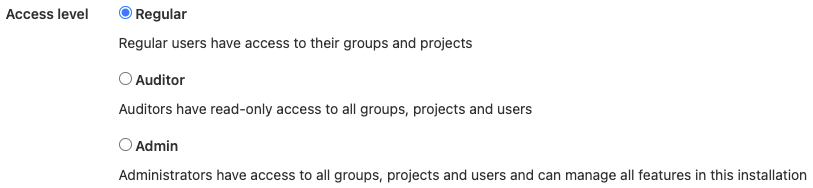

# Recommended word list

To help ensure consistency in the documentation, the Technical Writing team
recommends these wording choices. The GitLab handbook also maintains a list of
[top misused terms](https://about.gitlab.com/handbook/communication/top-misused-terms/).

For guidance not on this page, we defer to these style guides:

- [Microsoft Style Guide](https://docs.microsoft.com/en-us/style-guide/welcome/)
- [Google Developer Documentation Style Guide](https://developers.google.com/style)

<!-- vale off -->
<!-- markdownlint-disable -->

## `@mention`

Try to avoid **`@mention`**. Say **mention** instead, and consider linking to the
[mentions topic](../../../user/discussions/index.md#mentions).
Don't use backticks.

## 2FA, two-factor authentication

Spell out **two-factor authentication** in sentence case for the first use and in section headings, and **2FA**
thereafter. If the first word in a sentence, do not capitalize `factor` or `authentication`. For example:

- Two-factor authentication (2FA) helps secure your account. Set up 2FA when you first log in.

## above

Try to avoid using **above** when referring to an example or table in a documentation page. If required, use **previous** instead. For example:

- In the previous example, the dog had fleas.

Do not use **above** when referring to versions of the product. Use [**later**](#later) instead.

Use:

- In GitLab 14.4 and later...

Instead of:

- In GitLab 14.4 and above...
- In GitLab 14.4 and higher...

## access level

Access levels are different than [roles](#roles) or [permissions](#permissions).
When you create a user, you choose an access level: **Regular**, **Auditor**, or **Admin**.

Capitalize these words when you refer to the UI. Otherwise use lowercase.

## administrator

Use **administrator access** instead of **admin** when talking about a user's access level.

An **administrator** is not a [role](#roles) or [permission](#permissions).

Use:

- To do this thing, you must be an administrator.
- To do this thing, you must have administrator access.

Instead of:

- To do this thing, you must have the Admin role.

## Admin Area

Use title case **Admin Area** to refer to the area of the UI that you access when you select **Menu > Admin**.
This area of the UI says **Admin Area** at the top of the page and on the menu.

## agent

Use lowercase to refer to the [GitLab agent for Kubernetes](https://gitlab.com/gitlab-org/cluster-integration/gitlab-agent).
For example:

- To connect your cluster to GitLab, use the GitLab agent for Kubernetes.
- Install the agent in your cluster.
- Select an agent from the list.

Do not use title case **GitLab Agent** or **GitLab Agent for Kubernetes**.

## agent access token

The token generated when you create an agent for Kubernetes. Use **agent access token**, not:

- registration token
- secret token
- authentication token

## air gap, air-gapped

Use **offline environment** to describe installations that have physical barriers or security policies that prevent or limit internet access. Do not use **air gap**, **air gapped**, or **air-gapped**. For example:

- The firewall policies in an offline environment prevent the computer from accessing the internet.

## allow, enable

Try to avoid **allow** and **enable**, unless you are talking about security-related features.

Use:

- You can add a file to your repository.

Instead of:

- This feature allows you to add a file to your repository.
- This feature enables users to add files to their repository.

This phrasing is more active and is from the user perspective, rather than the person who implemented the feature.
[View details in the Microsoft style guide](https://docs.microsoft.com/en-us/style-guide/a-z-word-list-term-collections/a/allow-allows).

## Alpha

Use uppercase for **Alpha**. For example: **The XYZ feature is in Alpha.** or **This Alpha release is ready to test.**

You might also want to link to [this section](../../../policy/alpha-beta-support.md#alpha-features)
in the handbook when writing about Alpha features.

## and/or

Instead of **and/or**, use **or** or rewrite the sentence to spell out both options.

## and so on

Do not use **and so on**. Instead, be more specific. For details, see
[the Microsoft style guide](https://docs.microsoft.com/en-us/style-guide/a-z-word-list-term-collections/a/and-so-on).

## area

Use [**section**](#section) instead of **area**. The only exception is [the Admin Area](#admin-area).

## associate

Do not use **associate** when describing adding issues to epics, or users to issues, merge requests,
or epics.

Instead, use **assign**. For example:

- Assign the issue to an epic.
- Assign a user to the issue.

## below

Try to avoid **below** when referring to an example or table in a documentation page. If required, use **following** instead. For example:

- In the following example, the dog has fleas.

## Beta

Use uppercase for **Beta**. For example: **The XYZ feature is in Beta.** or **This Beta release is ready to test.**

You might also want to link to [this section](../../../policy/alpha-beta-support.md#beta-features)
in the handbook when writing about Beta features.

## blacklist

Do not use **blacklist**. Another option is **denylist**. ([Vale](../testing.md#vale) rule: [`InclusionCultural.yml`](https://gitlab.com/gitlab-org/gitlab/-/blob/master/doc/.vale/gitlab/InclusionCultural.yml))

## board

Use lowercase for **boards**, **issue boards**, and **epic boards**.

## box

Use **text box** to refer to the UI field. Do not use **field** or **box**. For example:

- In the **Variable name** text box, enter a value.

## bullet

Don't refer to individual items in an ordered or unordered list as **bullets**. Use **list item** instead. If you need to be less ambiguous, you can use:

- **Ordered list item** for items in an ordered list.
- **Unordered list item** for items in an unordered list.

## button

Don't use a descriptor with **button**.

Use:

- Select **Run pipelines**.

Instead of:

- Select the **Run pipelines** button.

## cannot, can not

Use **cannot** instead of **can not**. You can also use **can't**.

See also [contractions](index.md#contractions).

## checkbox

Use one word for **checkbox**. Do not use **check box**.

You **select** (not **check** or **enable**) and **clear** (not **deselect** or **disable**) checkboxes. For example:

- Select the **Protect environment** checkbox.
- Clear the **Protect environment** checkbox.

If you must refer to the checkbox, you can say it is selected or cleared. For example:

- Ensure the **Protect environment** checkbox is cleared.
- Ensure the **Protect environment** checkbox is selected.

(For `deselect`, [Vale](../testing.md#vale) rule: [`SubstitutionWarning.yml`](https://gitlab.com/gitlab-org/gitlab/-/blob/master/doc/.vale/gitlab/SubstitutionWarning.yml))

## checkout, check out

Use **check out** as a verb. For the Git command, use `checkout`.

- Use `git checkout` to check out a branch locally.
- Check out the files you want to edit.

## CI/CD

CI/CD is always uppercase. No need to spell it out on first use.

## CI/CD minutes

Use **CI/CD minutes** instead of **CI minutes**, **pipeline minutes**, **pipeline minutes quota**, or
**CI pipeline minutes**. This decision was made in [this issue](https://gitlab.com/gitlab-org/gitlab/-/issues/342813).

## click

Do not use **click**. Instead, use **select** with buttons, links, menu items, and lists.
**Select** applies to more devices, while **click** is more specific to a mouse.

## collapse

Use **collapse** instead of **close** when you are talking about expanding or collapsing a section in the UI.

## confirmation dialog

Use **confirmation dialog** to describe the dialog box that asks you to confirm your action. For example:

- On the confirmation dialog, select **OK**.

## Container Registry

Use title case for the GitLab Container Registry.

## currently

Do not use **currently** when talking about the product or its features. The documentation describes the product as it is today.
([Vale](../testing.md#vale) rule: [`CurrentStatus.yml`](https://gitlab.com/gitlab-org/gitlab/-/blob/master/doc/.vale/gitlab/CurrentStatus.yml))

## Dependency Proxy

Use title case for the GitLab Dependency Proxy.

## deploy board

Use lowercase for **deploy board**.

## Developer

When writing about the Developer role:

- Use a capital **D**.
- Do not use bold.
- Do not use the phrase, **if you are a developer** to mean someone who is assigned the Developer
  role. Instead, write it out. For example, **if you are assigned the Developer role**.
- To describe a situation where the Developer role is the minimum required:
  - Use: at least the Developer role
  - Instead of: the Developer role or higher

Do not use **Developer permissions**. A user who is assigned the Developer role has a set of associated permissions.

## disable

See [the Microsoft style guide](https://docs.microsoft.com/en-us/style-guide/a-z-word-list-term-collections/d/disable-disabled) for guidance on **disable**.
Use **inactive** or **off** instead. ([Vale](../testing.md#vale) rule: [`InclusionAbleism.yml`](https://gitlab.com/gitlab-org/gitlab/-/blob/master/doc/.vale/gitlab/InclusionAbleism.yml))

## disallow

Use **prevent** instead of **disallow**. ([Vale](../testing.md#vale) rule: [`Substitutions.yml`](https://gitlab.com/gitlab-org/gitlab/-/blob/master/doc/.vale/gitlab/Substitutions.yml))

## downgrade

To be more upbeat and precise, do not use **downgrade**. Focus instead on the action the user is taking.

- For changing to earlier GitLab versions, use [**roll back**](#roll-back).
- For changing to lower GitLab tiers, use **change the subscription tier**.

## dropdown list

Use **dropdown list** to refer to the UI element. Do not use **dropdown** without **list** after it.
Do not use **drop-down** (hyphenated), **dropdown menu**, or other variants.

For example:

- From the **Visibility** dropdown list, select **Public**.

## earlier

Use **earlier** when talking about version numbers.

Use:

- In GitLab 14.1 and earlier.

Instead of:

- In GitLab 14.1 and lower.

## easily

Do not use **easily**. If the user doesn't find the process to be easy, we lose their trust.

## e.g.

Do not use Latin abbreviations. Use **for example**, **such as**, **for instance**, or **like** instead. ([Vale](../testing.md#vale) rule: [`LatinTerms.yml`](https://gitlab.com/gitlab-org/gitlab/-/blob/master/doc/.vale/gitlab/LatinTerms.yml))

## email

Do not use **e-mail** with a hyphen. When plural, use **emails** or **email messages**. ([Vale](../testing.md#vale) rule: [`SubstitutionSuggestions.yml`](https://gitlab.com/gitlab-org/gitlab/-/blob/master/doc/.vale/gitlab/SubstitutionSuggestions.yml))

## enable

See [the Microsoft style guide](https://docs.microsoft.com/en-us/style-guide/a-z-word-list-term-collections/e/enable-enables) for guidance on **enable**.
Use **active** or **on** instead. ([Vale](../testing.md#vale) rule: [`InclusionAbleism.yml`](https://gitlab.com/gitlab-org/gitlab/-/blob/master/doc/.vale/gitlab/InclusionAbleism.yml))

## enter

In most cases, use **enter** rather than **type**.

- **Enter** encompasses multiple ways to enter information, including speech and keyboard.
- **Enter** assumes that the user puts a value in a field and then moves the cursor outside the field (or presses <kbd>Enter</kbd>).
  **Enter** includes both the entering of the content and the action to validate the content.

For example:

- In the **Variable name** text box, enter a value.
- In the **Variable name** text box, enter `my text`.

When you use **Enter** to refer to the key on a keyboard, use the HTML `<kbd>` tag:

- To view the list of results, press <kbd>Enter</kbd>.

See also [**type**](#type).

## epic

Use lowercase for **epic**.

See also [associate](#associate).

## epic board

Use lowercase for **epic board**.

## etc.

Try to avoid **etc.**. Be as specific as you can. Do not use
[**and so on**](#and-so-on) as a replacement.

Use:

- You can update objects, like merge requests and issues.

Instead of:

- You can update objects, like merge requests, issues, etc.

## expand

Use **expand** instead of **open** when you are talking about expanding or collapsing a section in the UI.

## FAQ

We want users to find information quickly, and they rarely search for the term **FAQ**.
Information in FAQs belongs with other similar information, under an easily searchable topic title.

## field

Use **box** instead of **field** or **text box**.

Use:

- In the **Variable name** text box, enter `my text`.

Instead of:

- In the **Variable name** field, enter `my text`.

However, you can make an exception when you are writing a task and you need to refer to all
of the fields at once. For example:

1. On the top bar, select **Menu > Projects** and find your project.
1. On the left sidebar, select **Settings > CI/CD**.
1. Expand **General pipelines**.
1. Complete the fields.

Learn more about [documenting multiple fields at once](index.md#documenting-multiple-fields-at-once).

## filter

When you are viewing a list of items, like issues or merge requests, you filter the list by
the available attributes. For example, you might filter by assignee or reviewer.

Filtering is different from [searching](#search).

## foo

Do not use **foo** in product documentation. You can use it in our API and contributor documentation, but try to use a clearer and more meaningful example instead.

## future tense

When possible, use present tense instead of future tense. For example, use **after you execute this command, GitLab displays the result** instead of **after you execute this command, GitLab will display the result**. ([Vale](../testing.md#vale) rule: [`FutureTense.yml`](https://gitlab.com/gitlab-org/gitlab/-/blob/master/doc/.vale/gitlab/FutureTense.yml))

## Geo

Use title case for **Geo**.

## GitLab

Do not make **GitLab** possessive (GitLab's). This guidance follows [GitLab Trademark Guidelines](https://about.gitlab.com/handbook/marketing/corporate-marketing/brand-activation/trademark-guidelines/).

## GitLab.com

**GitLab.com** refers to the GitLab instance managed by GitLab itself.

## GitLab Flavored Markdown

When possible, spell out [**GitLab Flavored Markdown**](../../../user/markdown.md).
([Vale](../testing.md#vale) rule: [`GLFM.yml`](https://gitlab.com/gitlab-org/gitlab/-/blob/master/doc/.vale/gitlab/SubstitutionSuggestions.yml))

If you must abbreviate, do not use **GFM**. Use **GLFM** instead.

## GitLab SaaS

**GitLab SaaS** refers to the product license that provides access to GitLab.com. It does not refer to the
GitLab instance managed by GitLab itself.

## GitLab Runner

Use title case for **GitLab Runner**. This is the product you install. See also [runners](#runner-runners) and [this issue](https://gitlab.com/gitlab-org/gitlab/-/issues/233529).

## GitLab self-managed

Use **GitLab self-managed** to refer to the product license for GitLab instances managed by customers themselves.

## guide

We want to speak directly to users. On `docs.gitlab.com`, do not use **guide** as part of a page title.
For example, **Snowplow Guide**. Instead, speak about the feature itself, and how to use it. For example, **Use Snowplow to do xyz**.

## Guest

When writing about the Guest role:

- Use a capital **G**.
- Do not use bold.
- Do not use the phrase, **if you are a guest** to mean someone who is assigned the Guest
  role. Instead, write it out. For example, **if you are assigned the Guest role**.
- To describe a situation where the Guest role is the minimum required:
  - Use: at least the Guest role
  - Instead of: the Guest role or higher

Do not use **Guest permissions**. A user who is assigned the Guest role has a set of associated permissions.

## handy

Do not use **handy**. If the user doesn't find the feature or process to be handy, we lose their trust. ([Vale](../testing.md#vale) rule: [`Simplicity.yml`](https://gitlab.com/gitlab-org/gitlab/-/blob/master/doc/.vale/gitlab/Simplicity.yml))

## high availability, HA

Do not use **high availability** or **HA**. Instead, direct readers to the GitLab [reference architectures](../../../administration/reference_architectures/index.md) for information about configuring GitLab for handling greater amounts of users.

## higher

Do not use **higher** when talking about version numbers.

Use:

- In GitLab 14.4 and later...

Instead of:

- In GitLab 14.4 and higher...
- In GitLab 14.4 and above...

## hit

Don't use **hit** to mean **press**.

Use:

- Press **ENTER**.

Instead of:

- Hit the **ENTER** button.

## I

Do not use first-person singular. Use **you**, **we**, or **us** instead. ([Vale](../testing.md#vale) rule: [`FirstPerson.yml`](https://gitlab.com/gitlab-org/gitlab/-/blob/master/doc/.vale/gitlab/FirstPerson.yml))

## i.e.

Do not use Latin abbreviations. Use **that is** instead. ([Vale](../testing.md#vale) rule: [`LatinTerms.yml`](https://gitlab.com/gitlab-org/gitlab/-/blob/master/doc/.vale/gitlab/LatinTerms.yml))

## in order to

Do not use **in order to**. Use **to** instead. ([Vale](../testing.md#vale) rule: [`Wordy.yml`](https://gitlab.com/gitlab-org/gitlab/-/blob/master/doc/.vale/gitlab/Wordy.yml))

## issue

Use lowercase for **issue**.

## issue board

Use lowercase for **issue board**.

## issue weights

Use lowercase for **issue weights**.

## job

Do not use **build** to be synonymous with **job**. A job is defined in the `.gitlab-ci.yml` file and runs as part of a pipeline.

If you want to use **CI** with the word **job**, use **CI/CD job** rather than **CI job**.

## Kubernetes executor

GitLab Runner can run jobs on a Kubernetes cluster. To do this, GitLab Runner uses the Kubernetes executor.

When referring to this feature, use:

- Kubernetes executor for GitLab Runner
- Kubernetes executor

Do not use:

- GitLab Runner Kubernetes executor, because this can infringe on the Kubernetes trademark.

## later

Use **later** when talking about version numbers.

Use:

- In GitLab 14.1 and later...

Instead of:

- In GitLab 14.1 and higher...
- In GitLab 14.1 and above...

## list

Do not use **list** when referring to a [**dropdown list**](#dropdown-list).
Use the full phrase **dropdown list** instead.

## license

When writing about licenses:

- Do not use variations such as **cloud license**, **offline license**, or **legacy license**.
- Do not use interchangeably with **subscription**:
  - A license grants users access to the subscription they purchased, and contains information such as the number of seats they purchased and subscription dates.
  - A subscription is the subscription tier that the user purchases.

Use:

  - Add a license to your instance.
  - Purchase a subscription.

Instead of:

  - Buy a license.
  - Purchase a license.

## log in, log on

Do not use **log in** or **log on**. Use [sign in](#sign-in) instead. If the user interface has **Log in**, you can use it.

## lower

Do not use **lower** when talking about version numbers.

Use:

- In GitLab 14.1 and earlier.

Instead of:

- In GitLab 14.1 and lower.

## Maintainer

When writing about the Maintainer role:

- Use a capital **M**.
- Do not use bold.
- Do not use the phrase, **if you are a maintainer** to mean someone who is assigned the Maintainer
  role. Instead, write it out. For example, **if you are assigned the Maintainer role**.
- To describe a situation where the Maintainer role is the minimum required:
  - Use: at least the Maintainer role
  - Instead of: the Maintainer role or higher

Do not use **Maintainer permissions**. A user who is assigned the Maintainer role has a set of associated permissions.

## mankind

Do not use **mankind**. Use **people** or **humanity** instead. ([Vale](../testing.md#vale) rule: [`InclusionGender.yml`](https://gitlab.com/gitlab-org/gitlab/-/blob/master/doc/.vale/gitlab/InclusionGender.yml))

## manpower

Do not use **manpower**. Use words like **workforce** or **GitLab team members**. ([Vale](../testing.md#vale) rule: [`InclusionGender.yml`](https://gitlab.com/gitlab-org/gitlab/-/blob/master/doc/.vale/gitlab/InclusionGender.yml))

## master

Do not use **master**. Options are **primary** or **main**. ([Vale](../testing.md#vale) rule: [`InclusionCultural.yml`](https://gitlab.com/gitlab-org/gitlab/-/blob/master/doc/.vale/gitlab/InclusionCultural.yml))

## may, might

**Might** means something has the probability of occurring. **May** gives permission to do something. Consider **can** instead of **may**.

## me, myself, mine

Do not use first-person singular. Use **you**, **we**, or **us** instead. ([Vale](../testing.md#vale) rule: [`FirstPerson.yml`](https://gitlab.com/gitlab-org/gitlab/-/blob/master/doc/.vale/gitlab/FirstPerson.yml))

## merge requests

Use lowercase for **merge requests**. If you use **MR** as the acronym, spell it out on first use.

## milestones

Use lowercase for **milestones**.

## n/a, N/A, not applicable

When possible, use **not applicable**. Spelling out the phrase helps non-English speaking users and avoids
capitalization inconsistencies.

## navigate

Do not use **navigate**. Use **go** instead. For example:

- Go to this webpage.
- Open a terminal and go to the `runner` directory.

([Vale](../testing.md#vale) rule: [`SubstitutionSuggestions.yml`](https://gitlab.com/gitlab-org/gitlab/-/blob/master/doc/.vale/gitlab/SubstitutionSuggestions.yml))

## need to, should

Try to avoid **needs to**, because it's wordy. Avoid **should** when you can be more specific. If something is required, use **must**.

Use:

- You must set the variable.
- Set the variable.

Instead of:

- You need to set the variable.

**Should** is acceptable for recommended actions or items, or in cases where an event may not
happen. For example:

- Although you can configure the installation manually, you should use the express configuration to
  avoid complications.
- You should see a success message in the console. Contact support if an error message appears
  instead.

## note that

Do not use **note that** because it's wordy.

Use:

- You can change the settings.

Instead of:

- Note that you can change the settings.

## on

When documenting how to select high-level UI elements, use the word **on**.

Use:

- `On the left sidebar...`

Instead of:

- Do not: `From the left sidebar...` or `In the left sidebar...`

## once

The word **once** means **one time**. Don't use it to mean **after** or **when**.

Use:

- When the process is complete...

Instead of:

- Once the process is complete...

## only

Put the word **only** next to the word it modifies.

- You can create only private projects.

In this example, **only** modifies the noun **projects**. The sentence means you can create one type of project--a private project.

- You can only create private projects.

In this example, **only** modifies the verb **create**. This sentence means that you can't perform other actions,
like deleting private projects, or adding users to them.

## override

Use **override** to indicate temporary replacement.

For example, a value might be overridden when a job runs. The
original value does not change.

## overwrite

Use **overwrite** to indicate permanent replacement.

For example, a log file might overwrite a log file of the same name.

## Owner

When writing about the Owner role:

- Use a capital **O**.
- Do not use bold.
- Do not use the phrase, **if you are an owner** to mean someone who is assigned the Owner
  role. Instead, write it out. For example, **if you are assigned the Owner role**.

Do not use **Owner permissions**. A user who is assigned the Owner role has a set of associated permissions.

## Package Registry

Use title case for the GitLab Package Registry.

## permissions

Do not use [**roles**](#roles) and **permissions** interchangeably. Each user is assigned a role. Each role includes a set of permissions.

Permissions are not the same as [**access levels**](#access-level).

## personal access token

Use lowercase for **personal access token**.

## please

Do not use **please**. For details, see the [Microsoft style guide](https://docs.microsoft.com/en-us/style-guide/a-z-word-list-term-collections/p/please).

## press

Use **press** when talking about keyboard keys. For example:

- To stop the command, press <kbd>Control</kbd>+<kbd>C</kbd>.

## profanity

Do not use profanity. Doing so may negatively affect other users and contributors, which is contrary to the GitLab value of [Diversity, Inclusion, and Belonging](https://about.gitlab.com/handbook/values/#diversity-inclusion).

## provision

Use the term **provision** when referring to provisioning cloud infrastructure. You provision the infrastructure, and then deploy applications to it.

For example, you might write something like:

- Provision an AWS EKS cluster and deploy your application to it.

## push rules

Use lowercase for **push rules**.

## register

Use **register** instead of **sign up** when talking about creating an account.

## Reporter

When writing about the Reporter role:

- Use a capital **R**.
- Do not use bold.
- Do not use the phrase, **if you are a reporter** to mean someone who is assigned the Reporter
  role. Instead, write it out. For example, **if you are assigned the Reporter role**.
- To describe a situation where the Reporter role is the minimum required:
  - Use: at least the Reporter role
  - Instead of: the Reporter role or higher

Do not use **Reporter permissions**. A user who is assigned the Reporter role has a set of associated permissions.

## Repository Mirroring

Use title case for **Repository Mirroring**.

## respectively

Avoid **respectively** and be more precise instead.

Use:

- To create a user, select **Create user**. For an existing user, select **Save changes**.

Instead of:

- Select **Create user** or **Save changes** if you created a new user or
  edited an existing one respectively.

## roles

Do not use **roles** and [**permissions**](#permissions) interchangeably. Each user is assigned a role. Each role includes a set of permissions.

Roles are not the same as [**access levels**](#access-level).

## roll back

Use **roll back** for changing a GitLab version to an earlier one.

Do not use **roll back** for licensing or subscriptions. Use **change the subscription tier** instead.

## runner, runners

Use lowercase for **runners**. These are the agents that run CI/CD jobs. See also [GitLab Runner](#gitlab-runner) and [this issue](https://gitlab.com/gitlab-org/gitlab/-/issues/233529).

When referring to runners, if you have to specify that the runners are installed on a customer's GitLab instance,
use **self-managed** rather than **self-hosted**.

## (s)

Do not use **(s)** to make a word optionally plural. It can slow down comprehension. For example:

Use:

- Select the jobs you want.

Instead of:

- Select the job(s) you want.

If you can select multiples of something, then write the word as plural.

## sanity check

Do not use **sanity check**. Use **check for completeness** instead. ([Vale](../testing.md#vale) rule: [`InclusionAbleism.yml`](https://gitlab.com/gitlab-org/gitlab/-/blob/master/doc/.vale/gitlab/InclusionAbleism.yml))

## scalability

Do not use **scalability** when talking about increasing GitLab performance for additional users. The words scale or scaling
are sometimes acceptable, but references to increasing GitLab performance for additional users should direct readers
to the GitLab [reference architectures](../../../administration/reference_architectures/index.md) page.

## search

When you search, you type a string in the search box on the top bar.
The search results are displayed on a search page.

Searching is different from [filtering](#filter).

## section

Use **section** to describe an area on a page. For example, if a page has lines that separate the UI
into separate areas, refer to these areas as sections.

We often think of expandable/collapsible areas as **sections**. When you refer to expanding
or collapsing a section, don't include the word **section**.

Use:

- Expand **Auto DevOps**.

Instead of:

- Do not: Expand the **Auto DevOps** section.

## select

Use **select** with buttons, links, menu items, and lists. **Select** applies to more devices,
while **click** is more specific to a mouse.

## self-managed

Use **self-managed** to refer to a customer's installation of GitLab. Do not use **self-hosted**.

## Service Desk

Use title case for **Service Desk**.

## setup, set up

Use **setup** as a noun, and **set up** as a verb. For example:

- Your remote office setup is amazing.
- To set up your remote office correctly, consider the ergonomics of your work area.

## sign in

Use **sign in** instead of **sign on** or **log on** or **log in**. If the user interface has different words, use those.

You can use **single sign-on**.

## sign up

Use **register** instead of **sign up** when talking about creating an account.

## simply, simple

Do not use **simply** or **simple**. If the user doesn't find the process to be simple, we lose their trust. ([Vale](../testing.md#vale) rule: [`Simplicity.yml`](https://gitlab.com/gitlab-org/gitlab/-/blob/master/doc/.vale/gitlab/Simplicity.yml))

## since

The word **since** indicates a timeframe. For example, **Since 1984, Bon Jovi has existed**. Don't use **since** to mean **because**.

Use:

- Because you have the Developer role, you can delete the widget.

Instead of:

- Since you have the Developer role, you can delete the widget.

## slashes

Instead of **and/or**, use **or** or re-write the sentence. This rule also applies to other slashes, like **follow/unfollow**. Some exceptions (like **CI/CD**) are allowed.

## slave

Do not use **slave**. Another option is **secondary**. ([Vale](../testing.md#vale) rule: [`InclusionCultural.yml`](https://gitlab.com/gitlab-org/gitlab/-/blob/master/doc/.vale/gitlab/InclusionCultural.yml))

## subgroup

Use **subgroup** (no hyphen) instead of **sub-group**. ([Vale](../testing.md#vale) rule: [`SubstitutionSuggestions.yml`](https://gitlab.com/gitlab-org/gitlab/-/blob/master/doc/.vale/gitlab/SubstitutionSuggestions.yml))

## that

Do not use **that** when describing a noun. For example:

Use:

- The file you save...

Instead of:

- The file **that** you save...

See also [this, these, that, those](#this-these-that-those).

## terminal

Use lowercase for **terminal**. For example:

- Open a terminal.
- From a terminal, run the `docker login` command.

## text box

Use **text box** instead of **field** or **box** when referring to the UI element.

## there is, there are

Try to avoid **there is** and **there are**. These phrases hide the subject.

Use:

- The bucket has holes.

Instead of:

- There are holes in the bucket.

## they

Avoid the use of gender-specific pronouns, unless referring to a specific person.
Use a singular [they](https://developers.google.com/style/pronouns#gender-neutral-pronouns) as
a gender-neutral pronoun.

## this, these, that, those

Always follow these words with a noun. For example:

- Use: **This setting** improves performance.
- Instead of: **This** improves performance.

- Use: **These pants** are the best.
- Instead of: **These** are the best.

- Use: **That droid** is the one you are looking for.
- Instead of: **That** is the one you are looking for.

- Use: **Those settings** need to be configured. (Or even better, **Configure those settings.**)
- Instead of: **Those** need to be configured.

## to-do item

Use lowercase and hyphenate **to-do** item. ([Vale](../testing.md#vale) rule: [`ToDo.yml`](https://gitlab.com/gitlab-org/gitlab/-/blob/master/doc/.vale/gitlab/ToDo.yml))

## To-Do List

Use title case for **To-Do List**. ([Vale](../testing.md#vale) rule: [`ToDo.yml`](https://gitlab.com/gitlab-org/gitlab/-/blob/master/doc/.vale/gitlab/ToDo.yml))

## toggle

You **turn on** or **turn off** a toggle. For example:

- Turn on the **blah** toggle.

## TFA, two-factor authentication

Use [**2FA** and **two-factor authentication**](#2fa-two-factor-authentication) instead.

## type

Use **type** when the cursor remains in the field you're typing in. For example,
in a search dialog, you begin typing and the field populates results. You do not
click out of the field.

For example:

- To view all users named Alex, type `Al`.
- To view all labels for the documentation team, type `doc`.
- For a list of quick actions, type `/`.

See also [**enter**](#enter).

## update

Use **update** for installing a newer **patch** version of the software only. For example:

- Update GitLab from 14.9 to 14.9.1.

Do not use **update** for any other case. Instead, use **upgrade**.

## upgrade

Use **upgrade** for:

- Choosing a higher subscription tier (Premium or Ultimate).
- Installing a newer **major** (13.0, 14.0) or **minor** (13.8, 14.5) version of GitLab.

For example:

- Upgrade to GitLab Ultimate.
- Upgrade GitLab from 14.0 to 14.1.
- Upgrade GitLab from 14.0 to 15.0.

Use caution with the phrase **Upgrade GitLab** without any other text.
Ensure the surrounding text clarifies whether
you're talking about the product version or the subscription tier.

See also [downgrade](#downgrade) and [roll back](#roll-back).

## useful

Do not use **useful**. If the user doesn't find the process to be useful, we lose their trust. ([Vale](../testing.md#vale) rule: [`Simplicity.yml`](https://gitlab.com/gitlab-org/gitlab/-/blob/master/doc/.vale/gitlab/Simplicity.yml))

## user, users

When possible, address the reader directly, instead of calling them **users**.
Use the [second person](#you-your-yours), **you**, instead.

Use:

- You can configure a pipeline.

Instead of:

- Users can configure a pipeline.

## utilize

Do not use **utilize**. Use **use** instead. It's more succinct and easier for non-native English speakers to understand.
([Vale](../testing.md#vale) rule: [`SubstitutionSuggestions.yml`](https://gitlab.com/gitlab-org/gitlab/-/blob/master/doc/.vale/gitlab/SubstitutionSuggestions.yml))

## via

Do not use Latin abbreviations. Use **with**, **through**, or **by using** instead. ([Vale](../testing.md#vale) rule: [`LatinTerms.yml`](https://gitlab.com/gitlab-org/gitlab/-/blob/master/doc/.vale/gitlab/LatinTerms.yml))

## we

Try to avoid **we** and focus instead on how the user can accomplish something in GitLab.

Use:

- Use widgets when you have work you want to organize.

Instead of:

- We created a feature for you to add widgets.

One exception: You can use **we recommend** instead of **it is recommended** or **GitLab recommends**. ([Vale](../testing.md#vale) rule: [`SubstitutionSuggestions.yml`](https://gitlab.com/gitlab-org/gitlab/-/blob/master/doc/.vale/gitlab/SubstitutionSuggestions.yml))

## whitelist

Do not use **whitelist**. Another option is **allowlist**. ([Vale](../testing.md#vale) rule: [`InclusionCultural.yml`](https://gitlab.com/gitlab-org/gitlab/-/blob/master/doc/.vale/gitlab/InclusionCultural.yml))

## yet

Do not use **yet** when talking about the product or its features. The documentation describes the product as it is today.

Sometimes you might need to use **yet** when writing a task. If you use
**yet**, ensure the surrounding phrases are written
in present tense, active voice.

[View guidance about how to write about future features](../versions.md#promising-features-in-future-versions).
([Vale](../testing.md#vale) rule: [`CurrentStatus.yml`](https://gitlab.com/gitlab-org/gitlab/-/blob/master/doc/.vale/gitlab/CurrentStatus.yml))

## you, your, yours

Use **you**, **your**, and **yours** instead of [**the user** and **the user's**](#user-users).
Documentation should be from the [point of view](https://design.gitlab.com/content/voice-tone/#point-of-view) of the reader.

Use:

- You can configure a pipeline.

Instead of:

- Users can configure a pipeline.

<!-- vale on -->
<!-- markdownlint-enable -->
