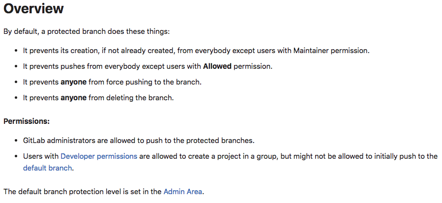
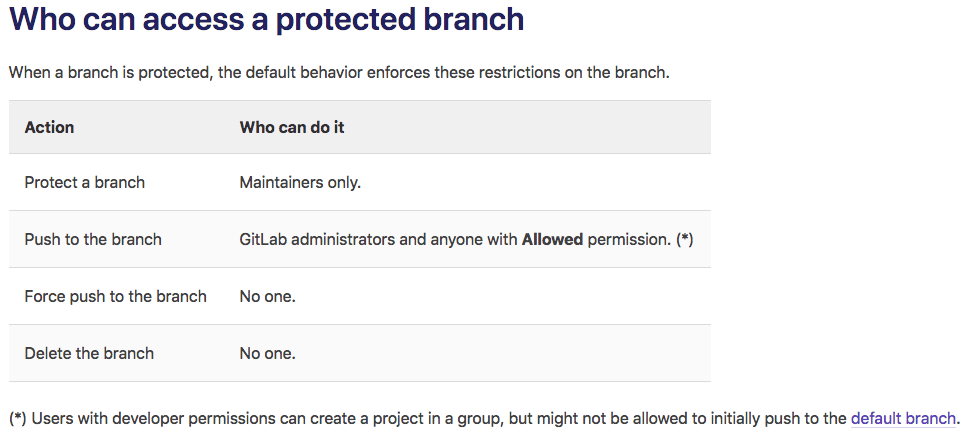

Reference information should be in an easily-scannable format,
like a table or list. It's similar to a dictionary or encyclopedia entry.

## Format

Reference topics should be in this format:

```markdown
title: Title (a noun, like "Pipeline settings" or "Administrator options")
---

Introductory sentence.

| Setting | Description |
|---------|-------------|
| **Name** | Descriptive sentence about the setting. |
```

## Reference topic titles

Reference topic titles are usually nouns.

Avoid these topic titles:

- `Important notes`. Instead, incorporate this information
  closer to where it belongs. For example, this information might be a prerequisite
  for a task, or information about a concept.
- `Limitations`. Instead, move the content near other similar information.
  If you must, you can use the title `Known issues`.

## Example

### Before

This topic was a compilation of a variety of information and was difficult to scan.



### After

The information in the **Overview** topic is now organized in a table
that's easy to scan. It also has a more searchable title.


