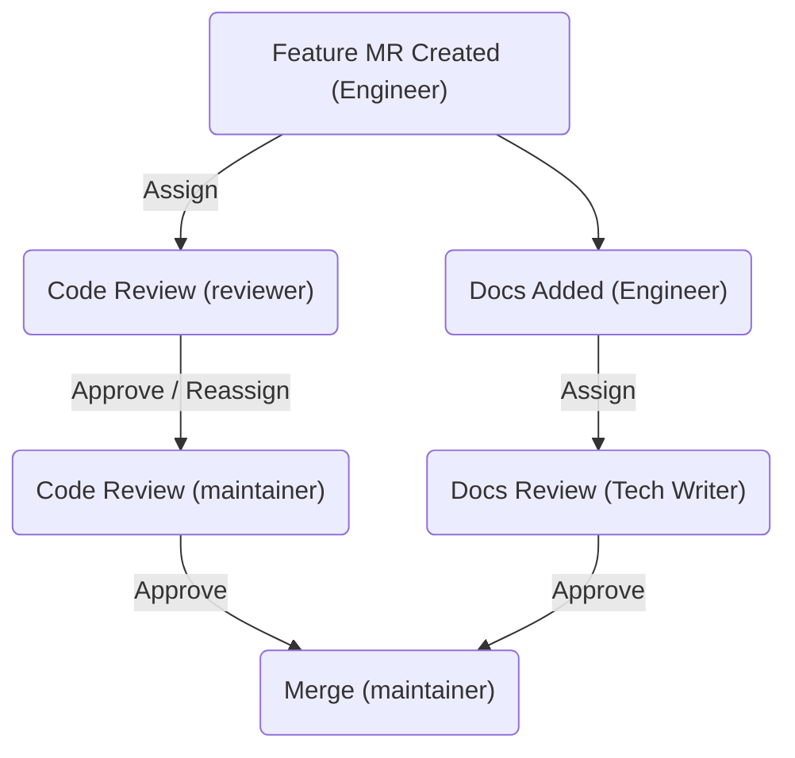

Documentation at GitLab follows a workflow.

## Before merging

Ensure your documentation includes:

- [Product availability details](styleguide/availability_details.md).
- The GitLab [version](styleguide/availability_details.md) that introduced the feature.
- Accurate [links](styleguide/_index.md#links).
- Accurate [user permissions](../../user/permissions.md).

Ensure you've followed the [style guide](styleguide/_index.md) and [word list](styleguide/word_list.md).

### Branch naming

The [CI/CD pipeline for the main GitLab project](../pipelines/_index.md) is configured to
run shorter, faster pipelines on merge requests that contain only documentation changes.

If you submit documentation-only changes to Omnibus, Charts, or Operator,
to make the shorter pipeline run, you must follow these guidelines when naming your branch:

| Branch name           | Valid example                |
|:----------------------|:-----------------------------|
| Starting with `docs/` | `docs/update-api-issues`     |
| Starting with `docs-` | `docs-update-api-issues`     |
| Ending in `-docs`     | `123-update-api-issues-docs` |

### Moving content

When you move content to a new location, and edit the content in the same merge request,
use separate commits.

Separate commits help the reviewer, because the MR diff for moved content
does not clearly highlight edits.
When you use separate commits, the reviewer can verify the location change
in the first commit diff, then the content changes in subsequent commits.

For example, if you move a page, but also update the content of the page:

1. In the first commit: Move the content to its new location and put [redirects](redirects.md) in place if required.
   If you can, fix broken links in this commit.
1. In subsequent commits: Make content changes. Fix broken links if you haven't already.
1. In the merge request: Explain the commits in the MR description and in a
   comment to the reviewer.

You can add as many commits as you want, but make sure the first commit only moves the content,
and does not edit it.

## Documentation for a product change

Documentation is required for any new or changed feature, and is:

- Created or updated as part of feature development, and is almost always in
  the same merge request as the feature code. Including documentation in the
  same merge request as the code eliminates the possibility that code and
  documentation get out-of-sync.
- Required with the delivery of a feature for a specific milestone as part of the
  GitLab [definition of done](../contributing/merge_request_workflow.md#definition-of-done).
- Linked from the release post.

### Developer responsibilities

Developers are the primary authors of documentation for a feature or feature
enhancement. They are responsible for:

- Developing initial content required for a feature.
- Liaising with their Product Manager to understand what documentation must be
  delivered, and when.
- Requesting technical reviews from other developers in their group.
- Requesting documentation reviews from the technical writer
  [assigned to the DevOps stage group](https://handbook.gitlab.com/handbook/product/ux/technical-writing/#assignments)
  that is delivering the new feature or feature enhancements.

The first merge request where a feature can be tested should include the
documentation, even if the feature is behind a feature flag.
For more information, see the [guidelines](../documentation/feature_flags.md).

The author of this MR, either a frontend or backend developer, should write the documentation.



Community Contributors can ask for additional help from GitLab team members.



#### Authoring

Because the documentation is an essential part of the product, if a `~"type::feature"`
issue also contains the `~documentation` label, you must ship the new or
updated documentation with the code of the feature.

Technical writers are happy to help, as requested and planned on an
issue-by-issue basis.

For feature issues requiring documentation, follow the process below unless
otherwise agreed with the product manager and technical writer:

- Include any new and edited documentation, either in:
  - The merge request introducing the code.
  - A separate merge request raised around the same time.
- Use the [documentation requirements](#documentation-requirements) developed
  by the Product Manager in the issue and discuss any further documentation
  plans or ideas as needed.

  If the new or changed documentation requires extensive collaboration or
  conversation, a separate, linked issue can be used for the planning process.

- Use the [Documentation guidelines](../documentation/_index.md),
  and other resources linked from there, including:
  - [Documentation folder structure](site_architecture/folder_structure.md).
  - [Documentation Style Guide](styleguide/_index.md).
  - [Markdown Guide](../../user/markdown.md).
- Contact the technical writer for the relevant
  [DevOps stage](https://handbook.gitlab.com/handbook/product/ux/technical-writing/#assignments)
  in your issue or merge request, or in the `#docs` Slack channel, if you:
  - Need any help to choose the correct place for documentation.
  - Want to discuss a documentation idea or outline.
  - Want to request any other help.
- If you are working on documentation in a separate merge request, ensure the
  documentation is merged as close as possible to the code merge.
- If the feature has a feature flag, [follow the policy for documenting feature-flagged issues](../documentation/feature_flags.md).

#### Review

Before merging, documentation changes committed by the developer must be
reviewed by:

- The code reviewer for the merge request. This is known as a technical review.
- Optionally, others involved in the work such as other developers or the
  Product Manager.
- The technical writer for the DevOps stage group, except in exceptional
  circumstances where a [post-merge review](#post-merge-reviews)
  can be requested.
- A maintainer of the project.

### Product Manager responsibilities

Product Managers are responsible for the
[documentation requirements](#documentation-requirements) for a feature or
feature enhancement. They can also:

- Connect with the technical writer for discussion and collaboration.
- Review documentation themselves.

For issues requiring any new or updated documentation, the Product Manager
must:

- Add the `~documentation` label.
- Confirm or add the documentation requirements.
- Ensure the issue contains:
  - Any new or updated feature name.
  - Overview, description, and use cases when applicable (as required by the
    [documentation folder structure](site_architecture/folder_structure.md)).

Everyone is encouraged to draft the documentation requirements in the issue.
However, a Product Manager will:

- When the issue is assigned a release milestone, review and update the
  Documentation details.
- By the kickoff, finalize the documentation details.

### Technical writer responsibilities

Technical writers are responsible for:

- Participating in issue discussions and reviewing MRs for the upcoming
  milestone.
- Reviewing documentation requirements in issues when called upon.
- Answering questions, and helping and providing advice throughout the
  authoring and editing process.
- Reviewing all significant new and updated documentation content, whether
  before merge or after it is merged.
- Assisting the developer and Product Manager with feature documentation
  delivery.
- Ensuring that issues and MRs are labeled appropriately, and that doc content has the correct [metadata](metadata.md).

#### Planning

The technical writer:

- Reviews their group's `~"type::feature"` issues that are part of the next milestone
  to get a sense of the scope of content likely to be authored.
- Recommends the `~documentation` label on issues from that list which don't
  have it but should, or inquires with the PM to determine if documentation is
  truly required.
- For `~direction` issues from that list, reads the full issue and reviews its
  Documentation requirements section. Addresses any recommendations or
  questions with the PMs and others collaborating on the issue to
  refine or expand the Documentation requirements.
- Updates the Technical Writing milestone plan ([example](https://gitlab.com/gitlab-org/technical-writing/team-tasks/-/issues/521) created from the [issue template](https://gitlab.com/gitlab-org/technical-writing/team-tasks/-/blob/main/.gitlab/issue_templates/tw-milestone-plan.md)).
  - Add a link to the board or filter that shows the planned documentation and UI text work for the upcoming milestone.
  - Confirm that the group PM or EM is aware of the planned work.

#### Collaboration

By default, the developer will work on documentation changes independently, but
the developer, product manager, or technical writer can propose a broader
collaboration for any given issue.

Additionally, technical writers are available for questions at any time.

#### Review

Technical writers provide non-blocking reviews of all documentation changes, before or after
the change is merged. Identified issues that would block or slow a change's
release are to be handled in linked, follow-up MRs.

### Documentation requirements

Feature documentation requirements should be included as part of
the issue for planning that feature in the **Documentation** section in the
issue description. Issues created using the
[**Feature Proposal** template](https://gitlab.com/gitlab-org/gitlab/-/raw/master/.gitlab/issue_templates/Feature%20proposal%20-%20detailed.md)
have this section by default.

Anyone can add these details, but the Product Manager who assigns the issue to
a specific release milestone will ensure these details are present and
finalized by the time of that milestone's kickoff.

Developers, technical writers, and others may help further refine this plan at
any time on request.

The following details should be included:

- What concepts and procedures should the documentation guide and enable the
  user to understand or accomplish?
- To this end, what new pages are needed, if any? What pages or subsections
  need updates? Consider changes and additions to user, admin, and API
  documentation.
- For any guide or instruction set, should it help address a single use case,
  or be flexible to address a certain range of use cases?
- Do we need to update a previously recommended workflow? Should we link the
  new feature from various relevant locations? Consider all ways documentation
  should be affected.
- Are there any key terms or task descriptions that should be included so that
  the documentation is found in relevant searches?
- Include suggested titles of any pages or subsection headings, if applicable.
- List any documentation that should be cross-linked, if applicable.

### Including documentation with code

Currently, the Technical Writing team strongly encourages including
documentation in the same merge request as the code that it relates to, but
this isn't strictly mandatory. It's still common for documentation to be added
in an MR separate from the feature MR.

Engineering teams may elect to adopt a workflow where it is **mandatory** that
documentation is included in the code MR, as part of their
[definition of done](../contributing/merge_request_workflow.md#definition-of-done).
When a team adopts this workflow, that team's engineers must include their
documentation in the **same** MR as their feature code, at all times.

#### Downsides of separate documentation MRs

A workflow that has documentation separated into its own MR has many downsides.

If the documentation merges **before** the feature:

- GitLab.com users might try to use the feature before it's released, driving
  support tickets.
- If the feature is delayed, the documentation might not be pulled/reverted in
  time and could be accidentally included on GitLab Self-Managed for that
  release.

If the documentation merges **after** the feature:

- The feature might be included on GitLab Self-Managed, but without any
  documentation if the documentation MR misses the cutoff.
- A feature might show up in the GitLab.com user interface before any
  documentation exists for it. Users surprised by this feature will search for
  documentation and won't find it, possibly driving support tickets.

Having two separate MRs means:

- Two different people might be responsible for merging one feature, which
  isn't workable with an asynchronous work style. The feature might merge while
  the technical writer is asleep, creating a potentially lengthy delay between
  the two merges.
- If the documentation MR is assigned to the same maintainer as responsible for
  the feature code MR, they will have to review and juggle two MRs instead of
  dealing with just one.

Documentation quality might be lower, because:

- Having documentation in a separate MR will mean far fewer people will see and
  verify them, increasing the likelihood that issues will be missed.
- In a *split* workflow, engineers might only create the documentation MR after
  the feature MR is ready, or almost ready. This gives the technical writer
  little time to learn about the feature to do a good review. It also
  increases pressure on them to review and merge faster than desired, letting
  problems slip in due to haste.

#### Benefits of always including documentation with code

Including documentation with code (and doing it early in the development
process) has many benefits:

- There are no timing issues connected to releases:
  - If a feature slips to the next release, the documentation slips too.
  - If the feature *just* makes it into a release, the documentation *just*
    makes it in too.
  - If a feature makes it to GitLab.com early, the documentation will be ready
    for our early adopters.
- Only a single person will be responsible for merging the feature (the code
  maintainer).
- The technical writer will have more time to gain an understanding of the
  feature and will be better able to verify the content of the documentation in
  the Review App or GDK. They will also be able to offer advice for improving
  the user interface text or offer additional use cases.
- The documentation will have increased visibility:
  - Everyone involved in the merge request can review the documentation. This
    could include product managers, multiple engineers with deep domain
    knowledge, the code reviewers, and the maintainer. They will be more likely
    to catch issues with examples, and background or concepts that the
    technical writer may not be aware of.
  - Increasing visibility of the documentation also has the side effect of
    improving *other* engineers' documentation. By reviewing each other's MRs,
    each engineer's own documentation skills will improve.
- Thinking about the documentation early can help engineers generate better
  examples, as they will need to think about what examples a user will want,
  and will need to ensure the code they write implements that example properly.

#### Documentation with code as a workflow

To have documentation included with code as a mandatory workflow, some
changes might need to happen to a team's current workflow:

- The engineers must strive to include the documentation early in the
  development process, to give ample time for review, not just from the
  technical writer, but also the code reviewer and maintainer.
- Reviewers and maintainers must also review the documentation during code
  reviews to ensure the described processes match the expected use of the
  feature and that examples are correct.
  They do **not** need to worry about style or grammar.
- The technical writer must be assigned as a reviewer on the MR directly and not only pinged.
  This can be done at any time, but must be before the code maintainer review.
  It's common to have both the documentation and code reviews happening at the
  same time, with the author, reviewer, and technical writer discussing the
  documentation together.
- When the documentation is ready, the technical writer will click **Approve**
  and usually will no longer be involved in the MR. If the feature changes
  during code review and the documentation is updated, the technical writer
  must be reassigned the MR to verify the update.
- Maintainers are allowed to merge features with the documentation *as-is*,
  even if the technical writer hasn't given final approval yet. The
  **documentation reviews must not be blockers**. Therefore, it's important to
  get the documentation included and assigned to the technical writers early.
  If the feature is merged before final documentation approval, the maintainer
  must create a [post-merge follow-up issue](#post-merge-reviews),
  and assign it to both the engineer and technical writer.

You can visualize the parallel workflow for code and documentation reviews as:

For complex features split over multiple merge requests:

- If a merge request is implementing components for a future feature, but the
  components aren't accessible to users yet, then no documentation should be
  included.
- If a merge request will expose a feature to users in any way, such as an
  enabled user interface element, an API endpoint, or anything similar, then
  that MR **must** have documentation. This might mean multiple
  documentation additions could happen in the buildup to the implementation of
  a single large feature, for example API documentation and feature usage
  documentation.
- If it's unclear which engineer should add the feature documentation into
  their MR, the engineering manager should decide during planning, and tie the
  documentation to the last MR that must be merged before a feature is
  considered released. This is often, but not always, a frontend MR.

## Labels

The Technical Writing team uses the following [labels](../../user/project/labels.md)
on issues and merge requests:

- A label for the type of change. The two labels used most often are:
  - `~"type::feature"`
  - `~"type::maintenance"` with `~"maintenance::refactor"`
- A stage and group label. For example:
  - `~devops::create` 
  - `~group::source code`
- The `~documentation` specialization label.
- The `~Technical Writing` team label.

The [documentation merge request template](https://gitlab.com/gitlab-org/gitlab/-/blob/master/.gitlab/merge_request_templates/Documentation.md)
includes some of these labels.

### Available labels

Any issue or merge request a technical writer works on must include the `Technical Writing` label.

To further classify the type of effort, include one or more of the following labels:

- [`Category:Docs Site`](https://gitlab.com/groups/gitlab-org/-/labels?subscribed=&sort=relevance&search=Category%3ADocs+Site): Documentation website infrastructure or code. This is not needed for issues related to the documentation itself. Issues with this label are included on the [Docs Workflow issue board](https://gitlab.com/groups/gitlab-org/-/boards/4340643?label_name[]=Category%3ADocs%20Site).
- [`development guidelines`](https://gitlab.com/gitlab-org/gitlab/-/labels?utf8=%E2%9C%93&subscribed=&search=development+guidelines): Files in the `/developer` directory.
- [`docs-missing`](https://gitlab.com/groups/gitlab-org/-/labels?subscribed=&sort=relevance&search=docs-missing): Documentation for a feature is missing. Documentation is required with the delivery of a feature for a specific milestone as part of the GitLab [definition of done](../contributing/merge_request_workflow.md#definition-of-done). Add this label to the original feature MR or issue where documentation is missing. Keep the label for historical tracking and use `tw::finished` to indicate when documentation is completed. Does not apply to [experiment features](../../policy/development_stages_support.md#experiment).
- [`documentation`](https://gitlab.com/groups/gitlab-org/-/labels?utf8=%E2%9C%93&subscribed=&sort=relevance&search=documentation): Files in the `/doc` directory.
- [`global nav`](https://gitlab.com/gitlab-org/technical-writing/docs-gitlab-com/-/labels?subscribed=&sort=relevance&search=global+nav): Left nav of the docs site. Used in the `docs-gitlab-com` project.
- [`L10N-docs`](https://gitlab.com/groups/gitlab-org/-/labels?subscribed=&sort=relevance&search=l10n-docs): Localization issue, MR, or epic that impacts the workflows of the Technical Writing team or the `docs.gitlab.com` site and infrastructure.
- [`release post item`](https://gitlab.com/groups/gitlab-org/-/labels?utf8=%E2%9C%93&subscribed=&search=release+post+item): Release post items.
- [`Technical Writing Leadership`](https://gitlab.com/gitlab-org/gitlab/-/labels?subscribed=&search=tech+writing+leadership): Work driven or owned by the Technical Writing leadership team, such as OKRs.
- [`tw-lead`](https://gitlab.com/groups/gitlab-org/-/labels?utf8=%E2%9C%93&subscribed=&search=tw-lead): MRs that are driven by or require input from one of the [stage leads](https://handbook.gitlab.com/handbook/product/ux/technical-writing/workflow/#stage-leads).
- [`tw-style`](https://gitlab.com/groups/gitlab-org/-/labels?utf8=%E2%9C%93&subscribed=&search=tw-style): Style standards for documentation and UI text.
- [`UI text`](https://gitlab.com/groups/gitlab-org/-/labels?utf8=%E2%9C%93&subscribed=&search=ui+text): Any user-facing text, such as UI text and error messages.

Other documentation labels include `vale`, `docs-only`, and `docs-channel`. These labels are optional.

### Type labels

All issues and merge requests must be classified into one of three work types: bug, feature, or maintenance.
Add one of the following labels to an issue or merge request:

- `type::feature`
- `type::bug`
- `type::maintenance`

For more information, see [work type classification](https://handbook.gitlab.com/handbook/product/groups/product-analysis/engineering/metrics/#work-type-classification).

The majority of documentation work uses the `type::maintenance` label.
You must also apply one these subtype labels to further classify the type of maintenance work:

- `maintenance::refactor`: Edits and improvements of existing documentation.
- `maintenance::workflow`: Documentation changes that are not visible to readers, like linting and tooling updates, and metadata changes.

For example, if you open a merge request to refactor a page for CTRT, apply the `type::maintenance` and `maintenance::refactor` labels.
If you open a merge request to modify the metadata, apply the `type::maintenance` and `maintenance::workflow` labels.

### Workflow labels

Writers can use [these labels](https://gitlab.com/groups/gitlab-org/-/labels?utf8=✓&subscribed=&search=tw%3A%3A)
to describe the status of their work in an issue or merge request:

- `tw::doing`
- `tw::finished`

The technical writer who authors content usually adds the `tw::doing` label,
and the technical writer who does the review usually adds the`tw::finished` label.
For content submissions from community contributors,
the technical writer would add both labels as part of their review.

The workflow is:

1. An issue or merge request is assigned to the writer for review.
1. The writer adds the `tw::doing` label while actively working.
   - If the writer stops work for more than a week,
     they remove the `tw::doing` label.
   - Whenever work restarts, the writer adds the `tw::doing` label.
1. When work is complete on the issue or merge request, a technical writer (typically the
   reviewer) adds the `tw::finished` label.
1. The issue or merge request is **Closed** or **Merged**.

The `tw::finished` label indicates that the writer is done with an issue or merge request
they are not closing or merging.
If the Technical Writing team is closing or merging, the issue or merge request
status overrides the scoped `tw` label status. The technical writer does not have to
use the `tw::finished` label.

If a technical writer is presented with an open issue or merge request with a
`tw::finished` label that needs more work, the writer should
re-add the `tw::doing` scoped label.

## Post-merge reviews

If not assigned to a technical writer for review prior to merging, a review must be scheduled
immediately after merge by the developer or maintainer. For this,
create an issue using the [Doc Review description template](https://gitlab.com/gitlab-org/gitlab/-/issues/new?issuable_template=Doc%20Review)
and link to it from the merged merge request that introduced the documentation change.

Circumstances in which a regular pre-merge technical writer review might be skipped include:

- There is a short amount of time left before the milestone release. If fewer than three
  days are remaining, seek a post-merge review and ping the writer via Slack to ensure the review is
  completed as soon as possible.
- The size of the change is small and you have a high degree of confidence
  that early users of the feature (for example, GitLab.com users) can easily
  use the documentation as written.

Remember:

- At GitLab, we treat documentation like code. As with code, documentation must be reviewed to
  ensure quality.
- Documentation forms part of the GitLab [definition of done](../contributing/merge_request_workflow.md#definition-of-done).
- That pre-merge technical writer reviews should be most common when the code is complete well in
  advance of a milestone release and for larger documentation changes.
- You can request a post-merge technical writer review of documentation if it's important to get the
  code with which it ships merged as soon as possible. In this case, the author of the original MR
  can address the feedback provided by the technical writer in a follow-up MR.
- The technical writer can also help decide that documentation can be merged without Technical
  writer review, with the review to occur soon after merge.

## Pages with no tech writer review

The documentation under `/doc/solutions` is created, maintained, copy edited,
and merged by the Solutions Architect team.

## AI-generated content

Community members can make AI-generated contributions to GitLab documentation, provided they follow the guidelines in our [DCO or our CLA terms](https://about.gitlab.com/community/contribute/dco-cla/).

GitLab team members must follow the guidelines documented in the [internal handbook](https://internal.gitlab.com/handbook/product/ai-strategy/ai-integration-effort/legal_restrictions/).

## Related topics

- [Reviews and levels of edit](https://handbook.gitlab.com/handbook/product/ux/technical-writing/#reviews)
- [Technical writing assignments](https://handbook.gitlab.com/handbook/product/ux/technical-writing/#assignments)
- The [Style Guide](styleguide/_index.md)
- The [Word list](styleguide/word_list.md)
- The [Markdown Guide](https://handbook.gitlab.com/docs/markdown-guide/)
