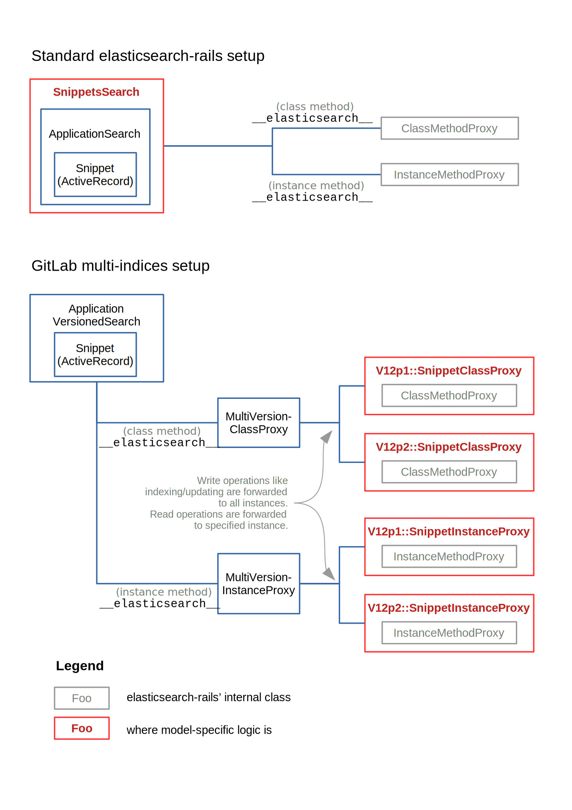

# Elasticsearch knowledge **(PREMIUM SELF)**

This area is to maintain a compendium of useful information when working with Elasticsearch.

Information on how to enable Elasticsearch and perform the initial indexing is in
the [Elasticsearch integration documentation](../integration/elasticsearch.md#enabling-advanced-search).

## Deep Dive

In June 2019, Mario de la Ossa hosted a Deep Dive (GitLab team members only: `https://gitlab.com/gitlab-org/create-stage/issues/1`) on the GitLab [Elasticsearch integration](../integration/elasticsearch.md) to share his domain specific knowledge with anyone who may work in this part of the codebase in the future. You can find the <i class="fa fa-youtube-play youtube" aria-hidden="true"></i> [recording on YouTube](https://www.youtube.com/watch?v=vrvl-tN2EaA), and the slides on [Google Slides](https://docs.google.com/presentation/d/1H-pCzI_LNrgrL5pJAIQgvLX8Ji0-jIKOg1QeJQzChug/edit) and in [PDF](https://gitlab.com/gitlab-org/create-stage/uploads/c5aa32b6b07476fa8b597004899ec538/Elasticsearch_Deep_Dive.pdf). Everything covered in this deep dive was accurate as of GitLab 12.0, and while specific details may have changed since then, it should still serve as a good introduction.

In August 2020, a second Deep Dive was hosted, focusing on [GitLab-specific architecture for multi-indices support](#zero-downtime-reindexing-with-multiple-indices). The <i class="fa fa-youtube-play youtube" aria-hidden="true"></i> [recording on YouTube](https://www.youtube.com/watch?v=0WdPR9oB2fg) and the [slides](https://lulalala.gitlab.io/gitlab-elasticsearch-deepdive/) are available. Everything covered in this deep dive was accurate as of GitLab 13.3.

## Supported Versions

See [Version Requirements](../integration/elasticsearch.md#version-requirements).

Developers making significant changes to Elasticsearch queries should test their features against all our supported versions.

## Setting up development environment

See the [Elasticsearch GDK setup instructions](https://gitlab.com/gitlab-org/gitlab-development-kit/blob/main/doc/howto/elasticsearch.md)

## Helpful Rake tasks

- `gitlab:elastic:test:index_size`: Tells you how much space the current index is using, as well as how many documents are in the index.
- `gitlab:elastic:test:index_size_change`: Outputs index size, reindexes, and outputs index size again. Useful when testing improvements to indexing size.

Additionally, if you need large repositories or multiple forks for testing, please consider [following these instructions](rake_tasks.md#extra-project-seed-options)

## How does it work?

The Elasticsearch integration depends on an external indexer. We ship an [indexer written in Go](https://gitlab.com/gitlab-org/gitlab-elasticsearch-indexer). The user must trigger the initial indexing via a Rake task but, after this is done, GitLab itself will trigger reindexing when required via `after_` callbacks on create, update, and destroy that are inherited from [`/ee/app/models/concerns/elastic/application_versioned_search.rb`](https://gitlab.com/gitlab-org/gitlab/-/blob/master/ee/app/models/concerns/elastic/application_versioned_search.rb).

After initial indexing is complete, create, update, and delete operations for all models except projects (see [#207494](https://gitlab.com/gitlab-org/gitlab/-/issues/207494)) are tracked in a Redis [`ZSET`](https://redis.io/topics/data-types#sorted-sets). A regular `sidekiq-cron` `ElasticIndexBulkCronWorker` processes this queue, updating many Elasticsearch documents at a time with the [Bulk Request API](https://www.elastic.co/guide/en/elasticsearch/reference/current/docs-bulk.html).

Search queries are generated by the concerns found in [`ee/app/models/concerns/elastic`](https://gitlab.com/gitlab-org/gitlab/-/tree/master/ee/app/models/concerns/elastic). These concerns are also in charge of access control, and have been a historic source of security bugs so please pay close attention to them!

## Existing Analyzers/Tokenizers/Filters

These are all defined in [`ee/lib/elastic/latest/config.rb`](https://gitlab.com/gitlab-org/gitlab/-/blob/master/ee/lib/elastic/latest/config.rb)

### Analyzers

#### `path_analyzer`

Used when indexing blobs' paths. Uses the `path_tokenizer` and the `lowercase` and `asciifolding` filters.

Please see the `path_tokenizer` explanation below for an example.

#### `sha_analyzer`

Used in blobs and commits. Uses the `sha_tokenizer` and the `lowercase` and `asciifolding` filters.

Please see the `sha_tokenizer` explanation later below for an example.

#### `code_analyzer`

Used when indexing a blob's filename and content. Uses the `whitespace` tokenizer and the filters: [`code`](#code), `lowercase`, and `asciifolding`

The `whitespace` tokenizer was selected in order to have more control over how tokens are split. For example the string `Foo::bar(4)` needs to generate tokens like `Foo` and `bar(4)` in order to be properly searched.

Please see the `code` filter for an explanation on how tokens are split.

NOTE:
The [Elasticsearch code_analyzer doesn't account for all code cases](../integration/elasticsearch.md#elasticsearch-code_analyzer-doesnt-account-for-all-code-cases).

#### `code_search_analyzer`

Not directly used for indexing, but rather used to transform a search input. Uses the `whitespace` tokenizer and the `lowercase` and `asciifolding` filters.

### Tokenizers

#### `sha_tokenizer`

This is a custom tokenizer that uses the [`edgeNGram` tokenizer](https://www.elastic.co/guide/en/elasticsearch/reference/5.5/analysis-edgengram-tokenizer.html) to allow SHAs to be searchable by any sub-set of it (minimum of 5 chars).

Example:

`240c29dc7e` becomes:

- `240c2`
- `240c29`
- `240c29d`
- `240c29dc`
- `240c29dc7`
- `240c29dc7e`

#### `path_tokenizer`

This is a custom tokenizer that uses the [`path_hierarchy` tokenizer](https://www.elastic.co/guide/en/elasticsearch/reference/5.5/analysis-pathhierarchy-tokenizer.html) with `reverse: true` in order to allow searches to find paths no matter how much or how little of the path is given as input.

Example:

`'/some/path/application.js'` becomes:

- `'/some/path/application.js'`
- `'some/path/application.js'`
- `'path/application.js'`
- `'application.js'`

### Filters

#### `code`

Uses a [Pattern Capture token filter](https://www.elastic.co/guide/en/elasticsearch/reference/5.5/analysis-pattern-capture-tokenfilter.html) to split tokens into more easily searched versions of themselves.

Patterns:

- `"(\\p{Ll}+|\\p{Lu}\\p{Ll}+|\\p{Lu}+)"`: captures CamelCased and lowedCameCased strings as separate tokens
- `"(\\d+)"`: extracts digits
- `"(?=([\\p{Lu}]+[\\p{L}]+))"`: captures CamelCased strings recursively. Ex: `ThisIsATest` => `[ThisIsATest, IsATest, ATest, Test]`
- `'"((?:\\"|[^"]|\\")*)"'`: captures terms inside quotes, removing the quotes
- `"'((?:\\'|[^']|\\')*)'"`: same as above, for single-quotes
- `'\.([^.]+)(?=\.|\s|\Z)'`: separate terms with periods in-between
- `'([\p{L}_.-]+)'`: some common chars in file names to keep the whole filename intact (for example `my_file-ñame.txt`)
- `'([\p{L}\d_]+)'`: letters, numbers and underscores are the most common tokens in programming. Always capture them greedily regardless of context.

## Gotchas

- Searches can have their own analyzers. Remember to check when editing analyzers
- `Character` filters (as opposed to token filters) always replace the original character, so they're not a good choice as they can hinder exact searches

## Zero downtime reindexing with multiple indices

NOTE:
This is not applicable yet as multiple indices functionality is not fully implemented.

Currently GitLab can only handle a single version of setting. Any setting/schema changes would require reindexing everything from scratch. Since reindexing can take a long time, this can cause search functionality downtime.

To avoid downtime, GitLab is working to support multiple indices that
can function at the same time. Whenever the schema changes, the admin
will be able to create a new index and reindex to it, while searches
continue to go to the older, stable index. Any data updates will be
forwarded to both indices. Once the new index is ready, an admin can
mark it active, which will direct all searches to it, and remove the old
index.

This is also helpful for migrating to new servers, e.g. moving to/from AWS.

Currently we are on the process of migrating to this new design. Everything is hardwired to work with one single version for now.

### Architecture

The traditional setup, provided by `elasticsearch-rails`, is to communicate through its internal proxy classes. Developers would write model-specific logic in a module for the model to include in (e.g. `SnippetsSearch`). The `__elasticsearch__` methods would return a proxy object, e.g.:

- `Issue.__elasticsearch__` returns an instance of `Elasticsearch::Model::Proxy::ClassMethodsProxy`
- `Issue.first.__elasticsearch__` returns an instance of `Elasticsearch::Model::Proxy::InstanceMethodsProxy`.

These proxy objects would talk to Elasticsearch server directly (see top half of the diagram).



In the planned new design, each model would have a pair of corresponding sub-classed proxy objects, in which model-specific logic is located. For example, `Snippet` would have `SnippetClassProxy` and `SnippetInstanceProxy` (being subclass of `Elasticsearch::Model::Proxy::ClassMethodsProxy` and `Elasticsearch::Model::Proxy::InstanceMethodsProxy`, respectively).

`__elasticsearch__` would represent another layer of proxy object, keeping track of multiple actual proxy objects. It would forward method calls to the appropriate index. For example:

- `model.__elasticsearch__.search` would be forwarded to the one stable index, since it is a read operation.
- `model.__elasticsearch__.update_document` would be forwarded to all indices, to keep all indices up-to-date.

The global configurations per version are now in the `Elastic::(Version)::Config` class. You can change mappings there.

### Creating new version of schema

NOTE:
This is not applicable yet as multiple indices functionality is not fully implemented.

Folders like `ee/lib/elastic/v12p1` contain snapshots of search logic from different versions. To keep a continuous Git history, the latest version lives under `ee/lib/elastic/latest`, but its classes are aliased under an actual version (e.g. `ee/lib/elastic/v12p3`). When referencing these classes, never use the `Latest` namespace directly, but use the actual version (e.g. `V12p3`).

The version name basically follows the GitLab release version. If setting is changed in 12.3, we will create a new namespace called `V12p3` (p stands for "point"). Raise an issue if there is a need to name a version differently.

If the current version is `v12p1`, and we need to create a new version for `v12p3`, the steps are as follows:

1. Copy the entire folder of `v12p1` as `v12p3`
1. Change the namespace for files under `v12p3` folder from `V12p1` to `V12p3` (which are still aliased to `Latest`)
1. Delete `v12p1` folder
1. Copy the entire folder of `latest` as `v12p1`
1. Change the namespace for files under `v12p1` folder from `Latest` to `V12p1`
1. Make changes to files under the `latest` folder as needed

## Creating a new Advanced Search migration

> This functionality was introduced by [#234046](https://gitlab.com/gitlab-org/gitlab/-/issues/234046).

NOTE:
This only supported for indices created with GitLab 13.0 or greater.

Migrations are stored in the [`ee/elastic/migrate/`](https://gitlab.com/gitlab-org/gitlab/-/tree/master/ee/elastic/migrate) folder with `YYYYMMDDHHMMSS_migration_name.rb`
filename format, which is similar to Rails database migrations:

```ruby
# frozen_string_literal: true

class MigrationName < Elastic::Migration
  # Important: Any updates to the Elastic index mappings must be replicated in the respective
  # configuration files:
  #   - `Elastic::Latest::Config`, for the main index.
  #   - `Elastic::Latest::<Type>Config`, for standalone indices.

  def migrate
  end

  # Check if the migration has completed
  # Return true if completed, otherwise return false
  def completed?
  end
end
```

Applied migrations are stored in `gitlab-#{RAILS_ENV}-migrations` index. All migrations not executed
are applied by the [`Elastic::MigrationWorker`](https://gitlab.com/gitlab-org/gitlab/-/blob/master/ee/app/workers/elastic/migration_worker.rb)
cron worker sequentially.

To update Elastic index mappings, apply the configuration to the respective files:

- For the main index: [`Elastic::Latest::Config`](https://gitlab.com/gitlab-org/gitlab/-/blob/master/ee/lib/elastic/latest/config.rb).
- For standalone indices: `Elastic::Latest::<Type>Config`.

Migrations can be built with a retry limit and have the ability to be [failed and marked as halted](https://gitlab.com/gitlab-org/gitlab/-/blob/66e899b6637372a4faf61cfd2f254cbdd2fb9f6d/ee/lib/elastic/migration.rb#L40).
Any data or index cleanup needed to support migration retries should be handled within the migration.

### Migration options supported by the `Elastic::MigrationWorker`

[`Elastic::MigrationWorker`](https://gitlab.com/gitlab-org/gitlab/-/blob/master/ee/app/workers/elastic/migration_worker.rb) supports the following migration options:

- `batched!` - Allow the migration to run in batches. If set, the [`Elastic::MigrationWorker`](https://gitlab.com/gitlab-org/gitlab/-/blob/master/ee/app/workers/elastic/migration_worker.rb)
will re-enqueue itself with a delay which is set using the `throttle_delay` option described below. The batching
must be handled within the `migrate` method, this setting controls the re-enqueuing only.

- `throttle_delay` - Sets the wait time in between batch runs. This time should be set high enough to allow each migration batch
enough time to finish. Additionally, the time should be less than 30 minutes since that is how often the
[`Elastic::MigrationWorker`](https://gitlab.com/gitlab-org/gitlab/-/blob/master/ee/app/workers/elastic/migration_worker.rb)
cron worker runs. Default value is 5 minutes.

- `pause_indexing!` - Pause indexing while the migration runs. This setting will record the indexing setting before
the migration runs and set it back to that value when the migration is completed.

- `space_requirements!` - Verify that enough free space is available in the cluster when the migration runs. This setting
  will halt the migration if the storage required is not available when the migration runs. The migration must provide
  the space required in bytes by defining a `space_required_bytes` method.

```ruby
# frozen_string_literal: true

class BatchedMigrationName < Elastic::Migration
  # Declares a migration should be run in batches
  batched!
  throttle_delay 10.minutes
  pause_indexing!
  space_requirements!
  
  # ...
end
```

### Multi-version compatibility

These Advanced Search migrations, like any other GitLab changes, need to support the case where
[multiple versions of the application are running at the same time](multi_version_compatibility.md).

Depending on the order of deployment, it's possible that the migration
has started or finished and there's still a server running the application code from before the
migration. We need to take this into consideration until we can [ensure all Advanced Search migrations
start after the deployment has finished](https://gitlab.com/gitlab-org/gitlab/-/issues/321619).

### Reverting a migration

Because Elasticsearch does not support transactions, we always need to design our
migrations to accommodate a situation where the application
code is reverted after the migration has started or after it is finished.

For this reason we generally defer destructive actions (for example, deletions after
some data is moved) to a later merge request after the migrations have
completed successfully. To be safe, for self-managed customers we should also
defer it to another release if there is risk of important data loss.

### Best practices for Advanced Search migrations

Follow these best practices for best results:

- When working in batches, keep the batch size under 9,000 documents
  and `throttle_delay` for at least 3 minutes. The bulk indexer is set to run
  every 1 minute and process a batch of 10,000 documents. These limits
  allow the bulk indexer time to process records before another migration
  batch is attempted.
- To ensure that document counts are up to date, it is recommended to refresh
  the index before checking if a migration is completed.
- Add logging statements to each migration when the migration starts, when a
  completion check occurs, and when the migration is completed. These logs
  are helpful when debugging issues with migrations.
- Pause indexing if you're using any Elasticsearch Reindex API operations.
- Consider adding a retry limit if there is potential for the migration to fail.
  This ensures that migrations can be halted if an issue occurs.

## Deleting Advanced Search migrations in a major version upgrade

Since our Advanced Search migrations usually require us to support multiple
code paths for a long period of time, it's important to clean those up when we
safely can.

We choose to use GitLab major version upgrades as a safe time to remove
backwards compatibility for indices that have not been fully migrated. We
[document this in our upgrade
documentation](../update/index.md#upgrading-to-a-new-major-version). We also
choose to replace the migration code with the halted migration
and remove tests so that:

- We don't need to maintain any code that is called from our Advanced Search
  migrations.
- We don't waste CI time running tests for migrations that we don't support
  anymore.
- Operators who have not run this migration and who upgrade directly to the
  target version will see a message prompting them to reindex from scratch.

To be extra safe, we will not delete migrations that were created in the last
minor version before the major upgrade. So, if we are upgrading to `%14.0`,
we should not delete migrations that were only added in `%13.12`. This is an
extra safety net as we expect there are migrations that get merged that may
take multiple weeks to finish on GitLab.com. It would be bad if we upgraded
GitLab.com to `%14.0` before the migrations in `%13.12` were finished. Since
our deployments to GitLab.com are automated and we currently don't have
automated checks to prevent this, the extra precaution is warranted.
Additionally, even if we did have automated checks to prevent it, we wouldn't
actually want to hold up GitLab.com deployments on Advanced Search migrations,
as they may still have another week to go, and that's too long to block
deployments.

### Process for removing migrations

For every migration that was created 2 minor versions before the major version
being upgraded to, we do the following:

1. Confirm the migration has actually completed successfully for GitLab.com.
1. Replace the content of the migration with:

   ```ruby
   include Elastic::MigrationObsolete
   ```

1. Delete any spec files to support this migration.
1. Remove any logic handling backwards compatibility for this migration. You
   can find this by looking for
   `Elastic::DataMigrationService.migration_has_finished?(:migration_name_in_lowercase)`.
1. Create a merge request with these changes. Noting that we should not
   accidentally merge this before the major release is started.

## Performance Monitoring

### Prometheus

GitLab exports [Prometheus
metrics](../administration/monitoring/prometheus/gitlab_metrics.md) relating to
the number of requests and timing for all web/API requests and Sidekiq jobs,
which can help diagnose performance trends and compare how Elasticsearch timing
is impacting overall performance relative to the time spent doing other things.

#### Indexing queues

GitLab also exports [Prometheus
metrics](../administration/monitoring/prometheus/gitlab_metrics.md) for
indexing queues, which can help diagnose performance bottlenecks and determine
whether or not your GitLab instance or Elasticsearch server can keep up with
the volume of updates.

### Logs

All of the indexing happens in Sidekiq, so much of the relevant logs for the
Elasticsearch integration can be found in
[`sidekiq.log`](../administration/logs.md#sidekiqlog). In particular, all
Sidekiq workers that make requests to Elasticsearch in any way will log the
number of requests and time taken querying/writing to Elasticsearch. This can
be useful to understand whether or not your cluster is keeping up with
indexing.

Searching Elasticsearch is done via ordinary web workers handling requests. Any
requests to load a page or make an API request, which then make requests to
Elasticsearch, will log the number of requests and the time taken to
[`production_json.log`](../administration/logs.md#production_jsonlog). These
logs will also include the time spent on Database and Gitaly requests, which
may help to diagnose which part of the search is performing poorly.

There are additional logs specific to Elasticsearch that are sent to
[`elasticsearch.log`](../administration/logs.md#elasticsearchlog)
that may contain information to help diagnose performance issues.

### Performance Bar

Elasticsearch requests will be displayed in the [`Performance
Bar`](../administration/monitoring/performance/performance_bar.md), which can
be used both locally in development and on any deployed GitLab instance to
diagnose poor search performance. This will show the exact queries being made,
which is useful to diagnose why a search might be slow.

### Correlation ID and `X-Opaque-Id`

Our [correlation
ID](distributed_tracing.md#developer-guidelines-for-working-with-correlation-ids)
is forwarded by all requests from Rails to Elasticsearch as the
[`X-Opaque-Id`](https://www.elastic.co/guide/en/elasticsearch/reference/current/tasks.html#_identifying_running_tasks)
header which allows us to track any
[tasks](https://www.elastic.co/guide/en/elasticsearch/reference/current/tasks.html)
in the cluster back the request in GitLab.

## Troubleshooting

### Getting `flood stage disk watermark [95%] exceeded`

You might get an error such as

```plaintext
[2018-10-31T15:54:19,762][WARN ][o.e.c.r.a.DiskThresholdMonitor] [pval5Ct]
   flood stage disk watermark [95%] exceeded on
   [pval5Ct7SieH90t5MykM5w][pval5Ct][/usr/local/var/lib/elasticsearch/nodes/0] free: 56.2gb[3%],
   all indices on this node will be marked read-only
```

This is because you've exceeded the disk space threshold - it thinks you don't have enough disk space left, based on the default 95% threshold.

In addition, the `read_only_allow_delete` setting will be set to `true`. It will block indexing, `forcemerge`, etc

```shell
curl "http://localhost:9200/gitlab-development/_settings?pretty"
```

Add this to your `elasticsearch.yml` file:

```yaml
# turn off the disk allocator
cluster.routing.allocation.disk.threshold_enabled: false
```

_or_

```yaml
# set your own limits
cluster.routing.allocation.disk.threshold_enabled: true
cluster.routing.allocation.disk.watermark.flood_stage: 5gb   # ES 6.x only
cluster.routing.allocation.disk.watermark.low: 15gb
cluster.routing.allocation.disk.watermark.high: 10gb
```

Restart Elasticsearch, and the `read_only_allow_delete` will clear on its own.

_from "Disk-based Shard Allocation | Elasticsearch Reference" [5.6](https://www.elastic.co/guide/en/elasticsearch/reference/5.6/disk-allocator.html#disk-allocator) and [6.x](https://www.elastic.co/guide/en/elasticsearch/reference/6.7/disk-allocator.html)_

### Disaster recovery/data loss/backups

The use of Elasticsearch in GitLab is only ever as a secondary data store.
This means that all of the data stored in Elasticsearch can always be derived
again from other data sources, specifically PostgreSQL and Gitaly. Therefore if
the Elasticsearch data store is ever corrupted for whatever reason you can
simply reindex everything from scratch.

If your Elasticsearch index is incredibly large it may be too time consuming or
cause too much downtime to reindex from scratch. There aren't any built in
mechanisms for automatically finding discrepancies and resyncing an
Elasticsearch index if it gets out of sync but one tool that may be useful is
looking at the logs for all the updates that occurred in a time range you
believe may have been missed. This information is very low level and only
useful for operators that are familiar with the GitLab codebase. It is
documented here in case it is useful for others. The relevant logs that could
theoretically be used to figure out what needs to be replayed are:

1. All non-repository updates that were synced can be found in
   [`elasticsearch.log`](../administration/logs.md#elasticsearchlog) by
   searching for
   [`track_items`](https://gitlab.com/gitlab-org/gitlab/-/blob/1e60ea99bd8110a97d8fc481e2f41cab14e63d31/ee/app/services/elastic/process_bookkeeping_service.rb#L25)
   and these can be replayed by sending these items again through
   `::Elastic::ProcessBookkeepingService.track!`
1. All repository updates that occurred can be found in
   [`elasticsearch.log`](../administration/logs.md#elasticsearchlog) by
   searching for
   [`indexing_commit_range`](https://gitlab.com/gitlab-org/gitlab/-/blob/6f9d75dd3898536b9ec2fb206e0bd677ab59bd6d/ee/lib/gitlab/elastic/indexer.rb#L41).
   Replaying these requires resetting the
   [`IndexStatus#last_commit/last_wiki_commit`](https://gitlab.com/gitlab-org/gitlab/-/blob/master/ee/app/models/index_status.rb)
   to the oldest `from_sha` in the logs and then triggering another index of
   the project using
   [`ElasticCommitIndexerWorker`](https://gitlab.com/gitlab-org/gitlab/-/blob/master/ee/app/workers/elastic_commit_indexer_worker.rb)
1. All project deletes that occurred can be found in
   [`sidekiq.log`](../administration/logs.md#sidekiqlog) by searching for
   [`ElasticDeleteProjectWorker`](https://gitlab.com/gitlab-org/gitlab/-/blob/master/ee/app/workers/elastic_delete_project_worker.rb).
   These updates can be replayed by triggering another
   `ElasticDeleteProjectWorker`.

With the above methods and taking regular [Elasticsearch
snapshots](https://www.elastic.co/guide/en/elasticsearch/reference/current/snapshot-restore.html)
we should be able to recover from different kinds of data loss issues in a
relatively short period of time compared to indexing everything from
scratch.
