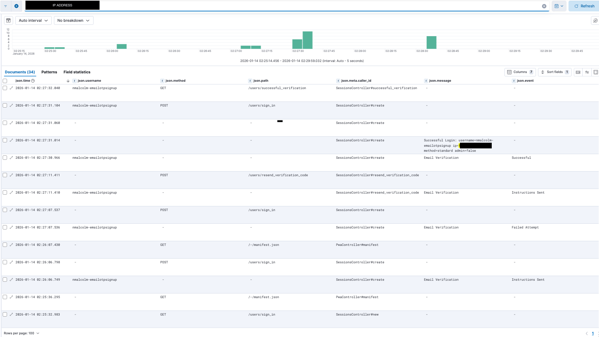
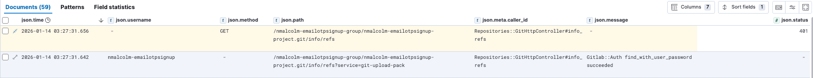

Email One-Time Passwords (Email OTP) is a two-factor authentication (2FA)
method for GitLab.com users who sign in with passwords. Users receive a
one-time code by email during login and must enter it to complete
authentication.

For information on this feature that are not development-specific, see
[the feature documentation](../user/profile/account/two_factor_authentication.md).

From January 2026
[GitLab.com is rolling out Email OTP as a mandatory minimum](https://about.gitlab.com/blog/strengthening-gitlab-com-security-mandatory-multi-factor-authentication).
Developers of this feature should be mindful of feature flags, GitLab
instance settings, and the need for future dated enrollment.

## Logging

You can triage and debug issues raised by Email OTP with the
[GitLab production logs](https://log.gprd.gitlab.net).

### Email OTP events during sign-in

Query for Email OTP verification events:

```plaintext
json.message: "Email Verification" AND json.username:replace_username_here
```

Add the `json.event` column to see event types. These logs appear when:

- Account requires Email OTP.
- Account is in grace period (`email_otp_required_after` is 7 days or less)
- Account is locked (pre-existing `VerifiesWithEmail` behavior)

Example log showing successful sign-in flow, searching by IP address:



Event reasons are defined in
[`VerifiesWithEmail` constants](https://gitlab.com/gitlab-org/gitlab/-/blob/master/app/controllers/concerns/verifies_with_email.rb#L11-L15).

### Password API authentication failures

As with other 2FA methods, users enrolled in Email OTP cannot
authenticate API requests with passwords. Look for successful password
validation followed by 401 responses.

Search for `find_with_user_password succeeded`, then look at
time-adjacent records or records with the same IP to identify the
request record and its response.

```plaintext
json.message: "find_with_user_password" AND json.username:replace_username_here
```

Example showing Git operations with Email OTP enrolled:



Note the `find_with_user_password succeeded` message appears even though
authentication ultimately fails with 401.

### Enrollment changes

View user preference modifications:

```plaintext
json.meta.caller_id: "UserSettings::ProfilesController#update" AND json.params.value: "email_otp_required_as_boolean"
```

Expand the record to view the preferences options being submitted. A
parameter value of `1` indicates the user is enrolling in Email OTP, a
`0` indicates they are unenrolling.

### Additional searches

**All user activity:**

```plaintext
json.username: "USERNAME" OR json.meta.user: "USERNAME"
```

**Session events:**

```plaintext
json.controller: "SessionsController" AND json.action: (new OR create OR resend_verification_code OR successful_verification)
```

**Password-authenticatable operations:**

```plaintext
json.controller: (Repositories::GitHttpController OR JwtController) AND json.path: "/PROJECT_PATH"
```

## Architecture

Email OTP is part of the Email Verification logic. This includes
verification of a provided code when a user signs in from a new IP
address, or signs in after they have been locked.

It is distinct from the
[Identity Verification](identity_verification.md) feature, and from
Devise's Confirmable feature, both of which occur during the user
registration flow.

### Code

**Controllers:**

- [`SessionsController`](https://gitlab.com/gitlab-org/gitlab/-/blob/master/app/controllers/sessions_controller.rb) - Authentication entry point
- [`VerifiesWithEmail`](https://gitlab.com/gitlab-org/gitlab/-/blob/master/app/controllers/concerns/verifies_with_email.rb) - Sends and verifies codes during sign in

**Models:**

- [`User`](https://gitlab.com/gitlab-org/gitlab/-/blob/master/app/models/user.rb) - Delegates Email OTP attributes to `UserDetail`
- [`UserDetail`](https://gitlab.com/gitlab-org/gitlab/-/blob/master/app/models/user_detail.rb) - Stores Email OTP state
- [`Users::EmailOtpEnrollment`](https://gitlab.com/gitlab-org/gitlab/-/blob/master/app/models/concerns/users/email_otp_enrollment.rb) - Enrollment logic and state management

**Helpers:**

- [`VerifiesWithEmailHelper`](https://gitlab.com/gitlab-org/gitlab/-/blob/master/app/helpers/verifies_with_email_helper.rb) - Backend and frontend helper methods
- [`SessionsHelper`](https://gitlab.com/gitlab-org/gitlab/-/blob/master/app/helpers/sessions_helper.rb) - Session-related helpers

### Database schema

`user_details` table stores:

- `email_otp` - Hashed OTP code (nil after use)
- `email_otp_required_after` - Enforcement timestamp, controlling
  enrollment state
- `email_otp_last_sent_at` - Last code delivery time
- `email_otp_last_sent_to` - Address the code was sent to

### State management

The `email_otp_required_after` value is automatically managed by
[`Users::EmailOtpEnrollment#set_email_otp_required_after_based_on_restrictions`](https://gitlab.com/gitlab-org/gitlab/-/blob/master/app/models/concerns/users/email_otp_enrollment.rb).
Enrollment states include nil (not enrolled), a future date (upcoming or
current grace period), or a past date (enforcement active).

Updating a User through
[`Users::UpdateService`](https://gitlab.com/gitlab-org/gitlab/-/blob/master/app/services/users/update_service.rb)
enforces state management, potentially overriding the value, using
`set_email_otp_required_after_based_on_restrictions`. The same check
also occurs during sign in.
This behavior is expected and generates logs with the method name in
`event.message`. Code comments explain the state transitions.

### Security

Email OTP does not satisfy
[group or instance 2FA requirements](../security/two_factor_authentication.md).
Only App-based TOTP and WebAuthn fulfill these policies. However, if a user has
no other 2FA methods configured, Email
OTP is required until they add a App-based TOTP or WebAuthn method.
This requirement is intentional to provide security.

[Rate limiting exists](https://gitlab.com/gitlab-org/gitlab/-/blob/master/lib/gitlab/application_rate_limiter.rb)
to prevent brute-force attacks on the email verification flow. The
module implements two rate limits:

1. **Sign-in rate limiting** (`user_sign_in`): Applied when a user
   enters a correct password but requires email verification. This
   prevents attackers from guessing passwords by observing when the
   email verification page is displayed.
1. **Email verification code resend rate limiting**
   (`email_verification_code_send`): Applied when users request a resend
   of their verification code, preventing abuse of the email sending
   mechanism.
1. **Email verification token validation rate limiting**
   (`email_verification`): Applied when users submit a verification
   token, preventing brute-force attempts to guess the token.

Verification codes expire after a
[fixed time period](https://gitlab.com/gitlab-org/gitlab/-/blob/master/app/services/users/email_verification/validate_token_service.rb#L8).
If the user doesn't verify before the code expires, they can request a new code.

Verification codes are sent to the primary
email address. If the user has a confirmed secondary address, they
can send a new code there as well. This also sends a security notification
to the primary email address.

### Authentication precedence

Two-factor authentication is offered in this order:

1. WebAuthn (if configured)
1. App-based TOTP (if configured)
1. Email OTP (if permitted and required)

Users with confirmed secondary email addresses can resend a new code if
they cannot access their primary email address.

## Configuration

**Feature flags:**

- [`email_based_mfa`](https://gitlab.com/gitlab-org/gitlab/-/issues/584355) - Global toggle for Email OTP enforcement
- [`enrol_new_users_in_email_otp`](https://gitlab.com/gitlab-org/gitlab/-/issues/561975) - Controls automatic enrollment for new users

**Application setting:**

- [`require_minimum_email_based_otp_for_users_with_passwords`](https://gitlab.com/gitlab-org/gitlab/-/blob/master/app/models/application_setting.rb#L765) - Makes Email OTP mandatory for users without other 2FA

## Testing

Configure GDK to match GitLab.com:

```ruby
# Admin > Settings > General > Sign-up restrictions
ApplicationSetting.current.update!(
  require_admin_approval_after_user_signup: false,
  email_confirmation_setting: 'hard' )

# Admin > Settings > General > Sign-in restrictions
ApplicationSetting.current.update!(
  anti_abuse_settings: {
    require_email_verification_on_account_locked: true
  }
)
```

Test enrollment states using commands like those below:

```ruby
user = User.find_by(username: 'test_user')

# Enable Email OTP
Feature.enable(:email_based_mfa, user)
# Disable Email OTP
Feature.disable(:email_based_mfa, user)

# Require Email OTP as a minimum
ApplicationSetting.current.update!(sign_in_restrictions: {require_minimum_email_based_otp_for_users_with_passwords: true })
# Or allow users to disable it
ApplicationSetting.current.update!(sign_in_restrictions: {require_minimum_email_based_otp_for_users_with_passwords: false })

# Enrol new users when they sign up
Feature.enable(:enrol_new_users_in_email_otp)
# Or make it opt-in
Feature.disable(:enrol_new_users_in_email_otp)

# Set enrollment date via UpdateService (triggers automatic enrollment logic)
Users::UpdateService.new( user, { user: user, email_otp_required_after: date } ).execute!
# Or set directly, bypassing set_email_otp_required_after_based_on_restrictions
user.update(email_otp_required_after: date) # nil to unenroll
```

View emails at `https://gdk.test:3443/rails/letter_opener`.

Grace period phases are defined in code - see
[`VerifiesWithEmail`](https://gitlab.com/gitlab-org/gitlab/-/blob/master/app/controllers/concerns/verifies_with_email.rb)
and
[`VerifiesWithEmailHelper`](https://gitlab.com/gitlab-org/gitlab/-/blob/master/app/helpers/verifies_with_email_helper.rb)
for threshold values.

## QA integration

For end-to-end production and staging tests to function properly, GitLab
allows QA users to bypass Email OTP when the `User-Agent` for the
request matches the configured `GITLAB_QA_USER_AGENT`.

## Related code

**Test files:**

- [`spec/requests/verifies_with_email_spec.rb`](https://gitlab.com/gitlab-org/gitlab/-/blob/master/spec/requests/verifies_with_email_spec.rb) - Integration tests for Email OTP sign-in flow
- [`spec/models/concerns/users/email_otp_enrollment_spec.rb`](https://gitlab.com/gitlab-org/gitlab/-/blob/master/spec/models/concerns/users/email_otp_enrollment_spec.rb) - Unit tests for enrollment state management
- [`spec/helpers/verifies_with_email_helper_spec.rb`](https://gitlab.com/gitlab-org/gitlab/-/blob/master/spec/helpers/verifies_with_email_helper_spec.rb) - Tests for Email OTP helper methods

## Additional resources

**User documentation:**

- [Two-Factor Authentication](../user/profile/account/two_factor_authentication.md) - Enable and sign in with Email OTP
- [Troubleshooting two-factor authentication](../user/profile/account/two_factor_authentication_troubleshooting.md) - Password API errors with Email OTP
- [Enforce two-factor authentication](../security/two_factor_authentication.md) - Email OTP does not satisfy 2FA requirements

**Technical documentation:**

- [SRE Runbook](https://gitlab.com/gitlab-com/runbooks/-/blob/master/docs/uncategorized/email-based-one-time-passwords-otp.md)
- [Support Runbook](https://handbook.gitlab.com/handbook/support/workflows/2fa-removal/)
- [Project Epic](https://gitlab.com/groups/gitlab-org/-/work_items/17128)
- [Architecture Design](https://handbook.gitlab.com/handbook/security/product_security/mandatory_mfa/architecture_design/)

**Internal support:**

- Slack: [`#mfa_default_planning`](https://gitlab.slack.com/archives/C08GXLZKXHV)
