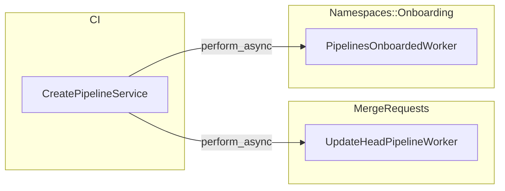
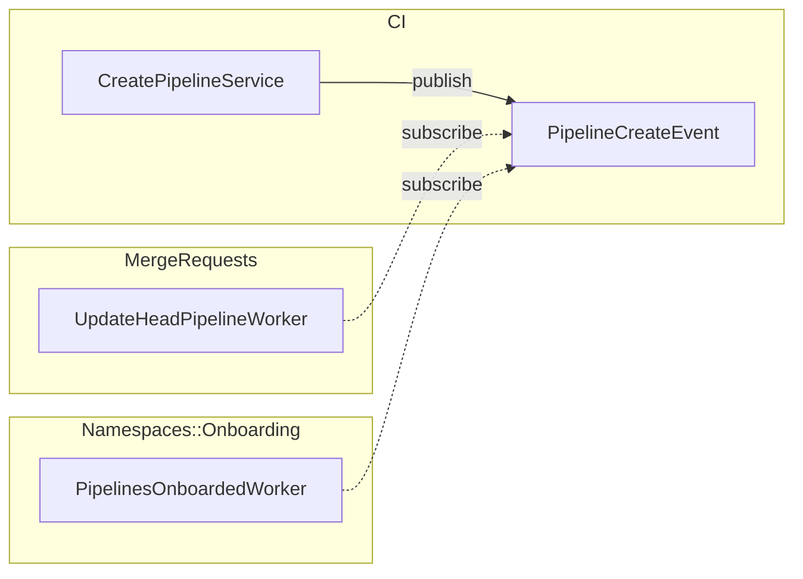

## Background

The monolithic GitLab project is becoming larger and more domains are being defined.
As a result, these domains are becoming entangled with each others due to temporal coupling.

An emblematic example is the [`PostReceive`](https://gitlab.com/gitlab-org/gitlab/blob/master/app/workers/post_receive.rb)
worker where a lot happens across multiple domains. If a new behavior reacts to
a new commit being pushed, then we add code somewhere in `PostReceive` or its sub-components
(`Git::ProcessRefChangesService`, for example).

This type of architecture:

- Is a violation of the Single Responsibility Principle.
- Increases the risk of adding code to a codebase you are not familiar with.
  There may be nuances you don't know about which may introduce bugs or a performance degradation.
- Violates domain boundaries. Inside a specific namespace (for example `Git::`) we suddenly see
  classes from other domains chiming in (like `Ci::` or `MergeRequests::`).

## What is EventStore?

`Gitlab:EventStore` is a basic pub-sub system built on top of the existing Sidekiq workers and observability we have today.
We use this system to apply an event-driven approach when modeling a domain while keeping coupling
to a minimum.

This essentially leaves the existing Sidekiq workers as-is to perform asynchronous work but inverts
the dependency.

### EventStore example

When a CI pipeline is created we update the head pipeline for any merge request matching the
pipeline's `ref`. The merge request can then display the status of the latest pipeline.

#### Without the EventStore

We change `Ci::CreatePipelineService` and add logic (like an `if` statement) to check if the
pipeline is created. Then we schedule a worker to run some side-effects for the `MergeRequests::` domain.

This style violates the [Open-Closed Principle](https://en.wikipedia.org/wiki/Open%E2%80%93closed_principle)
and unnecessarily add side-effects logic from other domains, increasing coupling:



#### With the EventStore

`Ci::CreatePipelineService` publishes an event `Ci::PipelineCreatedEvent` and its responsibility stops here.

The `MergeRequests::` domain can subscribe to this event with a worker `MergeRequests::UpdateHeadPipelineWorker`, so:

- Side-effects are scheduled asynchronously and don't impact the main business transaction that
  emits the domain event.
- More side-effects can be added without modifying the main business transaction.
- We can clearly see what domains are involved and their ownership.
- We can identify what events occur in the system because they are explicitly declared.

With `Gitlab::EventStore` there is still coupling between the subscriber (Sidekiq worker) and the schema of the domain event.
This level of coupling is much smaller than having the main transaction (`Ci::CreatePipelineService`) coupled to:

- multiple subscribers.
- multiple ways of invoking subscribers (including conditional invocations).
- multiple ways of passing parameters.



Each subscriber, being itself a Sidekiq worker, can specify any attributes that are related
to the type of work they are responsible for. For example, one subscriber could define
`urgency: high` while another one less critical could set `urgency: low`.

The EventStore is only an abstraction that allows us to have Dependency Inversion. This helps
separating a business transaction from side-effects (often executed in other domains).

When an event is published, the EventStore calls `perform_async` on each subscribed worker,
passing in the event information as arguments. This essentially schedules a Sidekiq job on each
subscriber's queue.

This means that nothing else changes with regards to how subscribers work, as they are just
Sidekiq workers. For example: if a worker (subscriber) fails to execute a job, the job is put
back into Sidekiq to be retried.

## EventStore advantages

- Subscribers (Sidekiq workers) can be set to run quicker by changing the worker weight
  if the side-effect is critical.
- Automatically enforce the fact that side-effects run asynchronously.
  This makes it safe for other domains to subscribe to events without affecting the performance of the
  main business transaction.

## EventStore disadvantages

- `EventStore` is built on top of Sidekiq.
  Although Sidekiq workers support retries and exponential backoff,
  there are instances when a worker exceeds a retry limit and Sidekiq jobs are
  lost. Also, as part of incidents, and disaster recovery, Sidekiq jobs may be
  dropped. Although many important GitLab features rely on the assumption of durability in Sidekiq, this may not be acceptable for some critical data integrity features. If you need to be sure
  the work is done eventually you may need to implement a queuing mechanism in
  Postgres where the jobs are picked up by Sidekiq cron workers. You can see
  examples of this approach in `::LooseForeignKeys::CleanupWorker` and
  `::BatchedGitRefUpdates::ProjectCleanupWorker`. Typically a partitioned
  table is created and you insert data which is then processed later by a cron
  worker and marked as `processed` in the database after doing some work.
  There are also strategies for implementing reliable queues in Redis such as that used in `::Elastic::ProcessBookkeepingService`. If you are introducing new patterns for queueing in the codebase you will want to seek advice from maintainers early in the process.
- Alternatively, consider not using `EventStore` if the logic needs to be
  processed as part of the main business transaction, and is not a
  side-effect.
- Sidekiq workers aren't limited by default but you should consider configuring a
  [concurrency limit](sidekiq/worker_attributes.md#concurrency-limit) if there is a risk of saturating shared resources.

## Define an event

An `Event` object represents a domain event that occurred in a [bounded context](https://gitlab.com/gitlab-org/gitlab/-/blob/master/config/bounded_contexts.yml).
Producers can notify other bounded contexts about something that happened by publishing events, so that they can react to it. An event should be named `<domain_object><action>Event`, where the `action` is in past tense, e.g. `ReviewerAddedEvent` instead of `AddReviewerEvent`. The `domain_object` may be elided when it is obvious based on the bounded context, e.g. `MergeRequest::ApprovedEvent` instead of `MergeRequest::MergeRequestApprovedEvent`.

### Guidance for good events

Events are a public interface, just like an API or a UI. Collaborate with your
product and design counterparts to ensure new events will address the needs of
subscribers. Whenever possible, new events should strive to meet the following
principles:

- **Semantic**: Events should describe what occurred within the bounded context, _not_ the intended
  action for subscribers.
- **Specific**: Events should be narrowly defined without being overly precise. This minimizes the
  amount of event filtering that subscribers have to perform, as well as the number of unique events
  to which they need to subscribe. Consider using properties to communicate additional information.
- **Scoped**: Events should be scoped to their bounded context. Avoid publishing events about domain objects that are not contained by your bounded context.

#### Examples

| Principle | Good | Bad |
| --- | --- | --- |
| Semantic | `MergeRequest::ApprovedEvent` | `MergeRequest::NotifyAuthorEvent` |
| Specific | `MergeRequest::ReviewerAddedEvent` | &bull;&nbsp;`MergeRequest::ChangedEvent` <br> &bull;&nbsp;`MergeRequest::CodeownerAddedAsReviewerEvent` |
| Scoped | `MergeRequest::CreatedEvent` | `Project::MergeRequestCreatedEvent` |

### Creating the event schema

Define new event classes under `app/events/<namespace>/` with a name representing something that happened in the past:

```ruby
class Ci::PipelineCreatedEvent < Gitlab::EventStore::Event
  def schema
    {
      'type' => 'object',
      'required' => ['pipeline_id'],
      'properties' => {
        'pipeline_id' => { 'type' => 'integer' },
        'ref' => { 'type' => 'string' }
      }
    }
  end
end
```

The schema, which must be a valid [JSON schema](https://json-schema.org/specification), is validated
by the [`JSONSchemer`](https://github.com/davishmcclurg/json_schemer) gem. The validation happens
immediately when you initialize the event object to ensure that publishers follow the contract
with the subscribers.

You should use optional properties as much as possible, which require fewer rollouts for schema changes.
However, `required` properties could be used for unique identifiers of the event's subject. For example:

- `pipeline_id` can be a required property for a `Ci::PipelineCreatedEvent`.
- `project_id` can be a required property for a `Projects::ProjectDeletedEvent`.

Publish only properties that are needed by the subscribers without tailoring the payload to specific subscribers.
The payload should fully represent the event and not contain loosely related properties. For example:

```ruby
Ci::PipelineCreatedEvent.new(data: {
  pipeline_id: pipeline.id,
  # unless all subscribers need merge request IDs,
  # this is data that can be fetched by the subscriber.
  merge_request_ids: pipeline.all_merge_requests.pluck(:id)
})
```

Publishing events with more properties provides the subscribers with the data
they need in the first place. Otherwise subscribers have to fetch the additional data from the database.
However, this can lead to continuous changes to the schema and possibly adding properties that may not
represent the single source of truth.
It's best to use this technique as a performance optimization. For example: when an event has many
subscribers that all fetch the same data again from the database.

### Update the schema

Changes to the schema require multiple rollouts. While the new version is being deployed:

- Existing publishers can publish events using the old version.
- Existing subscribers can consume events using the old version.
- Events get persisted in the Sidekiq queue as job arguments, so we could have 2 versions of the schema during deployments.

As changing the schema ultimately impacts the Sidekiq arguments, refer to our
[Sidekiq style guide](sidekiq/compatibility_across_updates.md#changing-the-arguments-for-a-worker) with regards to multiple rollouts.

#### Add properties

1. Rollout 1:
   - Add new properties as optional (not `required`).
   - Update the subscriber so it can consume events with and without the new properties.
1. Rollout 2:
   - Change the publisher to provide the new property
1. Rollout 3: (if the property should be `required`):
   - Change the schema and the subscriber code to always expect it.

#### Remove properties

1. Rollout 1:
   - If the property is `required`, make it optional.
   - Update the subscriber so it does not always expect the property.
1. Rollout 2:
   - Remove the property from the event publishing.
   - Remove the code from the subscriber that processes the property.

#### Other changes

For other changes, like renaming a property, use the same steps:

1. Remove the old property
1. Add the new property

## Publish an event

To publish the event from the [previous example](#define-an-event):

```ruby
Gitlab::EventStore.publish(
  Ci::PipelineCreatedEvent.new(data: { pipeline_id: pipeline.id })
)
```

Events should be dispatched from the relevant Service class whenever possible. Some
exceptions exist where we may allow models to publish events, like in state machine transitions.
For example, instead of scheduling `Ci::BuildFinishedWorker`, which runs a collection of side effects,
we could publish a `Ci::BuildFinishedEvent` and let other domains react asynchronously.

`ActiveRecord` callbacks are too low-level to represent a domain event. They represent more database
record changes. There might be cases where it would make sense, but we should consider
those exceptions.

## Create a subscriber

A subscriber is a Sidekiq worker that includes the `Gitlab::EventStore::Subscriber` module.
This module takes care of the `perform` method and provides a better abstraction to handle
the event safely via the `handle_event` method. For example:

```ruby
module MergeRequests
  class UpdateHeadPipelineWorker
    include Gitlab::EventStore::Subscriber

    def handle_event(event)
      Ci::Pipeline.find_by_id(event.data[:pipeline_id]).try do |pipeline|
        # ...
      end
    end
  end
end
```

## Register the subscriber to the event

To subscribe the worker to a specific event in `lib/gitlab/event_store.rb`,
add a line like this to the `Gitlab::EventStore.configure!` method:

WARNING:
New workers are recommended to be introduced with a feature flag in order to
[ensure compatibility with canary deployments](sidekiq/compatibility_across_updates.md#adding-new-workers).

```ruby
module Gitlab
  module EventStore
    def self.configure!(store)
      # ...

      store.subscribe ::Sbom::ProcessTransferEventsWorker, to: ::Projects::ProjectTransferedEvent,
        if: ->(event) do
          actor = ::Project.actor_from_id(event.data[:project_id])
          Feature.enabled?(:sync_project_archival_status_to_sbom_occurrences, actor)
        end

      # ...
    end
  end
end
```

A worker that is only defined in the EE codebase can subscribe to an event in the same way by
declaring the subscription in `ee/lib/ee/gitlab/event_store.rb`.

Subscriptions are stored in memory when the Rails app is loaded and they are immediately frozen.
It's not possible to modify subscriptions at runtime.

### Conditional dispatch of events

A subscription can specify a condition when to accept an event:

```ruby
store.subscribe ::MergeRequests::UpdateHeadPipelineWorker,
  to: ::Ci::PipelineCreatedEvent,
  if: -> (event) { event.data[:merge_request_id].present? }
```

This tells the event store to dispatch `Ci::PipelineCreatedEvent`s to the subscriber if
the condition is met.

This technique can avoid scheduling Sidekiq jobs if the subscriber is interested in a
small subset of events.

WARNING:
When using conditional dispatch it must contain only cheap conditions because they are
executed synchronously every time the given event is published.

For complex conditions it's best to subscribe to all the events and then handle the logic
in the `handle_event` method of the subscriber worker.

### Delayed dispatching of events

A subscription can specify a delay when to receive an event:

```ruby
store.subscribe ::MergeRequests::UpdateHeadPipelineWorker,
  to: ::Ci::PipelineCreatedEvent,
  delay: 1.minute
```

The `delay` parameter switches the dispatching of the event to use `perform_in` method
on the subscriber Sidekiq worker, instead of `perform_async`.

This technique is useful when publishing many events and leverage the Sidekiq deduplication.

### Publishing group of events

In some scenarios we publish multiple events of same type in a single business transaction.
This puts additional load to Sidekiq by invoking a job for each event. In such cases, we can
publish a group of events by calling `Gitlab::EventStore.publish_group`. This method accepts an
array of events of similar type. By default the subscriber worker receives a group of max 10 events,
but this can be configured by defining `group_size` parameter while creating the subscription.
The number of published events are dispatched to the subscriber in batches based on the
configured `group_size`. If the number of groups exceeds 100, we schedule each group with a delay
of 10 seconds, to reduce the load on Sidekiq.

```ruby
store.subscribe ::Security::RefreshProjectPoliciesWorker,
  to: ::ProjectAuthorizations::AuthorizationsChangedEvent,
  delay: 1.minute,
  group_size: 25
```

The `handle_event` method in the subscriber worker is called for each of the events in the group.

## Remove a subscriber

As `Gitlab::EventStore` is backed by Sidekiq we follow the same guides for
[removing Sidekiq workers](sidekiq/compatibility_across_updates.md#removing-worker-classes) starting
with:

- Removing the subscription in order to remove any code that enqueues the job
- Making the subscriber worker no-op. For this we need to remove the `Gitlab::EventStore::Subscriber` module from the worker.

## Testing

### Testing the publisher

The publisher's responsibility is to ensure that the event is published correctly.

To test that an event has been published correctly, we can use the RSpec matcher `:publish_event`:

```ruby
it 'publishes a ProjectDeleted event with project id and namespace id' do
  expected_data = { project_id: project.id, namespace_id: project.namespace_id }

  # The matcher verifies that when the block is called, the block publishes the expected event and data.
  expect { destroy_project(project, user, {}) }
    .to publish_event(Projects::ProjectDeletedEvent)
    .with(expected_data)
end
```

It is also possible to compose matchers inside the `:publish_event` matcher.
This could be useful when we want to assert that an event is created with a certain kind of value,
but we do not know the value in advance. An example of this is when publishing an event
after creating a new record.

```ruby
it 'publishes a ProjectCreatedEvent with project id and namespace id' do
  # The project ID will only be generated when the `create_project`
  # is called in the expect block.
  expected_data = { project_id: kind_of(Numeric), namespace_id: group_id }

  expect { create_project(user, name: 'Project', path: 'project', namespace_id: group_id) }
    .to publish_event(Projects::ProjectCreatedEvent)
    .with(expected_data)
end
```

When you publish multiple events, you can also check for non-published events.

```ruby
it 'publishes a ProjectCreatedEvent with project id and namespace id' do
  # The project ID is generated when `create_project`
  # is called in the `expect` block.
  expected_data = { project_id: kind_of(Numeric), namespace_id: group_id }

  expect { create_project(user, name: 'Project', path: 'project', namespace_id: group_id) }
    .to publish_event(Projects::ProjectCreatedEvent)
    .with(expected_data)
    .and not_publish_event(Projects::ProjectDeletedEvent)
end
```

### Testing the subscriber

The subscriber must ensure that a published event can be consumed correctly. For this purpose
we have added helpers and shared examples to standardize the way we test subscribers:

```ruby
RSpec.describe MergeRequests::UpdateHeadPipelineWorker do
  let(:pipeline_created_event) { Ci::PipelineCreatedEvent.new(data: ({ pipeline_id: pipeline.id })) }

  # This shared example ensures that an event is published and correctly processed by
  # the current subscriber (`described_class`). It also ensures that the worker is idempotent.
  it_behaves_like 'subscribes to event' do
    let(:event) { pipeline_created_event }
  end

  # This shared example ensures that an published event is ignored. This might be useful for
  # conditional dispatch testing.
  it_behaves_like 'ignores the published event' do
    let(:event) { pipeline_created_event }
  end

  it 'does something' do
    # This helper directly executes `perform` ensuring that `handle_event` is called correctly.
    consume_event(subscriber: described_class, event: pipeline_created_event)

    # run expectations
  end
end
```

## Best practices

- Maintain [CE & EE separation and compatibility](ee_features.md#separation-of-ee-code-in-the-backend):
  - Define the event class and publish the event in the same code where the event always occurs (CE or EE).
    - If the event occurs as a result of a CE feature, the event class must both be defined and published in CE.
      Likewise if the event occurs as a result of an EE feature, the event class must both be defined and published in EE.
  - Define subscribers that depends on the event in the same code where the dependent feature exists (CE or EE).
    - You can have an event published in CE (for example `Projects::ProjectCreatedEvent`) and a subscriber that depends
      on this event defined in EE (for example `Security::SyncSecurityPolicyWorker`).
- Define the event class and publish the event within the same bounded context (top-level Ruby namespace).
  - A given bounded context should only publish events related to its own context.
- Evaluate signal/noise ratio when subscribing to an event. How many events do you process vs ignore
  within the subscriber? Consider using [conditional dispatch](#conditional-dispatch-of-events)
  if you are interested in only a small subset of events. Balance between executing synchronous checks with
  conditional dispatch or schedule potentially redundant workers.
