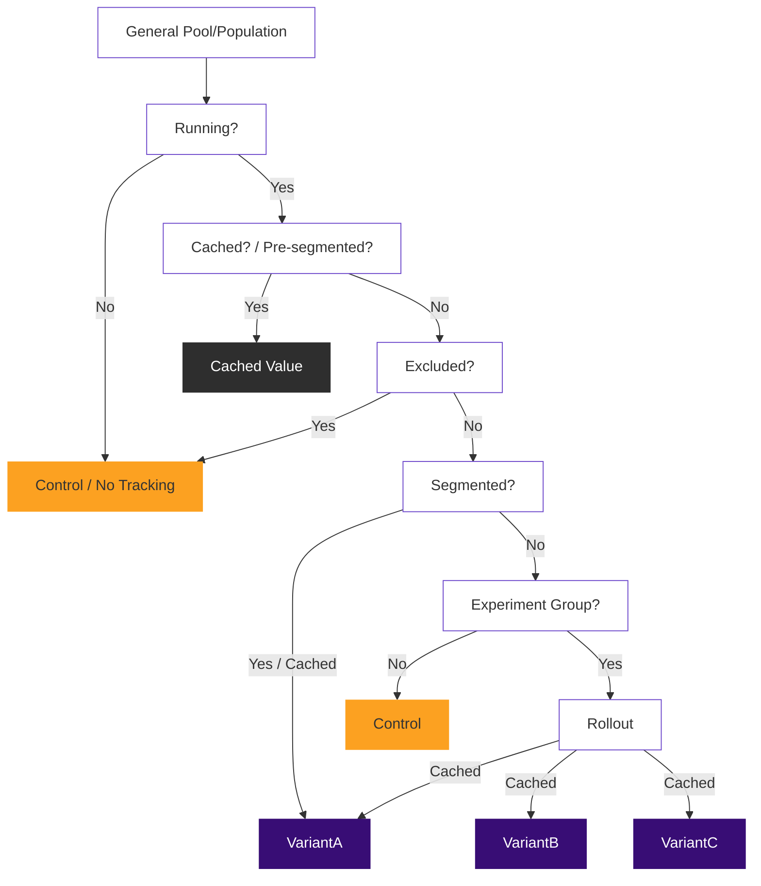

# Implementing an A/B/n experiment using GLEX

## Introduction

`Gitlab::Experiment` (GLEX) is tightly coupled with the concepts provided by
[Feature flags in development of GitLab](../feature_flags/index.md). Here, we refer
to this layer as feature flags, and may also use the term Flipper, because we
built our development and experiment feature flags atop it.

You're strongly encouraged to read and understand the
[Feature flags in development of GitLab](../feature_flags/index.md) portion of the
documentation before considering running experiments. Experiments add additional
concepts which may seem confusing or advanced without understanding the underpinnings
of how GitLab uses feature flags in development. One concept: GLEX supports
experiments with multiple variants, which are sometimes referred to as A/B/n tests.

The [`gitlab-experiment` project](https://gitlab.com/gitlab-org/gitlab-experiment)
exists in a separate repository, so it can be shared across any GitLab property that uses
Ruby. You should feel comfortable reading the documentation on that project as well
if you want to dig into more advanced topics.

## Glossary of terms

To ensure a shared language, you should understand these fundamental terms we use
when communicating about experiments:

- `experiment`: Any deviation of code paths we want to run at some times, but not others.
- `context`: A consistent experience we provide in an experiment.
- `control`: The default, or "original" code path.
- `candidate`: Defines an experiment with only one code path.
- `variant(s)`: Defines an experiment with multiple code paths.

### How it works

Use this decision tree diagram to understand how GLEX works. When an experiment runs,
the following logic is executed to determine what variant should be provided,
given how the experiment has been defined and using the provided context:



## Implement an experiment

Start by generating a feature flag using the `bin/feature-flag` command as you
normally would for a development feature flag, making sure to use `experiment` for
the type. For the sake of documentation let's name our feature flag (and experiment)
"pill_color".

```shell
bin/feature-flag pill_color -t experiment
```

After you generate the desired feature flag, you can immediately implement an
experiment in code. An experiment implementation can be as simple as:

```ruby
experiment(:pill_color, actor: current_user) do |e|
  e.use { 'control' }
  e.try(:red) { 'red' }
  e.try(:blue) { 'blue' }
end
```

When this code executes, the experiment is run, a variant is assigned, and (if within a
controller or view) a `window.gon.experiment.pill_color` object will be available in the
client layer, with details like:

- The assigned variant.
- The context key for client tracking events.

In addition, when an experiment runs, an event is tracked for
the experiment `:assignment`. We cover more about events, tracking, and
the client layer later.

In local development, you can make the experiment active by using the feature flag
interface. You can also target specific cases by providing the relevant experiment
to the call to enable the feature flag:

```ruby
# Enable for everyone
Feature.enable(:pill_color)

# Get the `experiment` method -- already available in controllers, views, and mailers.
include Gitlab::Experiment::Dsl
# Enable for only the first user
Feature.enable(:pill_color, experiment(:pill_color, actor: User.first))
```

To roll out your experiment feature flag on an environment, run
the following command using ChatOps (which is covered in more depth in the
[Feature flags in development of GitLab](../feature_flags/index.md) documentation).
This command creates a scenario where half of everyone who encounters
the experiment would be assigned the _control_, 25% would be assigned the _red_
variant, and 25% would be assigned the _blue_ variant:

```slack
/chatops run feature set pill_color 50 --actors
```

For an even distribution in this example, change the command to set it to 66% instead
of 50.

NOTE:
To immediately stop running an experiment, use the
`/chatops run feature set pill_color false` command.

WARNING:
We strongly recommend using the `--actors` flag when using the ChatOps commands,
as anything else may give odd behaviors due to how the caching of variant assignment is
handled.

We can also implement this experiment in a HAML file with HTML wrappings:

```haml
#cta-interface
  - experiment(:pill_color, actor: current_user) do |e|
    - e.use do
      .pill-button control
    - e.try(:red) do
      .pill-button.red red
    - e.try(:blue) do
      .pill-button.blue blue
```

### The importance of context

In our previous example experiment, our context (this is an important term) is a hash
that's set to `{ actor: current_user }`. Context must be unique based on how you
want to run your experiment, and should be understood at a lower level.

It's expected, and recommended, that you use some of these
contexts to simplify reporting:

- `{ actor: current_user }`: Assigns a variant and is "sticky" to each user
  (or "client" if `current_user` is nil) who enters the experiment.
- `{ project: project }`: Assigns a variant and is "sticky" to the project currently
  being viewed. If running your experiment is more useful when viewing a project,
  rather than when a specific user is viewing any project, consider this approach.
- `{ group: group }`: Similar to the project example, but applies to a wider
  scope of projects and users.
- `{ actor: current_user, project: project }`: Assigns a variant and is "sticky"
  to the user who is viewing the given project. This creates a different variant
  assignment possibility for every project that `current_user` views. Understand this
  can create a large cache size if an experiment like this in a highly trafficked part
  of the application.
- `{ wday: Time.current.wday }`: Assigns a variant based on the current day of the
  week. In this example, it would consistently assign one variant on Friday, and a
  potentially different variant on Saturday.

Context is critical to how you define and report on your experiment. It's usually
the most important aspect of how you choose to implement your experiment, so consider
it carefully, and discuss it with the wider team if needed. Also, take into account
that the context you choose affects our cache size.

After the above examples, we can state the general case: *given a specific
and consistent context, we can provide a consistent experience and track events for
that experience.* To dive a bit deeper into the implementation details: a context key
is generated from the context that's provided. Use this context key to:

- Determine the assigned variant.
- Identify events tracked against that context key.

We can think about this as the experience that we've rendered, which is both dictated
and tracked by the context key. The context key is used to track the interaction and
results of the experience we've rendered to that context key. These concepts are
somewhat abstract and hard to understand initially, but this approach enables us to
communicate about experiments as something that's wider than just user behavior.

NOTE:
Using `actor:` utilizes cookies if the `current_user` is nil. If you don't need
cookies though - meaning that the exposed functionality would only be visible to
signed in users - `{ user: current_user }` would be just as effective.

WARNING:
The caching of variant assignment is done by using this context, and so consider
your impact on the cache size when defining your experiment. If you use
`{ time: Time.current }` you would be inflating the cache size every time the
experiment is run. Not only that, your experiment would not be "sticky" and events
wouldn't be resolvable.

### Advanced experimentation

GLEX allows for two general implementation styles:

1. The simple experiment style described previously.
1. A more advanced style where an experiment class can be provided.

The advanced style is handled by naming convention, and works similar to what you
would expect in Rails.

To generate a custom experiment class that can override the defaults in
`ApplicationExperiment` (our base GLEX implementation), use the rails generator:

```shell
rails generate gitlab:experiment pill_color control red blue
```

This generates an experiment class in `app/experiments/pill_color_experiment.rb`
with the variants (or _behaviors_) we've provided to the generator. Here's an example
of how that class would look after migrating the previous example into it:

```ruby
class PillColorExperiment < ApplicationExperiment
  def control_behavior
    'control'
  end

  def red_behavior
    'red'
  end

  def blue_behavior
    'blue'
  end
end
```

We can now simplify where we run our experiment to the following call, instead of
providing the block we were initially providing, by explicitly calling `run`:

```ruby
experiment(:pill_color, actor: current_user).run
```

The _behavior_ methods we defined in our experiment class represent the default
implementation. You can still use the block syntax to override these _behavior_
methods however, so the following would also be valid:

```ruby
experiment(:pill_color, actor: current_user) do |e|
  e.use { '<strong>control</strong>' }
end
```

NOTE:
When passing a block to the `experiment` method, it is implicitly invoked as
if `run` has been called.

#### Segmentation rules

You can use runtime segmentation rules to, for instance, segment contexts into a specific
variant. The `segment` method is a callback (like `before_action`) and so allows providing
a block or method name.

In this example, any user named `'Richard'` would always be assigned the _red_
variant, and any account older than 2 weeks old would be assigned the _blue_ variant:

```ruby
class PillColorExperiment < ApplicationExperiment
  segment(variant: :red) { context.actor.first_name == 'Richard' }
  segment :old_account?, variant: :blue

  # ...behaviors

  private

  def old_account?
    context.actor.created_at < 2.weeks.ago
  end
end
```

When an experiment runs, the segmentation rules are executed in the order they're
defined. The first segmentation rule to produce a truthy result assigns the variant.

In our example, any user named `'Richard'`, regardless of account age, will always
be assigned the _red_ variant. If you want the opposite logic, flip the order.

NOTE:
Keep in mind when defining segmentation rules: after a truthy result, the remaining
segmentation rules are skipped to achieve optimal performance.

#### Exclusion rules

Exclusion rules are similar to segmentation rules, but are intended to determine
if a context should even be considered as something we should include in the experiment
and track events toward. Exclusion means we don't care about the events in relation
to the given context.

These examples exclude all users named `'Richard'`, *and* any account
older than 2 weeks old. Not only are they given the control behavior - which could
be nothing - but no events are tracked in these cases as well.

```ruby
class PillColorExperiment < ApplicationExperiment
  exclude :old_account?, ->{ context.actor.first_name == 'Richard' }

  # ...behaviors

  private

  def old_account?
    context.actor.created_at < 2.weeks.ago
  end
end
```

We can also do exclusion when we run the experiment. For instance,
if we wanted to prevent the inclusion of non-administrators in an experiment, consider
the following experiment. This type of logic enables us to do complex experiments
while preventing us from passing things into our experiments, because
we want to minimize passing things into our experiments:

```ruby
experiment(:pill_color, actor: current_user) do |e|
  e.exclude! unless can?(current_user, :admin_project, project)
end
```

You may also need to check exclusion in custom tracking logic by calling `should_track?`:

```ruby
class PillColorExperiment < ApplicationExperiment
  # ...behaviors

  def expensive_tracking_logic
    return unless should_track?

    track(:my_event, value: expensive_method_call)
  end
end
```

Exclusion rules aren't the best way to determine if an experiment is active. Override
the `enabled?` method for a high-level way of determining if an experiment should
run and track. Make the `enabled?` check as efficient as possible because it's the
first early opt-out path an experiment can implement.

### Tracking events

One of the most important aspects of experiments is gathering data and reporting on
it. GLEX provides an interface that allows tracking events across an experiment.
You can implement it consistently if you provide the same context between
calls to your experiment. If you do not yet understand context, you should read
about contexts now.

We can assume we run the experiment in one or a few places, but
track events potentially in many places. The tracking call remains the same, with
the arguments you would normally use when
[tracking events using snowplow](../snowplow/index.md). The easiest example
of tracking an event in Ruby would be:

```ruby
experiment(:pill_color, actor: current_user).track(:created)
```

When you run an experiment with any of these examples, an `:assigned` event
is tracked automatically by default. All events that are tracked from an
experiment have a special
[experiment context](https://gitlab.com/gitlab-org/iglu/-/blob/master/public/schemas/com.gitlab/gitlab_experiment/jsonschema/1-0-0)
added to the event. This can be used - typically by the data team - to create a connection
between the events on a given experiment.

If our current user hasn't encountered the experiment yet (meaning where the experiment
is run), and we track an event for them, they are assigned a variant and see
that variant if they ever encountered the experiment later, when an `:assignment`
event would be tracked at that time for them.

NOTE:
GitLab tries to be sensitive and respectful of our customers regarding tracking,
so GLEX allows us to implement an experiment without ever tracking identifying
IDs. It's not always possible, though, based on experiment reporting requirements.
You may be asked from time to time to track a specific record ID in experiments.
The approach is largely up to the PM and engineer creating the implementation.
No recommendations are provided here at this time.

### Record experiment subjects

Snowplow tracking of identifiable users or groups is prohibited, but you can still
determine if an experiment is successful or not. We're allowed to record the ID of
a namespace, project or user in our database. Therefore, we can tell the experiment
to record their ID together with the assigned experiment variant in the
`experiment_subjects` database table for later analysis.

For the recording to work, the experiment's context must include a `namespace`,
`group`, `project`, `user`, or `actor`.

To record the experiment subject when you first assign a variant, call `record!` in
the experiment's block:

```ruby
experiment(:pill_color, actor: current_user) do |e|
  e.record!
end
```

## Test with RSpec

This gem provides some RSpec helpers and custom matchers. These are in flux as of GitLab 13.10.

First, require the RSpec support file to mix in some of the basics:

```ruby
require 'gitlab/experiment/rspec'
```

You still need to include matchers and other aspects, which happens
automatically for files in `spec/experiments`, but for other files and specs
you want to include it in, you can specify the `:experiment` type:

```ruby
it "tests", :experiment do
end
```

### Stub helpers

You can stub experiments using `stub_experiments`. Pass it a hash using experiment
names as the keys, and the variants you want each to resolve to, as the values:

```ruby
# Ensures the experiments named `:example` & `:example2` are both
# "enabled" and that each will resolve to the given variant
# (`:my_variant` & `:control` respectively).
stub_experiments(example: :my_variant, example2: :control)

experiment(:example) do |e|
  e.enabled? # => true
  e.variant.name # => 'my_variant'
end

experiment(:example2) do |e|
  e.enabled? # => true
  e.variant.name # => 'control'
end
```

### Exclusion and segmentation matchers

You can also test the exclusion and segmentation matchers.

```ruby
class ExampleExperiment < ApplicationExperiment
  exclude { context.actor.first_name == 'Richard' }
  segment(variant: :candidate) { context.actor.username == 'jejacks0n' }
end

excluded = double(username: 'rdiggitty', first_name: 'Richard')
segmented = double(username: 'jejacks0n', first_name: 'Jeremy')

# exclude matcher
expect(experiment(:example)).to exclude(actor: excluded)
expect(experiment(:example)).not_to exclude(actor: segmented)

# segment matcher
expect(experiment(:example)).to segment(actor: segmented).into(:candidate)
expect(experiment(:example)).not_to segment(actor: excluded)
```

### Tracking matcher

Tracking events is a major aspect of experimentation. We try
to provide a flexible way to ensure your tracking calls are covered.

You can do this on the instance level or at an "any instance" level:

```ruby
subject = experiment(:example)

expect(subject).to track(:my_event)

subject.track(:my_event)
```

You can use the `on_any_instance` chain method to specify that it could happen on
any instance of the experiment. This helps you if you're calling
`experiment(:example).track` downstream:

```ruby
expect(experiment(:example)).to track(:my_event).on_any_instance

experiment(:example).track(:my_event)
```

A full example of the methods you can chain onto the `track` matcher:

```ruby
expect(experiment(:example)).to track(:my_event, value: 1, property: '_property_')
  .on_any_instance
  .with_context(foo: :bar)
  .for(:variant_name)

experiment(:example, :variant_name, foo: :bar).track(:my_event, value: 1, property: '_property_')
```

### Recording and assignment tracking

To test assignment tracking and the `record!` method, you can use or adopt the following
shared example: [tracks assignment and records the subject](https://gitlab.com/gitlab-org/gitlab/blob/master/spec/support/shared_examples/lib/gitlab/experimentation_shared_examples.rb).

## Experiments in the client layer

This is in flux as of GitLab 13.10, and can't be documented just yet.

Any experiment that's been run in the request lifecycle surfaces in `window.gon.experiment`,
and matches [this schema](https://gitlab.com/gitlab-org/iglu/-/blob/master/public/schemas/com.gitlab/gitlab_experiment/jsonschema/1-0-0)
so you can use it when resolving some concepts around experimentation in the client layer.

### Use experiments in Vue

With the `gitlab-experiment` component, you can define slots that match the name of the
variants pushed to `window.gon.experiment`. For example, if we alter the `pill_color`
experiment to just use the default variants of `control` and `candidate` like so:

```ruby
def show
  experiment(:pill_color) do |e|
    e.use { } # control
    e.try { } # candidate
  end.run
end
```

We can make use of the named slots `control` and `candidate` in the Vue component:

```vue
<script>
import GitlabExperiment from '~/experimentation/components/gitlab_experiment.vue';

export default {
  components: { GitlabExperiment }
}
</script>

<template>
  <gitlab-experiment name="pill_color">
    <template #control>
      <button class="bg-default">Click default button</button>
    </template>

    <template #candidate>
      <button class="bg-red">Click red button</button>
    </template>
  </gitlab-experiment>
</template>
```

When you're coding for an experiment with multiple variants, you can use the variant names.
For example, the Vue component for the previously-defined `pill_color` experiment with `red` and `blue` variants would look like this:

```vue
<template>
  <gitlab-experiment name="pill_color">
    <template #control>
      <button class="bg-default">Click default button</button>
    </template>

    <template #red>
      <button class="bg-red">Click red button</button>
    </template>

    <template #blue>
      <button class="bg-blue">Click blue button</button>
    </template>
  </gitlab-experiment>
</template>
```

NOTE:
When there is no experiment data in the `window.gon.experiment` object for the given experiment name, the `control` slot will be used, if it exists.

## Notes on feature flags

NOTE:
We use the terms "enabled" and "disabled" here, even though it's against our
[documentation style guide recommendations](../documentation/styleguide/word_list.md#enable)
because these are the terms that the feature flag documentation uses.

You may already be familiar with the concept of feature flags in GitLab, but using
feature flags in experiments is a bit different. While in general terms, a feature flag
is viewed as being either `on` or `off`, this isn't accurate for experiments.

Generally, `off` means that when we ask if a feature flag is enabled, it will always
return `false`, and `on` means that it will always return `true`. An interim state,
considered `conditional`, also exists. GLEX takes advantage of this trinary state of
feature flags. To understand this `conditional` aspect: consider that either of these
settings puts a feature flag into this state:

- Setting a `percentage_of_actors` of any percent greater than 0%.
- Enabling it for a single user or group.

Conditional means that it returns `true` in some situations, but not all situations.

When a feature flag is disabled (meaning the state is `off`), the experiment is
considered _inactive_. You can visualize this in the [decision tree diagram](#how-it-works)
as reaching the first `Running?` node, and traversing the negative path.

When a feature flag is rolled out to a `percentage_of_actors` or similar (meaning the
state is `conditional`) the experiment is considered to be _running_
where sometimes the control is assigned, and sometimes the candidate is assigned.
We don't refer to this as being enabled, because that's a confusing and overloaded
term here. In the experiment terms, our experiment is _running_, and the feature flag is
`conditional`.

When a feature flag is enabled (meaning the state is `on`), the candidate will always be
assigned.

We should try to be consistent with our terms, and so for experiments, we have an
_inactive_ experiment until we set the feature flag to `conditional`. After which,
our experiment is then considered _running_. If you choose to "enable" your feature flag,
you should consider the experiment to be _resolved_, because everyone is assigned
the candidate unless they've opted out of experimentation.

As of GitLab 13.10, work is being done to improve this process and how we communicate
about it.
