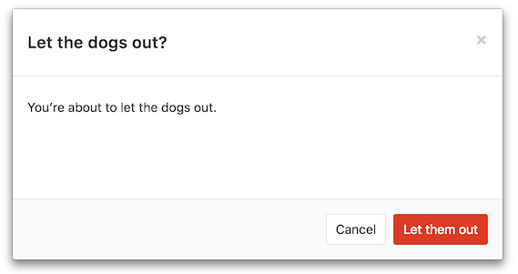

# Components

## Contents
* [Dropdowns](#dropdowns)
* [Modals](#modals)

## Dropdowns

See also the [corresponding UX guide](../ux_guide/components.md#dropdowns).

### How to style a bootstrap dropdown
1. Use the HTML structure provided by the [docs][bootstrap-dropdowns]
1. Add a specific class to the top level `.dropdown` element


    ```Haml
    .dropdown.my-dropdown
      %button{ type: 'button', data: { toggle: 'dropdown' }, 'aria-haspopup': true, 'aria-expanded': false }
        %span.dropdown-toggle-text
          Toggle Dropdown
        = icon('chevron-down')

      %ul.dropdown-menu
        %li
          %a
            item!
    ```

    Or use the helpers
    ```Haml
    .dropdown.my-dropdown
      = dropdown_toggle('Toogle!', { toggle: 'dropdown' })
      = dropdown_content
        %li
          %a
            item!
    ```

[bootstrap-dropdowns]: https://getbootstrap.com/docs/3.3/javascript/#dropdowns

## Modals

See also the [corresponding UX guide](../ux_guide/components.md#modals).

We have a reusable Vue component for modals: [vue_shared/components/gl-modal.vue](https://gitlab.com/gitlab-org/gitlab-ce/blob/master/app/assets/javascripts/vue_shared/components/gl-modal.vue)

Here is an example of how to use it:

```html
  <gl-modal
    id="dogs-out-modal"
    :header-title-text="s__('ModalExample|Let the dogs out?')"
    footer-primary-button-variant="danger"
    :footer-primary-button-text="s__('ModalExample|Let them out')"
    @submit="letOut(theDogs)"
  >
    {{ s__('ModalExample|You’re about to let the dogs out.') }}
  </gl-modal>
```


