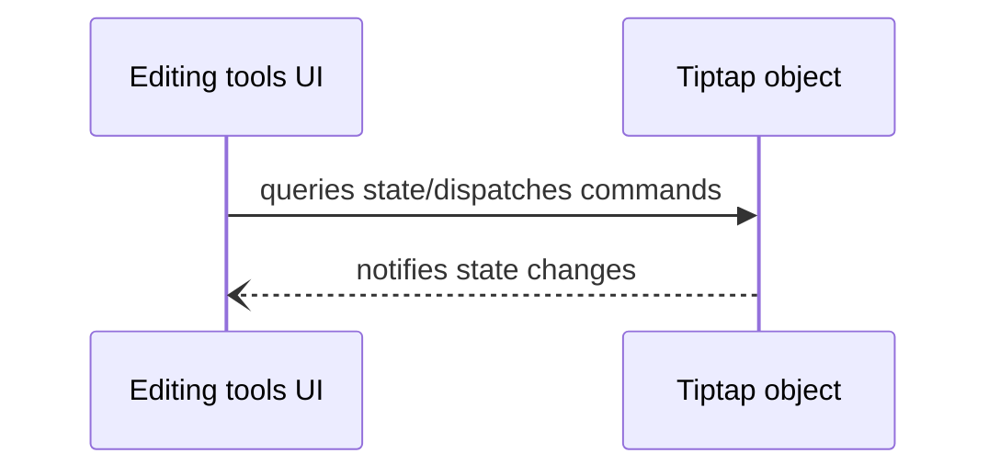
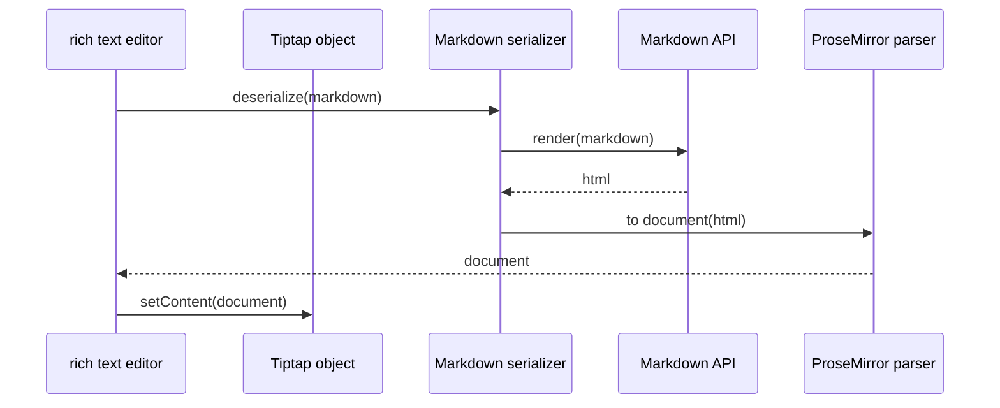
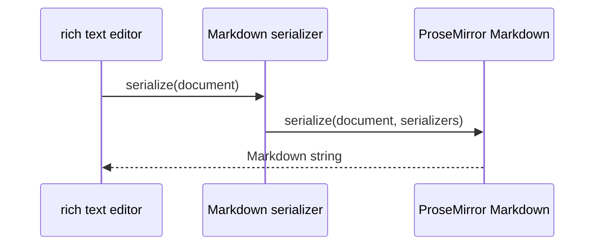

The rich text editor is a UI component that provides a WYSIWYG editing
experience for [GitLab Flavored Markdown](../../user/markdown.md) in the GitLab application.
It also serves as the foundation for implementing Markdown-focused editors
that target other engines, like static site generators.

We use [Tiptap 2.0](https://tiptap.dev/) and [ProseMirror](https://prosemirror.net/)
to build the rich text editor. These frameworks provide a level of abstraction on top of
the native
[`contenteditable`](https://developer.mozilla.org/en-US/docs/Web/HTML/Global_attributes/contenteditable) web technology.

## Usage guide

Follow these instructions to include the rich text editor in a feature.

1. [Include the rich text editor component](#include-the-rich-text-editor-component).
1. [Set and get Markdown](#set-and-get-markdown).
1. [Listen for changes](#listen-for-changes).

### Include the rich text editor component

Import the `ContentEditor` Vue component. We recommend using asynchronous named imports to
take advantage of caching, as the ContentEditor is a big dependency.

```html
<script>
export default {
  components: {
    ContentEditor: () =>
      import(
        /* webpackChunkName: 'content_editor' */ '~/content_editor/components/content_editor.vue'
      ),
  },
  // rest of the component definition
}
</script>
```

The rich text editor requires two properties:

- `renderMarkdown` is an asynchronous function that returns the response (String) of invoking the
  [Markdown API](../../api/markdown.md).
- `uploadsPath` is a URL that points to a [GitLab upload service](../uploads/_index.md)
  with `multipart/form-data` support.

See the [`WikiForm.vue`](https://gitlab.com/gitlab-org/gitlab/-/blob/master/app/assets/javascripts/pages/shared/wikis/components/wiki_form.vue#L207)
component for a production example of these two properties.

### Set and get Markdown

The `ContentEditor` Vue component doesn't implement Vue data binding flow (`v-model`)
because setting and getting Markdown are expensive operations. Data binding would
trigger these operations every time the user interacts with the component.

Instead, you should obtain an instance of the `ContentEditor` class by listening to the
`initialized` event:

```html
<script>
import { createAlert } from '~/alert';
import { __ } from '~/locale';

export default {
  methods: {
    async loadInitialContent(contentEditor) {
      this.contentEditor = contentEditor;

      try {
        await this.contentEditor.setSerializedContent(this.content);
      } catch (e) {
        createAlert({ message: __('Could not load initial document') });
      }
    },
    submitChanges() {
      const markdown = this.contentEditor.getSerializedContent();
    },
  },
};
</script>
<template>
  <content-editor
    :render-markdown="renderMarkdown"
    :uploads-path="pageInfo.uploadsPath"
    @initialized="loadInitialContent"
  />
</template>
```

### Listen for changes

You can still react to changes in the rich text editor. Reacting to changes helps
you know if the document is empty or dirty. Use the `@change` event handler for
this purpose.

```html
<script>
export default {
  data() {
    return {
      empty: false,
    };
  },
  methods: {
    handleContentEditorChange({ empty }) {
      this.empty = empty;
    }
  },
};
</script>
<template>
  <div>
    <content-editor
      :render-markdown="renderMarkdown"
      :uploads-path="pageInfo.uploadsPath"
      @initialized="loadInitialContent"
      @change="handleContentEditorChange"
    />
    <gl-button :disabled="empty" @click="submitChanges">
      {{ __('Submit changes') }}
    </gl-button>
  </div>
</template>
```

## Implementation guide

The rich text editor is composed of three main layers:

- **The editing tools UI**, like the toolbar and the table structure editor. They
  display the editor's state and mutate it by dispatching commands.
- **The Tiptap Editor object** manages the editor's state,
  and exposes business logic as commands executed by the editing tools UI.
- **The Markdown serializer** transforms a Markdown source string into a ProseMirror
  document and vice versa.

### Editing tools UI

The editing tools UI are Vue components that display the editor's state and
dispatch [commands](https://tiptap.dev/docs/editor/api/commands) to mutate it.
They are located in the `~/content_editor/components` directory. For example,
the **Bold** toolbar button displays the editor's state by becoming active when
the user selects bold text. This button also dispatches the `toggleBold` command
to format text as bold:



#### Node views

We implement [node views](https://tiptap.dev/docs/editor/guide/node-views/vue)
to provide inline editing tools for some content types, like tables and images. Node views
allow separating the presentation of a content type from its
[model](https://prosemirror.net/docs/guide/#doc.data_structures). Using a Vue component in
the presentation layer enables sophisticated editing experiences in the rich text editor.
Node views are located in `~/content_editor/components/wrappers`.

#### Dispatch commands

You can inject the Tiptap Editor object to Vue components to dispatch
commands.

NOTE:
Do not implement logic that changes the editor's
state in Vue components. Encapsulate this logic in commands, and dispatch
the command from the component's methods.

```html
<script>
export default {
  inject: ['tiptapEditor'],
  methods: {
    execute() {
      //Incorrect
      const { state, view } = this.tiptapEditor.state;
      const { tr, schema } = state;
      tr.addMark(state.selection.from, state.selection.to, null, null, schema.mark('bold'));

      // Correct
      this.tiptapEditor.chain().toggleBold().focus().run();
    },
  }
};
</script>
<template>
```

#### Query editor's state

Use the `EditorStateObserver` renderless component to react to changes in the
editor's state, such as when the document or the selection changes. You can listen to
the following events:

- `docUpdate`
- `selectionUpdate`
- `transaction`
- `focus`
- `blur`
- `error`.

Learn more about these events in [the Tiptap event guide](https://tiptap.dev/docs/editor/api/events).

```html
<script>
// Parts of the code has been hidden for efficiency
import EditorStateObserver from './editor_state_observer.vue';

export default {
  components: {
    EditorStateObserver,
  },
  data() {
    return {
      error: null,
    };
  },
  methods: {
    displayError({ message }) {
      this.error = message;
    },
    dismissError() {
      this.error = null;
    },
  },
};
</script>
<template>
  <editor-state-observer @error="displayError">
    <gl-alert v-if="error" class="gl-mb-6" variant="danger" @dismiss="dismissError">
      {{ error }}
    </gl-alert>
  </editor-state-observer>
</template>
```

### The Tiptap editor object

The Tiptap [Editor](https://tiptap.dev/docs/editor/api/editor) class manages
the editor's state and encapsulates all the business logic that powers
the rich text editor. The rich text editor constructs a new instance of this class and
provides all the necessary extensions to support
[GitLab Flavored Markdown](../../user/markdown.md).

#### Implement new extensions

Extensions are the building blocks of the rich text editor. You can learn how to implement
new ones by reading [the Tiptap guide](https://tiptap.dev/docs/editor/guide/custom-extensions).
We recommend checking the list of built-in [nodes](https://tiptap.dev/docs/editor/api/nodes) and
[marks](https://tiptap.dev/docs/editor/api/marks) before implementing a new extension
from scratch.

Store the rich text editor extensions in the `~/content_editor/extensions` directory.
When using a Tiptap built-in extension, wrap it in a ES6 module inside this directory:

```javascript
export { Bold as default } from '@tiptap/extension-bold';
```

Use the `extend` method to customize the Extension's behavior:

```javascript
import { HardBreak } from '@tiptap/extension-hard-break';

export default HardBreak.extend({
  addKeyboardShortcuts() {
    return {
      'Shift-Enter': () => this.editor.commands.setHardBreak(),
    };
  },
});
```

#### Register extensions

Register the new extension in `~/content_editor/services/create_content_editor.js`. Import
the extension module and add it to the `builtInContentEditorExtensions` array:

```javascript
import Emoji from '../extensions/emoji';

const builtInContentEditorExtensions = [
  Code,
  CodeBlockHighlight,
  Document,
  Dropcursor,
  Emoji,
  // Other extensions
]
```

### The Markdown serializer

The Markdown Serializer transforms a Markdown String to a
[ProseMirror document](https://prosemirror.net/docs/guide/#doc) and vice versa.

#### Deserialization

Deserialization is the process of converting Markdown to a ProseMirror document.
We take advantage of ProseMirror's
[HTML parsing and serialization capabilities](https://prosemirror.net/docs/guide/#schema.serialization_and_parsing)
by first rendering the Markdown as HTML using the [Markdown API endpoint](../../api/markdown.md):



Deserializers live in the extension modules. Read Tiptap documentation about
[`parseHTML`](https://tiptap.dev/docs/editor/guide/custom-extensions#parse-html) and
[`addAttributes`](https://tiptap.dev/docs/editor/guide/custom-extensions#attributes) to
learn how to implement them. The Tiptap API is a wrapper around ProseMirror's
[schema spec API](https://prosemirror.net/docs/ref/#model.SchemaSpec).

#### Serialization

Serialization is the process of converting a ProseMirror document to Markdown. The Content
Editor uses [`prosemirror-markdown`](https://github.com/ProseMirror/prosemirror-markdown)
to serialize documents. We recommend reading the
[MarkdownSerializer](https://github.com/ProseMirror/prosemirror-markdown#class-markdownserializer)
and [MarkdownSerializerState](https://github.com/ProseMirror/prosemirror-markdown#class-markdownserializerstate)
classes documentation before implementing a serializer:



`prosemirror-markdown` requires implementing a serializer function for each content type supported
by the rich text editor. We implement serializers in `~/content_editor/services/markdown_serializer.js`.
