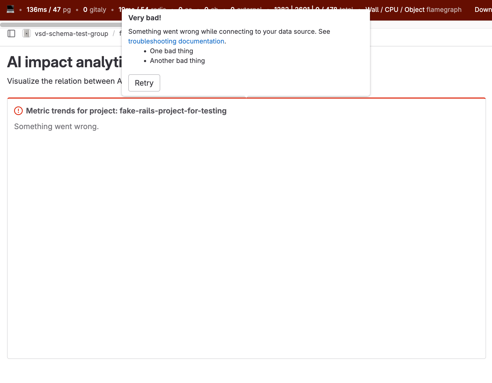
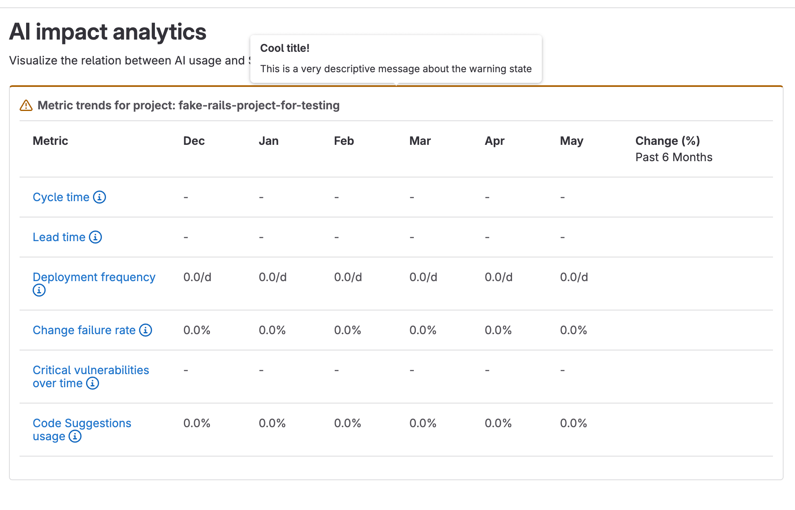
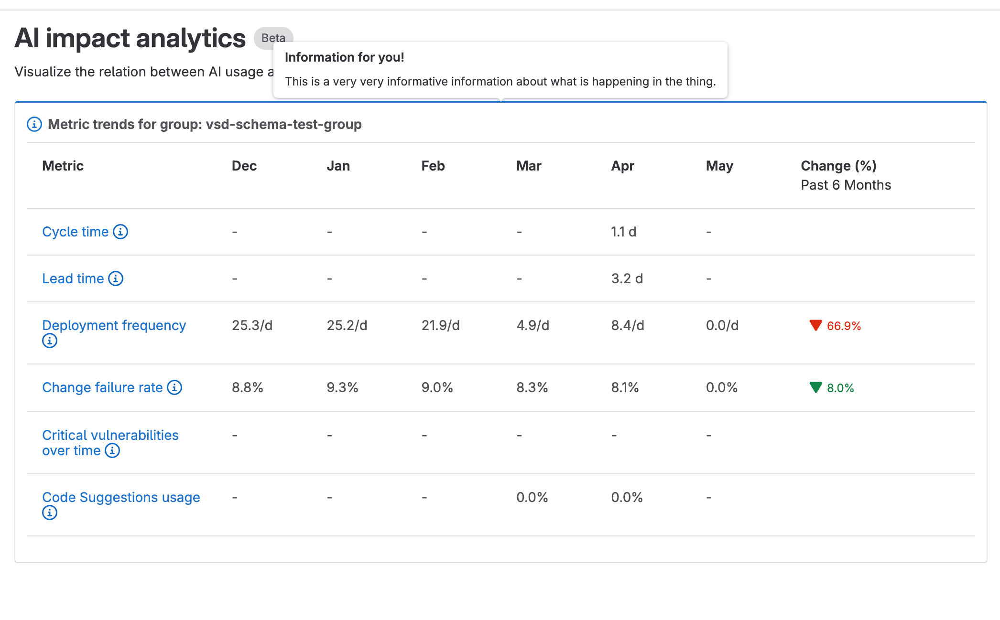

# Customizable dashboards

> - [Introduced](https://gitlab.com/gitlab-org/gitlab/-/merge_requests/98610) in GitLab 15.5 as an [experiment](../../policy/experiment-beta-support.md#experiment).

Customizable dashboards provide a configuation-based [dashboard](https://design.gitlab.com/patterns/dashboards)
structure, which is used to render and modify dashboard configurations created by GitLab or users.

The dashboard structure does not provide the means to save and version control
user configuration files on a repository. This functionality is provided by [Analytics dashboards](../../user/analytics/analytics_dashboards.md)
which uses the customizable dashboard component.

NOTE:
Customizable dashboards is intended for Premium and Ultimate subscriptions.

## Overview

Customizable dashboard can be broken down into 3 logical components:

- Dashboard
- Panels
- Visualizations

A dashboard consists of a list of panels to render, each panel references one
visualization, and a single visualization can be shared by many panels.

A typical dashboard structure looks like this:

```plaintext
dashboard
├── panelA
│  └── visualizationX
├── panelB
│  └── visualizationY
├── panelC
│  └── visualizationY
```

## Usage

To use customizable dashboards:

1. Create a new Vue component for your dashboard.
1. Create a [visualization configuration](#visualization-configuration).
1. Create your [dashboard configuration](#dashboard-configuration).
1. Render an instance of `CustomizableDashboard` and pass it your [dashboard configuration](#using-the-component).

### Visualization configuration

Each visualization is a graphical representation of query results fetched from a data source.

```javascript
// visualizations.js

export const pageViewsOverTime = {
  // The name of the Vue component used to render the query.
  type: 'LineChart',
  // Chart options defined by the charting library being used by the panel.
  options: {
    xAxis: { name: __('Time'), type: 'time' },
    yAxis: { name: __('Counts'), type: 'value' },
  },
  // The data to query
  data: {
    // The data source to query. Here it is Product Analytics.
    type: 'cube_analytics',
    // The query to run on the data source. Here in Cube.js format.
    query: {
      dimensions: [],
      filters: [
        {
          member: 'TrackedEvents.eventName',
          operator: 'equals',
          values: ['page_view']
        }
      ],
      measures: ['TrackedEvents.pageViewsCount'],
      timeDimensions: [
        {
          dimension: 'TrackedEvents.derivedTstamp',
          granularity: 'day',
        },
      ],
      limit: 100,
      timezone: 'UTC',
    },
  },
};
```

#### Adding a new visualization render type

To add a new visualization render type:

1. Create a new Vue component that accepts `data` and `options` properties.
   See [`line_chart.vue`](https://gitlab.com/gitlab-org/gitlab/-/blob/master/ee/app/assets/javascripts/analytics/analytics_dashboards/components/visualizations/line_chart.vue) as an example.
1. Add your component to the list of conditional imports in [`panel_base.vue`](https://gitlab.com/gitlab-org/gitlab/-/blob/master/ee/app/assets/javascripts/vue_shared/components/customizable_dashboard/panels_base.vue#L13).
1. Add your component to the schema's list of `AnalyticsVisualization` types in [`analytics_visualizations.json`](https://gitlab.com/gitlab-org/gitlab/-/blob/master/ee/app/validators/json_schemas/analytics_visualization.json).

##### Migrating existing components to visualizations

You can migrate existing components to dashboard visualizations. To do this,
wrap your existing component in a new visualization that provides the component with the
required context and data. See [`dora_performers_score.vue`](https://gitlab.com/gitlab-org/gitlab/-/blob/master/ee/app/assets/javascripts/analytics/analytics_dashboards/components/visualizations/dora_performers_score.vue) as an example.

As an upgrade path, your component may fetch its own data internally.
This method is fine for the first few iterations, but eventually you should migrate
your visualization to use the standard and shared analytics data sources method.
See [`value_stream.js`](https://gitlab.com/gitlab-org/gitlab/-/blob/master/ee/app/assets/javascripts/analytics/analytics_dashboards/data_sources/value_stream.js) as an example.

#### Adding a new visualization data source

To add a new data source:

1. Create a new JavaScript module that exports a `fetch` method. See [`cube_analytics.js`](https://gitlab.com/gitlab-org/gitlab/-/blob/master/ee/app/assets/javascripts/analytics/analytics_dashboards/data_sources/cube_analytics.js#L122) as an example.
1. Add your module to the list exports in [`data_sources/index.js`](https://gitlab.com/gitlab-org/gitlab/-/blob/master/ee/app/assets/javascripts/analytics/analytics_dashboards/data_sources/index.js).
1. Add your data source to the schema's list of `Data` types in [`analytics_visualizations.json`](https://gitlab.com/gitlab-org/gitlab/-/blob/master/ee/app/validators/json_schemas/analytics_visualization.json).

NOTE:
Your data source must respect the filters so that all panels show data for
the same date range.

#### Feedback and error handling

Visualizations can provide panel-specific feedback in the form of an alert. This allows you to highlight the panel and add a popover to
display additional information when the user hovers over the panel. You can view online examples in the [GitLab storybook](https://gitlab-org.gitlab.io/gitlab/storybook/?path=/story/ee-vue-shared-components-panels-base--default).

The supported alert variants based on our [Pajamas guidelines](https://design.gitlab.com/components/alert#variants) are:

- `danger`: For unrecoverable errors encountered when loading the data or the panel.
- `warning`: For errors or additional information that impact the data displayed in the panel.
- `info`: For additional information or tips about the panel.

Visualization panels provide props for rendering alerts:

- `showAlertState`: A boolean used to show or hide an alert.
- `alertVariant`: The type of alert, which defaults to the `danger` variant.
- `alertPopoverTitle`: The title text for the alert.

The `alert-popover` slot can be used to customize the body content of the alert:

```vue
<!-- Displays a danger popover state with a list of failures -->
<panels-base
 :title="Test panel with error"
 :show-alert-state="true"
 :alert-variant="VARIANT_DANGER"
 :alert-popover-title="Very bad!"
>
  <template #alert-popover>
    <p>{{ "The following failures occurred:" }}</p>
    <ul>
      <li>{{ "Failed to load api" }}</li>
      <li>{{ "Failed to load ui" }}</li>
    </ul>
  </template>
</panels-base>
```

::Tabs

:::TabTitle `danger` alert

Here's an example of a `danger` alert for a panel.



:::TabTitle `warning` alert

Here's an example of a `warning` alert for a panel.



:::TabTitle `info` alert

Here's an example of an `info` alert for a panel.



::EndTabs

### Dashboard configuration

Here is an example dashboard configuration:

```javascript
// constants.js
import { pageViewsOverTime } from './visualizations';

export const dashboard = {
  slug: 'my_dashboard', // Used to set the URL path for the dashboard.
  title: 'My dashboard title', // The title to display.
  description: 'This is a description of the dashboard', // A description of the dashboard
  userDefined: true, // The dashboard editor is only available when true.
  // Each dashboard consists of an array of panels to display.
  panels: [
    {
      id: 1,
      title: 'Page views over time', // The panel title to display.
      // The visualization configuration. This can be shared by many panels.
      visualization: pageViewsOverTime,
      // Gridstack settings based upon https://github.com/gridstack/gridstack.js/tree/master/doc#item-options.
      // All values are grid row/column numbers up to 12.
      // We use the default 12 column grid https://github.com/gridstack/gridstack.js#change-grid-columns.
      gridAttributes: {
        yPos: 1,
        xPos: 0,
        width: 6,
        height: 5,
      },
      // Optional overrides for the values in `visualization.data.query`.
      // Here we override the Cube.js query to get page views per week instead of days.
      queryOverrides: {
        timeDimensions: {
          dimension: 'TrackedEvents.derivedTstamp',
          granularity: 'week',
        },
      },
    },
  ],
};
```

### Using the component

Here is an example component that renders a customizable dashboard:

```vue
<script>
import CustomizableDashboard from 'ee/vue_shared/components/customizable_dashboard/customizable_dashboard.vue';
import PanelsBase from `ee/vue_shared/components/customizable_dashboard/panels_base.vue`;
import { dashboard } from './constants';

export default {
  name: 'MyCustomDashboard',
  components: {
    CustomizableDashboard,
    PanelsBase,
  },
  data() {
    return {
      // We keep the original (default) dashboard object to track changes.
      dashboard: {
        ...dashboard,
        default: { ...dashboard, }
      },
      // Optional dashboard filters. Currently the only availble filter is date range.
      defaultFilters: {
        dateRangeOption: 'last_7_days' // 'custom', 'today', 'last_7_days', 'last_30_days'
        endDate: new Date(2023, 06, 14),
        startDate: new Date(2023, 06, 7),
      },
      // Set to true to sync the filter object with the URL query string.
      syncUrlFilters: true,
      // Set to true to show the date range filter.
      showDateRangeFilter: true,
      // The maximum size of the date range allowed in days. 0 for unlimited.
      dateRangeLimit: 0,
      // Array of GlDisclosureDropdown items to show on each panel when editing
      panelActions: [
        {
          text: __('Delete'),
          action: () => this.$emit('delete'),
          icon: 'remove',
        },
      ],
    };
  },
};
</script>

<template>
  <customizable-dashboard
    :initial-dashboard="dashboard"
    :default-filters="defaultFilters"
    :sync-url-filters="syncUrlFilters"
    :show-date-range-filter="showDateRangeFilter"
    :date-range-limit="dateRangeLimit"
  />
    <template #panel="{ panel, filters, editing, deletePanel }">
      <!-- Panels base provides a styled wrapper for your visualizations. -->
      <panels-base
        :title="panel.title"
        :editing="editing"
        :actions="panelActions"
        @delete="deletePanel"
      >
        <template #body>
          <!-- Render the panel's visualization here -->
        </template>
      </panels-base>
    </template>
  </customizable-dashboard>
</template>
```

## Dashboard designer

> - Introduced in GitLab 16.1 [with a flag](../../administration/feature_flags.md) named `combined_analytics_dashboards_editor`. Disabled by default.
> - [Generally available](https://gitlab.com/gitlab-org/gitlab/-/issues/411407) in GitLab 16.6. Feature flag `combined_analytics_dashboards_editor` removed.

The CustomizableDashboard component provides a graphical interface for users to
modify panels of existing dashboards and create new dashboards.

The dashboard editor is only available when `dashboard.userDefined` is `true`.

```vue
<script>
import CustomizableDashboard from 'ee/vue_shared/components/customizable_dashboard/customizable_dashboard.vue';
import { s__ } from '~/locale';
import { dashboard } from './constants';

export const I18N_MY_NEW_CATEGORY = s__('Namespace|My data source');

export default {
  name: 'MyCustomDashboard',
  data() {
    return {
      ...,
      // The initial saved dashboard. Used to track changes.
      initialDashboard: dashboard,
      // Set to true to render the dashboard saving state.
      isSaving: false,
      // A list of availble visualizations categorized by feature.
      availableVisualizations: {
        // The visualization category title to display.
        [I18N_MY_NEW_CATEGORY]: {
          // Set to true when asynchronously loading the visualization IDs
          loading: false,
          // List of availble visualization IDs for the user to add to the dashboard.
          visualizationIds: [
            'page_views_over_time',
            'events_over_time',
          ],
        },
      }
    };
  },
  methods: {
    /**
     * Event handler for when a user saves changes made to the current dashboard.
     * @param  {String} dashboardId The current dashboard ID.
     * @param  {String} newDashboardObject The newly modified dashboard object.
     */
    saveDashboard(dashboardId, newDashboardObject) {
      this.isSaving = true;
      // Save changes somewhere.
      // Then update the saved dashboard version
      this.initialDashboard = newDashboardObject;
      this.isSaving = false;
    },
  },
}
</script>

<template>
  <customizable-dashboard
    :initial-dashboard="initialDashboard"
    :available-visualizations="availableVisualizations"
    :is-saving="isSaving"
    @save="saveDashboard"
  />
    <template #panel="{ panel, filters, editing, deletePanel }">
      <my-dashboard-panel :panel="panel" />
    </template>
  </customizable-dashboard>
</template>
```

## Introducing visualizations behind a feature flag

While developing new visualizations we can use [feature flags](../feature_flags/index.md#create-a-new-feature-flag) to mitigate risks of disruptions or incorrect data for users.

The [`from_data`](https://gitlab.com/gitlab-org/gitlab/-/blob/master/ee/app/models/product_analytics/panel.rb#L7) method builds the panel objects for a dashboard. Using the `filter_map` method, we can add a condition to skip rendering panels that include the visualization we are developing.

For example, here we have added the `enable_usage_overview_visualization` feature flag and can check it's current state to determine whether panels using the `usage_overview` visualization should be rendered:

```ruby
panel_yaml.filter_map do |panel|
  # Skip processing the usage_overview panel if the feature flag is disabled
  next if panel['visualization'] == 'usage_overview' && Feature.disabled?(:enable_usage_overview_visualization)

  new(
    title: panel['title'],
    project: project,
    grid_attributes: panel['gridAttributes'],
    query_overrides: panel['queryOverrides'],
    visualization: panel['visualization']
  )
end
```
