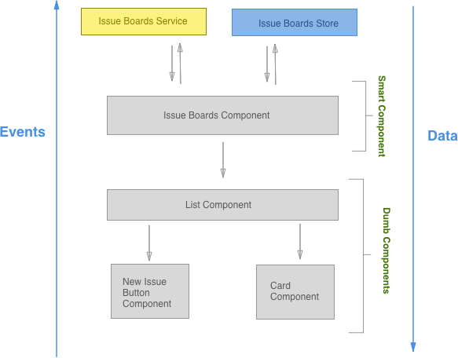

# Frontend Development Process

You can find more about the organization of the frontend team in the [handbook](https://about.gitlab.com/handbook/frontend/).

## Development Checklist

The idea is to remind us about specific topics during the time we build a new feature or start something. This is a common practice in other industries (like pilots) that also use  standardised checklists to reduce problems early on.

Copy the content over to your issue or merge request and if something doesn't apply simply remove it from your current list.

This checklist is intended to help us during development of bigger features/refactorings, it's not a "use it always and every point always matches" list.

Please use your best judgement when to use it and please contribute new points through merge requests if something comes to your mind.

---

### Frontend development

#### Planning development

- [ ] Check the current set weight of the issue, does it fit your estimate?
- [ ] Are all [departments](https://about.gitlab.com/handbook/engineering/#engineering-teams) that are needed from your perspective already involved in the issue? (For example is UX missing?)
- [ ] Is the specification complete? Are you missing decisions? How about error handling/defaults/edge cases? Take your time to understand the needed implementation and go through its flow.
- [ ] Are all necessary UX specifications available that you will need in order to implement? Are there new UX components/patterns in the designs? Then contact the UI component team early on. How should error messages or validation be handled?
- [ ] **Library usage** Use Vuex as soon as you have even a medium state to manage, use Vue router if you need to have different views internally and want to link from the outside. Check what libraries we already have for which occassions.
- [ ] **Plan your implementation:**
    - [ ] **Architecture plan:** Create a plan aligned with GitLab's architecture, how you are going to do the implementation, for example Vue application setup and its components (through [onion skinning](https://gitlab.com/gitlab-org/gitlab-ce/issues/35873#note_39994091)), Store structure and data flow, which existing Vue components can you reuse. Its a good idea to go through your plan with another engineer to refine it.
    - [ ] **Backend:** The best way is to kickoff the implementation in a call and discuss with the assigned Backend engineer what you will need from the backend and also when. Can you reuse existing API's? How is the performance with the planned architecture? Maybe create together a JSON mock object to already start with development.
    - [ ] **Communication:** It also makes sense to have for bigger features an own slack channel (normally called #f_{feature_name}) and even weekly demo calls with all people involved.
    - [ ] **Dependency Plan:** Are there big dependencies in the plan between you and others, then maybe create an execution diagram to show what is blocking which part and the order of the different parts.
    - [ ] **Task list:** Create a simple checklist of the subtasks that are needed for the implementation, also consider creating even sub issues. (for example show a comment, delete a comment, update a comment, etc.). This helps you and also everyone else following the implementation
- [ ] **Keep it small** To make it easier for you and also all reviewers try to keep merge requests small and merge into a feature branch if needed. To accomplish that you need to plan that from the start. Different methods are:
    - [ ] **Skeleton based plan** Start with an MR that has the skeleton of the components with placeholder content. In following MRs you can fill the components with interactivity. This also makes it easier to spread out development on multiple people.
    - [ ] **Cookie Mode** Think about hiding the feature behind a cookie flag if the implementation is on top of existing features
    - [ ] **New route** Are you refactoring something big then you might consider adding a new route where you implement the new feature and when finished delete the current route and rename the new one. (for example 'merge_request' and 'new_merge_request')
- [ ] **Setup** Is there any specific setup needed for your implementation (for example a kubernetes cluster)? Then let everyone know if it is not already mentioned where they can find documentation (if it doesn't exist - create it)
- [ ] **Security** Are there any new security relevant implementations? Then please contact the security team for an app security review. If you are not sure ask our [domain expert](https://about.gitlab.com/handbook/frontend/#frontend-domain-experts)

#### During development

- [ ] Check off tasks on your created task list to keep everyone updated on the progress
- [ ] [Share your work early with reviewers/maintainers](#share-your-work-early)
- [ ] Share your work with UXer and Product Manager with Screenshots and/or [GIF's](https://about.gitlab.com/handbook/product/making-gifs/). They are easy to create for you and keep them up to date.
- [ ] If you are blocked on something let everyone on the issue know through a comment.
- [ ] Are you unable to work on this issue for a longer period of time, also let everyone know.
- [ ] **Documentation** Update/add docs for the new feature, see `docs/`. Ping one of the documentation experts/reviewers

#### Finishing development + Review

- [ ] **Keep it in the scope** Try to focus on the actual scope and avoid a scope creep during review and keep new things to new issues.
- [ ] **Performance** Have you checked performance? For example do the same thing with 500 comments instead of 1. Document the tests and possible findings in the MR so a reviewer can directly see it.
- [ ] Have you tested with a variety of our [supported browsers](../../install/requirements.md#supported-web-browsers)? You can use [browserstack](https://www.browserstack.com/) to be able to access a wide variety of browsers and operating systems.
- [ ] Did you check the mobile view?
- [ ] Check the built webpack bundle (For the report run `WEBPACK_REPORT=true gdk run`, then open `webpack-report/index.html`) if we have unnecessary bloat due to wrong references, including libraries multiple times, etc.. If you need help contact the webpack [domain expert](https://about.gitlab.com/handbook/frontend/#frontend-domain-experts)
- [ ] **Tests** Not only greenfield tests - Test also all bad cases that come to your mind.
- [ ] If you have multiple MR's then also smoke test against the final merge.
- [ ] Are there any big changes on how and especially how frequently we use the API then let production know about it
- [ ] Smoke test of the RC on dev., staging., canary deployments and .com
- [ ] Follow up on issues that came out of the review. Create isssues for discovered edge cases that should be covered in future iterations.

---

### Share your work early
1. Before writing code, ensure your vision of the architecture is aligned with
GitLab's architecture.
1. Add a diagram to the issue and ask a frontend architect in the slack channel `#fe_architectural` about it.

  

1. Don't take more than one week between starting work on a feature and
sharing a Merge Request with a reviewer or a maintainer.

### Vue features
1. Follow the steps in [Vue.js Best Practices](vue.md)
1. Follow the style guide.
1. Only a handful of people are allowed to merge Vue related features.
Reach out to one of Vue experts early in this process.
