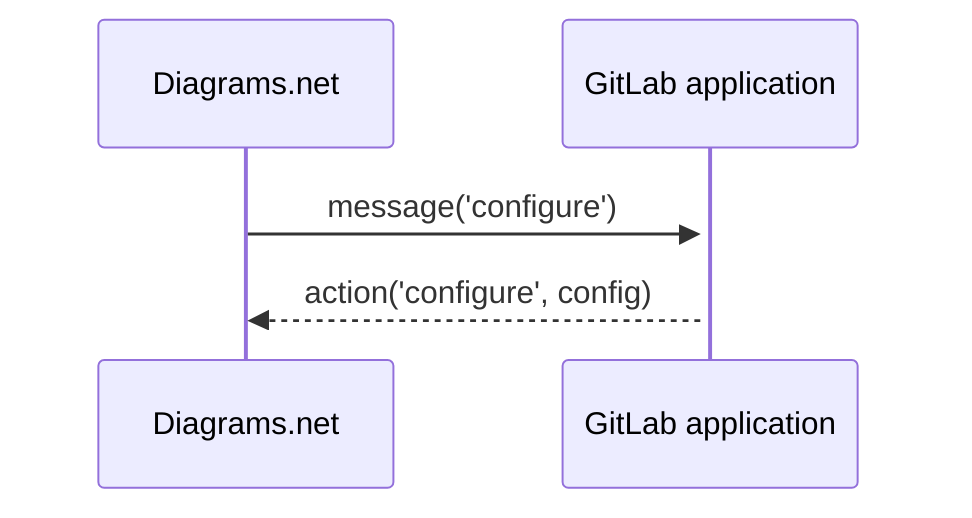
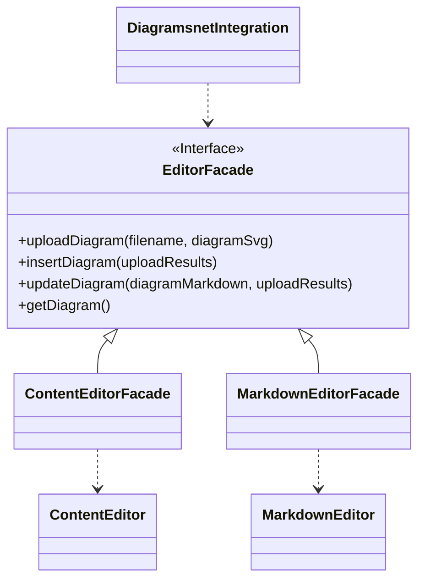

In [wikis](../../user/markdown.md#diagramsnet-editor) you can use the diagrams.net editor to
create diagrams. The diagrams.net editor runs as a separate web service outside the GitLab
application and GitLab instance administrators can
[configure the URL](../../administration/integration/diagrams_net.md) that points to this service.

This page describes the key implementation aspects of this integration on the frontend. The diagrams.net
integration implementation is located in the
[`drawio_editor.js`](https://gitlab.com/gitlab-org/gitlab/-/blob/master/app/assets/javascripts/drawio/drawio_editor.js)
file of the GitLab repository.

## IFrame sandbox

The GitLab application embeds the diagrams.net editor inside an iframe. IFrames creates a
sandboxed environment that disallows the diagrams.net editor from accessing the GitLab
application's browsing context thus protecting user data and enhancing security.

The diagrams.net and the GitLab application communicate using the
[postMessage](https://developer.mozilla.org/en-US/docs/Web/API/Window/postMessage) API.



The GitLab application receives messages from the Diagrams.net editor that
contain a serialized JavaScript object. This object has the following shape:

```typescript
type Message = {
  event: string;
  value?: string;
  data?: string;
}
```

The `event` property tells the GitLab application how it should
react to the message. The diagrams.net editor sends the following events:

- `configure`: When the GitLab application receives this message, it sends back
  a `configure` action to set the color theme of the diagrams.net editor.
- `init`: When the GitLab application receives this message,
  it can upload an existing diagram using the `load` action.
- `exit`: The GitLab application closes and disposes the
  diagrams.net editor.
- `prompt`: This event has a `value` attribute with the
  diagram's filename. If the `value` property is an empty value,
  the GitLab application should send a `prompt`requesting the user to introduce a filename.
- `export`: This event has a `data` attribute that contains
  the diagram created by the user in the SVG format.

## Markdown Editor integration

The user can start the diagrams.net editor from the Markdown
Editor or the [Content Editor](content_editor.md). The diagrams.net editor integration doesn't
know implementation details about these editors. Instead, it exposes a protocol or interface that serves
as a façade to decouple the editor implementation details from the diagrams.net integration.



The diagrams.net integration calls these methods to upload a diagram to the GitLab
application or get a diagrams embedded as an uploaded resource in the Markdown Editor.
