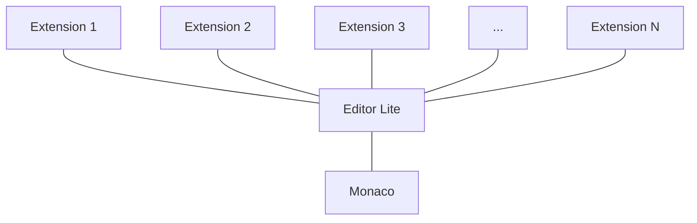

# Editor Lite

## Background

**Editor Lite** is a technological product driving [Web Editor](../../user/project/repository/web_editor.md), [Snippets](../../user/snippets.md), [CI Linter](../../ci/lint.md), etc. Editor Lite is the driving technology for any single-file editing experience across the product.

Editor Lite is a thin wrapper around [the Monaco editor](https://microsoft.github.io/monaco-editor/index.html) that provides the necessary helpers and abstractions and extends Monaco using extensions.

## How to use Editor Lite

Editor Lite is framework-agnostic and can be used in any application, whether it's Rails or Vue. For the convenience of integration, we have [the dedicated `<editor-lite>` Vue component](#vue-component), but in general, the integration of Editor Lite is pretty straightforward:

1. Import Editor Lite:

```javascript
import EditorLite from '~/editor/editor_lite';
```

1. Initialize global editor for the view:

```javascript
const editor = new EditorLite({
  // Editor Options.
  // The list of all accepted options can be found at
  // https://microsoft.github.io/monaco-editor/api/enums/monaco.editor.editoroption.html
});
```

1. Create an editor's instance:

```javascript
editor.createInstance({
  // Editor Lite configuration options.
})
```

An instance of Editor Lite accepts the following configuration options:

| Option | Required? | Description |
| ---- | ---- | ---- |
| `el` | `true` | `HTML Node`: element on which to render the editor |
| `blobPath` | `false` | `String`: the name of a file to render in the editor. It is used to identify the correct syntax highlighter to use with that or another file type. Can accept wildcard as in `*.js` when the actual filename isn't known or doesn't play any role |
| `blobContent` | `false` | `String`: the initial content to be rendered in the editor |
| `extensions` | `false` | `Array`: extensions to use in this instance |
| `blobGlobalId` | `false` | `String`: auto-generated property.<br>**Note:** this prop might go away in the future. Do not pass `blobGlobalId` unless you know what you're doing.|
| [Editor Options](https://microsoft.github.io/monaco-editor/api/enums/monaco.editor.editoroption.html) | `false` | `Object(s)`: any prop outside of the list above is treated as an Editor Option for this particular instance. This way, one can override global Editor Options on the instance level. |

## API

The editor follows the same public API as [provided by Monaco editor](https://microsoft.github.io/monaco-editor/api/interfaces/monaco.editor.istandalonecodeeditor.html) with just a few additional functions on the instance level:

| Function | Arguments | Description
| ----- | ----- | ----- |
| `updateModelLanguage` | `path`: String | Updates the instance's syntax highlighting to follow the extension of the passed `path`. Available only on _instance_ level|
| `use` | Array of objects | Array of **extensions** to apply to the instance. Accepts only the array of _objects_, which means that the extensions' ES6 modules should be fetched and resolved in your views/components before being passed to `use`. This prop is available on _instance_ (applies extension to this particular instance) and _global edtor_ (applies the same extension to all instances) levels. |
| Monaco Editor options | See [documentation](https://microsoft.github.io/monaco-editor/api/interfaces/monaco.editor.istandalonecodeeditor.html) | Default Monaco editor options |

## Tips

1. Editor's loading state.

Editor Lite comes with the loading state built-in, making spinners and loaders rarely needed in HTML. To benefit the built-in loading state, set the `data-editor-loading` property on the HTML element that is supposed to contain the editor. Editor Lite will show the loader automatically while it's bootstrapping.


1. Update syntax highlighting if the file name changes.

```javascript
// fileNameEl here is the HTML input element that contains the file name
fileNameEl.addEventListener('change', () => {
  this.editor.updateModelLanguage(fileNameEl.value);
});
```

1. Get the editor's content.

We might set up listeners on the editor for every change but it rapidly can become an expensive operation. Instead , we can get editor's content when it's needed. For example on a form's submission:

```javascript
form.addEventListener('submit', () => {
  my_content_variable = this.editor.getValue();
});
```

1. Performance

Even though Editor Lite itself is extremely slim, it still depends on Monaco editor. Monaco is not an easily tree-shakeable module. Hence, every time you add Editor Lite to a view, the JavaScript bundle's size significantly increases, affecting your view's loading performance. To avoid that, it is recommended to import the editor on demand on those views where it is not 100% certain that the editor will be used. Or if the editor is a secondary element of the view. Loading Editor Lite on demand is no different from loading any other module:

```javascript
someActionFunction() {
  import(/* webpackChunkName: 'EditorLite' */ '~/editor/editor_lite').
    then(({ default: EditorLite }) => {
      const editor = new EditorLite();
      ...
    });
  ...
}
```

## Extensions

Editor Lite has been built to provide a universal, extensible editing tool to the whole product, which would not depend on any particular group. Even though the Editor Lite's core is owned by [Create::Editor FE Team](https://about.gitlab.com/handbook/engineering/development/dev/create-editor-fe/), the main functional elements — extensions — can be owned by any group. Editor Lite extensions' main idea is that the core of the editor remains very slim and stable. At the same time, whatever new functionality is needed can be added as an extension to this core, without touching the core itself. It allows any group to build and own any new editing functionality without being afraid of it being broken or overridden with the Editor Lite changes.

Structurally, the complete implementation of Editor Lite could be presented as the following diagram:



Technically, an extension is just an ES6 module that exports a JavaScript object:

```javascript
import { Position } from 'monaco-editor';

export default {
  navigateFileStart() {
    this.setPosition(new Position(1, 1));
  },
};

```

Important things to note here:

- We can depend on other modules in our extensions. This organization helps keep the size of Editor Lite's core at bay by importing dependencies only when needed.
- `this` in extension's functions refers to the current Editor Lite instance. Using `this`, you get access to the complete instance's API, such as the `setPosition()` method in this particular case.

### Using an existing extension

Adding an extension to Editor Lite's instance is simple:

```javascript
import EditorLite from '~/editor/editor_lite';
import MyExtension from '~/my_extension';

const editor = new EditorLite().createInstance({
  ...
});
editor.use(MyExtension);
```

### Creating an extension

Let's create our first Editor Lite extension. As aforementioned, extensions are ES6 modules exporting the simple `Object` that is used to extend Editor Lite's functionality. As the most straightforward test, let's create an extension that extends Editor Lite with a new function that, when called, will output editor's content in `alert`.

`~/my_folder/my_fancy_extension.js:`

```javascript
export default {
  throwContentAtMe() {
    alert(this.getValue());
  },
};
```

And that's it with our extension! Note that we're using `this` as a reference to the instance. And through it, we get access to the complete underlying [Monaco editor API](https://microsoft.github.io/monaco-editor/api/interfaces/monaco.editor.istandalonecodeeditor.html) like `getValue()` in this case.

Now let's use our extension:

`~/my_folder/component_bundle.js`:

```javascript
import EditorLite from '~/editor/editor_lite';
import MyFancyExtension from './my_fancy_extension';

const editor = new EditorLite().createInstance({
  ...
});
editor.use(MyFancyExtension);
...
someButton.addEventListener('click', () => {
  editor.throwContentAtMe();
});
```

First of all, we import Editor Lite and our new extension. Then we create the editor and its instance. By default Editor Lite has no `throwContentAtMe` method. But the `editor.use(MyFancyExtension)` line brings that method to our instance. After that, we can use it any time we need it. In this case, we call it when some theoretical button has been clicked.

This script would result in an alert containing the editor's content when `someButton` is clicked.


### Tips

1. Performance

Just like Editor Lite itself, any extension can be loaded on demand to not harm loading performance of the views:

```javascript
const EditorPromise = import(
  /* webpackChunkName: 'EditorLite' */ '~/editor/editor_lite'
);
const MarkdownExtensionPromise = import('~/editor/editor_markdown_ext');

Promise.all([EditorPromise, MarkdownExtensionPromise])
  .then(([{ default: EditorLite }, { default: MarkdownExtension }]) => {
    const editor = new EditorLite().createInstance({
      ...
    });
    editor.use(MarkdownExtension);
  });
```

1. Using multiple extensions

Just pass the array of extensions to your `use` method:

```javascript
editor.use([FileTemplateExtension, MyFancyExtension]);
```

## <a id="vue-component"></a>`<editor-lite>` Vue component

TBD
