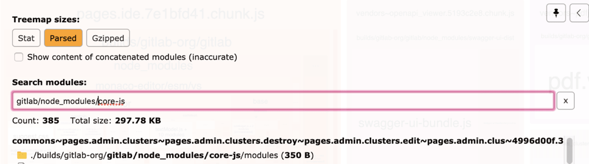

# Frontend FAQ

## Rules of Frontend FAQ

1. **You talk about Frontend FAQ.**
   Please share links to it whenever applicable, so more eyes catch when content
   gets outdated.
1. **Keep it short and simple.**
   Whenever an answer needs more than two sentences it does not belong here.
1. **Provide background when possible.**
   Linking to relevant source code, issue / epic, or other documentation helps
   to understand the answer.
1. **If you see something, do something.**
   Please remove or update any content that is outdated as soon as you see it.

## FAQ

### 1. How does one find the Rails route for a page?

#### Check the 'page' data attribute

The easiest way is to type the following in the browser while on the page in
question:

```javascript
document.body.dataset.page
```

Find here the [source code setting the attribute](https://gitlab.com/gitlab-org/gitlab/-/blob/cc5095edfce2b4d4083a4fb1cdc7c0a1898b9921/app/views/layouts/application.html.haml#L4).

#### Rails routes

The `rails routes` command can be used to list all the routes available in the application. Piping the output into `grep`, we can perform a search through the list of available routes.
The output includes the request types available, route parameters and the relevant controller.

```shell
bundle exec rails routes | grep "issues"
```

### 2. `modal_copy_button` vs `clipboard_button`

The `clipboard_button` uses the `copy_to_clipboard.js` behavior, which is
initialized on page load. Vue clipboard buttons that
don't exist at page load (such as ones in a `GlModal`) do not have
click handlers associated with the clipboard package.

`modal_copy_button` manages an instance of the
[`clipboard` plugin](https://www.npmjs.com/package/clipboard) specific to
the instance of that component. This means that clipboard events are
bound on mounting and destroyed when the button is, mitigating the above
issue. It also has bindings to a particular container or modal ID
available, to work with the focus trap created by our GlModal.

### 3. A `gitlab-ui` component not conforming to [Pajamas Design System](https://design.gitlab.com/)

Some [Pajamas Design System](https://design.gitlab.com/) components implemented in
`gitlab-ui` do not conform with the design system specs. This is because they lack some
planned features or are not correctly styled yet. In the Pajamas website, a
banner on top of the component examples indicates that:

> This component does not yet conform to the correct styling defined in our Design
> System. Refer to the Design System documentation when referencing visuals for this
> component.

For example, at the time of writing, this type of warning can be observed for
[all form components](https://design.gitlab.com/components/form/). It, however,
doesn't imply that the component should not be used.

GitLab always asks to use `<gl-*>` components whenever a suitable component exists.
It makes codebase unified and more comfortable to maintain/refactor in the future.

Ensure a [Product Designer](https://about.gitlab.com/company/team/?department=ux-department)
reviews the use of the non-conforming component as part of the MR review. Make a
follow up issue and attach it to the component implementation epic found in the
[Components of Pajamas Design System epic](https://gitlab.com/groups/gitlab-org/-/epics/973).

### 4. My submit form button becomes disabled after submitting

A Submit button inside of a form attaches an `onSubmit` event listener on the form element. [This code](https://gitlab.com/gitlab-org/gitlab/-/blob/794c247a910e2759ce9b401356432a38a4535d49/app/assets/javascripts/main.js#L225) adds a `disabled` class selector to the submit button when the form is submitted. To avoid this behavior, add the class `js-no-auto-disable` to the button.

### 5. Should one use a full URL (for example `gon.gitlab_url`) or a full path (for example `gon.relative_url_root`) when referencing backend endpoints?

It's preferred to use a **full path** over a **full URL**. This is because the URL uses the hostname configured with
GitLab which may not match the request. This causes [cross-origin resource sharing issues like this Web IDE example](https://gitlab.com/gitlab-org/gitlab/-/issues/36810).

Example:

```javascript
// bad :(
// If gitlab is configured with hostname `0.0.0.0`
// This will cause CORS issues if I request from `localhost`
axios.get(joinPaths(gon.gitlab_url, '-', 'foo'))

// good :)
axios.get(joinPaths(gon.relative_url_root, '-', 'foo'))
```

Also, please try not to hardcode paths in the Frontend, but instead receive them from the Backend (see next section).
When referencing Backend rails paths, avoid using `*_url`, and use `*_path` instead.

Example:

```haml
-# Bad :(
#js-foo{ data: { foo_url: some_rails_foo_url } }

-# Good :)
#js-foo{ data: { foo_path: some_rails_foo_path } }
```

### 6. How should the Frontend reference Backend paths?

We prefer not to add extra coupling by hard-coding paths. If possible,
add these paths as data attributes to the DOM element being referenced in the JavaScript.

Example:

```javascript
// Bad :(
// Here's a Vuex action that hardcodes a path :(
export const fetchFoos = ({ state }) => {
  return axios.get(joinPaths(gon.relative_url_root, '-', 'foo'));
};

// Good :)
function initFoo() {
  const el = document.getElementById('js-foo');

  // Path comes from our root element's data which is used to initialize the store :)
  const store = createStore({
    fooPath: el.dataset.fooPath
  });

  Vue.extend({
    store,
    el,
    render(h) {
      return h(Component);
    },
  });
}

// Vuex action can now reference the path from its state :)
export const fetchFoos = ({ state }) => {
  return axios.get(state.settings.fooPath);
};
```

### 7. How can one test the production build locally?

Sometimes it's necessary to test locally what the frontend production build would produce, to do so the steps are:

1. Stop webpack: `gdk stop webpack`.
1. Open `gitlab.yaml` located in `gitlab/config` folder, scroll down to the `webpack` section, and change `dev_server` to `enabled: false`.
1. Run `yarn webpack-prod && gdk restart rails-web`.

The production build takes a few minutes to be completed. Any code changes at this point are
displayed only after executing the item 3 above again.

To return to the normal development mode:

1. Open `gitlab.yaml` located in your `gitlab` installation folder, scroll down to the `webpack` section and change back `dev_server` to `enabled: true`.
1. Run `yarn clean` to remove the production assets and free some space (optional).
1. Start webpack again: `gdk start webpack`.
1. Restart GDK: `gdk restart rails-web`.

### 8. Babel polyfills

> [Introduced](https://gitlab.com/gitlab-org/gitlab/-/issues/28837) in GitLab 12.8.

GitLab has enabled the Babel `preset-env` option
[`useBuiltIns: 'usage'`](https://babeljs.io/docs/en/babel-preset-env#usebuiltins-usage).
This adds the appropriate `core-js` polyfills once for each JavaScript feature
we're using that our target browsers don't support. You don't need to add `core-js`
polyfills manually.

GitLab adds non-`core-js` polyfills for extending browser features (such as
the GitLab SVG polyfill), which allow us to reference SVGs by using `<use xlink:href>`.
Be sure to add these polyfills to `app/assets/javascripts/commons/polyfills.js`.

To see what polyfills are being used:

1. Navigate to your merge request.
1. In the secondary menu below the title of the merge request, click **Pipelines**, then
   click the pipeline you want to view, to display the jobs in that pipeline.
1. Click the [`compile-production-assets`](https://gitlab.com/gitlab-org/gitlab/-/jobs/641770154) job.
1. In the right-hand sidebar, scroll to **Job Artifacts**, and click **Browse**.
1. Click the **webpack-report** folder to open it, and click **index.html**.
1. In the upper left corner of the page, click the right arrow **{angle-right}**
   to display the explorer.
1. In the **Search modules** field, enter `gitlab/node_modules/core-js` to see
   which polyfills are being loaded and where:

   

### 9. Why is my page broken in dark mode?

See [dark mode docs](dark_mode.md)
