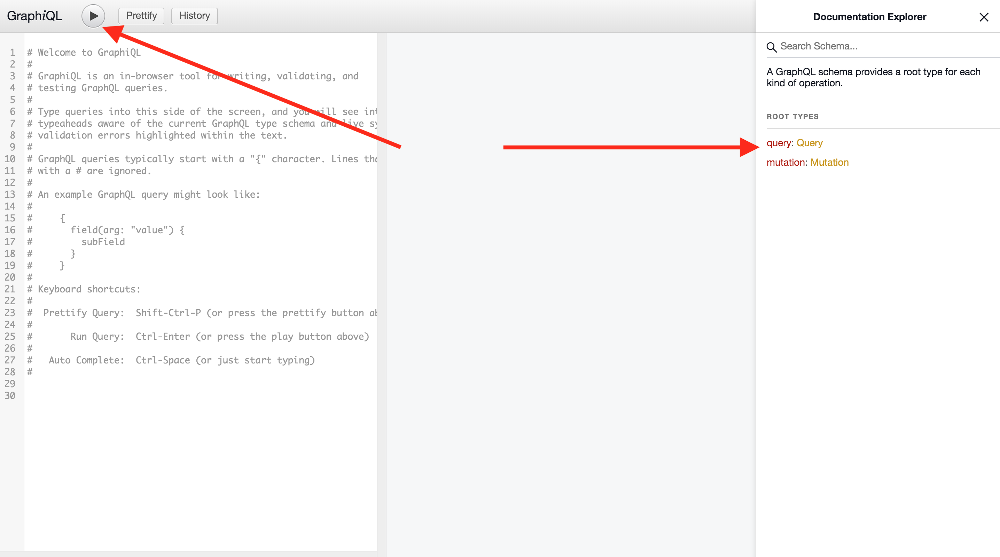

# GraphQL

Our GraphQL API can be explored via GraphiQL at your instance's
`/-/graphql-explorer` or at [GitLab.com](https://gitlab.com/-/graphql-explorer).

You can check all existing queries and mutations on the right side
of GraphiQL in its **Documentation explorer**. It's also possible to
write queries and mutations directly on the left tab and check
their execution by clicking **Execute query** button on the top left:



We use [Apollo] and [Vue Apollo][vue-apollo] for working with GraphQL
on the frontend.

## Apollo Client

To save duplicated clients getting created in different apps, we have a
[default client][default-client] that should be used. This setups the
Apollo client with the correct URL and also sets the CSRF headers.

Default client accepts two parameters: `resolvers` and `config`.

- `resolvers` parameter is created to accept an object of resolvers for [local state management](#local-state-with-apollo) queries and mutations
- `config` parameter takes an object of configuration settings:
  - `cacheConfig` field accepts an optional object of settings to [customize Apollo cache](https://github.com/apollographql/apollo-client/tree/master/packages/apollo-cache-inmemory#configuration)
  - `baseUrl` allows us to pass a URL for GraphQL endpoint different from our main endpoint (i.e.`${gon.relative_url_root}/api/graphql`)
  - `assumeImmutableResults` (set to `false` by default) - this setting, when set to `true`, will assume that every single operation on updating Apollo Cache is immutable. It also sets `freezeResults` to `true`, so any attempt on mutating Apollo Cache will throw a console warning in development environment. Please ensure you're following the immutability pattern on cache update operations before setting this option to `true`.

## GraphQL Queries

To save query compilation at runtime, webpack can directly import `.graphql`
files. This allows webpack to preprocess the query at compile time instead
of the client doing compilation of queries.

To distinguish queries from mutations and fragments, the following naming convention is recommended:

- `allUsers.query.graphql` for queries;
- `addUser.mutation.graphql` for mutations;
- `basicUser.fragment.graphql` for fragments.

GraphQL:

- Queries are stored in `(ee/)app/assets/javascripts/` under the feature. For example, `respository/queries`. Frontend components can use these stored queries.
- Mutations are stored in
  `(ee/)app/assets/javascripts/<subfolders>/<name of mutation>.mutation.graphql`.

### Fragments

Fragments are a way to make your complex GraphQL queries more readable and re-usable.
They can be stored in a separate file and imported.

For example, a fragment that references another fragment:

```ruby
fragment BaseEpic on Epic {
  id
  iid
  title
  webPath
  relativePosition
  userPermissions {
    adminEpic
    createEpic
  }
}

fragment EpicNode on Epic {
  ...BaseEpic
  state
  reference(full: true)
  relationPath
  createdAt
  closedAt
  hasChildren
  hasIssues
  group {
    fullPath
  }
}
```

More about fragments:
[GraphQL Docs](https://graphql.org/learn/queries/#fragments)

## Usage in Vue

To use Vue Apollo, import the [Vue Apollo][vue-apollo] plugin as well
as the default client. This should be created at the same point
the Vue application is mounted.

```javascript
import Vue from 'vue';
import VueApollo from 'vue-apollo';
import createDefaultClient from '~/lib/graphql';
Vue.use(VueApollo);

const apolloProvider = new VueApollo({
  defaultClient: createDefaultClient(),
});

new Vue({
  ...,
  apolloProvider,
  ...
});
```

Read more about [Vue Apollo][vue-apollo] in the [Vue Apollo documentation](https://vue-apollo.netlify.com/guide/).

### Local state with Apollo

It is possible to manage an application state with Apollo by passing
in a resolvers object when creating the default client. The default state can be set by writing
to the cache after setting up the default client.

```javascript
import Vue from 'vue';
import VueApollo from 'vue-apollo';
import createDefaultClient from '~/lib/graphql';
Vue.use(VueApollo);

const defaultClient = createDefaultClient({
  Query: {
    ...
  },
  Mutations: {
    ...
  },
});

defaultClient.cache.writeData({
  data: {
    isLoading: true,
  },
});

const apolloProvider = new VueApollo({
  defaultClient,
});
```

Read more about local state management with Apollo in the [Vue Apollo documentation](https://vue-apollo.netlify.com/guide/local-state.html#local-state).

### Testing

With [Vue test utils][vue-test-utils] it is easy to quickly test components that
fetch GraphQL queries. The simplest way is to use `shallowMount` and then set
the data on the component

```javascript
it('tests apollo component', () => {
  const vm = shallowMount(App);

  vm.setData({
    ...mock data
  });
});
```

Another possible way is testing queries with mocked GraphQL schema. Read more about this way in [Vue Apollo testing documentation](https://vue-apollo.netlify.com/guide/testing.html#tests-with-mocked-graqhql-schema)

## Usage outside of Vue

It is also possible to use GraphQL outside of Vue by directly importing
and using the default client with queries.

```javascript
import defaultClient from '~/lib/graphql';
import query from './query.graphql';

defaultClient.query(query)
  .then(result => console.log(result));
```

Read more about the [Apollo] client in the [Apollo documentation](https://www.apollographql.com/docs/tutorial/client/).

[Apollo]: https://www.apollographql.com/
[vue-apollo]: https://github.com/Akryum/vue-apollo/
[feature-flags]: ../feature_flags.md
[default-client]: https://gitlab.com/gitlab-org/gitlab/blob/master/app/assets/javascripts/lib/graphql.js
[vue-test-utils]: https://vue-test-utils.vuejs.org/
[apollo-link-state]: https://www.apollographql.com/docs/link/links/state.html
