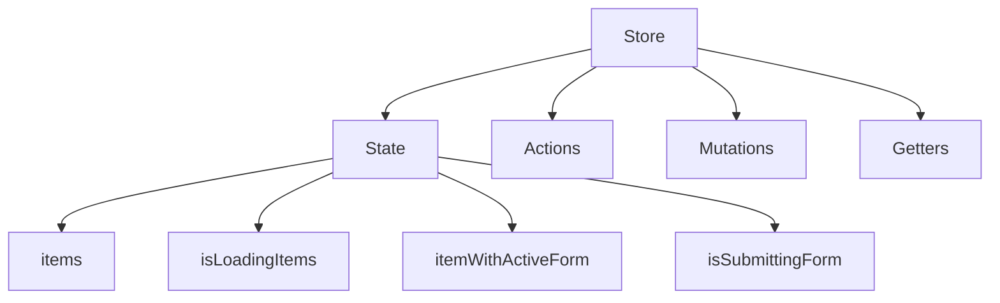
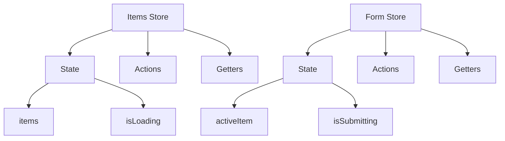
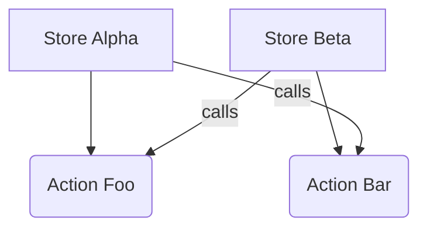
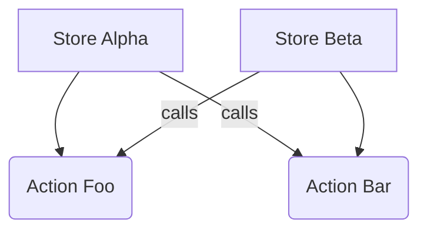
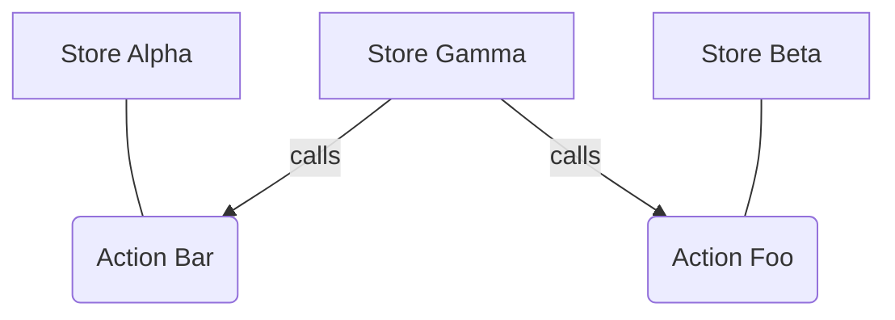

[Pinia](https://pinia.vuejs.org/) is a tool for [managing client-side state](state_management.md) for Vue applications.
Refer to the [official documentation](https://pinia.vuejs.org/core-concepts/) on how to use Pinia.

## Best practices

### Pinia instance

You should always prefer using shared Pinia instance from `~/pinia/instance`.
This allows you to easily add more stores to components without worrying about multiple Pinia instances.

```javascript
import { pinia } from '~/pinia/instance';

new Vue({ pinia, render(h) { return h(MyComponent); } });
```

### Small stores

Prefer creating small stores that focus on a single task only.
This is contrary to the Vuex approach which encourages you to create bigger stores.

Treat Pinia stores like cohesive components rather than giant state façades (Vuex modules).

#### Vuex design ❌



#### Pinia's design ✅



### Single file stores

Place state, actions, and getters in a single file.
Do not create 'barrel' store index files which import everything from `actions.js`, `state.js` and `getters.js`.

If your store file gets too big it's time to consider splitting that store into multiple stores.

### Use Option Stores

Pinia offers two types of store definitions: [option](https://pinia.vuejs.org/core-concepts/#Option-Stores) and [setup](https://pinia.vuejs.org/core-concepts/#Setup-Stores).
Prefer the option type when creating new stores. This promotes consistency and will simplify the migration path from Vuex.

### Global stores

Prefer using global Pinia stores for global reactive state.

```javascript
// bad ❌
import { isNarrowScreenMediaQuery } from '~/lib/utils/css_utils';

new Vue({
  data() {
    return {
      isNarrow: false,
    };
  },
  mounted() {
    const query = isNarrowScreenMediaQuery();
    this.isNarrow = query.matches;

    query.addEventListener('change', (event) => {
      this.isNarrow = event.matches;
    });
  },
  render() {
    if (this.isNarrow) return null;
    //
  },
});
```

```javascript
// good ✅
import { pinia } from '~/pinia/instance';
import { useViewport } from '~/pinia/global_stores/viewport';

new Vue({
  pinia,
  ...mapState(useViewport, ['isNarrowScreen']),
  render() {
    if (this.isNarrowScreen) return null;
    //
  },
});
```

### Hot Module Replacement

[Pinia offers an HMR option](https://pinia.vuejs.org/cookbook/hot-module-replacement.html#HMR-Hot-Module-Replacement-) that you have to manually attach in your code.
The experience Pinia offers with this method is [subpar](https://github.com/vuejs/pinia/issues/898) and this should be avoided.

## Testing Pinia

### Unit testing the store

[Follow the official testing documentation](https://pinia.vuejs.org/cookbook/testing.html#Unit-testing-a-store).

Official documentation suggests using `setActivePinia(createPinia())` to test the Pinia.

Our recommendation is to leverage `createTestingPinia` with unstubbed actions.
It acts the same as `setActivePinia(createPinia())` but also allows us to spy on any action by default.

**Always** use `createTestingPinia` with `stubActions: false` when unit testing the store.

A basic test could look like this:

```javascript
import { createTestingPinia } from '@pinia/testing';
import { useMyStore } from '~/my_store.js';

describe('MyStore', () => {
  beforeEach(() => {
    createTestingPinia({ stubActions: false });
  });

  it('does something', () => {
    useMyStore().someAction();
    expect(useMyStore().someState).toBe(true);
  });
});
```

Any given test should only check for any of these three things:

1. A change in the store state
1. A call to another action
1. A call to side effect (for example an Axios request)

Never try to use the same Pinia instance in more than one test case.
Always create a fresh Pinia instance because it is what actually holds your state.

### Unit testing components with the store

[Follow the official testing documentation](https://pinia.vuejs.org/cookbook/testing.html#Unit-testing-components).

Pinia requires special handling to support Vue 3 compat mode:

1. It must register `PiniaVuePlugin` on the Vue instance
1. Pinia instance must be explicitly provided to the `shallowMount`/`mount` from Vue Test Utils
1. Stores have to be created prior to rendering the component, otherwise Vue will try to use Pinia for Vue 3

A full setup looks like this:

```javascript
import Vue from 'vue';
import { createTestingPinia, PiniaVuePlugin } from 'pinia';
import { shallowMount } from '@vue/test-utils';
import { useMyStore } from '~/my_store.js';
import MyComponent from '~/my_component.vue';

Vue.use(PiniaVuePlugin);

describe('MyComponent', () => {
  let pinia;
  let wrapper;

  const createComponent = () => {
    wrapper = shallowMount(MyComponent, { pinia });
  }

  beforeEach(() => {
    pinia = createTestingPinia();
    // store is created before component is rendered
    useMyStore();
  });

  it('does something', () => {
    createComponent();
    // all actions are stubbed by default
    expect(useMyStore().someAction).toHaveBeenCalledWith({ arg: 'foo' });
    expect(useMyStore().someAction).toHaveBeenCalledTimes(1);
  });
});
```

In most cases you won't need to set `stubActions: false` when testing components.
Instead, the store itself should be properly tested and the component tests should check that the actions were called with correct arguments.

#### Setting up initial state

Pinia doesn't allow to unstub actions once they've been stubbed.
That means you can not use them to set the initial state if you didn't set `stubActions: false`.

In that case it is allowed to set the state directly:

```javascript
describe('MyComponent', () => {
  let pinia;
  let wrapper;

  const createComponent = () => {
    wrapper = shallowMount(MyComponent, { pinia });
  }

  beforeEach(() => {
    // all the actions are stubbed, we can't use them to change the state anymore
    pinia = createTestingPinia();
    // store is created before component is rendered
    useMyStore();
  });

  it('does something', () => {
    // state is set directly instead of using an action
    useMyStore().someState = { value: 1 };
    createComponent();
    // ...
  });
});
```

## Migrating from Vuex

GitLab is actively migrating from Vuex, you can contribute and follow this progress [here](https://gitlab.com/groups/gitlab-org/-/epics/18476).

Before migrating decide what your primary [state manager](state_management.md) should be first.
Proceed with this guide if Pinia was your choice.

Migration to Pinia could be completed in two ways: a single step migration and a multi-step one.

Follow single step migration if your store meets these criteria:

1. Store contains only one module
1. Actions, getters and mutations cumulatively do not exceed 1000 lines

In any other case prefer the multi-step migration.

### Single step migration

[Follow the official Vuex migration guide](https://pinia.vuejs.org/cookbook/migration-vuex.html).

1. Migrate store to Pinia [using codemods](#automated-migration-using-codemods)
1. Fix store tests following [our guide](#migrating-store-tests) and [best practices](#unit-testing-the-store)
1. Update components to use the migrated Pinia store
   1. Replace `mapActions`, `mapState` with Pinia counterparts
   1. Replace `mapMutations` with Pinia's `mapActions`
   1. Replace `mapGetters` with Pinia's `mapState`
1. Fix components tests following [our guide](#migrating-component-tests) and [best practices](#unit-testing-components-with-the-store)

If your diff starts to exceed reviewable size prefer the multi-step migration.

### Multi-step migration

[Learn about the official Vuex migration guide](https://pinia.vuejs.org/cookbook/migration-vuex.html).

A walkthrough is available in the two part video series:

1. [Migrating the store (part 1)](https://youtu.be/aWVYvhktYfM)
1. [Migrating the components (part 2)](https://youtu.be/9G7h4YmoHRw)

Follow these steps to iterate over the migration process and split the work onto smaller merge requests:

1. Identify the store you are going to migrate.
   Start with the file that defines your store via `new Vuex.Store()` and go from there.
   Include all the modules that are used inside this store.
1. Create a migration issue, assign a migration DRI(s) and list all the store modules you're going to migrate.
   Track your migration progress in that issue. If necessary, split the migration into multiple issues.
1. Create a new CODEOWNERS (`.gitlab/CODEOWNERS`) rule for the store files you're migrating, include all the Vuex module dependencies and store specs.

   If you are migrating only a single store module then you would need to include only `state.js` (or your `index.js`),
   `actions.js`, `mutations.js` and `getters.js` and their respective spec files.

   Assign at least two individuals responsible for reviewing changes made to the Vuex store.
   Always sync your changes from Vuex store to Pinia. This is very important so you don't introduce regressions with the Pinia store.
1. Copy existing store as-is to a new location (you can call it `stores/legacy_store` for example). Preserve the file structure.
   Do this for every store module you're going to migrate. Split this into multiple merge requests if necessary.
1. Create an index file (`index.js`) with a store definition (`defineStore`) and define your state in there.
   Copy the state definition from `state.js`. Do not import actions, mutations and getters yet.
1. Use [code mods](#automated-migration-using-codemods) to migrate the store files.
   Import migrated modules in your new store's definition (`index.js`).
1. If you have circular dependencies in your stores consider [using `tryStore` plugin](#avoiding-circular-dependencies).
1. [Migrate the store specs manually](#migrating-store-tests).
1. [Sync your Vuex store with Pinia stores](#syncing-with-vuex).
1. Refactor components to use the new store. Split this into as many merge requests as necessary.
   Always [update the specs](#migrating-component-tests) with the components.
1. Remove the Vuex store.
1. Remove CODEOWNERS rule.
1. Close the migration issue.

#### Example migration breakdown

You can use the [merge requests migration](https://gitlab.com/groups/gitlab-org/-/epics/16505) breakdown as a reference:

1. Diffs store
   1. [Copy store to a new location and introduce CODEOWNERS rules](https://gitlab.com/gitlab-org/gitlab/-/merge_requests/163826)
   1. [Automated store migration](https://gitlab.com/gitlab-org/gitlab/-/merge_requests/163827)
      1. Also creates MrNotes store
   1. Specs migration ([actions](https://gitlab.com/gitlab-org/gitlab/-/merge_requests/165733), [getters](https://gitlab.com/gitlab-org/gitlab/-/merge_requests/167176), [mutations](https://gitlab.com/gitlab-org/gitlab/-/merge_requests/167434))
1. Notes store
   1. [Copy store to a new location](https://gitlab.com/gitlab-org/gitlab/-/merge_requests/167450)
   1. [Automated store migration](https://gitlab.com/gitlab-org/gitlab/-/merge_requests/167946)
   1. Specs migration ([actions](https://gitlab.com/gitlab-org/gitlab/-/merge_requests/169681), [getters](https://gitlab.com/gitlab-org/gitlab/-/merge_requests/170547), [mutations](https://gitlab.com/gitlab-org/gitlab/-/merge_requests/170549))
1. Batch comments store
   1. [Copy store to a new location](https://gitlab.com/gitlab-org/gitlab/-/merge_requests/176485)
   1. [Automated store migration](https://gitlab.com/gitlab-org/gitlab/-/merge_requests/176486)
   1. Specs migration ([actions](https://gitlab.com/gitlab-org/gitlab/-/merge_requests/176487), [getters](https://gitlab.com/gitlab-org/gitlab/-/merge_requests/176490), [mutations](https://gitlab.com/gitlab-org/gitlab/-/merge_requests/176488))
1. [Sync Vuex stores with Pinia stores](https://gitlab.com/gitlab-org/gitlab/-/merge_requests/178302)
1. Diffs store components migration
   1. [Diffs app](https://gitlab.com/gitlab-org/gitlab/-/merge_requests/186121)
   1. [Non diffs components](https://gitlab.com/gitlab-org/gitlab/-/merge_requests/186365)
   1. [File browser](https://gitlab.com/gitlab-org/gitlab/-/merge_requests/186370)
   1. [Diffs components](https://gitlab.com/gitlab-org/gitlab/-/merge_requests/186381)
   1. [Diff file components](https://gitlab.com/gitlab-org/gitlab/-/merge_requests/186382)
   1. [Rest of diffs components](https://gitlab.com/gitlab-org/gitlab/-/merge_requests/186962)
1. [Batch comments components migration](https://gitlab.com/gitlab-org/gitlab/-/merge_requests/180129)
1. [MrNotes components migration](https://gitlab.com/gitlab-org/gitlab/-/merge_requests/178291)
1. Notes store components migration
   1. [Diffs components](https://gitlab.com/gitlab-org/gitlab/-/merge_requests/188273)
   1. [Simple notes components](https://gitlab.com/gitlab-org/gitlab/-/merge_requests/193248)
   1. [More notes components](https://gitlab.com/gitlab-org/gitlab/-/merge_requests/195975)
   1. [Rest of notes components](https://gitlab.com/gitlab-org/gitlab/-/merge_requests/196142)
   1. [Notes app](https://gitlab.com/gitlab-org/gitlab/-/merge_requests/197331)
1. [Remove Vuex from merge requests](https://gitlab.com/gitlab-org/gitlab/-/merge_requests/196307)
   1. Also removes the CODEOWNERS rules

### Post migration steps

Once your store is migrated consider refactoring it to follow our best practices. Split big stores into smaller ones.
[Refactor `tryStore` uses](#refactoring-trystore).

### Automated migration using codemods

You can use [ast-grep](https://ast-grep.github.io/) codemods to simplify migration from Vuex to Pinia.

1. [Install ast-grep](https://ast-grep.github.io/guide/quick-start.html#installation) on your system before proceeding.
1. Run `scripts/frontend/codemods/vuex-to-pinia/migrate.sh path/to/your/store`

The codemods will migrate `actions.js`, `mutations.js` and `getters.js` located in your store folder.
Manually scan these files after running the codemods to ensure they are properly migrated.
Vuex specs can not be automatically migrated, migrate them by hand.

Vuex module calls are replaced using Pinia conventions:

| Vuex                                                        | Pinia                                |
|-------------------------------------------------------------|--------------------------------------|
| `dispatch('anotherModule/action', ...args, { root: true })` | `useAnotherModule().action(...args)` |
| `dispatch('action', ...args, { root: true })`               | `useRootStore().action(...args)`     |
| `rootGetters['anotherModule/getter']`                       | `useAnotherModule().getter`          |
| `rootGetters.getter`                                        | `useRootStore().getter`              |
| `rootState.anotherModule.state`                             | `useAnotherModule().state`           |

If you have not yet migrated a dependent module (`useAnotherModule` and `useRootStore` in the examples above) you can create a temporary dummy store.
Use the guidance below to migrate Vuex modules.

### Migrating stores with nested modules

It is not trivial to iteratively migrate stores with nested modules that have dependencies between them.
In such cases prefer migrating nested modules first:

1. Create a Pinia store counterpart of the nested Vuex store module.
1. Create a placeholder Pinia 'root' store for root module dependencies if applicable.
1. Copy and adapt existing tests for the migrated module.
1. **Do not use migrated modules yet.**
1. Once all the nested modules are migrated you can migrate the root module and replace the placeholder store with the real one.
1. Replace Vuex store with Pinia stores in components.

### Avoiding circular dependencies

It is imperative that you don't create circular dependencies in your Pinia stores.
Unfortunately Vuex design allows to create interdependent modules that we have to refactor later.

An example circular dependency in store design:



To mitigate this issue consider using `tryStore` plugin for Pinia during migration from Vuex:

#### Before

```javascript
// store_alpha/actions.js
function callOtherStore() {
  // bad ❌, circular dependency created
  useBetaStore().bar();
}
```

```javascript
// store_beta/actions.js
function callOtherStore() {
  // bad ❌, circular dependency created
  useAlphaStore().bar();
}
```

#### After

```javascript
// store_alpha/actions.js
function callOtherStore() {
  // OK ✅, circular dependency avoided
  this.tryStore('betaStore').bar();
}
```

```javascript
// store_beta/actions.js
function callOtherStore() {
  // OK ✅, circular dependency avoided
  this.tryStore('alphaStore').bar();
}
```

This will look up the store by its name using Pinia instance and prevent the circular dependency issue.
Store name is defined when calling `defineStore('storeName', ...)`.

You **must** initialize both stores prior to component mounting when using `tryStore`:

```javascript
// stores are created in advance
useAlphaStore();
useBetaStore();
new Vue({ pinia, render(h) { return h(MyComponent); } });
```

The `tryStore` helper function can only be used during migration. Never use this in proper Pinia stores.

#### Refactoring `tryStore`

After you finished the migration it is very important to redesign the stores so there are no more circular dependencies.

The easiest way to solve this would be to create a top level store that would orchestrate other stores.

##### Before



##### After



### Syncing with Vuex

This `syncWithVuex` plugin syncs your state from Vuex to Pinia and vice versa.
This allows you to iteratively migrate components by having both stores in your app during migration.

Usage example:

```javascript
// Vuex store @ ./store.js
import Vuex from 'vuex';
import createOldStore from './stores/old_store';

export default new Vuex.Store({
  modules: {
    oldStore: createOldStore(),
  },
});
```

```javascript
// Pinia store
import { defineStore } from 'pinia';
import oldVuexStore from './store'

export const useMigratedStore = defineStore('migratedStore', {
  syncWith: {
    store: oldVuexStore,
    name: 'oldStore', // use legacy store name if it is defined inside Vuex `modules`
    namespaced: true, // set to 'true' if Vuex module is namespaced
  },
  // the state here gets sync with Vuex, any changes to migratedStore also propagate to the Vuex store
  state() {
    // ...
  },
  // ...
});
```

#### Override

A Vuex store definition can be shared in multiple Vuex store instances.
In that case we can not rely on the store config alone to sync our Pinia store with the Vuex store.
We need to point our Pinia store to the actual Vuex store instance using `syncWith` helper function.

```javascript
// this overrides the existing `syncWith` config
useMigratedStore().syncWith({ store: anotherOldStore });
// `useMigratedStore` state now is synced only with `anotherOldStore`
new Vue({ pinia, render(h) { return h(MyComponent) } });
```

### Migrating store tests

#### `testAction`

Some Vuex tests might use `testAction` helper to test that certain actions or mutations have been called.
We can migrate these specs using `createTestPiniaAction` helper from `helpers/pinia_helpers` in Jest.

##### Before

```javascript
describe('SomeStore', () => {
  it('runs actions', () => {
    return testAction(
      store.actionToBeCalled, // action to be called immediately
      { someArg: 1 }, // action call arguments
      { someState: 1 }, // initial store state
      [{ type: 'MUTATION_NAME', payload: '123' }], // mutation calls to expect
      [{ type: 'actionName' }], // action calls to expect
    );
  });
});
```

##### After

```javascript
import { createTestPiniaAction } from 'helpers/pinia_helpers';

describe('SomeStore', () => {
  let store;
  let testAction;

  beforeEach(() => {
    store = useMyStore();
    testAction = createTestPiniaAction(store);
  });

  it('runs actions', () => {
    return testAction(
      store.actionToBeCalled,
      { someArg: 1 },
      { someState: 1 },
      [{ type: store.MUTATION_NAME, payload: '123' }], // explicit reference to migrated mutation
      [{ type: store.actionName }], // explicit reference to migrated action
    );
  });
});
```

Avoid using `testAction` in your proper Pinia tests: this should only be used during migration.
Always prefer testing each action call explicitly.

#### Custom getters

Pinia allows to define custom getters in Vue 3. Since we're using Vue 2 this is not possible.
To work around this you can use `createCustomGetters` helper from `helpers/pinia_helpers`.

##### Before

```javascript
describe('SomeStore', () => {
  it('runs actions', () => {
    const dispatch = jest.fn();
    const getters = { someGetter: 1 };
    someAction({ dispatch, getters });
    expect(dispatch).toHaveBeenCalledWith('anotherAction', 1);
  });
});
```

##### After

```javascript
import { createCustomGetters } from 'helpers/pinia_helpers';

describe('SomeStore', () => {
  let store;
  let getters;

  beforeEach(() => {
    getters = {};
    createTestingPinia({
      stubActions: false,
      plugins: [
        createCustomGetters(() => ({
          myStore: getters, // each store used in tests should be also declared here
        })),
      ],
    });
    store = useMyStore();
  });

  it('runs actions', () => {
    getters.someGetter = 1;
    store.someAction();
    expect(store.anotherAction).toHaveBeenCalledWith(1);
  });
});
```

Avoid mocking getters in proper Pinia tests: this should only be used for migration.
Instead, provide a valid state so a getter can return correct value.

### Migrating component tests

Pinia does not return promises in actions by default.
Because of that pay a special attention when using `createTestingPinia`.
Since it stubs all the actions it does not guarantee that an action would return a promise.
If your component's code is expecting an action to return a promise stub it accordingly.

```javascript
describe('MyComponent', () => {
  let pinia;

  beforeEach(() => {
    pinia = createTestingPinia();
    useMyStore().someAsyncAction.mockResolvedValue(); // this now returns a promise
  });
});
```
