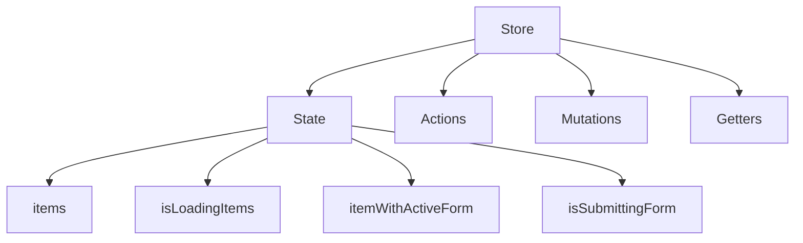
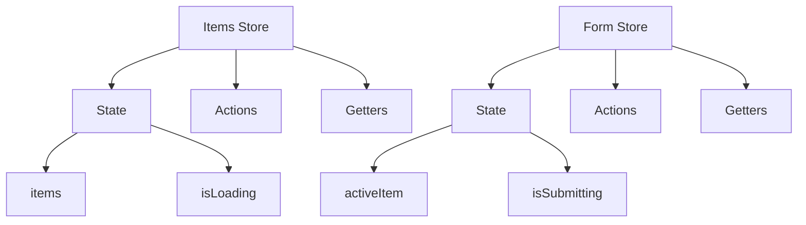

# Pinia

WARNING:
**[Pilot Phase](https://gitlab.com/gitlab-org/gitlab/-/issues/479279)**: Adopt Pinia with caution.
This is a new technology at GitLab and we might not have all the necessary precautions and best practices in place yet.
If you're considering using Pinia please drop a message in the `#frontend` internal Slack channel for evaluation.

[Pinia](https://pinia.vuejs.org/) is a tool for [managing client-side state](state_management.md) for Vue applications.
Refer to the [official documentation](https://pinia.vuejs.org/core-concepts/) on how to use Pinia.

## Best practices

### Small stores

Prefer creating small stores that focus on a single task only.
This is contrary to the Vuex approach which encourages you to create bigger stores.

Treat Pinia stores like cohesive components rather than giant state façades (Vuex modules).

### Single file stores

Place state, actions, and getters in a single file.
Do not create 'barrel' store index files which import everything from `actions.js`, `state.js` and `getters.js`.

If your store file gets too big it's time to consider splitting that store into multiple stores.

### Use Option Stores

Pinia offers two types of store definitions: [option](https://pinia.vuejs.org/core-concepts/#Option-Stores) and [setup](https://pinia.vuejs.org/core-concepts/#Setup-Stores).
Prefer the option type when creating new stores. This promotes consistency and will simplify the migration path from Vuex.

### Before Pinia

### After Pinia

## Migrating from Vuex

Decide what your primary [state manager](state_management.md) should be first.
Proceed with this guide if Pinia was your choice.

[Follow the official Vuex migration guide](https://pinia.vuejs.org/cookbook/migration-vuex.html).

Try to split all your migrations into two steps:

1. Refactor just the Vuex API: Don't change the store structure, make sure it works in Pinia ([example](https://gitlab.com/gitlab-org/gitlab/-/merge_requests/149489)).
1. Refactor the structure: Split your store into multiple smaller, single purpose stores.

### Automated migration using codemods

You can use [ast-grep](https://ast-grep.github.io/) codemods to simplify migration from Vuex to Pinia.

1. [Install ast-grep](https://ast-grep.github.io/guide/quick-start.html#installation) on your system before proceeding.
1. Run `scripts/frontend/codemods/vuex-to-pinia/migrate.sh path/to/your/store`

The codemods will migrate `actions.js`, `mutations.js` and `getters.js` located in your store folder.
Manually scan these files after running the codemods to ensure they are properly migrated.
Vuex specs can not be automatically migrated, migrate them by hand.

Vuex module calls are replaced using Pinia conventions:

1. `dispatch('anotherModule/action', ...args, { root: true })` → `useAnotherModule().action(...args)`
1. `dispatch('action', ...args, { root: true })` → `useRootStore().action(...args)`
1. `rootGetters['anotherModule/getter']` → `useAnotherModule().getter`
1. `rootGetters.getter` → `useRootStore().getter`
1. `rootState.anotherModule.state` → `useAnotherModule().state`

If you have not yet migrated a dependent module (`useAnotherModule` and `useRootStore` in the examples above) you can create a temporary dummy store.
Use the guidance below to migrate Vuex modules.

### Migrating stores with nested modules

It is not trivial to iteratively migrate stores with nested modules that have dependencies between them.
In such cases prefer migrating nested modules first:

1. Create a Pinia store counterpart of the nested Vuex store module.
1. Create a placeholder Pinia 'root' store for root module dependencies if applicable.
1. Copy and adapt existing tests for the migrated module.
1. **Do not use migrated modules yet.**
1. Once all the nested modules are migrated you can migrate the root module and replace the placeholder store with the real one.
1. Replace Vuex store with Pinia stores in components.
