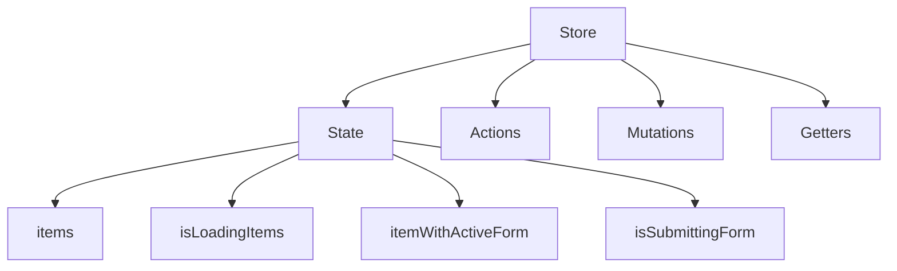
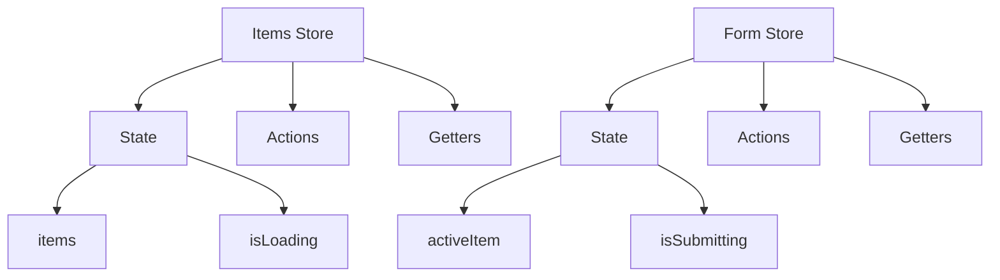

# Pinia

[Pinia](https://pinia.vuejs.org/) is one of the two [supported state managers in GitLab](state_management.md).
Refer to the [official documentation](https://pinia.vuejs.org/core-concepts/) on how to use Pinia.
If you want to migrate from Vuex to Apollo refer to [this guide](migrating_from_vuex.md).

## Architecture

You should prefer creating small stores that focus on a single task only.
This is contrary to the Vuex approach which encourages you to create bigger stores.

Treat Pinia stores like components rather like giant state façades (Vuex modules).

Your state, actions and getters should be placed in a single file.
Do not create 'barrel' store index files which import everything from `actions.js`, `state.js` and `getters.js`.
If your store file gets too big it's time to consider splitting that store into multiple stores.

### Before Pinia

### After Pinia

## Migrating from Vuex

[Follow the official Vuex migration guide](https://pinia.vuejs.org/cookbook/migration-vuex.html).

Try to split all your migrations into two steps:

1. Refactor just the Vuex API: don't change the store structure, make sure it works in Pinia ([example](https://gitlab.com/gitlab-org/gitlab/-/merge_requests/149489))
1. Refactor the structure: split your store into multiple smaller, single purpose stores

### Migrating stores with nested modules

It is not trivial to iteratively migrate stores with nested modules.
In such cases prefer migrating nested modules first:

1. Create a Pinia store counterpart of the nested Vuex store module
1. Create a dummy Pinia 'root' store for root module dependencies if applicable
1. Copy and adapt existing tests for the migrated module
1. **Do not use migrated modules yet**
1. Once all the nested modules are migrated you can migrate the root module and replace the 'dummy' store with the real one
1. Replace Vuex store with Pinia stores in components
