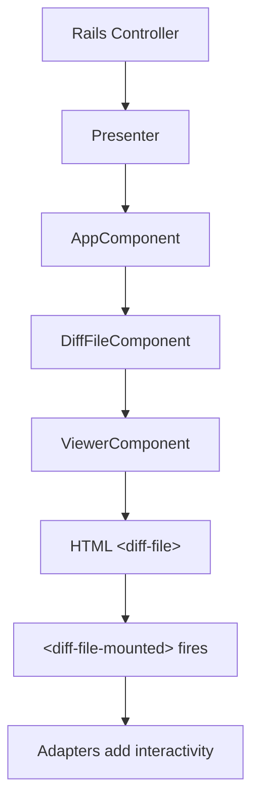
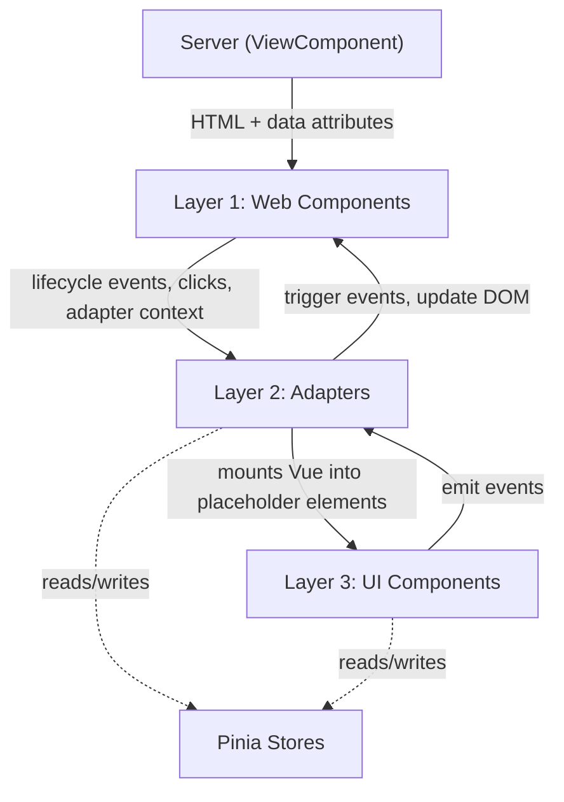

Rapid Diffs is a high-performance [diff](#diff-terminology) rendering system
for GitLab. Rapid Diffs uses server-rendered HTML, Web Components, and HTTP
streaming to display code changes on merge request, commit, and compare pages.
See [Deferred by default](#deferred-by-default) for the reasoning behind this
approach.

> [!NOTE]
> The merge request page requires the `rapid_diffs_on_mr_show` feature flag
> and `?rapid_diffs=true` in the URL.

## Server and client architecture

The main focus of Rapid Diffs is perceived performance: minimizing the time
from request to the first rendered diff on the screen.

Diff files are always rendered on the server with
[ViewComponent](view_component.md). The client never constructs diff HTML. The
client only places server-rendered HTML onto the page and adds interactivity.
This applies to every scenario:

- On initial page load, the server renders the first batch of diff files
  inline in the HTML response. Users see content immediately.
- During streaming, remaining diff files arrive as a streamed HTML response
  from the server. The client renders the HTML as-is into the live DOM.
- On reloads, when a user changes view settings like inline/parallel or
  whitespace, or when an integration triggers a reload, the client replaces
  the entire diffs list with fresh server-rendered HTML streamed from the
  server. A single file can also be reloaded individually by fetching its
  HTML endpoint and replacing the corresponding `<diff-file>` element.

JavaScript only adds interactivity through a lightweight adapter system.
Adapters toggle files, manage discussions, and control menus.



### Diff terminology

Git represents file changes as diffs. A diff file represents the changes to a
single file. A diff file consists of a file header and one or more hunks.
Each hunk starts with a hunk header, marked by the `@@` line, that indicates
where the change occurs. The hunk header is followed by hunk
lines: the actual added, removed, and unchanged context lines.

The following example shows how a raw `git diff` maps to these parts:

```plaintext
┌─ File header
│
│  diff --git a/app/models/user.rb b/app/models/user.rb
│  index 4a5e3f1..b7c9d2a 100644
│  --- a/app/models/user.rb
│  +++ b/app/models/user.rb
│
├─ Hunk 1
│  ┌─ Hunk header
│  │  @@ -10,6 +10,7 @@ class User < ApplicationRecord
│  │
│  ├─ Hunk lines
│  │    validates :name, presence: true       ← context (unchanged)
│  │    validates :email, presence: true      ← context (unchanged)
│  │  + validates :username, uniqueness: true ← added
│  │    validates :role, inclusion: ROLES     ← context (unchanged)
│  │
├─ Hunk 2
│  ┌─ Hunk header
│  │  @@ -25,7 +26,7 @@ class User < ApplicationRecord
│  │
│  ├─ Hunk lines
│  │    def display_name                     ← context
│  │  -   name                               ← removed
│  │  +   "#{name} (@#{username})"           ← added
│  │    end                                  ← context
```

In Rapid Diffs, the server renders each of these parts as HTML table rows inside
a `<diff-file>` web component. Hunk headers are interactive. Users click them
to expand hidden context lines above or below the hunk. Hunk lines display
syntax-highlighted code with line numbers for both the old and new versions of
the file.

### Server side

Server-side code lives in `app/components/rapid_diffs/`:

- `AppComponent` is the root shell. `AppComponent` renders the header, file
  browser sidebar, and diffs list. `AppComponent` passes `app_data` to the
  client as a JSON data attribute.
- `DiffFileComponent` wraps a single diff file inside a `<diff-file>` custom
  element. `DiffFileComponent` selects the correct viewer and provides file
  metadata as `data-file-data`.
- Viewers in `viewers/` each render a specific diff type: inline text, parallel
  text, image, or no preview. Viewers extend `ViewerComponent` and implement
  `self.viewer_name`, which returns a string like `text_inline`. This name maps
  the server-rendered file to the matching client-side adapter configuration.

#### Presenters

Presenters prepare data for `AppComponent` and diff file endpoints.
They provide endpoint URLs, user preferences, and configuration
without coupling the view layer to the controller.
Page-specific app components like `MergeRequestAppComponent`
and `CommitAppComponent` wrap `AppComponent` and inject extra data.
For example, `CommitAppComponent` adds discussion endpoints.

#### Data flow to the client

The server passes data to the client through HTML `data-*` attributes in
three layers:

- `data-app-data` on the root `[data-rapid-diffs]` element. Contains
  endpoints, user preferences, and app configuration as JSON. Parsed once at
  app initialization.
- `data-file-data` on each `<diff-file>` element. Contains the viewer name,
  file paths, and the diff lines endpoint. Parsed once when the file mounts.
- `data-*` attributes on specific interactive elements for small values like
  line numbers or action identifiers.

The client sends data back to the server through cookies. Cookies persist UI
state like file browser visibility and sidebar width so the server renders
the correct initial layout without shifts.

### Client side

Client-side code lives in `app/assets/javascripts/rapid_diffs/`. The entry point
is `RapidDiffsFacade` in `app/index.js`, which initializes the app, registers
web components, and starts streaming. Page-specific subclasses like
`CommitRapidDiffsApp` in `commit_app.js` extend the facade with extra setup.

The client is organized into three layers:

Layer 1, Web Components in `web_components/`: `<diff-file>` and
`<diff-file-mounted>`. Owns the DOM element lifecycle. Stores a reference to the
app, caches the inner diff element, and delegates all events to adapters.
Contains no feature logic.

Layer 2, Adapters in `adapters/`: Stateless JavaScript objects that subscribe
to lifecycle events and perform feature logic. Composed per viewer type and per
page through adapter configurations. See [Adapters](#adapters).

Layer 3, UI Components in `app/` and `stores/`: Vue components and
[Pinia](pinia.md) stores that handle complex interactive UI like discussions,
image viewers, and option menus. Adapters mount these into server-rendered
placeholder elements. The adapter that creates a Vue instance owns the
lifecycle of that instance. Pinia stores manage global state such as view
settings, loaded files, and discussions. Both adapters and Vue components can
access Pinia stores.



#### The `<diff-file>` lifecycle

Each diff file is a `<diff-file>` custom element defined in
`web_components/diff_file.js`. The element does not use Shadow DOM. The server
renders children as plain HTML, and a sentinel `<diff-file-mounted>` element at
the end signals that all children are present.

The mount sequence starts when the browser encounters `<diff-file-mounted>`:

1. The element's `connectedCallback` calls `parentElement.mount(app)`.
1. `mount()` stores a reference to the app, caches the diff element, sets up
   visibility observation, and triggers the `MOUNTED` adapter event.

This solves a timing problem specific to custom elements. When the browser
encounters an opening `<diff-file>` tag, the browser creates the element and
calls `connectedCallback` immediately, before any child elements exist in the
DOM. During streaming, children arrive progressively. The
`<diff-file-mounted>` sentinel at the end guarantees all children are present
before initialization runs.

A `<diff-file>` is destroyed when the user changes view settings, for example
switching from inline to parallel, or when a file is reloaded. The element is
removed from the DOM and all adapter cleanup callbacks run. The `MOUNTED` event
receives an `onUnmounted` callback that registers cleanup functions to run at
destruction time. See [Adapters and runtime](#adapters-and-runtime) for cleanup
rules.

#### Adapters

Adapters are plain JavaScript objects that add behavior to a diff file. When a
`<diff-file>` mounts, the element reads the viewer name from `data-file-data`,
for example `text_inline` or `image`, and looks up the matching adapter list in
the adapter configuration under `app/adapter_configs/`. Only the adapters
registered for that viewer run on that file, so different file types get
different behaviors.

Each adapter responds to lifecycle events declared in `adapter_events.js`:
mounting, clicks, visibility changes, and file expand/collapse. Adapters also
declare a `clicks` object for delegated click actions. The diff file template
marks interactive elements with `data-click="actionName"`, and `DiffFile`
routes clicks to every adapter's matching handler.

Inside adapter methods, `this` is rebound to the adapter context. `this`
does not refer to the adapter object. The context exposes the app data, the
diff DOM element, parsed file metadata, and a `sink` object. The `sink` exists
because adapters are stateless and have no instance fields. Adapters store
intermediate data between events in `this.sink`, such as a flag that tracks
whether line links have been rewritten. See `web_components/diff_file.js` for
the full context API.

A single click listener on the app root captures all clicks, finds the closest
`<diff-file>`, and routes the event to the matching `clicks` handler. A single
shared `IntersectionObserver` triggers `VISIBLE`/`INVISIBLE` on adapters that
declare those handlers.

The following adapter shows these patterns together:

```javascript
import { MOUNTED, VISIBLE } from '~/rapid_diffs/adapter_events';

export const myAdapter = {
  [MOUNTED](onUnmounted) {
    // Set up resources; clean them up when the diff file is destroyed
    const handler = () => { /* ... */ };
    this.diffElement.addEventListener('input', handler);
    onUnmounted(() => this.diffElement.removeEventListener('input', handler));
  },
  [VISIBLE]() {
    // Runs each time the file scrolls into view
  },
  clicks: {
    myAction(event, button) {
      // Responds to elements with data-click="myAction"
    },
  },
};
```

#### Streaming

After the initial page load, remaining diff files arrive through a separate
streaming HTTP request. The client processes the stream as follows:

1. `fetch()` the stream URL, or reuse a preloaded request from `startup_js`.
1. Create a hidden document with `document.createHTMLDocument()`.
1. Call `document.write()` on the hidden document so the browser parses the
   incoming HTML incrementally.
1. As each `<diff-file>` completes parsing, signaled by `<diff-file-mounted>`,
   migrate the element to the live DOM.

`document.write()` can only be called on a new document, which is why the
client creates a hidden document. This is the only way to pass a streamed HTML
response directly to the DOM parser.

## Design principles

These principles shape every design decision in Rapid Diffs.

### Deferred by default

The primary metric is time to first diff file visible: the moment a user
sees the first rendered diff after navigation. Server-side rendering is the
shortest path to a visible diff. The browser paints HTML as the response
arrives, with no JavaScript required for the first render. A client-side
approach would need to download JavaScript, execute the code, fetch data, and
build the DOM before anything appears. Beyond server rendering, the page
performs only the minimum work needed to show the first diff files. Everything
else is deferred or started early so the result is ready when needed:

- Streaming: The user should see content before the server finishes
  processing all diffs. The first batch ships inline in the page response.
  Remaining files stream separately so the server never blocks the first paint.
- Lazy rendering: Off-screen diff files should not cost layout or paint.
  `content-visibility: auto` with a server-provided row count reserves space
  without rendering files the user has not scrolled to.
- Lazy data loading: Only the diff files themselves belong in the initial
  response. Supplementary UI like the file browser sidebar, discussions, and
  option menus loads after the critical rendering path completes.
- Lazy initialization: Interactive components should not mount ahead of
  time. Mounting on first interaction keeps setup cost constant regardless
  of file or line count.
- Event delegation: Per-element listeners scale with the number of lines
  and files on the page. A single delegated click listener and a single shared
  `IntersectionObserver` keep event setup O(1).
- Memory efficiency: A diff page can hold hundreds of files with thousands
  of lines. Allocating one adapter instance per file would create unnecessary
  overhead. Reusing a single plain object per adapter type and discarding
  per-file state on unmount keeps memory proportional to visible files.
- Preloading: JavaScript bundles take time to download and execute. Startup
  calls in the HTML `<head>` fire `fetch()` requests before bundles load so
  the streaming response is already in flight when the app initializes.

### Composition over inheritance

Rapid Diffs runs on four pages: commit, compare revisions, new merge request,
and merge request. Each page has different layouts, data sources, and feature
requirements. The merge request page has rich inline discussions and code
review tools. The commit page has basic discussions and commit-specific
actions. The compare page needs neither. The system must support these
differences without page-specific logic leaking across boundaries.

Composition solves the cross-page problem. Features are assembled from small,
independent pieces rather than built into class hierarchies. Each piece has a
narrow responsibility: toggle a file, expand lines, or rewrite links. A
feature added for the merge request page does not affect the commit page
because the pieces are combined through
[adapter configurations](#adapters), not shared base classes. The same
pattern applies on the server, where page-specific app components wrap
`AppComponent` rather than extending a deep hierarchy.

## Add features

Each recipe below walks through a common task with concrete code examples.

### Add a click action

1. Add a `data-click="yourAction"` attribute to the relevant element in the Haml
   template.
1. Add a `clicks.yourAction` method to an existing adapter, or create a new one.
1. If you created a new adapter, register it in the relevant adapter
   configuration in `app/adapter_configs/`.

For example, the file toggle button in the header template uses
`data-click="toggleFile"`:

```haml
= render Pajamas::ButtonComponent.new(
    button_options: { data: { click: 'toggleFile' } }
  )
```

The `toggleFileAdapter` handles the click:

```javascript
export const toggleFileAdapter = {
  clicks: {
    toggleFile(event, button) {
      const collapsed = this.diffElement.dataset.collapsed === 'true';
      if (collapsed) {
        expand.call(this);
      } else {
        collapse.call(this);
      }
    },
  },
};
```

### Add an adapter event

1. Export the event name from `adapter_events.js`.
1. Add the event handler to your adapter using the exported constant as the key.
1. Trigger the event with `this.trigger(EVENT_NAME, ...args)`.

For example, `expandLinesAdapter` triggers `EXPANDED_LINES` after inserting new
diff lines, so other adapters such as `lineLinkAdapter` can react:

```javascript
// In expandLinesAdapter, after inserting lines:
this.trigger(EXPANDED_LINES);

// In lineLinkAdapter, rewriting links on the newly inserted lines:
export const lineLinkAdapter = {
  [EXPANDED_LINES]() {
    handleAllLineLinks.call(this);
  },
};
```

### Add a viewer

1. Create a `ViewerComponent` subclass in `app/components/rapid_diffs/viewers/`.
   Implement `self.viewer_name`.
1. Add the viewer selection logic to `DiffFileComponent#viewer_component`.
1. Create an adapter if the viewer needs client-side interactivity.
1. Register the new viewer name in `app/adapter_configs/base.js`.

For example, to add a PDF viewer:

```ruby
# app/components/rapid_diffs/viewers/pdf_view_component.rb
module RapidDiffs
  module Viewers
    class PdfViewComponent < ViewerComponent
      def self.viewer_name
        'pdf'
      end
    end
  end
end
```

Then in `DiffFileComponent#viewer_component`:

```ruby
return Viewers::PdfViewComponent if @diff_file.pdf?
```

And register the viewer in `app/adapter_configs/base.js`:

```javascript
export const VIEWER_ADAPTERS = {
  // ...existing viewers...
  pdf: [...HEADER_ADAPTERS, pdfAdapter],
};
```

### Add page-specific behavior

1. Create an adapter configuration file in `app/adapter_configs/` that spreads
   `VIEWER_ADAPTERS` and overrides the viewer types that need changes.
1. Create a facade subclass that sets `adapterConfig` to your configuration.
1. Create a page-specific app component that wraps `AppComponent` with extra data.

For example, the commit page replaces the default options menu adapter with one
that includes commit-specific actions, and adds inline discussions:

```javascript
// app/adapter_configs/commit.js
export const adapters = {
  ...VIEWER_ADAPTERS,
  text_inline: [
    ...VIEWER_ADAPTERS.text_inline.filter((a) => a !== optionsMenuAdapter),
    commitDiffsOptionsMenuAdapter,
    inlineDiscussionsAdapter,
  ],
};
```

See `commit_app.js` and `CommitAppComponent` for the full example.

### Mount Vue inside an adapter

When a feature needs Vue for dropdowns, discussions, or image viewers, mount
the instance in the adapter's `MOUNTED` handler. Target a placeholder element
rendered by the server:

```haml
-# Server renders a mount point
%div{ data: { my_mount: true } }
```

```javascript
import Vue from 'vue';
import { MOUNTED } from '~/rapid_diffs/adapter_events';
import MyComponent from './my_component.vue';

export const myAdapter = {
  [MOUNTED]() {
    new Vue({
      el: this.diffElement.querySelector('[data-my-mount]'),
      render: (h) => h(MyComponent, { props: { /* ... */ } }),
    });
  },
};
```

### Test new features

#### Ruby ViewComponent specs

Server-side components are tested with `render_inline`:

- Full mount: `render_inline` tests the entire component tree.
- Shallow mount: `allow_next_instance_of` stubs child components with
  placeholder HTML. Prefer shallow mount for complex components like
  `DiffFileComponent`.

```ruby
it "renders the viewer" do
  render_inline(described_class.new(diff_file: diff_file))
  expect(page).to have_selector("diff-file")
  expect(page).to have_selector("diff-file-mounted")
end
```

#### JavaScript adapter and store specs

Test adapters by mounting a real `DiffFile` custom element with inline HTML and
calling delegated events directly:

```javascript
beforeAll(() => {
  customElements.define('diff-file', DiffFile);
});

beforeEach(() => {
  document.body.innerHTML = `
    <diff-file data-file-data='${JSON.stringify({ viewer: 'text_inline' })}'>
      <div class="rd-diff-file"><!-- template --></div>
    </diff-file>
  `;
  document.querySelector('diff-file').mount({
    adapterConfig: { text_inline: [myAdapter] },
    appData: {},
    unobserve: jest.fn(),
  });
});
```

## Rapid Diffs guidelines

Before writing code, review the [design principles](#design-principles).

### Caching

Each `<diff-file>` fragment must produce identical HTML for every user viewing
the same diff so the server can cache and reuse the fragment.

- Diff file components like `DiffFileComponent`, viewers, and headers must only
  depend on diff content: the content SHA, file paths, line content, line
  numbers, and viewer name.
- Place user-specific data such as permissions, preferences, and avatar URLs in
  `data-app-data` on the root element, not inside individual diff files.
- Do not include request-specific data such as CSRF tokens or session state in
  diff file HTML.
- If a feature requires per-user content inside a diff file, such as discussion
  threads, load the content on the client after mount.
- When adding a property to a `ViewComponent`, check whether the value changes
  per user. If the value changes, the property does not belong in the diff file
  template.

### Client-server separation

- Render a feature on the server if the feature produces the same HTML for every
  user viewing the same diff. For example, syntax-highlighted code lines, hunk
  headers, and file headers are server-rendered. Handle a feature on the client
  through an adapter if the feature reacts to user input or varies per user.
  For example, inline discussions, file collapse toggle, options menu, and
  line permalink rewriting are client-side.
- Place global configuration in `data-app-data`, per-file metadata in
  `data-file-data`, and small element-specific values in individual `data-*`
  attributes. See [Data flow to the client](#data-flow-to-the-client) for the
  full reference.
- Do not add latency between navigation and the first visible diff. If a change
  adds cost to the critical path, defer or eliminate the cost.

### HTML and styling

- Do not use Tailwind utility classes inside diff file templates. A single diff
  line with Tailwind classes can be 3-5x larger than one using a short `rd-`
  class name. Over thousands of lines, this difference is significant.
- Do not embed JSON blobs inside diff file bodies. Use `data-file-data` on the
  `<diff-file>` element, which is parsed once, and `data-*` attributes on
  specific elements for small values.
- Avoid deeply nested wrapper elements. Each extra `<div>` multiplied across
  thousands of lines adds measurable overhead to parse time and memory.
- Prefix all CSS classes with `rd-` to avoid conflicts with legacy styles.
- Avoid inline styles. Define styles in SCSS page bundles.
- Avoid deeply nested selectors. Prefer single-level class definitions.
- Use CSS variables for page-specific offsets like sticky headers and sidebar
  widths. Define them in page bundles, not in component styles.

### Adapters and runtime

- Do not attach listeners to individual elements. Use delegated `clicks`
  handlers or adapter lifecycle events.
- Defer non-essential work to after the critical rendering path. Use
  `VISIBLE`/`INVISIBLE` handlers for work that applies once the file is visible.
- Mount complex components on first user interaction, not ahead of time.
- Store intermediate state in `this.sink`, not in closures. Closures that
  capture large DOM references cause memory leaks.
- Clean up all event listeners and DOM references in `onUnmounted`. If you store
  a DOM reference outside the adapter, such as in a Pinia store or a Vue
  component, clear the reference in `onUnmounted` as well. Failing to do so
  keeps the detached DOM tree in memory.

```javascript
[MOUNTED](onUnmounted) {
  const handler = () => { /* ... */ };
  this.diffElement.addEventListener('input', handler);
  onUnmounted(() => {
    this.diffElement.removeEventListener('input', handler);
  });
},
```

### Accessibility

Rapid Diffs must conform to level AA of the
[WCAG 2.1](https://www.w3.org/TR/WCAG21/) and
[ATAG 2.0](https://www.w3.org/TR/ATAG20/) guidelines.

- Provide text alternatives for non-text diff content such as images.
- Make all interactive elements operable by keyboard. File toggles, expand
  controls, discussion threads, and option menus must not require a mouse.
- Use semantic HTML and proper heading hierarchy so assistive technology users
  can navigate between files, hunks, and discussions.
- Preserve user preferences like view mode, whitespace settings, and file
  browser visibility across sessions.
- Follow [the Pajamas accessibility developer checklist](https://design.gitlab.com/accessibility/evaluation).
