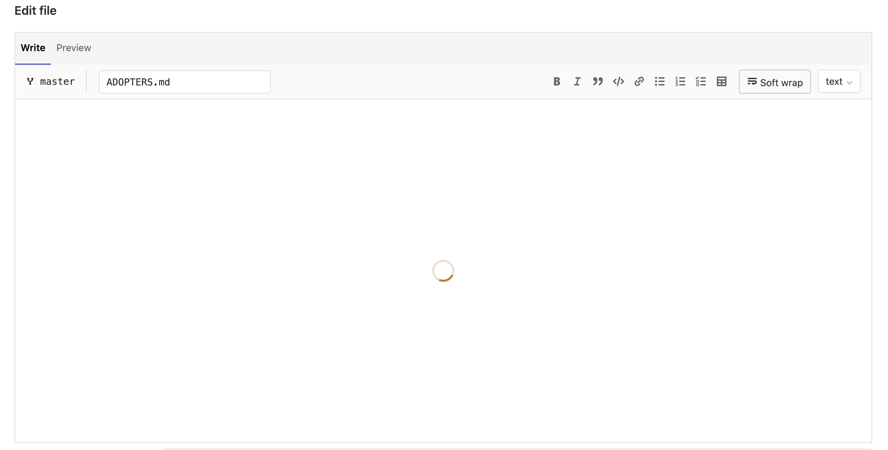
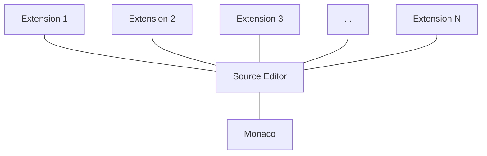
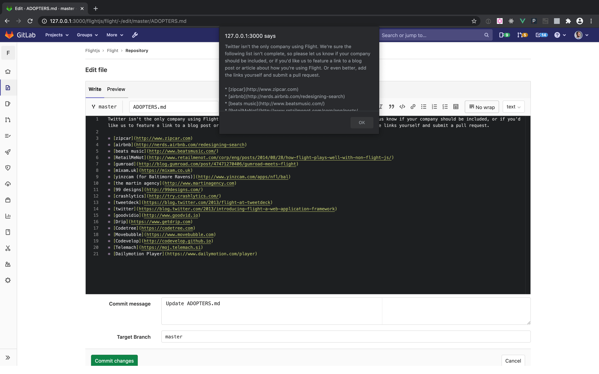

# Source Editor **(FREE)**

**Source Editor** provides the editing experience at GitLab. This thin wrapper around
[the Monaco editor](https://microsoft.github.io/monaco-editor/) provides necessary
helpers and abstractions, and extends Monaco [using extensions](#extensions). Multiple
GitLab features use it, including:

- [Web IDE](../../user/project/web_ide/index.md)
- [CI Linter](../../ci/lint.md)
- [Snippets](../../user/snippets.md)
- [Web Editor](../../user/project/repository/web_editor.md)
- [Security Policies](../../user/application_security/threat_monitoring/index.md)

## How to use Source Editor

Source Editor is framework-agnostic and can be used in any application, including both
Rails and Vue. To help with integration, we have the dedicated `<source-editor>`
Vue component, but the integration of Source Editor is generally straightforward:

1. Import Source Editor:

   ```javascript
   import SourceEditor from '~/editor/source_editor';
   ```

1. Initialize global editor for the view:

   ```javascript
   const editor = new SourceEditor({
     // Editor Options.
     // The list of all accepted options can be found at
     // https://microsoft.github.io/monaco-editor/api/enums/monaco.editor.editoroption.html
   });
   ```

1. Create an editor's instance:

   ```javascript
   editor.createInstance({
     // Source Editor configuration options.
   })
   ```

An instance of Source Editor accepts the following configuration options:

| Option | Required? | Description |
| -------------- | ------- | ---- |
| `el`           | `true`  | `HTML Node`: The element on which to render the editor. |
| `blobPath`     | `false` | `String`: The name of a file to render in the editor, used to identify the correct syntax highlighter to use with that file, or another file type. Can accept wildcards like `*.js` when the actual filename isn't known or doesn't play any role. |
| `blobContent`  | `false` | `String`: The initial content to render in the editor. |
| `extensions`   | `false` | `Array`: Extensions to use in this instance. |
| `blobGlobalId` | `false` | `String`: An auto-generated property.<br>**Note:** This property may go away in the future. Do not pass `blobGlobalId` unless you know what you're doing.|
| Editor Options | `false` | `Object(s)`: Any property outside of the list above is treated as an Editor Option for this particular instance. Use this field to override global Editor Options on the instance level. A full [index of Editor Options](https://microsoft.github.io/monaco-editor/api/enums/monaco.editor.editoroption.html) is available. |

## API

The editor uses the same public API as
[provided by Monaco editor](https://microsoft.github.io/monaco-editor/api/interfaces/monaco.editor.istandalonecodeeditor.html)
with additional functions on the instance level:

| Function              | Arguments | Description
| --------------------- | ----- | ----- |
| `updateModelLanguage` | `path`: String | Updates the instance's syntax highlighting to follow the extension of the passed `path`. Available only on the instance level.|
| `use`                 | Array of objects | Array of extensions to apply to the instance. Accepts only the array of _objects_. You must fetch the extensions' ES6 modules must be fetched and resolved in your views or components before they are passed to `use`. This property is available on _instance_ (applies extension to this particular instance) and _global editor_ (applies the same extension to all instances) levels. |
| Monaco Editor options | See [documentation](https://microsoft.github.io/monaco-editor/api/interfaces/monaco.editor.istandalonecodeeditor.html) | Default Monaco editor options |

## Tips

1. Editor's loading state.

   The loading state is built in to Source Editor, making spinners and loaders
   rarely needed in HTML. To benefit the built-in loading state, set the `data-editor-loading`
   property on the HTML element that should contain the editor. When bootstrapping,
   Source Editor shows the loader automatically.

   

1. Update syntax highlighting if the filename changes.

   ```javascript
   // fileNameEl here is the HTML input element that contains the file name
   fileNameEl.addEventListener('change', () => {
     this.editor.updateModelLanguage(fileNameEl.value);
   });
   ```

1. Get the editor's content.

   We may set up listeners on the editor for every change, but it rapidly can become
   an expensive operation. Instead, get the editor's content when it's needed.
   For example, on a form's submission:

   ```javascript
   form.addEventListener('submit', () => {
     my_content_variable = this.editor.getValue();
   });
   ```

1. Performance

   Even though Source Editor itself is extremely slim, it still depends on Monaco editor,
   which adds weight. Every time you add Source Editor to a view, the JavaScript bundle's
   size significantly increases, affecting your view's loading performance. We recommend
   you import the editor on demand if either:

   - You're uncertain if the view needs the editor.
   - The editor is a secondary element of the view.

   Loading Source Editor on demand is handled like loading any other module:

   ```javascript
   someActionFunction() {
     import(/* webpackChunkName: 'SourceEditor' */ '~/editor/source_editor').
       then(({ default: SourceEditor }) => {
         const editor = new SourceEditor();
         ...
       });
     ...
   }
   ```

## Extensions

Source Editor provides a universal, extensible editing tool to the whole product,
and doesn't depend on any particular group. Even though the Source Editor's core is owned by
[Create::Editor FE Team](https://about.gitlab.com/handbook/engineering/development/dev/create-editor/),
any group can own the extensions—the main functional elements. The goal of
Source Editor extensions is to keep the editor's core slim and stable. Any
needed features can be added as extensions to this core. Any group can
build and own new editing features without worrying about changes to Source Editor
breaking or overriding them.

You can depend on other modules in your extensions. This organization helps keep
the size of Source Editor's core at bay by importing dependencies only when needed.

Structurally, the complete implementation of Source Editor can be presented as this diagram:



An extension is an ES6 module that exports a JavaScript object:

```javascript
import { Position } from 'monaco-editor';

export default {
  navigateFileStart() {
    this.setPosition(new Position(1, 1));
  },
};

```

In the extension's functions, `this` refers to the current Source Editor instance.
Using `this`, you get access to the complete instance's API, such as the
`setPosition()` method in this particular case.

### Using an existing extension

Adding an extension to Source Editor's instance requires the following steps:

```javascript
import SourceEditor from '~/editor/source_editor';
import MyExtension from '~/my_extension';

const editor = new SourceEditor().createInstance({
  ...
});
editor.use(MyExtension);
```

### Creating an extension

Let's create our first Source Editor extension. Extensions are
[ES6 modules](https://hacks.mozilla.org/2015/08/es6-in-depth-modules/) exporting a
basic `Object`, used to extend Source Editor's features. As a test, let's
create an extension that extends Source Editor with a new function that, when called,
outputs the editor's content in `alert`.

`~/my_folder/my_fancy_extension.js:`

```javascript
export default {
  throwContentAtMe() {
    alert(this.getValue());
  },
};
```

In the code example, `this` refers to the instance. By referring to the instance,
we can access the complete underlying
[Monaco editor API](https://microsoft.github.io/monaco-editor/api/interfaces/monaco.editor.istandalonecodeeditor.html),
which includes functions like `getValue()`.

Now let's use our extension:

`~/my_folder/component_bundle.js`:

```javascript
import SourceEditor from '~/editor/source_editor';
import MyFancyExtension from './my_fancy_extension';

const editor = new SourceEditor().createInstance({
  ...
});
editor.use(MyFancyExtension);
...
someButton.addEventListener('click', () => {
  editor.throwContentAtMe();
});
```

First of all, we import Source Editor and our new extension. Then we create the
editor and its instance. By default Source Editor has no `throwContentAtMe` method.
But the `editor.use(MyFancyExtension)` line brings that method to our instance.
After that, we can use it any time we need it. In this case, we call it when some
theoretical button has been clicked.

This script would result in an alert containing the editor's content when `someButton` is clicked.



### Tips

1. Performance

   Just like Source Editor itself, any extension can be loaded on demand to not harm
   loading performance of the views:

   ```javascript
   const EditorPromise = import(
     /* webpackChunkName: 'SourceEditor' */ '~/editor/source_editor'
   );
   const MarkdownExtensionPromise = import('~/editor/source_editor_markdown_ext');

   Promise.all([EditorPromise, MarkdownExtensionPromise])
     .then(([{ default: SourceEditor }, { default: MarkdownExtension }]) => {
       const editor = new SourceEditor().createInstance({
         ...
       });
       editor.use(MarkdownExtension);
     });
   ```

1. Using multiple extensions

   Just pass the array of extensions to your `use` method:

   ```javascript
   editor.use([FileTemplateExtension, MyFancyExtension]);
   ```
