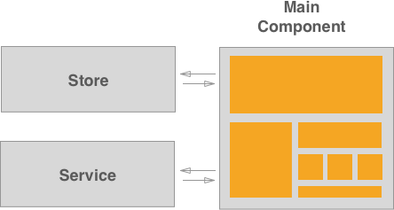

# Vue

For more complex frontend features, we recommend using Vue.js. It shares
some ideas with React.js as well as Angular.

To get started with Vue, read through [their documentation][vue-docs].

## When to use Vue.js

We recommend using Vue for more complex features. Here are some guidelines for when to use Vue.js:

- If you are starting a new feature or refactoring an old one that highly interacts with the DOM;
- For real time data updates;
- If you are creating a component that will be reused elsewhere;

## When not to use Vue.js

We don't want to refactor all GitLab frontend code into Vue.js, here are some guidelines for
when not to use Vue.js:

- Adding or changing static information;
- Features that highly depend on jQuery will be hard to work with Vue.js;
- Features without reactive data;

As always, the Frontend Architectural Experts are available to help with any Vue or JavaScript questions.

## Vue architecture

All new features built with Vue.js must follow a [Flux architecture][flux].
The main goal we are trying to achieve is to have only one data flow and only one data entry.
In order to achieve this goal, you can either use [vuex](#vuex) or use the [store pattern][state-management], explained below:

Each Vue bundle needs a Store - where we keep all the data -,a Service - that we use to communicate with the server - and a main Vue component.

Think of the Main Vue Component as the entry point of your application. This is the only smart
component that should exist in each Vue feature.
This component is responsible for:
1. Calling the Service to get data from the server
1. Calling the Store to store the data received
1. Mounting all the other components

  

You can also read about this architecture in vue docs about [state management][state-management]
and about [one way data flow][one-way-data-flow].

### Components, Stores and Services

In some features implemented with Vue.js, like the [issue board][issue-boards]
or [environments table][environments-table]
you can find a clear separation of concerns:

```
new_feature
├── components
│   └── component.vue
│   └── ...
├── stores
│  └── new_feature_store.js
├── services
│  └── new_feature_service.js
├── new_feature_bundle.js
```
_For consistency purposes, we recommend you to follow the same structure._

Let's look into each of them:

### A `*_bundle.js` file

This is the index file of your new feature. This is where the root Vue instance
of the new feature should be.

The Store and the Service should be imported and initialized in this file and
provided as a prop to the main component.

Don't forget to follow [these steps.][page_specific_javascript]

### Bootstrapping Gotchas
#### Providing data from Haml to JavaScript
While mounting a Vue application may be a need to provide data from Rails to JavaScript.
To do that, provide the data through `data` attributes in the HTML element and query them while mounting the application.

_Note:_ You should only do this while initing the application, because the mounted element will be replaced with Vue-generated DOM.

The advantage of providing data from the DOM to the Vue instance through `props` in the `render` function
instead of querying the DOM inside the main vue component is that makes tests easier by avoiding the need to
create a fixture or an HTML element in the unit test. See the following example:

```javascript
// haml
.js-vue-app{ data: { endpoint: 'foo' }}

document.addEventListener('DOMContentLoaded', () => new Vue({
  el: '.js-vue-app',
  data() {
    const dataset = this.$options.el.dataset;
    return {
      endpoint: dataset.endpoint,
    };
  },
  render(createElement) {
    return createElement('my-component', {
      props: {
        endpoint: this.isLoading,
      },
    });
  },
}));
```

#### Accessing the `gl` object
When we need to query the `gl` object for data that won't change during the application's lyfecyle, we should do it in the same place where we query the DOM.
By following this practice, we can avoid the need to mock the `gl` object, which will make tests easier.
It should be done while initializing our Vue instance, and the data should be provided as `props` to the main component:

##### example:
```javascript

document.addEventListener('DOMContentLoaded', () => new Vue({
  el: '.js-vue-app',
  render(createElement) {
    return createElement('my-component', {
      props: {
        username: gon.current_username,
      },
    });
  },
}));
```

### A folder for Components

This folder holds all components that are specific of this new feature.
If you need to use or create a component that will probably be used somewhere
else, please refer to `vue_shared/components`.

A good thumb rule to know when you should create a component is to think if
it will be reusable elsewhere.

For example, tables are used in a quite amount of places across GitLab, a table
would be a good fit for a component. On the other hand, a table cell used only
in one table would not be a good use of this pattern.

You can read more about components in Vue.js site, [Component System][component-system]

#### Components Gotchas
1. Using SVGs in components: To use an SVG in a template we need to make it a property we can access through the component.
A `prop` and a property returned by the `data` functions require `vue` to set a `getter` and a `setter` for each of them.
The SVG should be a computed property in order to improve performance, note that computed properties are cached based on their dependencies.

```javascript
// bad
import svg from 'svg.svg';
data() {
  return {
    myIcon: svg,
  };
};

// good
import svg from 'svg.svg';
computed: {
  myIcon() {
    return svg;
  }
}
```

### A folder for the Store

The Store is a class that allows us to manage the state in a single
source of truth. It is not aware of the service or the components.

The concept we are trying to follow is better explained by Vue documentation
itself, please read this guide: [State Management][state-management]

### A folder for the Service

The Service is a class used only to communicate with the server.
It does not store or manipulate any data. It is not aware of the store or the components.
We use [axios][axios] to communicate with the server.
Refer to [axios](axios.md) for more details.

Axios instance should only be imported in the service file.

  ```javascript
  import axios from 'javascripts/lib/utils/axios_utils';
  ```

### End Result

The following example shows an  application:

```javascript
// store.js
export default class Store {

  /**
   * This is where we will iniatialize the state of our data.
   * Usually in a small SPA you don't need any options when starting the store. In the case you do
   * need guarantee it's an Object and it's documented.
   *
   * @param  {Object} options
   */
  constructor(options) {
    this.options = options;

    // Create a state object to handle all our data in the same place
    this.todos = []:
  }

  setTodos(todos = []) {
    this.todos = todos;
  }

  addTodo(todo) {
    this.todos.push(todo);
  }

  removeTodo(todoID) {
    const state = this.todos;

    const newState = state.filter((element) => {element.id !== todoID});

    this.todos = newState;
  }
}

// service.js
import axios from 'javascripts/lib/utils/axios_utils'

export default class Service {
  constructor(options) {
    this.todos = axios.create({
      baseURL: endpoint.todosEndpoint
    });

  }

  getTodos() {
    return this.todos.get();
  }

  addTodo(todo) {
    return this.todos.put(todo);
  }
}
// todo_component.vue
<script>
export default {
  props: {
    data: {
      type: Object,
      required: true,
    },
  }
}
</script>
<template>
  <div>
    <h1>
      Title: {{data.title}}
    </h1>
    <p>
      {{data.text}}
    </p>
  </div>
</template>

// todos_main_component.vue
<script>
import Store from 'store';
import Service from 'service';
import TodoComponent from 'todoComponent';
export default {
  /**
   * Although most data belongs in the store, each component it's own state.
   * We want to show a loading spinner while we are fetching the todos, this state belong
   * in the component.
   *
   * We need to access the store methods through all methods of our component.
   * We need to access the state of our store.
   */
  data() {
    const store = new Store();

    return {
      isLoading: false,
      store: store,
      todos: store.todos,
    };
  },

  components: {
    todo: TodoComponent,
  },

  created() {
    this.service = new Service('todos');

    this.getTodos();
  },

  methods: {
    getTodos() {
      this.isLoading = true;

      this.service.getTodos()
        .then(response => response.json())
        .then((response) => {
          this.store.setTodos(response);
          this.isLoading = false;
        })
        .catch(() => {
          this.isLoading = false;
          // Show an error
        });
    },

    addTodo(todo) {
      this.service.addTodo(todo)
      then(response => response.json())
      .then((response) => {
        this.store.addTodo(response);
      })
      .catch(() => {
        // Show an error
      });
    }
  }
}
</script>
<template>
  <div class="container">
    <div v-if="isLoading">
      <i
        class="fa fa-spin fa-spinner"
        aria-hidden="true" />
    </div>

    <div
      v-if="!isLoading"
      class="js-todo-list">
      <template v-for='todo in todos'>
        <todo :data="todo" />
      </template>

      <button
        @click="addTodo"
        class="js-add-todo">
        Add Todo
      </button>
    </div>
  <div>
</template>

// bundle.js
import todoComponent from 'todos_main_component.vue';

new Vue({
  el: '.js-todo-app',
  components: {
    todoComponent,
  },
  render: createElement => createElement('todo-component' {
    props: {
      someProp: [],
    }
  }),
});

```

The [issue boards service][issue-boards-service]
is a good example of this pattern.

## Style guide

Please refer to the Vue section of our [style guide](style_guide_js.md#vue-js)
for best practices while writing your Vue components and templates.

## Testing Vue Components

Each Vue component has a unique output. This output is always present in the render function.

Although we can test each method of a Vue component individually, our goal must be to test the output
of the render/template function, which represents the state at all times.

Make use of Vue Resource Interceptors to mock data returned by the service.

Here's how we would test the Todo App above:

```javascript
import component from 'todos_main_component';

describe('Todos App', () => {
  it('should render the loading state while the request is being made', () => {
    const Component = Vue.extend(component);

    const vm = new Component().$mount();

    expect(vm.$el.querySelector('i.fa-spin')).toBeDefined();
  });

  describe('with data', () => {
    // Mock the service to return data
    const interceptor = (request, next) => {
      next(request.respondWith(JSON.stringify([{
        title: 'This is a todo',
        body: 'This is the text'
      }]), {
        status: 200,
      }));
    };

    let vm;

    beforeEach(() => {
      Vue.http.interceptors.push(interceptor);

      const Component = Vue.extend(component);

      vm = new Component().$mount();
    });

    afterEach(() => {
      Vue.http.interceptors = _.without(Vue.http.interceptors, interceptor);
    });


    it('should render todos', (done) => {
      setTimeout(() => {
        expect(vm.$el.querySelectorAll('.js-todo-list div').length).toBe(1);
        done();
      }, 0);
    });
  });

  describe('add todo', () => {
    let vm;
    beforeEach(() => {
      const Component = Vue.extend(component);
      vm = new Component().$mount();
    });
    it('should add a todos', (done) => {
      setTimeout(() => {
        vm.$el.querySelector('.js-add-todo').click();

        // Add a new interceptor to mock the add Todo request
        Vue.nextTick(() => {
          expect(vm.$el.querySelectorAll('.js-todo-list div').length).toBe(2);
        });
      }, 0);
    });
  });
});
```
#### `mountComponent` helper
There is a helper in `spec/javascripts/helpers/vue_mount_component_helper.js` that allows you to mount a component with the given props:

```javascript
import Vue from 'vue';
import mountComponent from 'helpers/vue_mount_component_helper.js'
import component from 'component.vue'

const Component = Vue.extend(component);
const data = {prop: 'foo'};
const vm = mountComponent(Component, data);
```

#### Test the component's output
The main return value of a Vue component is the rendered output. In order to test the component we
need to test the rendered output. [Vue][vue-test] guide's to unit test show us exactly that:

### Stubbing API responses
Refer to [mock axios](axios.md#mock-axios-response-on-tests)


## Vuex
To manage the state of an application you may use [Vuex][vuex-docs].

_Note:_ All of the below is explained in more detail in the official [Vuex documentation][vuex-docs].

### Separation of concerns
Vuex is composed of State, Getters, Mutations, Actions and Modules.

When a user clicks on an action, we need to `dispatch` it. This action will `commit` a mutation that will change the state.
_Note:_ The action itself will not update the state, only a mutation should update the state.

#### File structure
When using Vuex at GitLab, separate this concerns into different files to improve readability. If you can, separate the Mutation Types as well:

```
└── store
  ├── index.js          # where we assemble modules and export the store
  ├── actions.js        # actions
  ├── mutations.js      # mutations
  ├── getters.js        # getters
  └── mutation_types.js # mutation types
```
The following examples show an application that lists and adds users to the state.

##### `index.js`
This is the entry point for our store. You can use the following as a guide:

```javascript
import Vue from 'vue';
import Vuex from 'vuex';
import * as actions from './actions';
import * as getters from './getters';
import mutations from './mutations';

Vue.use(Vuex);

export default new Vuex.Store({
  actions,
  getters,
  mutations,
  state: {
    users: [],
  },
});
```
_Note:_ If the state of the application is too complex, an individual file for the state may be better.

##### `actions.js`
An action commits a mutation. In this file, we will write the actions that will commit the respective mutation:

```javascript
  import * as types from './mutation_types';

  export const addUser = ({ commit }, user) => {
    commit(types.ADD_USER, user);
  };
```

To dispatch an action from a component, use the `mapActions` helper:
```javascript
import { mapActions } from 'vuex';

{
  methods: {
    ...mapActions([
      'addUser',
    ]),
    onClickUser(user) {
      this.addUser(user);
    },
  },
};
```

##### `getters.js`
Sometimes we may need to get derived state based on store state, like filtering for a specific prop. This can be done through the `getters`:

```javascript
// get all the users with pets
export getUsersWithPets = (state, getters) => {
  return state.users.filter(user => user.pet !== undefined);
};
```

To access a getter from a component, use the `mapGetters` helper:
```javascript
import { mapGetters } from 'vuex';

{
  computed: {
    ...mapGetters([
      'getUsersWithPets',
    ]),
  },
};
```

##### `mutations.js`
The only way to actually change state in a Vuex store is by committing a mutation.

```javascript
  import * as types from './mutation_types';

  export default {
    [types.ADD_USER](state, user) {
      state.users.push(user);
    },
  };
```

##### `mutations_types.js`
From [vuex mutations docs][vuex-mutations]:
> It is a commonly seen pattern to use constants for mutation types in various Flux implementations. This allows the code to take advantage of tooling like linters, and putting all constants in a single file allows your collaborators to get an at-a-glance view of what mutations are possible in the entire application.

```javascript
export const ADD_USER = 'ADD_USER';
```

### How to include the store in your application
The store should be included in the main component of your application:
```javascript
  // app.vue
  import store from 'store'; // it will include the index.js file

  export default {
    name: 'application',
    store,
    ...
  };
```

### Vuex Gotchas
1. Avoid calling a mutation directly. Always use an action to commit a mutation. Doing so will keep consistency through out the application. From Vuex docs:

  >  why don't we just call store.commit('action') directly? Well, remember that mutations must be synchronous? Actions aren't. We can perform asynchronous operations inside an action.

  ```javascript
    // component.vue

    // bad
    created() {
      this.$store.commit('mutation');
    }

    // good
    created() {
      this.$store.dispatch('action');
    }
  ```
1. When possible, use mutation types instead of hardcoding strings. It will be less error prone.
1. The State will be accessible in all components descending from the use where the store is instantiated.

### Testing Vuex
#### Testing Vuex concerns
Refer to [vuex docs][vuex-testing] regarding testing Actions, Getters and Mutations.

#### Testing components that need a store
Smaller components might use `store` properties to access the data.
In order to write unit tests for those components, we need to include the store and provide the correct state:

```javascript
//component_spec.js
import Vue from 'vue';
import store from './store';
import component from './component.vue'

describe('component', () => {
  let vm;
  let Component;

  beforeEach(() => {
    Component = Vue.extend(issueActions);
  });

  afterEach(() => {
    vm.$destroy();
  });

  it('should show a user', () => {
    const user = {
      name: 'Foo',
      age: '30',
    };

    // populate the store
    store.dispatch('addUser', user);

    vm = new Component({
      store,
      propsData: props,
    }).$mount();
  });
});
```

[vue-docs]: http://vuejs.org/guide/index.html
[issue-boards]: https://gitlab.com/gitlab-org/gitlab-ce/tree/master/app/assets/javascripts/boards
[environments-table]: https://gitlab.com/gitlab-org/gitlab-ce/tree/master/app/assets/javascripts/environments
[page_specific_javascript]: https://docs.gitlab.com/ce/development/frontend.html#page-specific-javascript
[component-system]: https://vuejs.org/v2/guide/#Composing-with-Components
[state-management]: https://vuejs.org/v2/guide/state-management.html#Simple-State-Management-from-Scratch
[one-way-data-flow]: https://vuejs.org/v2/guide/components.html#One-Way-Data-Flow
[vue-test]: https://vuejs.org/v2/guide/unit-testing.html
[issue-boards-service]: https://gitlab.com/gitlab-org/gitlab-ce/blob/master/app/assets/javascripts/boards/services/board_service.js.es6
[flux]: https://facebook.github.io/flux
[vuex-docs]: https://vuex.vuejs.org
[vuex-structure]: https://vuex.vuejs.org/en/structure.html
[vuex-mutations]: https://vuex.vuejs.org/en/mutations.html
[vuex-testing]: https://vuex.vuejs.org/en/testing.html
[axios]: https://github.com/axios/axios
[axios-interceptors]: https://github.com/axios/axios#interceptors
