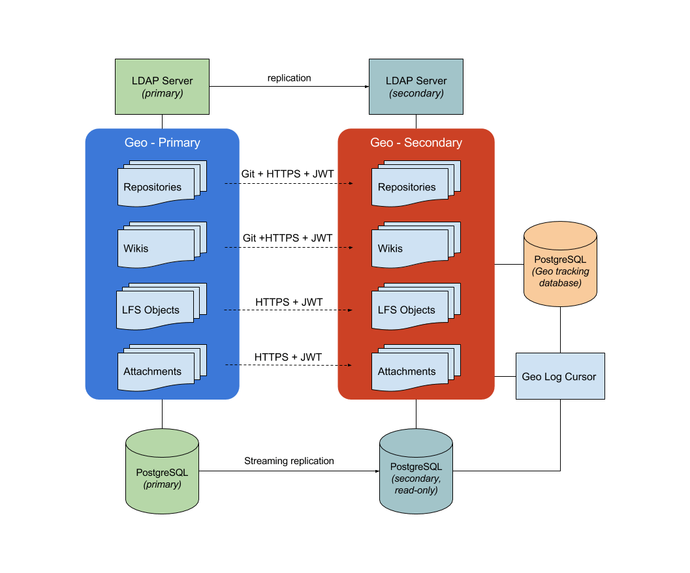

# Geo (development) **(PREMIUM ONLY)**

Geo connects GitLab instances together. One GitLab instance is
designated as a **primary** node and can be run with multiple
**secondary** nodes. Geo orchestrates quite a few components that can be seen on
the diagram below and are described in more detail within this document.



## Replication layer

Geo handles replication for different components:

- [Database](#database-replication): includes the entire application, except cache and jobs.
- [Git repositories](#repository-replication): includes both projects and wikis.
- [Uploaded blobs](#uploads-replication): includes anything from images attached on issues
  to raw logs and assets from CI.

With the exception of the Database replication, on a *secondary* node, everything is coordinated
by the [Geo Log Cursor](#geo-log-cursor).

### Geo Log Cursor daemon

The [Geo Log Cursor daemon](#geo-log-cursor-daemon) is a separate process running on
each **secondary** node. It monitors the [Geo Event Log](#geo-event-log)
for new events and creates background jobs for each specific event type.

For example when a repository is updated, the Geo **primary** node creates
a Geo event with an associated repository updated event. The Geo Log Cursor daemon
picks the event up and schedules a `Geo::ProjectSyncWorker` job which will
use the `Geo::RepositorySyncService` and `Geo::WikiSyncService` classes
to update the repository and the wiki respectively.

The Geo Log Cursor daemon can operate in High Availability mode automatically.
The daemon will try to acquire a lock from time to time and once acquired, it
will behave as the *active* daemon.

Any additional running daemons on the same node, will be in standby
mode, ready to resume work if the *active* daemon releases its lock.

We use the [`ExclusiveLease`](https://www.rubydoc.info/github/gitlabhq/gitlabhq/Gitlab/ExclusiveLease) lock type with a small TTL, that is renewed at every
pooling cycle. That allows us to implement this global lock with a timeout.

At the end of the pooling cycle, if the daemon can't renew and/or reacquire
the lock, it switches to standby mode.

### Database replication

Geo uses [streaming replication](#streaming-replication) to replicate
the database from the **primary** to the **secondary** nodes. This
replication gives the **secondary** nodes access to all the data saved
in the database. So users can log in on the **secondary** and read all
the issues, merge requests, etc. on the **secondary** node.

### Repository replication

Geo also replicates repositories. Each **secondary** node keeps track of
the state of every repository in the [tracking database](#tracking-database).

There are a few ways a repository gets replicated by the:

- [Repository Sync worker](#repository-sync-worker).
- [Geo Log Cursor](#geo-log-cursor).

#### Project Registry

The `Geo::ProjectRegistry` class defines the model used to track the
state of repository replication. For each project in the main
database, one record in the tracking database is kept.

It records the following about repositories:

- The last time they were synced.
- The last time they were successfully synced.
- If they need to be resynced.
- When a retry should be attempted.
- The number of retries.
- If and when they were verified.

It also stores these attributes for project wikis in dedicated columns.

#### Repository Sync worker

The `Geo::RepositorySyncWorker` class runs periodically in the
background and it searches the `Geo::ProjectRegistry` model for
projects that need updating. Those projects can be:

- Unsynced: Projects that have never been synced on the **secondary**
  node and so do not exist yet.
- Updated recently: Projects that have a `last_repository_updated_at`
  timestamp that is more recent than the `last_repository_successful_sync_at`
  timestamp in the `Geo::ProjectRegistry` model.
- Manual: The admin can manually flag a repository to resync in the
  [Geo admin panel](../user/admin_area/geo_nodes.md).

When we fail to fetch a repository on the secondary `RETRIES_BEFORE_REDOWNLOAD`
times, Geo does a so-called _redownload_. It will do a clean clone
into the `@geo-temporary` directory in the root of the storage. When
it's successful, we replace the main repo with the newly cloned one.

### Uploads replication

File uploads are also being replicated to the **secondary** node. To
track the state of syncing, the `Geo::UploadRegistry` model is used.

#### Upload Registry

Similar to the [Project Registry](#project-registry), there is a
`Geo::UploadRegistry` model that tracks the synced uploads.

CI Job Artifacts and LFS objects are synced in a similar way as uploads,
but they are tracked by `Geo::JobArtifactRegistry`, and `Geo::LfsObjectRegistry`
models respectively.

#### File Download Dispatch worker

Also similar to the [Repository Sync worker](#repository-sync-worker),
there is a `Geo::FileDownloadDispatchWorker` class that is run
periodically to sync all uploads that aren't synced to the Geo
**secondary** node yet.

Files are copied via HTTP(s) and initiated via the
`/api/v4/geo/transfers/:type/:id` endpoint,
e.g. `/api/v4/geo/transfers/lfs/123`.

## Authentication

To authenticate file transfers, each `GeoNode` record has two fields:

- A public access key (`access_key` field).
- A secret access key (`secret_access_key` field).

The **secondary** node authenticates itself via a [JWT request](https://jwt.io/).
When the **secondary** node wishes to download a file, it sends an
HTTP request with the `Authorization` header:

```
Authorization: GL-Geo <access_key>:<JWT payload>
```

The **primary** node uses the `access_key` field to look up the
corresponding **secondary** node and decrypts the JWT payload,
which contains additional information to identify the file
request. This ensures that the **secondary** node downloads the right
file for the right database ID. For example, for an LFS object, the
request must also include the SHA256 sum of the file. An example JWT
payload looks like:

```
{ "data": { sha256: "31806bb23580caab78040f8c45d329f5016b0115" }, iat: "1234567890" }
```

If the requested file matches the requested SHA256 sum, then the Geo
**primary** node sends data via the [X-Sendfile](https://www.nginx.com/resources/wiki/start/topics/examples/xsendfile/)
feature, which allows NGINX to handle the file transfer without tying
up Rails or Workhorse.

NOTE: **Note:**
JWT requires synchronized clocks between the machines
involved, otherwise it may fail with an encryption error.

## Git Push to Geo secondary

The Git Push Proxy exists as a functionality built inside the `gitlab-shell` component.
It is active on a **secondary** node only. It allows the user that has cloned a repository
from the secondary node to push to the same URL.

Git `push` requests directed to a **secondary** node will be sent over to the **primary** node,
while `pull` requests will continue to be served by the **secondary** node for maximum efficiency.

HTTPS and SSH requests are handled differently:

- With HTTPS, we will give the user a `HTTP 302 Redirect` pointing to the project on the **primary** node.
  The Git client is wise enough to understand that status code and process the redirection.
- With SSH, because there is no equivalent way to perform a redirect, we have to proxy the request.
  This is done inside [`gitlab-shell`](https://gitlab.com/gitlab-org/gitlab-shell), by first translating the request
  to the HTTP protocol, and then proxying it to the **primary** node.

The [`gitlab-shell`](https://gitlab.com/gitlab-org/gitlab-shell) daemon knows when to proxy based on the response
from `/api/v4/allowed`. A special `HTTP 300` status code is returned and we execute a "custom action",
specified in the response body. The response contains additional data that allows the proxied `push` operation
to happen on the **primary** node.

## Using the Tracking Database

Along with the main database that is replicated, a Geo **secondary**
node has its own separate [Tracking database](#tracking-database).

The tracking database contains the state of the **secondary** node.

Any database migration that needs to be run as part of an upgrade
needs to be applied to the tracking database on each **secondary** node.

### Configuration

The database configuration is set in [`config/database_geo.yml`](https://gitlab.com/gitlab-org/gitlab/blob/master/config/database_geo.yml.postgresql).
The directory [`ee/db/geo`](https://gitlab.com/gitlab-org/gitlab/tree/master/ee/db/geo)
contains the schema and migrations for this database.

To write a migration for the database, use the `GeoMigrationGenerator`:

```
rails g geo_migration [args] [options]
```

To migrate the tracking database, run:

```
bundle exec rake geo:db:migrate
```

### Foreign Data Wrapper

> Introduced in GitLab 10.1.

Foreign Data Wrapper ([FDW](#fdw)) is used by the [Geo Log Cursor](#geo-log-cursor) and improves
the performance of many synchronization operations.

FDW is a PostgreSQL extension ([`postgres_fdw`](https://www.postgresql.org/docs/current/postgres-fdw.html)) that is enabled within
the Geo Tracking Database (on a **secondary** node), which allows it
to connect to the readonly database replica and perform queries and filter
data from both instances.

While FDW is available in older versions of PostgreSQL, we needed to
raise the minimum required version to 9.6 as this includes many
performance improvements to the FDW implementation.

This persistent connection is configured as an FDW server
named `gitlab_secondary`. This configuration exists within the database's user
context only. To access the `gitlab_secondary`, GitLab needs to use the
same database user that had previously been configured.

The Geo Tracking Database accesses the readonly database replica via FDW as a regular user,
limited by its own restrictions. The credentials are configured as a
`USER MAPPING` associated with the `SERVER` mapped previously
(`gitlab_secondary`).

FDW configuration and credentials definition are managed automatically by the
Omnibus GitLab `gitlab-ctl reconfigure` command.

#### Refeshing the Foreign Tables

Whenever a new Geo node is configured or the database schema changes on the
**primary** node, you must refresh the foreign tables on the **secondary** node
by running the following:

```sh
bundle exec rake geo:db:refresh_foreign_tables
```

Failure to do this will prevent the **secondary** node from
functioning properly. The **secondary** node will generate error
messages, as the following PostgreSQL error:

```
ERROR:  relation "gitlab_secondary.ci_job_artifacts" does not exist at character 323
STATEMENT:                SELECT a.attname, format_type(a.atttypid, a.atttypmod),
                          pg_get_expr(d.adbin, d.adrelid), a.attnotnull, a.atttypid, a.atttypmod
                     FROM pg_attribute a LEFT JOIN pg_attrdef d
                       ON a.attrelid = d.adrelid AND a.attnum = d.adnum
                    WHERE a.attrelid = '"gitlab_secondary"."ci_job_artifacts"'::regclass
                      AND a.attnum > 0 AND NOT a.attisdropped
                    ORDER BY a.attnum
```

#### Accessing data from a Foreign Table

At the SQL level, all you have to do is `SELECT` data from `gitlab_secondary.*`.

Here's an example of how to access all projects from the Geo Tracking Database's FDW:

```sql
SELECT * FROM gitlab_secondary.projects;
```

As a more real-world example, this is how you filter for unarchived projects
on the Tracking Database:

```sql
SELECT project_registry.*
  FROM project_registry
  JOIN gitlab_secondary.projects
    ON (project_registry.project_id = gitlab_secondary.projects.id
   AND gitlab_secondary.projects.archived IS FALSE)
```

At the ActiveRecord level, we have additional Models that represent the
foreign tables. They must be mapped in a slightly different way, and they are read-only.

Check the existing FDW models in `ee/app/models/geo/fdw` for reference.

From a developer's perspective, it's no different than creating a model that
represents a Database View.

With the examples above, you can access the projects with:

```ruby
Geo::Fdw::Project.all
```

and to access the `ProjectRegistry` filtering by unarchived projects:

```ruby
# We have to use Arel here:
project_registry_table = Geo::ProjectRegistry.arel_table
fdw_project_table = Geo::Fdw::Project.arel_table

project_registry_table.join(fdw_project_table)
                      .on(project_registry_table[:project_id].eq(fdw_project_table[:id]))
                      .where((fdw_project_table[:archived]).eq(true)) # if you append `.to_sql` you can check generated query
```

## Finders

Geo uses [Finders](https://gitlab.com/gitlab-org/gitlab/tree/master/app/finders),
which are classes take care of the heavy lifting of looking up
projects/attachments/etc. in the tracking database and main database.

### Finders Performance

The Finders need to compare data from the main database with data in
the tracking database. For example, counting the number of synced
projects normally involves retrieving the project IDs from one
database and checking their state in the other database. This is slow
and requires a lot of memory.

To overcome this, the Finders use [FDW](#fdw), or Foreign Data
Wrappers. This allows a regular `JOIN` between the main database and
the tracking database.

## Redis

Redis on the **secondary** node works the same as on the **primary**
node. It is used for caching, storing sessions, and other persistent
data.

Redis data replication between **primary** and **secondary** node is
not used, so sessions etc. aren't shared between nodes.

## Object Storage

GitLab can optionally use Object Storage to store data it would
otherwise store on disk. These things can be:

- LFS Objects
- CI Job Artifacts
- Uploads

Objects that are stored in object storage, are not handled by Geo. Geo
ignores items in object storage. Either:

- The object storage layer should take care of its own geographical
  replication.
- All secondary nodes should use the same storage node.

## Verification

### Repository verification

Repositories are verified with a checksum.

The **primary** node calculates a checksum on the repository. It
basically hashes all Git refs together and stores that hash in the
`project_repository_states` table of the database.

The **secondary** node does the same to calculate the hash of its
clone, and compares the hash with the value the **primary** node
calculated. If there is a mismatch, Geo will mark this as a mismatch
and the administrator can see this in the [Geo admin panel](../user/admin_area/geo_nodes.md).

## Glossary

### Primary node

A **primary** node is the single node in a Geo setup that read-write
capabilities. It's the single source of truth and the Geo
**secondary** nodes replicate their data from there.

In a Geo setup, there can only be one **primary** node. All
**secondary** nodes connect to that **primary**.

### Secondary node

A **secondary** node is a read-only replica of the **primary** node
running in a different geographical location.

### Streaming replication

Geo depends on the streaming replication feature of PostgreSQL. It
completely replicates the database data and the database schema. The
database replica is a read-only copy.

Streaming replication depends on the Write Ahead Logs, or WAL. Those
logs are copied over to the replica and replayed there.

Since streaming replication also replicates the schema, the database
migration do not need to run on the secondary nodes.

### Tracking database

A database on each Geo **secondary** node that keeps state for the node
on which it resides. Read more in [Using the Tracking database](#using-the-tracking-database).

### FDW

Foreign Data Wrapper, or FDW, is a feature built-in in PostgreSQL. It
allows data to be queried from different data sources. In Geo, it's
used to query data from different PostgreSQL instances.

## Geo Event Log

The Geo **primary** stores events in the `geo_event_log` table. Each
entry in the log contains a specific type of event. These type of
events include:

- Repository Deleted event
- Repository Renamed event
- Repositories Changed event
- Repository Created event
- Hashed Storage Migrated event
- Lfs Object Deleted event
- Hashed Storage Attachments event
- Job Artifact Deleted event
- Upload Deleted event

### Geo Log Cursor

The process running on the **secondary** node that looks for new
`Geo::EventLog` rows.

## Code features

### `Gitlab::Geo` utilities

Small utility methods related to Geo go into the
[`ee/lib/gitlab/geo.rb`](https://gitlab.com/gitlab-org/gitlab/blob/master/ee/lib/gitlab/geo.rb)
file.

Many of these methods are cached using the `RequestStore` class, to
reduce the performance impact of using the methods throughout the
codebase.

#### Current node

The class method `.current_node` returns the `GeoNode` record for the
current node.

We use the `host`, `port`, and `relative_url_root` values from
`gitlab.yml` and search in the database to identify which node we are
in (see `GeoNode.current_node`).

#### Primary or secondary

To determine whether the current node is a **primary** node or a
**secondary** node use the `.primary?` and `.secondary?` class
methods.

It is possible for these methods to both return `false` on a node when
the node is not enabled. See [Enablement](#enablement).

#### Geo Database configured?

There is also an additional gotcha when dealing with things that
happen during initialization time. In a few places, we use the
`Gitlab::Geo.geo_database_configured?` method to check if the node has
the tracking database, which only exists on the **secondary**
node. This overcomes race conditions that could happen during
bootstrapping of a new node.

#### Enablement

We consider Geo feature enabled when the user has a valid license with the
feature included, and they have at least one node defined at the Geo Nodes
screen.

See `Gitlab::Geo.enabled?` and `Gitlab::Geo.license_allows?` methods.

#### Read-only

All Geo **secondary** nodes are read-only.

The general principle of a [read-only database](verifying_database_capabilities.md#read-only-database)
applies to all Geo **secondary** nodes. So the
`Gitlab::Database.read_only?` method will always return `true` on a
**secondary** node.

When some write actions are not allowed because the node is a
**secondary**, consider adding the `Gitlab::Database.read_only?` or
`Gitlab::Database.read_write?` guard, instead of `Gitlab::Geo.secondary?`.

The database itself will already be read-only in a replicated setup,
so we don't need to take any extra step for that.

## Steps needed to replicate a new data type

As GitLab evolves, we constantly need to add new resources to the Geo replication system.
The implementation depends on resource specifics, but there are several things
that need to be taken care of:

- Event generation on the primary site. Whenever a new resource is changed/updated, we need to
  create a task for the Log Cursor.
- Event handling. The Log Cursor needs to have a handler for every event type generated by the primary site.
- Dispatch worker (cron job). Make sure the backfill condition works well.
- Sync worker.
- Registry with all possible states.
- Verification.
- Cleaner. When sync settings are changed for the secondary site, some resources need to be cleaned up.
- Geo Node Status. We need to provide API endpoints as well as some presentation in the GitLab Admin Area.
- Health Check. If we can perform some pre-cheсks and make node unhealthy if something is wrong, we should do that.
  The `rake gitlab:geo:check` command has to be updated too.

## History of communication channel

The communication channel has changed since first iteration, you can
check here historic decisions and why we moved to new implementations.

### Custom code (GitLab 8.6 and earlier)

In GitLab versions before 8.6, custom code is used to handle
notification from **primary** node to **secondary** nodes by HTTP
requests.

### System hooks (GitLab 8.7 to 9.5)

Later, it was decided to move away from custom code and begin using
system hooks. More people were using them, so
many would benefit from improvements made to this communication layer.

There is a specific **internal** endpoint in our API code (Grape),
that receives all requests from this System Hooks:
`/api/v4/geo/receive_events`.

We switch and filter from each event by the `event_name` field.

### Geo Log Cursor (GitLab 10.0 and up)

Since GitLab 10.0, [System Webhooks](#system-hooks-gitlab-87-to-95) are no longer
used and Geo Log Cursor is used instead. The Log Cursor traverses the
`Geo::EventLog` rows to see if there are changes since the last time
the log was checked and will handle repository updates, deletes,
changes, and renames.

The table is within the replicated database. This has two advantages over the
old method:

- Replication is synchronous and we preserve the order of events.
- Replication of the events happen at the same time as the changes in the
  database.
