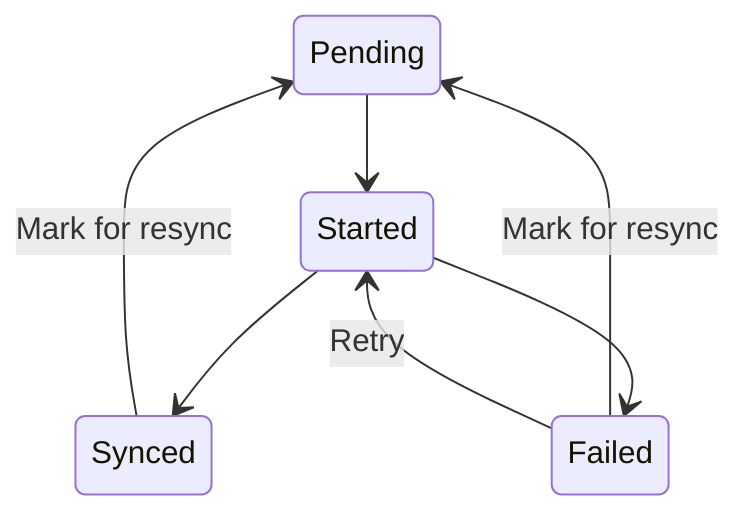
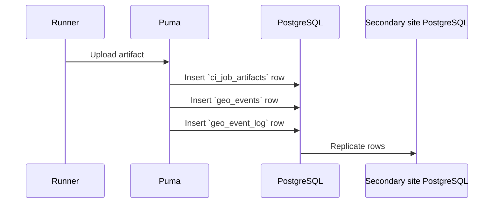
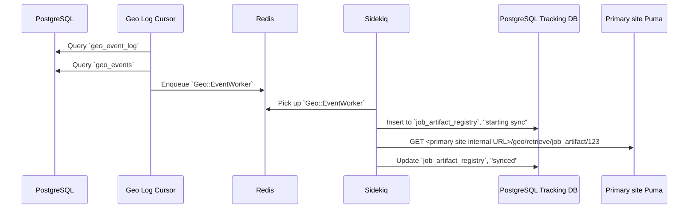
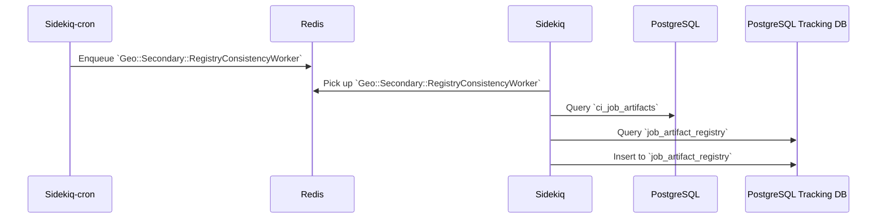
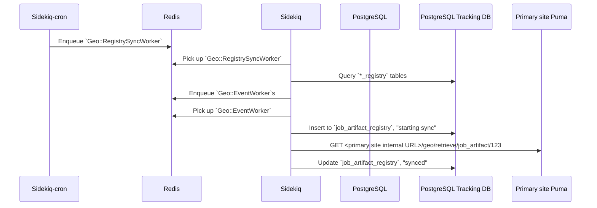
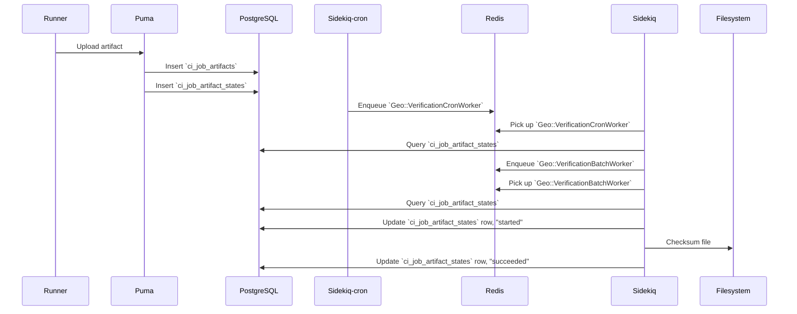
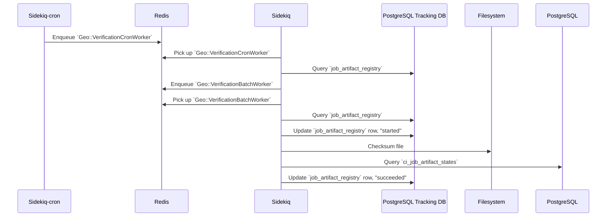
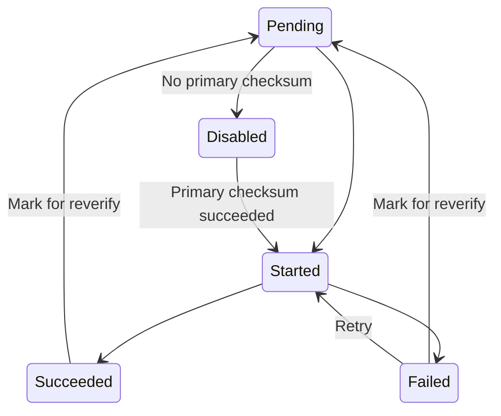
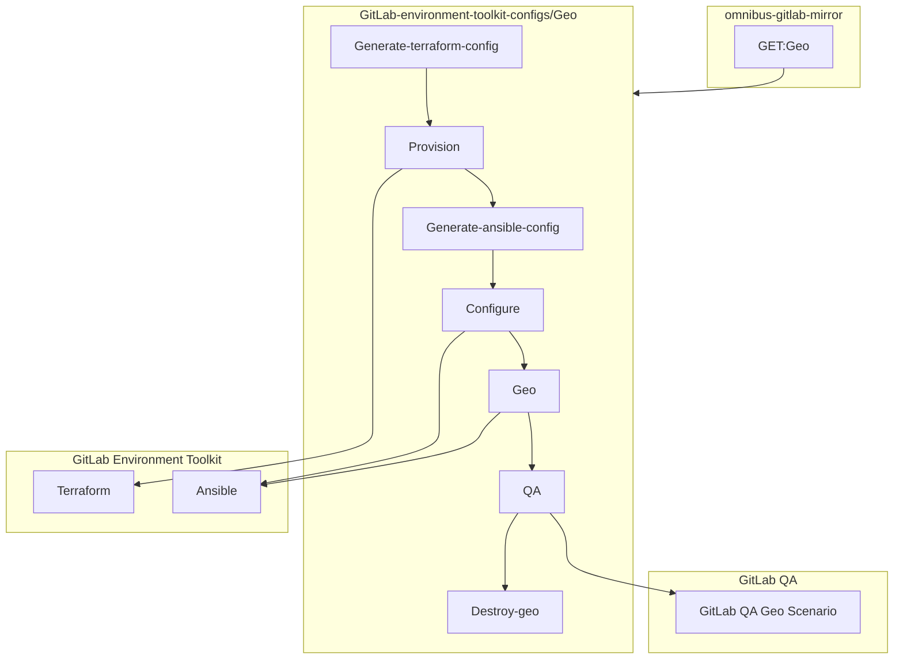

Geo connects GitLab instances together. One GitLab instance is
designated as a **primary** site and can be run with multiple
**secondary** sites. Geo orchestrates quite a few components that can be seen on
the diagram below and are described in more detail in this document.


## Replication layer

Geo handles replication for different components:

- [Database](#database-replication): includes the entire application, except cache and jobs.
- [Git repositories](#repository-replication): includes both projects and wikis.
- [Blobs](#blob-replication): includes anything from images attached on issues
  to raw logs and assets from CI.

With the exception of the Database replication, on a *secondary* site, everything is coordinated
by the [Geo Log Cursor](#geo-log-cursor-daemon).

### Replication states

The following diagram illustrates how the replication works. Some allowed transitions are omitted for clarity.



### Geo Log Cursor daemon

The [Geo Log Cursor daemon](#geo-log-cursor-daemon) is a separate process running on
each **secondary** site. It monitors the [Geo Event Log](#geo-event-log)
for new events and creates background jobs for each specific event type.

For example when a repository is updated, the Geo **primary** site creates
a Geo event with an associated repository updated event. The Geo Log Cursor daemon
picks the event up and schedules a `Geo::ProjectSyncWorker` job which
uses the `Geo::RepositorySyncService` to update the repository.

The Geo Log Cursor daemon can operate in High Availability mode automatically.
The daemon tries to acquire a lock from time to time and once acquired, it
behaves as the *active* daemon.

Any additional running daemons on the same site, is in standby
mode, ready to resume work if the *active* daemon releases its lock.

We use the [`ExclusiveLease`](https://www.rubydoc.info/github/gitlabhq/gitlabhq/Gitlab/ExclusiveLease) lock type with a small TTL, that is renewed at every
pooling cycle. That allows us to implement this global lock with a timeout.

At the end of the pooling cycle, if the daemon can't renew and/or reacquire
the lock, it switches to standby mode.

### Database replication

Geo uses [streaming replication](#streaming-replication) to replicate
the database from the **primary** to the **secondary** sites. This
replication gives the **secondary** sites access to all the data saved
in the database, so users can sign in to the **secondary** site and read,
for example, all the issues and merge requests.

### Repository replication

Geo also replicates repositories. Each **secondary** site keeps track of
the state of every repository in the [tracking database](#tracking-database).

There are a few ways a repository gets replicated by the:

- [Repository Sync worker](#repository-sync-worker).
- [Geo Log Cursor](#geo-log-cursor-daemon).

#### Project Registry

The `Geo::ProjectRegistry` class defines the model used to track the
state of repository replication. For each project in the main
database, one record in the tracking database is kept.

It records the following about repositories:

- The last time they were synced.
- The last time they were successfully synced.
- If they need to be resynced.
- When a retry should be attempted.
- The number of retries.
- If and when they were verified.

It also stores these attributes for project wikis in dedicated columns.

#### Repository Sync worker

The `Geo::RepositorySyncWorker` class runs periodically in the
background and it searches the `Geo::ProjectRegistry` model for
projects that need updating. Those projects can be:

- Unsynced: Projects that have never been synced on the **secondary**
  site and so do not exist yet.
- Updated recently: Projects that have a `last_repository_updated_at`
  timestamp that is more recent than the `last_repository_successful_sync_at`
  timestamp in the `Geo::ProjectRegistry` model.
- Manual: The administrator can manually flag a repository to resync in the
  [Geo **Admin** area](../administration/geo_sites.md).

When we fail to fetch a repository on the secondary `RETRIES_BEFORE_REDOWNLOAD`
times, Geo does a so-called _re-download_. It will do a clean clone
into the `@geo-temporary` directory in the root of the storage. When
it's successful, we replace the main repository with the newly cloned one.

### Blob replication

Blobs such as [uploads](uploads/_index.md), LFS objects, and CI job artifacts, are replicated to the **secondary** site with the [Self-Service Framework](geo/framework.md). To track the state of syncing, each model has a corresponding registry table, for example `Upload` has `Geo::UploadRegistry` in the [PostgreSQL Geo Tracking Database](#tracking-database).

#### Blob replication happy path workflows between services

Job artifacts are used in the diagrams below, as one example of a blob.

##### Replicating a new job artifact

Primary site:



- A [Runner](https://docs.gitlab.com/runner/) uploads an artifact
- [Puma](architecture.md#puma) inserts `ci_job_artifacts` row
- Puma inserts `geo_events` row with data like "Job Artifact with ID 123 was updated"
- Puma inserts `geo_event_log` row pointing to the `geo_events` row (because we built SSF on top of some legacy logic)
- [PostgreSQL](architecture.md#postgresql) streaming replication inserts the rows in the read replica

Secondary site, after the PostgreSQL DB rows have been replicated:



- [Geo Log Cursor](#geo-log-cursor-daemon) loop finds the new `geo_event_log` row
- Geo Log Cursor processes the `geo_events` row
  - Geo Log Cursor enqueues `Geo::EventWorker` job passing through the `geo_events` row data
- [Sidekiq](architecture.md#sidekiq) picks up `Geo::EventWorker` job
  - Sidekiq inserts `job_artifact_registry` row in the [PostgreSQL Geo Tracking Database](#tracking-database) because it doesn't exist, and marks it "started sync"
  - Sidekiq does a GET request on an API endpoint at the primary Geo site and downloads the file
  - Sidekiq marks the `job_artifact_registry` row as "synced" and "pending verification"

##### Backfilling existing job artifacts

- Sysadmin has an existing GitLab site without Geo
- There are existing CI jobs and job artifacts
- Sysadmin sets up a new GitLab site and configures it to be a secondary Geo site

Secondary site:

There are two cronjobs running every minute: `Geo::Secondary::RegistryConsistencyWorker` and `Geo::RegistrySyncWorker`. The workflow below is split into two, along those lines.



- [Sidekiq-cron](https://github.com/sidekiq-cron/sidekiq-cron) enqueues a `Geo::Secondary::RegistryConsistencyWorker` job every minute. As long as it is actively doing work (creating and deleting rows), this job immediately re-enqueues itself. This job uses an exclusive lease to prevent multiple instances of itself from running simultaneously.
- [Sidekiq](architecture.md#sidekiq) picks up `Geo::Secondary::RegistryConsistencyWorker` job
  - Sidekiq queries `ci_job_artifacts` table for up to 10000 rows
  - Sidekiq queries `job_artifact_registry` table for up to 10000 rows
  - Sidekiq inserts a `job_artifact_registry` row in the [PostgreSQL Geo Tracking Database](#tracking-database) corresponding to the existing Job Artifact



- [Sidekiq-cron](https://github.com/ondrejbartas/sidekiq-cron) enqueues a `Geo::RegistrySyncWorker` job every minute. As long as it is actively doing work, this job loops for up to an hour scheduling sync jobs. This job uses an exclusive lease to prevent multiple instances of itself from running simultaneously.
- [Sidekiq](architecture.md#sidekiq) picks up `Geo::RegistrySyncWorker` job
  - Sidekiq queries all `registry` tables in the [PostgreSQL Geo Tracking Database](#tracking-database) for "never attempted sync" rows. It interleaves rows from each table and adds them to an in-memory queue.
  - If the previous step yielded less than 1000 rows, then Sidekiq queries all `registry` tables for "failed sync and ready to retry" rows and interleaves those and adds them to the in-memory queue.
  - Sidekiq enqueues `Geo::EventWorker` jobs with arguments like "Job Artifact with ID 123 was updated" for each item in the queue, and tracks the enqueued Sidekiq job IDs.
  - Sidekiq stops enqueuing `Geo::EventWorker` jobs when "maximum concurrency limit" settings are reached
  - Sidekiq loops doing this kind of work until it has no more to do
- Sidekiq picks up `Geo::EventWorker` job
  - Sidekiq marks the `job_artifact_registry` row as "started sync"
  - Sidekiq does a GET request on an API endpoint at the primary Geo site and downloads the file
  - Sidekiq marks the `job_artifact_registry` row as "synced" and "pending verification"

##### Verifying a new job artifact

Primary site:



- A [Runner](https://docs.gitlab.com/runner/) uploads an artifact
- [Puma](architecture.md#puma) creates a `ci_job_artifacts` row
- Puma creates a `ci_job_artifact_states` row to store verification state.
  - The row is marked "pending verification"
- [Sidekiq-cron](https://github.com/ondrejbartas/sidekiq-cron) enqueues a `Geo::VerificationCronWorker` job every minute
- [Sidekiq](architecture.md#sidekiq) picks up the `Geo::VerificationCronWorker` job
  - Sidekiq queries `ci_job_artifact_states` for the number of rows marked "pending verification" or "failed verification and ready to retry"
  - Sidekiq enqueues one or more `Geo::VerificationBatchWorker` jobs, limited by the "maximum verification concurrency" setting
- Sidekiq picks up `Geo::VerificationBatchWorker` job
  - Sidekiq queries `ci_job_artifact_states` for rows marked "pending verification"
  - If the previous step yielded less than 10 rows, then Sidekiq queries `ci_job_artifact_states` for rows marked "failed verification and ready to retry"
  - For each row
    - Sidekiq marks it "started verification"
    - Sidekiq gets the SHA256 checksum of the file
    - Sidekiq saves the checksum in the row and marks it "succeeded verification"
    - Now secondary Geo sites can compare against this checksum

Secondary site:



- After the artifact is successfully synced, it becomes "pending verification"
- [Sidekiq-cron](https://github.com/ondrejbartas/sidekiq-cron) enqueues a `Geo::VerificationCronWorker` job every minute
- [Sidekiq](architecture.md#sidekiq) picks up the `Geo::VerificationCronWorker` job
  - Sidekiq queries `job_artifact_registry` in the [PostgreSQL Geo Tracking Database](#tracking-database) for the number of rows marked "pending verification" or "failed verification and ready to retry"
  - Sidekiq enqueues one or more `Geo::VerificationBatchWorker` jobs, limited by the "maximum verification concurrency" setting
- Sidekiq picks up `Geo::VerificationBatchWorker` job
  - Sidekiq queries `job_artifact_registry` in the PostgreSQL Geo Tracking Database for rows marked "pending verification"
  - If the previous step yielded less than 10 rows, then Sidekiq queries `job_artifact_registry` for rows marked "failed verification and ready to retry"
  - For each row
    - Sidekiq marks it "started verification"
    - Sidekiq gets the SHA256 checksum of the file
    - Sidekiq saves the checksum in the row
    - Sidekiq compares the checksum against the checksum in the `ci_job_artifact_states` row which was replicated by PostgreSQL
    - If the checksum matches, then Sidekiq marks the `job_artifact_registry` row "succeeded verification"

## Authentication

To authenticate Git and file transfers, each `GeoNode` record has two fields:

- A public access key (`access_key` field).
- A secret access key (`secret_access_key` field).

The **secondary** site authenticates itself via a [JWT request](https://jwt.io/).

The **secondary** site authorizes HTTP requests with the `Authorization` header:

```plaintext
Authorization: GL-Geo <access_key>:<JWT payload>
```

The **primary** site uses the `access_key` field to look up the corresponding
**secondary** site and decrypts the JWT payload.

NOTE:
JWT requires synchronized clocks between the machines involved, otherwise the
**primary** site may reject the request.

### File transfers

When the **secondary** site wishes to download a file, the JWT payload
contains additional information to identify the file
request. This ensures that the **secondary** site downloads the right
file for the right database ID. For example, for an LFS object, the
request must also include the SHA256 sum of the file. An example JWT
payload looks like:

```yaml
{"data": {sha256: "31806bb23580caab78040f8c45d329f5016b0115"}, iat: "1234567890"}
```

If the requested file matches the requested SHA256 sum, then the Geo
**primary** site sends data via the X-Sendfile
feature, which allows NGINX to handle the file transfer without tying
up Rails or Workhorse.

### Git transfers

When the **secondary** site wishes to clone or fetch a Git repository from the
**primary** site, the JWT payload contains additional information to identify
the Git repository request. This ensures that the **secondary** site downloads
the right Git repository for the right database ID. An example JWT
payload looks like:

```yaml
{"data": {scope: "mygroup/myproject"}, iat: "1234567890"}
```

## Git Push to Geo secondary

The Git Push Proxy exists as a functionality built inside the `gitlab-shell` component.
It is active on a **secondary** site only. It allows the user that has cloned a repository
from the secondary site to push to the same URL.

Git `push` requests directed to a **secondary** site will be sent over to the **primary** site,
while `pull` requests will continue to be served by the **secondary** site for maximum efficiency.

HTTPS and SSH requests are handled differently:

- With HTTPS, we will give the user a `HTTP 302 Redirect` pointing to the project on the **primary** site.
  The Git client is wise enough to understand that status code and process the redirection.
- With SSH, because there is no equivalent way to perform a redirect, we have to proxy the request.
  This is done inside [`gitlab-shell`](https://gitlab.com/gitlab-org/gitlab-shell), by first translating the request
  to the HTTP protocol, and then proxying it to the **primary** site.

The [`gitlab-shell`](https://gitlab.com/gitlab-org/gitlab-shell) daemon knows when to proxy based on the response
from `/api/v4/allowed`. A special `HTTP 300` status code is returned and we execute a "custom action",
specified in the response body. The response contains additional data that allows the proxied `push` operation
to happen on the **primary** site.

## Using the Tracking Database

Along with the main database that is replicated, a Geo **secondary**
site has its own separate [Tracking database](#tracking-database).

The tracking database contains the state of the **secondary** site.

Any database migration that needs to be run as part of an upgrade
needs to be applied to the tracking database on each **secondary** site.

### Configuration

The database configuration is set in [`config/database.yml`](https://gitlab.com/gitlab-org/gitlab/-/blob/master/config/database.yml.postgresql).
The directory [`ee/db/geo`](https://gitlab.com/gitlab-org/gitlab/-/tree/master/ee/db/geo)
contains the schema and migrations for this database.

To write a migration for the database, run:

```shell
rails g migration [args] [options] --database geo
```

To migrate the tracking database, run:

```shell
bundle exec rake db:migrate:geo
```

## Finders

Geo uses [Finders](https://gitlab.com/gitlab-org/gitlab/-/tree/master/app/finders),
which are classes take care of the heavy lifting of looking up
projects/attachments/ and so on, in the tracking database and main database.

## Redis

Redis on the **secondary** site works the same as on the **primary**
site. It is used for caching, storing sessions, and other persistent
data.

Redis data replication between **primary** and **secondary** site is
not used, so sessions and so on, aren't shared between sites.

## Object Storage

GitLab can optionally use Object Storage to store data it would
otherwise store on disk. For example:

- LFS Objects
- CI Job Artifacts
- Uploads

By default, Geo does not replicate objects that are stored in object storage. Depending on the situation and needs of the customer, they can:

- [Enable GitLab-managed object storage replication](../administration/geo/replication/object_storage.md#enabling-gitlab-managed-object-storage-replication).
- Use their cloud provider's built-in services to replicate object storage across Geo sites.
- Configure secondary Geo sites to access the same object storage endpoint as the primary site.

## Verification

### Verification states

The following diagram illustrates how the verification works. Some allowed transitions are omitted for clarity.



### Repository verification

Repositories are verified with a checksum.

The **primary** site calculates a checksum on the repository. It
basically hashes all Git refs together and stores that hash in the
`project_repository_states` table of the database.

The **secondary** site does the same to calculate the hash of its
clone, and compares the hash with the value the **primary** site
calculated. If there is a mismatch, Geo will mark this as a mismatch
and the administrator can see this in the [Geo **Admin** area](../administration/geo_sites.md).

## Geo proxying

Geo secondaries can proxy web requests to the primary.
Read more on the [Geo proxying (development) page](geo/proxying.md).

## Geo API

Geo uses the external [API](geo/api.md) to facilitate communication between various components.

## Glossary

### Primary site

A **primary** site is the single site in a Geo setup that read-write
capabilities. It's the single source of truth and the Geo
**secondary** sites replicate their data from there.

In a Geo setup, there can only be one **primary** site. All
**secondary** sites connect to that **primary**.

### Secondary site

A **secondary** site is a read-only replica of the **primary** site
running in a different geographical location.

### Streaming replication

Geo depends on the streaming replication feature of PostgreSQL. It
completely replicates the database data and the database schema. The
database replica is a read-only copy.

Streaming replication depends on the Write Ahead Logs, or WAL. Those
logs are copied over to the replica and replayed there.

Since streaming replication also replicates the schema, the database
migration do not need to run on the secondary sites.

### Tracking database

A database on each Geo **secondary** site that keeps state for the site
on which it resides. Read more in [Using the Tracking database](#using-the-tracking-database).

## Geo Event Log

The Geo **primary** stores events in the `geo_event_log` table. Each
entry in the log contains a specific type of event. These type of
events include:

- Repository Deleted event
- Repository Renamed event
- Repositories Changed event
- Repository Created event
- Hashed Storage Migrated event
- LFS Object Deleted event
- Hashed Storage Attachments event
- Job Artifact Deleted event
- Upload Deleted event

See [Geo Log Cursor daemon](#geo-log-cursor-daemon).

## Code features

### `Gitlab::Geo` utilities

Small utility methods related to Geo go into the
[`ee/lib/gitlab/geo.rb`](https://gitlab.com/gitlab-org/gitlab/-/blob/master/ee/lib/gitlab/geo.rb)
file.

Many of these methods are cached using the `RequestStore` class, to
reduce the performance impact of using the methods throughout the
codebase.

#### Current site

The class method `.current_node` returns the `GeoNode` record for the
current site.

We use the `host`, `port`, and `relative_url_root` values from
`gitlab.yml` and search in the database to identify which site we are
in (see `GeoNode.current_node`).

#### Primary or secondary

To determine whether the current site is a **primary** site or a
**secondary** site use the `.primary?` and `.secondary?` class
methods.

It is possible for these methods to both return `false` on a site when
the site is not enabled. See [Enablement](#enablement).

#### Geo Database configured?

There is also an additional gotcha when dealing with things that
happen during initialization time. In a few places, we use the
`Gitlab::Geo.geo_database_configured?` method to check if the site has
the tracking database, which only exists on the **secondary**
site. This overcomes race conditions that could happen during
bootstrapping of a new site.

#### Enablement

We consider Geo feature enabled when the user has a valid license with the
feature included, and they have at least one site defined at the Geo Nodes
screen.

See `Gitlab::Geo.enabled?` and `Gitlab::Geo.license_allows?` methods.

#### Read-only

All Geo **secondary** sites are read-only.

The general principle of a [read-only database](database/verifying_database_capabilities.md#read-only-database)
applies to all Geo **secondary** sites. So the
`Gitlab::Database.read_only?` method will always return `true` on a
**secondary** site.

When some write actions are not allowed because the site is a
**secondary**, consider adding the `Gitlab::Database.read_only?` or
`Gitlab::Database.read_write?` guard, instead of `Gitlab::Geo.secondary?`.

The database itself will already be read-only in a replicated setup,
so we don't need to take any extra step for that.

## Ensuring a new feature has Geo support

Geo depends on PostgreSQL replication of the main and CI databases, so if you add a new table or field, it should already work on secondary Geo sites.

However, if you introduce a new kind of data which is stored outside of the main and CI PostgreSQL databases, then you need to ensure that this data is replicated and verified by Geo. This is necessary for customers to be able to rely on their secondary sites for [disaster recovery](../administration/geo/disaster_recovery/_index.md).

The following subsections describe how to determine whether work is needed, and if so, how to proceed. If you have any questions, [contact the Geo team](https://handbook.gitlab.com/handbook/product/categories/#geo-group).

For comparison with your own features, see [Supported Geo data types](../administration/geo/replication/datatypes.md). It has a detailed, up-to-date list of the types of data that Geo replicates and verifies.

### Git repositories

If you add a feature that is backed by Git repositories, then you must add Geo support. See [the repository replicator strategy of the Geo self-service framework](geo/framework.md#repository-replicator-strategy).

Create an issue based on the [Geo Replicate a new blob type template](https://gitlab.com/gitlab-org/gitlab/-/issues/new?issuable_template=Geo%20Replicate%20a%20new%20blob%20type) and follow the guidelines.

### Blobs

If you add a subclass of `CarrierWave::Uploader::Base`, then you are adding what Geo calls a blob. If you specifically subclass [`AttachmentUploader` as generally recommended](uploads/working_with_uploads.md#recommendations), then the data has Geo support with no work needed. This is because `AttachmentUploader` tracks blobs with the `Upload` model using the `uploads` table, and Geo support is already implemented for that model.

If your blobs are tracked in a new table, perhaps because you expect millions of rows at GitLab.com scale, then you must add Geo support. See [the blob replicator strategy of the Geo self-service framework](geo/framework.md#blob-replicator-strategy).

[Geo detects new blobs with a spec](https://gitlab.com/gitlab-org/gitlab/-/blob/eeba0e4d231ae39012a5bbaeac43a72c2bd8affb/ee/spec/uploaders/every_gitlab_uploader_spec.rb) that fails when an `Uploader` does not have a corresponding `Replicator`.

Create an issue based on the [Geo Replicate a new Git repository type template](https://gitlab.com/gitlab-org/gitlab/-/issues/new?issuable_template=Geo%20Replicate%20a%20new%20Git%20repository%20type) and follow the guidelines.

### Features with more than one kind of data

If a new complex feature is backed by multiple kinds of data, for example, a Git repository and a blob, then you can likely consider each kind of data separately.

Taking [Designs](../user/project/issues/design_management.md) as an example, each issue has a Git repository which can have many LFS objects, and each LFS object may have an automatically generated thumbnail.

- LFS objects were already supported by Geo, so no Geo-specific work was needed.
- The implementation of thumbnails reused the `Upload` model, so no Geo-specific work was needed.
- Design Git repositories were not inherently supported by Geo, so work was needed.

As another example, [Dependency Proxy](../administration/packages/dependency_proxy.md) is backed by two kinds of blobs, `DependencyProxy::Blob` and `DependencyProxy::Manifest`. We can use [the blob replicator strategy of the Geo self-service framework](geo/framework.md#blob-replicator-strategy) on each type, independent of each other.

### Other kinds of data

If a new feature introduces a new kind of data which is not a Git repository, or a blob, or a combination of the two, then contact the Geo team to discuss how to handle it.

As an example, container registry data does not easily fit into the above categories. It is backed by a registry service which owns the data, and GitLab interacts with the registry service's API. So a one off approach is required for Geo support of container registry. Still, we are able to reuse much of the glue code of [the Geo self-service framework](geo/framework.md#repository-replicator-strategy).

## Self-service framework

If you want to add easy Geo replication of a resource you're working
on, check out our [self-service framework](geo/framework.md).

## Geo development workflow

### GET:Geo pipeline

After triggering a successful [e2e:test-on-omnibus-ee](testing_guide/end_to_end/_index.md#using-the-test-on-omnibus-job) pipeline, you can manually trigger a job named `GET:Geo`:

1. In the [GitLab project](https://gitlab.com/gitlab-org/gitlab), select the **Pipelines** tab of a merge request.
1. Select the `Stage: qa` stage on the latest pipeline to expand and list all the related jobs.
1. Select trigger job `e2e:test-on-omnibus` to navigate inside child pipeline.
1. Select `trigger-omnibus` to view the [Omnibus GitLab Mirror](https://gitlab.com/gitlab-org/build/omnibus-gitlab-mirror) pipeline corresponding to the merge request.
1. The `GET:Geo` job can be found and triggered under the `trigger-qa` stage.

This pipeline uses [GET](https://gitlab.com/gitlab-org/gitlab-environment-toolkit) to spin up a
[20 RPS / 1k users](../administration/reference_architectures/1k_users.md) Geo installation,
and run the [`gitlab-qa`](https://gitlab.com/gitlab-org/gitlab-qa) Geo scenario against the instance.
When working on Geo features, it is a good idea to ensure the `qa-geo` job passes in a triggered `GET:Geo pipeline`.

The pipelines that control the provisioning and teardown of the instance are included in The GitLab Environment Toolkit Configs
[Geo subproject](https://gitlab.com/gitlab-org/quality/gitlab-environment-toolkit-configs/Geo).

When adding new functionality, consider adding new tests to verify the behavior. For steps,
see the [QA documentation](https://gitlab.com/gitlab-org/gitlab/-/tree/master/qa#writing-tests).

#### Architecture

The pipeline involves the interaction of multiple different projects:

- [GitLab](https://gitlab.com/gitlab-org/gitlab) - The [`e2e:test-on-omnibus-ee` job](testing_guide/end_to_end/_index.md#using-the-test-on-omnibus-job) is launched from merge requests in this project.
- [`omnibus-gitlab`](https://gitlab.com/gitlab-org/omnibus-gitlab) - Builds relevant artifacts containing the changes from the triggering merge request pipeline.
- [GET-Configs/Geo](https://gitlab.com/gitlab-org/quality/gitlab-environment-toolkit-configs/Geo) - Coordinates the lifecycle of a short-lived Geo installation that can be evaluated.
- [GET](https://gitlab.com/gitlab-org/gitlab-environment-toolkit) - Contains the necessary logic for creating and destroying Geo installations. Used by `GET-Configs/Geo`.
- [`gitlab-qa`](https://gitlab.com/gitlab-org/gitlab-qa) - Tool for running automated tests against a GitLab instance.


