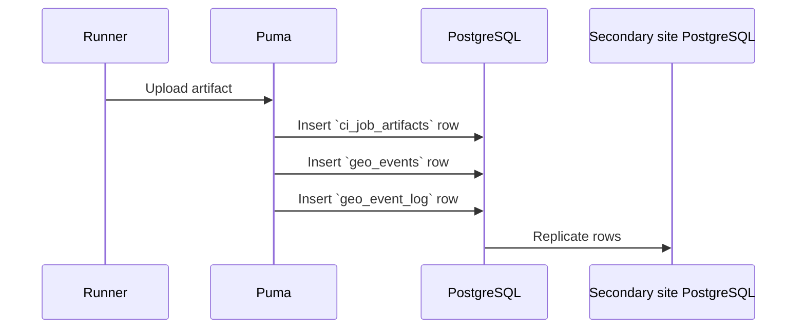
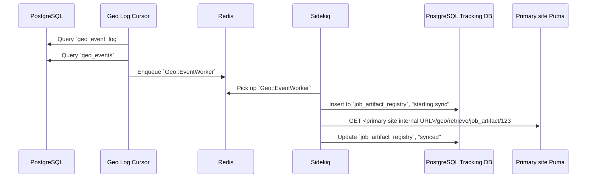
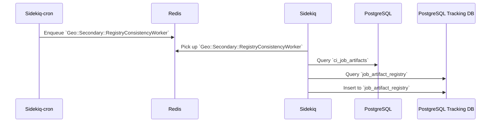
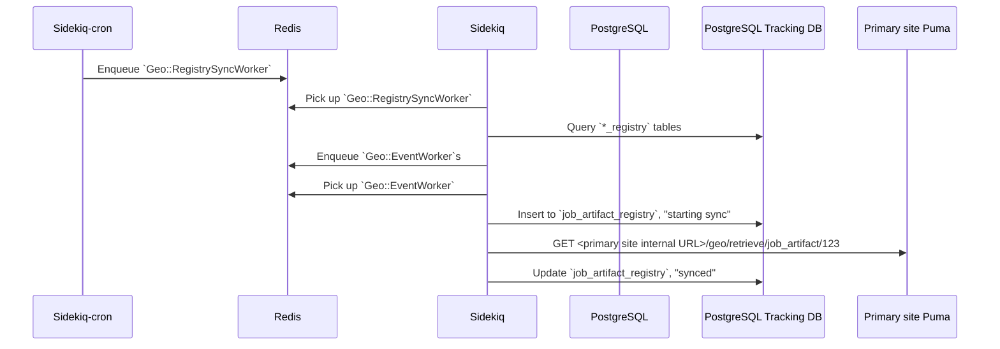
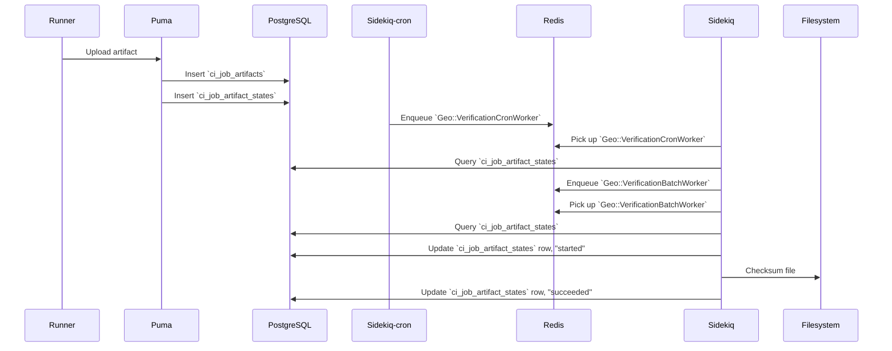
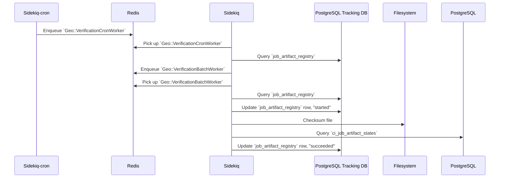

Blobs such as [uploads](../uploads/_index.md), LFS objects, and CI job artifacts, are replicated to the **secondary** site
with the [Self-Service Framework](framework.md). To track the state of syncing, each model has a corresponding registry table,
for example `Upload` has `Geo::UploadRegistry` in the [PostgreSQL Geo Tracking Database](../geo.md#tracking-database).

## Blob replication happy path workflows between services

Job artifacts are used in the diagrams below, as one example of a blob.

### Replicating a new job artifact

Primary site:

- A [Runner](https://docs.gitlab.com/runner/) uploads an artifact
- [Puma](../architecture.md#puma) inserts `ci_job_artifacts` row
- Puma inserts `geo_events` row with data like "Job Artifact with ID 123 was updated"
- Puma inserts `geo_event_log` row pointing to the `geo_events` row (because we built SSF on top of some legacy logic)
- [PostgreSQL](../architecture.md#postgresql) streaming replication inserts the rows in the read replica

Secondary site, after the PostgreSQL DB rows have been replicated:

- [Geo Log Cursor](../geo.md#geo-log-cursor-daemon) loop finds the new `geo_event_log` row
- Geo Log Cursor processes the `geo_events` row
  - Geo Log Cursor enqueues `Geo::EventWorker` job passing through the `geo_events` row data
- [Sidekiq](../architecture.md#sidekiq) picks up `Geo::EventWorker` job
  - Sidekiq inserts `job_artifact_registry` row in the [PostgreSQL Geo Tracking Database](../geo.md#tracking-database) because it doesn't exist, and marks it "started sync"
  - Sidekiq does a GET request on an API endpoint at the primary Geo site and downloads the file
  - Sidekiq marks the `job_artifact_registry` row as "synced" and "pending verification"

### Backfilling existing job artifacts

- Sysadmin has an existing GitLab site without Geo
- There are existing CI jobs and job artifacts
- Sysadmin sets up a new GitLab site and configures it to be a secondary Geo site

Secondary site:

There are two cronjobs running every minute: `Geo::Secondary::RegistryConsistencyWorker` and `Geo::RegistrySyncWorker`.
The workflow below is split into two, along those lines.

- [Sidekiq-cron](https://github.com/sidekiq-cron/sidekiq-cron) enqueues a `Geo::Secondary::RegistryConsistencyWorker` job every minute. As long as it is actively doing work (creating and deleting rows), this job immediately re-enqueues itself. This job uses an exclusive lease to prevent multiple instances of itself from running simultaneously.
- [Sidekiq](../architecture.md#sidekiq) picks up `Geo::Secondary::RegistryConsistencyWorker` job
  - Sidekiq queries `ci_job_artifacts` table for up to 10000 rows
  - Sidekiq queries `job_artifact_registry` table for up to 10000 rows
  - Sidekiq inserts a `job_artifact_registry` row in the [PostgreSQL Geo Tracking Database](../geo.md#tracking-database) corresponding to the existing Job Artifact

- [Sidekiq-cron](https://github.com/ondrejbartas/sidekiq-cron) enqueues a `Geo::RegistrySyncWorker` job every minute.
As long as it is actively doing work, this job loops for up to an hour scheduling sync jobs. This job uses an exclusive
lease to prevent multiple instances of itself from running simultaneously.
- [Sidekiq](../architecture.md#sidekiq) picks up `Geo::RegistrySyncWorker` job
  - Sidekiq queries all `registry` tables in the [PostgreSQL Geo Tracking Database](../geo.md#tracking-database) for
  "never attempted sync" rows. It interleaves rows from each table and adds them to an in-memory queue.
  - If the previous step yielded less than 1000 rows, then Sidekiq queries all `registry` tables for
  "failed sync and ready to retry" rows and interleaves those and adds them to the in-memory queue.
  - Sidekiq enqueues `Geo::EventWorker` jobs with arguments like "Job Artifact with ID 123 was updated" for
  each item in the queue, and tracks the enqueued Sidekiq job IDs.
  - Sidekiq stops enqueuing `Geo::EventWorker` jobs when "maximum concurrency limit" settings are reached
  - Sidekiq loops doing this kind of work until it has no more to do
- Sidekiq picks up `Geo::EventWorker` job
  - Sidekiq marks the `job_artifact_registry` row as "started sync"
  - Sidekiq does a GET request on an API endpoint at the primary Geo site and downloads the file
  - Sidekiq marks the `job_artifact_registry` row as "synced" and "pending verification"

### Verifying a new job artifact

Primary site:

- A [Runner](https://docs.gitlab.com/runner/) uploads an artifact
- [Puma](../architecture.md#puma) creates a `ci_job_artifacts` row
- Puma creates a `ci_job_artifact_states` row to store verification state.
  - The row is marked "pending verification"
- [Sidekiq-cron](https://github.com/ondrejbartas/sidekiq-cron) enqueues a `Geo::VerificationCronWorker` job every minute
- [Sidekiq](../architecture.md#sidekiq) picks up the `Geo::VerificationCronWorker` job
  - Sidekiq queries `ci_job_artifact_states` for the number of rows marked "pending verification" or
  "failed verification and ready to retry"
  - Sidekiq enqueues one or more `Geo::VerificationBatchWorker` jobs, limited by the "maximum verification concurrency"
  setting
- Sidekiq picks up `Geo::VerificationBatchWorker` job
  - Sidekiq queries `ci_job_artifact_states` for rows marked "pending verification"
  - If the previous step yielded less than 10 rows, then Sidekiq queries `ci_job_artifact_states` for rows marked
    "failed verification and ready to retry"
  - For each row
    - Sidekiq marks it "started verification"
    - Sidekiq gets the SHA256 checksum of the file
    - Sidekiq saves the checksum in the row and marks it "succeeded verification"
    - Now secondary Geo sites can compare against this checksum

Secondary site:

- After the artifact is successfully synced, it becomes "pending verification"
- [Sidekiq-cron](https://github.com/ondrejbartas/sidekiq-cron) enqueues a `Geo::VerificationCronWorker` job every minute
- [Sidekiq](../architecture.md#sidekiq) picks up the `Geo::VerificationCronWorker` job
  - Sidekiq queries `job_artifact_registry` in the [PostgreSQL Geo Tracking Database](../geo.md#tracking-database)
  for the number of rows marked "pending verification" or "failed verification and ready to retry"
    - Sidekiq enqueues one or more `Geo::VerificationBatchWorker` jobs, limited by the "maximum verification concurrency"
    setting
- Sidekiq picks up `Geo::VerificationBatchWorker` job
  - Sidekiq queries `job_artifact_registry` in the PostgreSQL Geo Tracking Database for rows marked "pending verification"
  - If the previous step yielded less than 10 rows, then Sidekiq queries `job_artifact_registry` for rows marked
  "failed verification and ready to retry"
  - For each row
    - Sidekiq marks it "started verification"
    - Sidekiq gets the SHA256 checksum of the file
    - Sidekiq saves the checksum in the row
    - Sidekiq compares the checksum against the checksum in the `ci_job_artifact_states` row which was replicated
    by PostgreSQL
    - If the checksum matches, then Sidekiq marks the `job_artifact_registry` row "succeeded verification"
