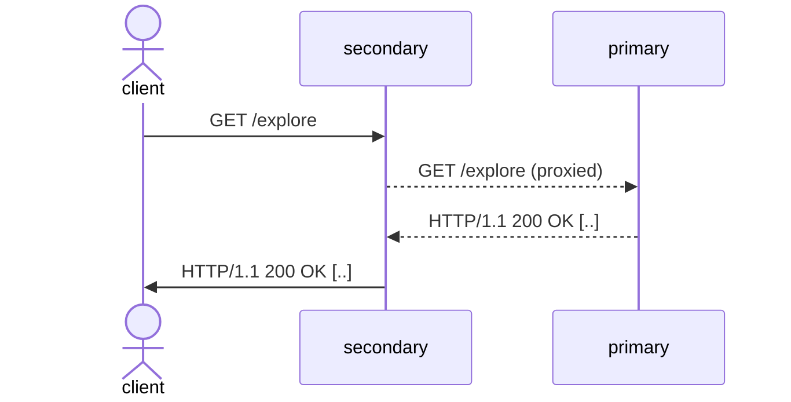
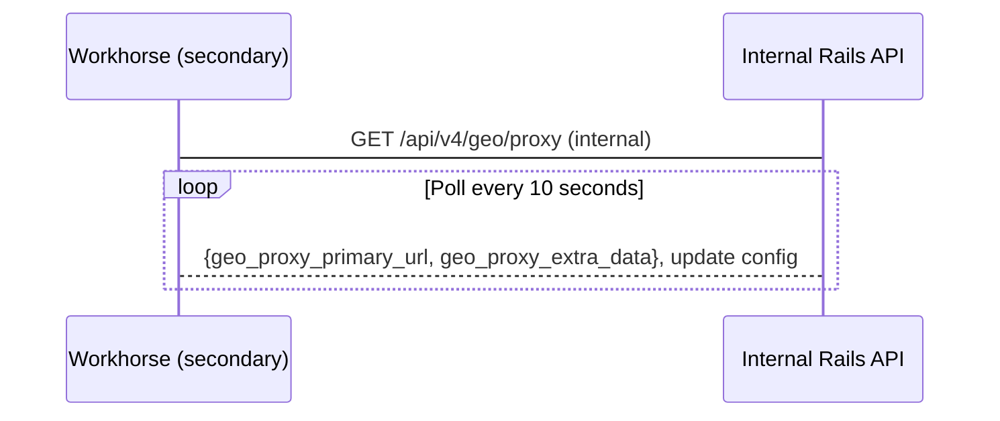
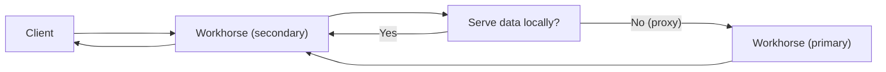
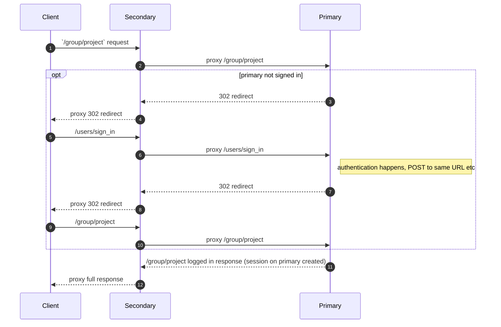
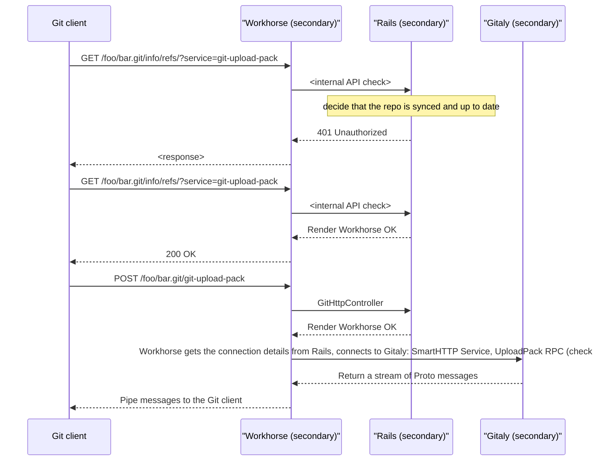
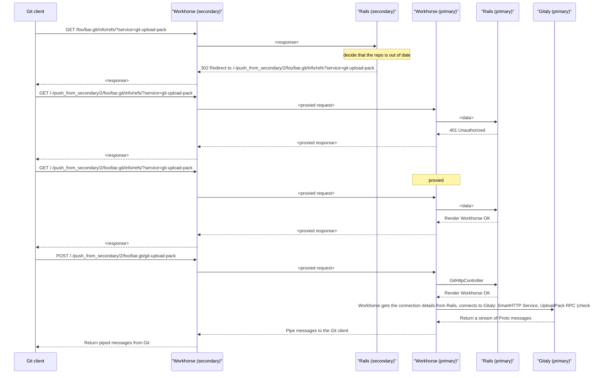
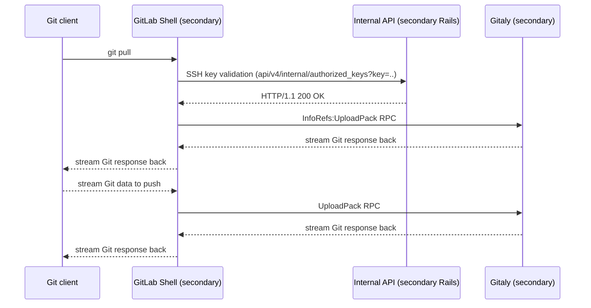
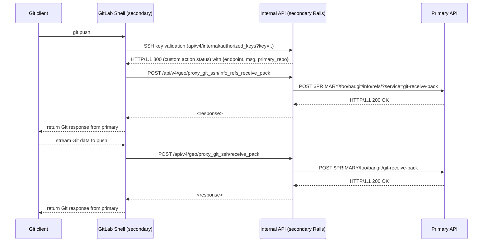
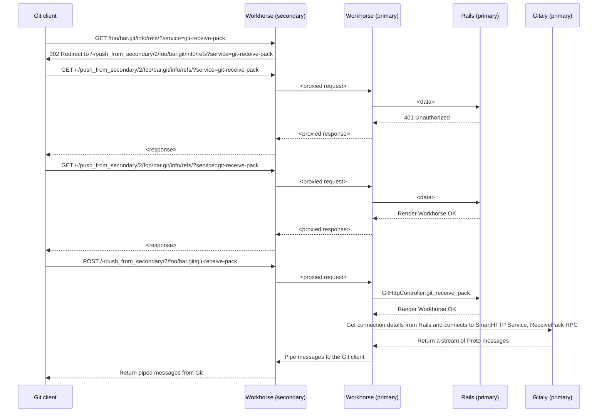

Secondaries proxy nearly all HTTP requests through Workhorse to the primary, so users navigating to the
secondary see a read-write UI, and are able to do all operations that they can do on the primary.

## High-level components

Proxying of GitLab UI and API HTTP requests is handled by the [`gitlab-workhorse`](../architecture.md#gitlab-workhorse) component. Traffic usually sent to the Rails application on the Geo secondary site is proxied to the [internal URL](../../administration/geo/_index.md#internal-url) of the primary Geo site instead.

Proxying of Git over HTTP requests is handled by the [`gitlab-workhorse`](../architecture.md#gitlab-workhorse) component, but the decision to proxy or not is handled by the Rails application, taking into account whether the request is push or pull, and whether the desired Git data is up-to-date.

Proxying of Git over SSH traffic is handled by the [`gitlab-shell`](../architecture.md#gitlab-shell) component, but the decision to proxy or not is handled by the Rails application, taking into account whether the request is push or pull, and whether the desired Git data is up-to-date.

## Request lifecycle

### Top-level view

The proxying interaction can be explained at a high level through the following diagram:

### Proxy detection mechanism

To know whether or not it should proxy requests to the primary, and the URL of the primary (as it is stored in
the database), Workhorse polls the internal API when Geo is enabled. When proxying should be enabled, the internal
API responds with the primary URL and JWT-signed data that is passed on to the primary for every request.

### In-depth request flow and local data acceleration compared with proxying

Detailing implementation, Workhorse on the secondary (requested) site decides whether to proxy the data or not. If it
can "accelerate" the data type (that is, can serve locally to save a roundtrip request), it returns the data
immediately. Otherwise, traffic is sent to the primary's internal URL, served by Workhorse on the primary exactly
as a direct request would. The response is then be proxied back to the user through the secondary Workhorse in the
same connection.

## Sign-in

### Requests proxied to the primary requiring authorization

## Git pull

For historical reasons, the `push_from_secondary` path is used to forward a Git pull. There is
[an issue proposing to rename this route](https://gitlab.com/gitlab-org/gitlab/-/issues/292690) to avoid confusion.

### Git pull over HTTP(s)

#### Accelerated repositories

When a repository exists on the secondary and we detect is up to date with the primary, we serve it directly instead of
proxying.

#### Proxied repositories

If a requested repository isn't synced, or we detect is not up to date, the request will be proxied to the primary, in
order to get the latest version of the changes.

### Git pull over SSH

As SSH operations go through GitLab Shell instead of Workhorse, they are not proxied through the mechanism used for
Workhorse requests. With SSH operations, they are proxied as Git HTTP requests to the primary site by the secondary
Rails internal API.

#### Accelerated repositories

When a repository exists on the secondary and we detect is up to date with the primary, we serve it directly instead of
proxying.

#### Proxied repositories

If a requested repository isn't synced, or we detect is not up to date, the request will be proxied to the primary, in
order to get the latest version of the changes.

## Git push

### Git push over SSH

As SSH operations go through GitLab Shell instead of Workhorse, they are not proxied through the mechanism used for
Workhorse requests. With SSH operations, they are proxied as Git HTTP requests to the primary site by the secondary
Rails internal API.

### Git push over HTTP(S)

If a requested repository isn't synced, or we detect is not up to date, the request will be proxied to the primary, a push redirects to a local path formatted as `/-/push_from_secondary/$SECONDARY_ID/*`.
Further, requests through this path are proxied to the primary, which will handle the push.

