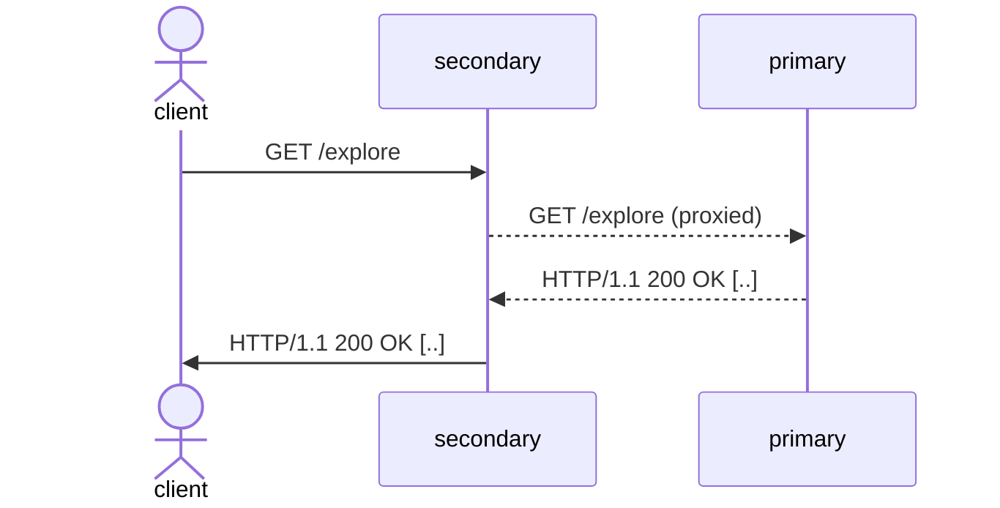
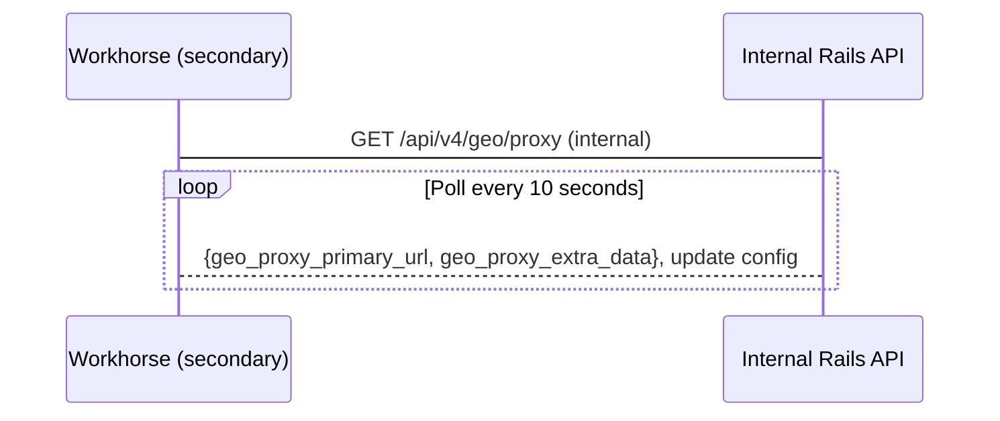
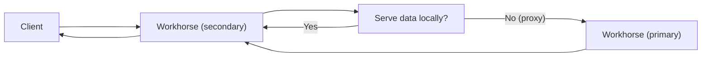
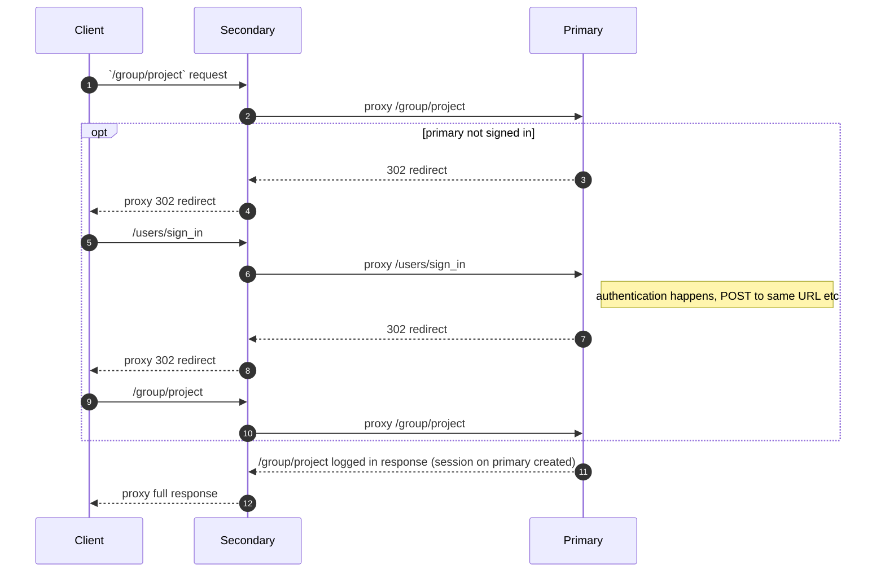
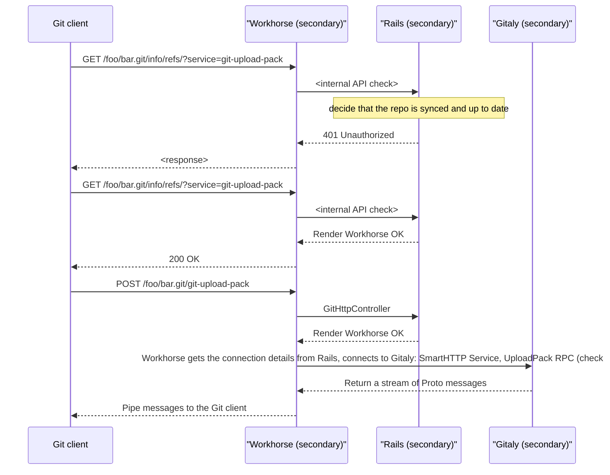
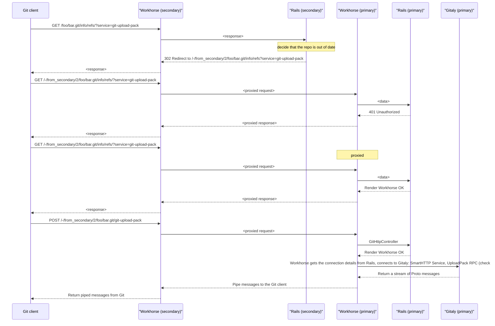
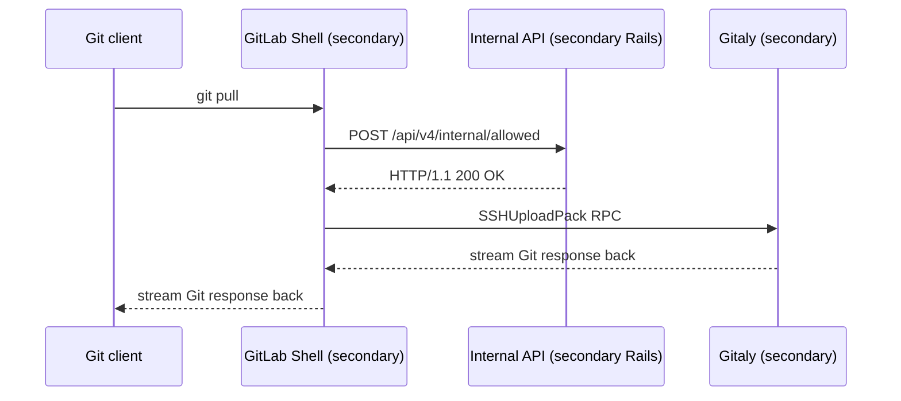
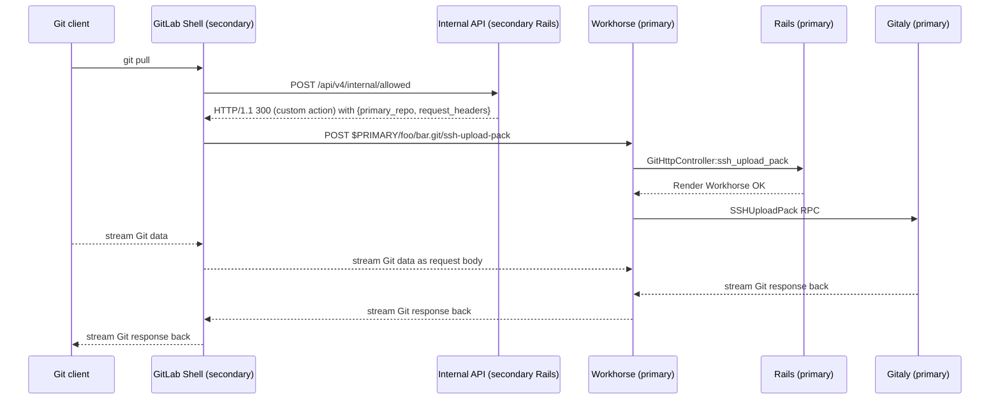
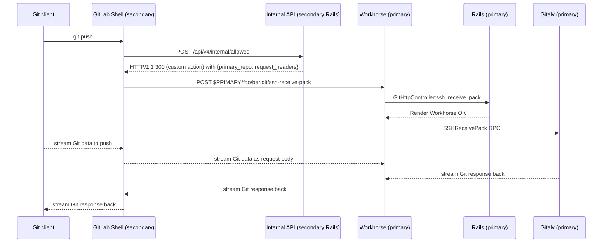
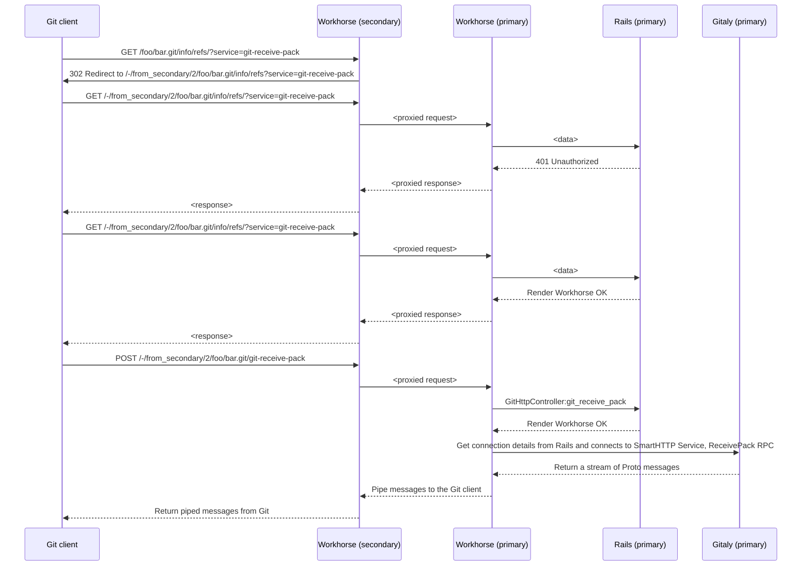

Secondaries proxy nearly all HTTP requests through Workhorse to the primary, so users navigating to the
secondary see a read-write UI, and are able to do all operations that they can do on the primary.

## High-level components

Proxying of GitLab UI and API HTTP requests is handled by the [`gitlab-workhorse`](../architecture.md#gitlab-workhorse) component. Traffic usually sent to the Rails application on the Geo secondary site is proxied to the [internal URL](../../administration/geo/_index.md#internal-url) of the primary Geo site instead.

Proxying of Git over HTTP requests is handled by the [`gitlab-workhorse`](../architecture.md#gitlab-workhorse) component, but the decision to proxy or not is handled by the Rails application, taking into account whether the request is push or pull, and whether the desired Git data is up-to-date.

Proxying of Git over SSH traffic is handled by the [`gitlab-shell`](../architecture.md#gitlab-shell) component, but the decision to proxy or not is handled by the Rails application, taking into account whether the request is push or pull, and whether the desired Git data is up-to-date.

## Request lifecycle

### Top-level view

The proxying interaction can be explained at a high level through the following diagram:

```mermaid
sequenceDiagram
actor client
participant secondary
participant primary

client->>secondary: GET /explore
secondary-->>primary: GET /explore (proxied)
primary-->>secondary: HTTP/1.1 200 OK [..]
secondary->>client: HTTP/1.1 200 OK [..]
```

### Proxy detection mechanism

To know whether or not it should proxy requests to the primary, and the URL of the primary (as it is stored in
the database), Workhorse polls the internal API when Geo is enabled. When proxying should be enabled, the internal
API responds with the primary URL and JWT-signed data that is passed on to the primary for every request.

```mermaid
sequenceDiagram
    participant W as Workhorse (secondary)
    participant API as Internal Rails API
    W->API: GET /api/v4/geo/proxy (internal)
    loop Poll every 10 seconds
        API-->W: {geo_proxy_primary_url, geo_proxy_extra_data}, update config
    end
```

### In-depth request flow and local data acceleration compared with proxying

Detailing implementation, Workhorse on the secondary (requested) site decides whether to proxy the data or not. If it
can "accelerate" the data type (that is, can serve locally to save a roundtrip request), it returns the data
immediately. Otherwise, traffic is sent to the primary's internal URL, served by Workhorse on the primary exactly
as a direct request would. The response is then proxied back to the user through the secondary Workhorse in the
same connection.

```mermaid
flowchart LR
  A[Client]--->W1["Workhorse (secondary)"]
  W1 --> W1C[Serve data locally?]
  W1C -- "Yes" ----> W1
  W1C -- "No (proxy)" ----> W2["Workhorse (primary)"]
  W2 --> W1 ----> A
```

## Sign-in

### Requests proxied to the primary requiring authorization

```mermaid
sequenceDiagram
autoNumber
participant Client
participant Secondary
participant Primary

Client->>Secondary: `/group/project` request
Secondary->>Primary: proxy /group/project
opt primary not signed in
Primary-->>Secondary: 302 redirect
Secondary-->>Client: proxy 302 redirect
Client->>Secondary: /users/sign_in
Secondary->>Primary: proxy /users/sign_in
Note right of Primary: authentication happens, POST to same URL etc
Primary-->>Secondary: 302 redirect
Secondary-->>Client: proxy 302 redirect
Client->>Secondary: /group/project
Secondary->>Primary: proxy /group/project
end
Primary-->>Secondary: /group/project logged in response (session on primary created)
Secondary-->>Client: proxy full response
```

## Git pull

The Git pull forward path was [renamed from the legacy name `push_from_secondary` to `from_secondary` for more clarity in GitLab 17.10](https://gitlab.com/gitlab-org/gitlab/-/issues/292690).

### Git pull over HTTP(s)

#### Accelerated repositories

When a repository exists on the secondary and we detect it is up to date with the primary, we serve it directly instead of
proxying.

```mermaid
sequenceDiagram
participant C as Git client
participant Wsec as "Workhorse (secondary)"
participant Rsec as "Rails (secondary)"
participant Gsec as "Gitaly (secondary)"
C->>Wsec: GET /foo/bar.git/info/refs/?service=git-upload-pack
Wsec->>Rsec: <internal API check>
note over Rsec: decide that the repo is synced and up to date
Rsec-->>Wsec: 401 Unauthorized
Wsec-->>C: <response>
C->>Wsec: GET /foo/bar.git/info/refs/?service=git-upload-pack
Wsec->>Rsec: <internal API check>
Rsec-->>Wsec: Render Workhorse OK
Wsec-->>C: 200 OK
C->>Wsec: POST /foo/bar.git/git-upload-pack
Wsec->>Rsec: GitHttpController#git_receive_pack
Rsec-->>Wsec: Render Workhorse OK
Wsec->>Gsec: Workhorse gets the connection details from Rails, connects to Gitaly: SmartHTTP Service, UploadPack RPC (check the proto for details)
Gsec-->>Wsec: Return a stream of Proto messages
Wsec-->>C: Pipe messages to the Git client
```

#### Proxied repositories

If a requested repository isn't synced, or we detect it is not up to date, the request will be proxied to the primary, in
order to get the latest version of the changes.

```mermaid
sequenceDiagram
participant C as Git client
participant Wsec as "Workhorse (secondary)"
participant Rsec as "Rails (secondary)"
participant W as "Workhorse (primary)"
participant R as "Rails (primary)"
participant G as "Gitaly (primary)"
C->>Wsec: GET /foo/bar.git/info/refs/?service=git-upload-pack
Wsec->>Rsec: <response>
note over Rsec: decide that the repo is out of date
Rsec-->>Wsec: 302 Redirect to /-/from_secondary/2/foo/bar.git/info/refs?service=git-upload-pack
Wsec-->>C: <response>
C->>Wsec: GET /-/from_secondary/2/foo/bar.git/info/refs/?service=git-upload-pack
Wsec->>W: <proxied request>
W->>R: <data>
R-->>W: 401 Unauthorized
W-->>Wsec: <proxied response>
Wsec-->>C: <response>
C->>Wsec: GET /-/from_secondary/2/foo/bar.git/info/refs/?service=git-upload-pack
note over W: proxied
Wsec->>W: <proxied request>
W->>R: <data>
R-->>W: Render Workhorse OK
W-->>Wsec: <proxied response>
Wsec-->>C: <response>
C->>Wsec: POST /-/from_secondary/2/foo/bar.git/git-upload-pack
Wsec->>W: <proxied request>
W->>R: GitHttpController#git_receive_pack
R-->>W: Render Workhorse OK
W->>G: Workhorse gets the connection details from Rails, connects to Gitaly: SmartHTTP Service, UploadPack RPC (check the proto for details)
G-->>W: Return a stream of Proto messages
W-->>Wsec: Pipe messages to the Git client
Wsec-->>C: Return piped messages from Git
```

### Git pull over SSH

SSH operations go through GitLab Shell instead of Workhorse, so they are not proxied through the mechanism
used for Workhorse requests. GitLab Shell asks the secondary Rails internal API whether to serve the request
locally or forward it to the primary. When the request must be forwarded, Rails responds with a custom
action that carries the primary repository URL and the Geo authorization headers GitLab Shell needs to
contact the primary directly.

#### Accelerated repositories

When a repository exists on the secondary and we detect it is up to date with the primary, we serve it directly instead of
proxying.

```mermaid
sequenceDiagram
participant C as Git client
participant S as GitLab Shell (secondary)
participant I as Internal API (secondary Rails)
participant G as Gitaly (secondary)
C->>S: git pull
S->>I: POST /api/v4/internal/allowed
I-->>S: HTTP/1.1 200 OK
S->>G: SSHUploadPack RPC
G-->>S: stream Git response back
S-->>C: stream Git response back
```

#### Proxied repositories

If a requested repository isn't synced, or we detect it is not up to date, GitLab Shell forwards the request
to the primary. It streams the SSH session to the primary as a single HTTP request to the
`ssh-upload-pack` endpoint, using the Geo authorization headers returned by the secondary Rails internal API.
Workhorse on the primary authenticates the request with Rails and then connects to Gitaly.

```mermaid
sequenceDiagram
participant C as Git client
participant S as GitLab Shell (secondary)
participant I as Internal API (secondary Rails)
participant W as Workhorse (primary)
participant R as Rails (primary)
participant G as Gitaly (primary)
C->>S: git pull
S->>I: POST /api/v4/internal/allowed
I-->>S: HTTP/1.1 300 (custom action) with {primary_repo, request_headers}
S->>W: POST $PRIMARY/foo/bar.git/ssh-upload-pack
W->>R: GitHttpController:ssh_upload_pack
R-->>W: Render Workhorse OK
W->>G: SSHUploadPack RPC
C-->>S: stream Git data
S-->>W: stream Git data as request body
G-->>W: stream Git response back
W-->>S: stream Git response back
S-->>C: stream Git response back
```

The `geo_proxy_fetch_ssh_to_primary` feature flag controls this behavior. When the flag is disabled,
GitLab Shell instead sends the request to the `/api/v4/geo/proxy_git_ssh/*` endpoints on the secondary,
and the secondary Rails application forwards it to the primary as Git over HTTP.

## Git push

### Git push over SSH

Pushes over SSH always go to the primary. GitLab Shell forwards the request the same way as a proxied pull,
but to the `ssh-receive-pack` endpoint.

```mermaid
sequenceDiagram
participant C as Git client
participant S as GitLab Shell (secondary)
participant I as Internal API (secondary Rails)
participant W as Workhorse (primary)
participant R as Rails (primary)
participant G as Gitaly (primary)
C->>S: git push
S->>I: POST /api/v4/internal/allowed
I-->>S: HTTP/1.1 300 (custom action) with {primary_repo, request_headers}
S->>W: POST $PRIMARY/foo/bar.git/ssh-receive-pack
W->>R: GitHttpController:ssh_receive_pack
R-->>W: Render Workhorse OK
W->>G: SSHReceivePack RPC
C-->>S: stream Git data to push
S-->>W: stream Git data as request body
G-->>W: stream Git response back
W-->>S: stream Git response back
S-->>C: stream Git response back
```

The `geo_proxy_push_ssh_to_primary` feature flag controls this behavior. When the flag is disabled,
GitLab Shell instead sends the request to the `/api/v4/geo/proxy_git_ssh/*` endpoints on the secondary,
and the secondary Rails application forwards it to the primary as Git over HTTP.

### Git push over HTTP(S)

If a requested repository isn't synced, or we detect it is not up to date, the request will be proxied to the primary. A push redirects to a local path formatted as `/-/from_secondary/$SECONDARY_ID/*`.
Further, requests through this path are proxied to the primary, which will handle the push.

```mermaid
sequenceDiagram
participant C as Git client
participant Wsec as Workhorse (secondary)
participant W as Workhorse (primary)
participant R as Rails (primary)
participant G as Gitaly (primary)
C->>Wsec: GET /foo/bar.git/info/refs/?service=git-receive-pack
Wsec->>C: 302 Redirect to /-/from_secondary/2/foo/bar.git/info/refs?service=git-receive-pack
C->>Wsec: GET /-/from_secondary/2/foo/bar.git/info/refs/?service=git-receive-pack
Wsec->>W: <proxied request>
W->>R: <data>
R-->>W: 401 Unauthorized
W-->>Wsec: <proxied response>
Wsec-->>C: <response>
C->>Wsec: GET /-/from_secondary/2/foo/bar.git/info/refs/?service=git-receive-pack
Wsec->>W: <proxied request>
W->>R: <data>
R-->>W: Render Workhorse OK
W-->>Wsec: <proxied response>
Wsec-->>C: <response>
C->>Wsec: POST /-/from_secondary/2/foo/bar.git/git-receive-pack
Wsec->>W: <proxied request>
W->>R: GitHttpController:git_receive_pack
R-->>W: Render Workhorse OK
W->>G: Get connection details from Rails and connects to SmartHTTP Service, ReceivePack RPC
G-->>W: Return a stream of Proto messages
W-->>Wsec: Pipe messages to the Git client
Wsec-->>C: Return piped messages from Git
```
