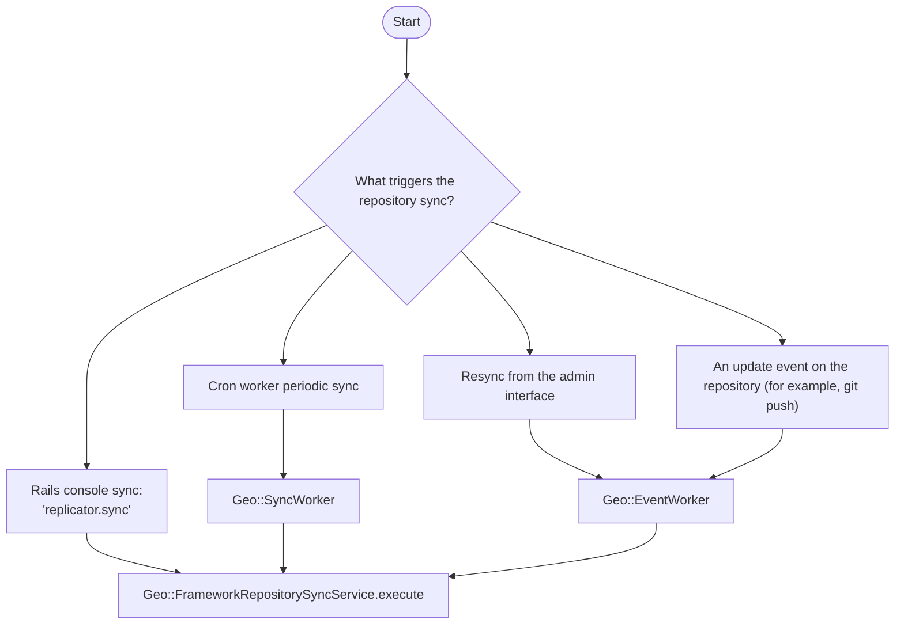
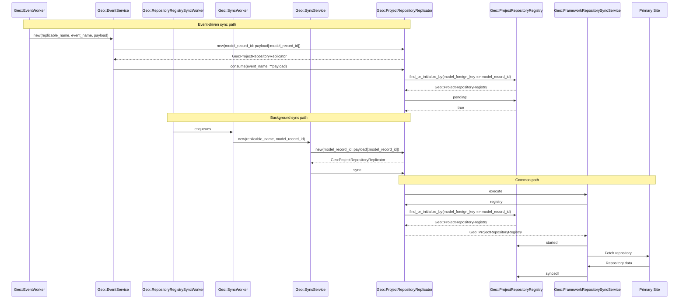
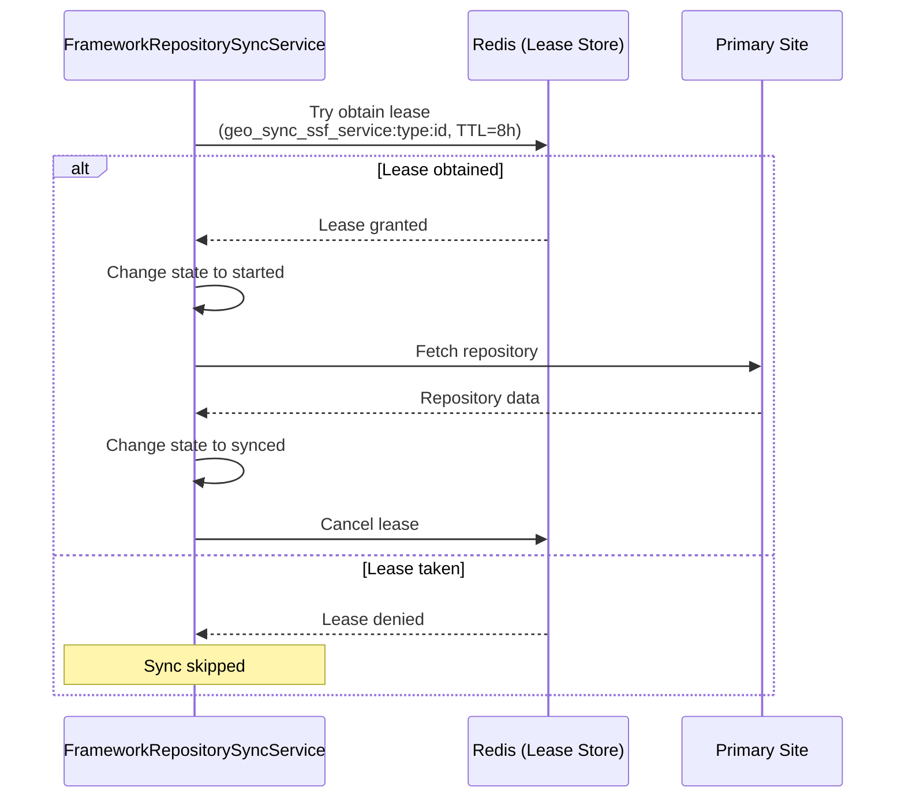

Repository replication (also called synchronization or sync) is a core Geo feature that replicates Git repositories from primary
to secondary sites. This ensures that secondary sites maintain up-to-date copies of all repositories, enabling disaster recovery and
geographic distribution of Git data.

The `Geo::ProjectRepositoryRegistry` class defines the model used to track the state of repository replication
on the secondary sites. For each project in the main (primary) database, one record in the tracking database is kept.

It records the following about repositories:

- The last time they were synced.
- The last time they were successfully synced.
- If they need to be resynced.
- When a retry should be attempted.
- The number of retries.
- If and when they were verified.

## Sync triggers

Repository synchronization can be triggered through different mechanisms.

These triggers boil down to two categories: background and event-driven syncs.

### Background syncs

To ensure all repositories are synchronized, `Geo::RepositoryRegistrySyncWorker`
runs periodically in the background on secondary sites. Specifically, this worker:

- Queries the tracking database for registries that need syncing. These can be:
  - Unsynced: Projects that have never been synced on the **secondary**
    site and so do not exist yet.
  - Updated recently: Projects that have a `last_repository_updated_at`
  timestamp that is more recent than the `last_repository_successful_sync_at`
  timestamp in the `Geo::ProjectRepositoryRegistry` model.
  - Manually resynced: The administrator can manually flag a repository to resync in the
  [Geo **Admin** area](../../administration/geo_sites.md).
- Enqueues `Geo::SyncWorker` jobs for each repository that needs updating.
- Provides baseline synchronization for all repositories.

### Event-driven syncs

Event-driven syncs are triggered by repository updates on the primary site. When a repository is updated, a new record
is created in the Geo events table for this particular repository update. The [Geo Log Cursor daemon](../geo.md#geo-log-cursor-daemon), which runs on
the secondary site, picks the event up and schedules a `Geo::EventWorker` job, which runs the `Geo::EventService`.
This service:

- Finds the repository replicator, and runs its `consume(event)` method.
- Changes registry state to `pending` before attempting sync to avoid race conditions
- Ensures latest changes are replicated quickly to secondary sites

## Sequence diagram

The following diagram illustrates how repository synchronization flows through the system. The two paths are
represented on the same diagram as they both end in the same fashion:

## Exclusive lease mechanism

The exclusive lease mechanism is a critical component that prevents concurrent synchronization operations on the same
repository. The lease is taken when the `Geo::FrameworkRepositorySyncService` executes.

Its purpose is to:

- Prevents race conditions when multiple sync jobs attempt to update the same repository simultaneously.
- Ensures data consistency by serializing sync operations for each repository.
- Protects against un-necessary load coming from duplicated event workers as well as sync stuck in `pending` state.

The lease has a timeout of 3 hours. The format for the lease key is `geo_sync_ssf_service:{replicable_name}:{model_record_id}`.

### Behavior during sync operations

When a sync operation begins:

1. The service attempts to obtain an exclusive lease for the repository
1. If the lease is already held by another process:
   - The sync exits early with a log message: "Cannot obtain an exclusive lease".
   - No sync operation is performed.
   - The job will be retried later.
1. If the lease is obtained:
   - The sync operation proceeds.
   - The lease is released in an `ensure` block after sync completes.

### Orphaned lease keys

Orphaned lease keys can occur when the sync process is killed uncleanly (for example, `SIGKILL` or process crash),
which means the process terminates before the `ensure` block can release the lease.
When a lease key is orphaned, subsequent sync attempts for that repository are blocked for up to 3 hours
(until the lease expires).

To mitigate this problem, you have a few options:

- **Automatic expiration**: Orphaned leases automatically expire after 3 hours.
- **Monitoring**: Check for an increase in `geo.log` for "Cannot obtain an exclusive lease" messages and
  `geo_sync_ssf_service:{replicable_name}:{model_record_id}` value of `lease_key` to identify potentially affected repositories.
- **Manual release**: As a last resort, you can manually release orphaned leases through the Rails console (see [troubleshooting](../../administration/geo/replication/troubleshooting/synchronization_verification.md#orphaned-exclusive-lease-keys-blocking-repository-sync))

## Related topics

- [Geo self-service framework](framework.md) - Overview of the Geo replication framework
- [Troubleshooting synchronization and verification](../../administration/geo/replication/troubleshooting/synchronization_verification.md) - Troubleshooting guide including orphaned lease key resolution
- [Issue #552408](https://gitlab.com/gitlab-org/gitlab/-/issues/552408) - Original issue documenting orphaned lease key problem
