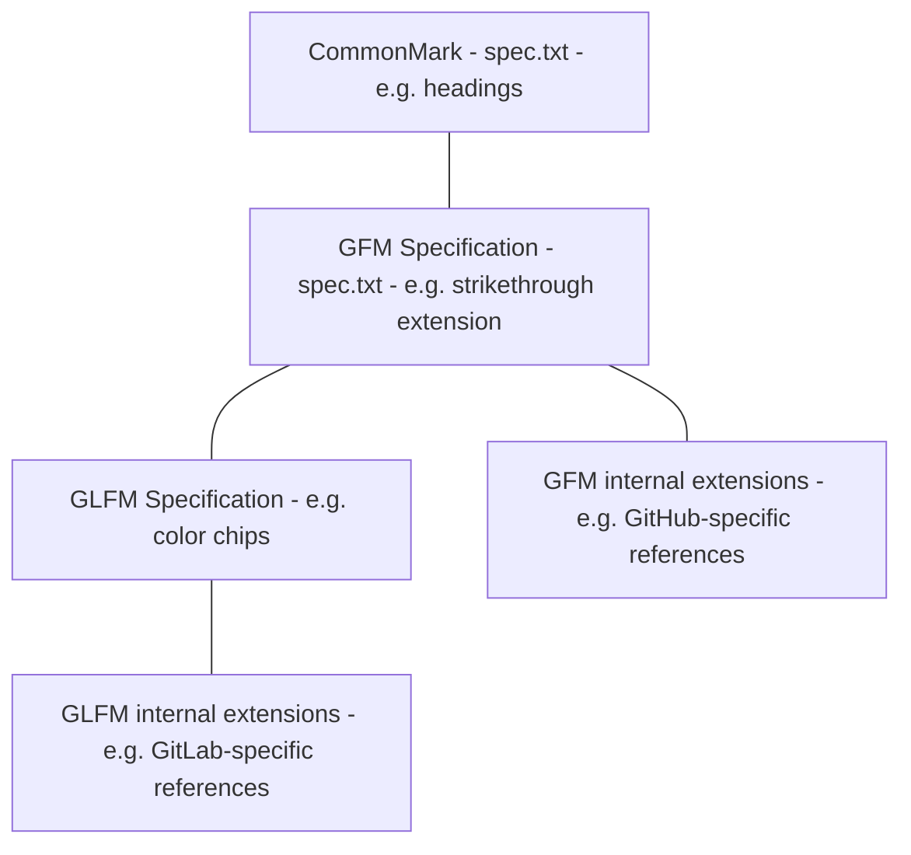

# GitLab Flavored Markdown (GLFM) Specification Guide **(FREE)**

GitLab supports Markdown in various places. The Markdown dialect we use is called
GitLab Flavored Markdown, or GLFM.

The specification for the GLFM dialect is based on the
[GitHub Flavored Markdown (GFM) specification](https://github.github.com/gfm/),
which is in turn based on the [CommonMark specification](https://spec.commonmark.org/current/).
The GLFM specification includes
[several extensions](../../../user/markdown.md#differences-between-gitlab-flavored-markdown-and-standard-markdown)
to the GFM specification.

See the [section on acronyms](#acronyms-glfm-ghfm-gfm-commonmark) for a
detailed explanation of the various acronyms used in this document.
This guide is a developer-facing document that describes the various terms and
definitions, goals, tools, and implementations related to the GLFM specification.
It is intended to support and augment the [user-facing documentation](../../../user/markdown.md)
for GitLab Flavored Markdown.

NOTE:
In this document, _GFM_ refers to _GitHub_ Flavored Markdown, not _GitLab_ Flavored Markdown.
Refer to the [section on acronyms](#acronyms-glfm-ghfm-gfm-commonmark)
for a detailed explanation of the various acronyms used in this document.

NOTE:
This guide and the implementation and files described in it are still a work in
progress. As the work progresses, rewrites and consolidation
between this guide and the [user-facing documentation](../../../user/markdown.md)
for GitLab Flavored Markdown are likely.

## Terms and definitions

### Acronyms: GLFM, GHFM, GFM, CommonMark

[_GitHub_ Flavored Markdown](https://github.github.com/gfm/) is widely referred
to by the acronym GFM, and this document follows that convention as well.
_GitLab_ Flavored Markdown is referred to as GLFM in this document,
to distinguish it from GitHub Flavored Markdown.

Unfortunately, this convention is not followed consistently in the rest
of the documentation or GitLab codebase. In many places, the GFM
acronym is used to refer to _GitLab_ Flavored Markdown. An
[open issue](https://gitlab.com/gitlab-org/gitlab/-/issues/24592) exists to resolve
this inconsistency.

Some places in the code refer to both the GitLab and GitHub specifications
simultaneous in the same areas of logic. In these situations,
_GitHub_ Flavored Markdown may be referred to with variable or constant names like
`ghfm_` to avoid confusion. For example, we use the `ghfm` acronym for the
[`ghfm_spec_v_0.29.txt` GitHub Flavored Markdown specification file](#github-flavored-markdown-specification)
which is committed to the `gitlab` repository and used as input to the
[`update_specification.rb` script](#update-specificationrb-script).

The original CommonMark specification is referred to as _CommonMark_ (no acronym).

### Various Markdown specifications

The specification format we use is based on the approach used in CommonMark, where
a `spec.txt` file serves as documentation, as well as being in a format that can
serve as input to automated conformance tests. It is
[explained in the CommonMark specification](https://spec.commonmark.org/0.30/#about-this-document):

> This document attempts to specify Markdown syntax unambiguously. It contains many
> examples with side-by-side Markdown and HTML. These examples are intended to double as conformance tests.

Here are the HTML-rendered versions of the specifications:

- [GitLab Flavored Markdown (GLFM) specification](https://gitlab.com/gitlab-org/gitlab/-/blob/master/glfm_specification/output/spec.html), which extends the:
- [GitHub Flavored Markdown (GFM) specification](https://github.github.com/gfm/) (rendered from the [source `spec.txt` for GFM specification](https://github.com/github/cmark-gfm/blob/master/test/spec.txt)), which extends the:
- [CommonMark specification](https://spec.commonmark.org/0.30/) (rendered from the [source `spec.txt` for CommonMark specification](https://github.com/commonmark/commonmark-spec/blob/master/spec.txt))

NOTE:
The creation of the
[GitLab Flavored Markdown (GLFM) specification](https://gitlab.com/gitlab-org/gitlab/-/blob/master/glfm_specification/output/spec.html)
file is still pending.

However, GLFM has more complex parsing, rendering, and testing requirements than
GFM or CommonMark. Therefore,
it does not have a static, hardcoded, manually updated `spec.txt`. Instead, the
GLFM `spec.txt` is automatically generated based on other input files. This process
is explained in detail in the [Implementation](#implementation) sections below.

#### Official specifications vs internal extensions

Within GFM and GLFM respectively, both GitHub and GitLab have two "sets" of Markdown they support:

- Official specification
- Internal extensions

The following taxonomy chart shows the taxonomy and terminology of the various specifications:



##### Official specifications

GFM and GLFM each have an official specification, which includes both:

1. The CommonMark standard.
1. Generic extensions to the CommonMark standard.

For example, GFM adds the
[`strikethrough` extension](https://github.github.com/gfm/https://github.github.com/gfm/#strikethrough-extension-),
and GLFM adds the
[`color chips` extension](../../../user/markdown.md#colors).
These extensions in the official specifications are not dependent upon any specific
implementation or environment. They can be implemented in any third-party Markdown rendering engine.

##### Internal extensions

GFM and GLFM each also have a set of internal extensions. These extensions are not part of the GFM or GLFM
official specifications, but are part of the GitHub and GitLab internal Markdown renderer and parser
implementations. These internal extensions are often dependent upon the GitHub or GitLab
implementations or environments, and may depend upon metadata which is only available via
interacting with those environments. For example,
[GitHub supports GitHub-specific autolinked references](https://docs.github.com/en/get-started/writing-on-github/working-with-advanced-formatting/autolinked-references-and-urls),
and
[GitLab also supports GitLab-specific references](../../../user/markdown.md#gitlab-specific-references).
These may also be implemented by third-party Markdown rendering engines which integrate with
GitHub or GitLab. For example, editor or IDE plugins which enable the user to directly edit
Markdown for issues, pull requests, or merge requests within the editor or IDE.

### Markdown examples

Everywhere in the context of the specification and this guide, the term
_examples_ is specifically used to refer to the Markdown + HTML pairs used
to illustrate the canonical parsing (or rendering) behavior of various Markdown source
strings in the standard
[CommonMark specification format](https://spec.commonmark.org/0.30/#example-1).

In this context, it should not be confused with other similar or related meanings of
_example_, such as
[RSpec examples](https://relishapp.com/rspec/rspec-core/docs/example-groups/basic-structure-describe-it).

### Parsers and renderers

To understand the various ways in which a specification is used, and how it related
to a given Markdown dialect, it's important to understand the distinction between
a _parser_ and a _renderer_:

- A Markdown _parser_ accepts Markdown as input and produces a Markdown
  Abstract Syntax Tree (AST) as output.
- A Markdown _renderer_ accepts the AST produced by a parser, and produces HTML
  (or a PDF, or any other relevant rendering format) as output.

### Types of Markdown tests driven by the GLFM specification

The two main types of automated testing are driven by the Markdown
examples and data contained in the GLFM specification. We refer to them as:

- Markdown conformance testing.
- Markdown snapshot testing.

Many other types of tests also occur in the GitLab
codebase, and some of these tests are also related to the GLFM Markdown dialect.
Therefore, to avoid confusion, we use these standard terms for the two types
of specification-driven testing referred to in this documentation and elsewhere.

#### Markdown conformance testing

_Markdown conformance testing_ refers to the standard testing method used by
all CommonMark Markdown dialects to verify that a specific implementation conforms
to the CommonMark Markdown specification. It is enforced by running the standard
CommonMark tool [`spec_tests.py`](https://github.com/github/cmark-gfm/blob/master/test/spec_tests.py)
against a given `spec.txt` specification and the implementation.

NOTE:
`spec_tests.py` may eventually be re-implemented in Ruby, to not have a dependency on Python.

#### Markdown snapshot testing

_Markdown snapshot testing_ refers to the automated testing performed in
the GitLab codebase, which is driven by `example_snapshots` fixture data derived from all of
the examples in the GLFM specification. It consists of both backend RSpec tests and frontend Jest
tests which use the fixture data. This fixture data is contained in YAML files. These files
are generated and updated based on the Markdown examples in the specification,
and the existing GLFM parser and render implementations. They may also be
manually updated as necessary to test-drive incomplete implementations.
Regarding the terminology used here:

<!-- vale gitlab.InclusionCultural = NO -->

1. The Markdown snapshot tests can be considered a form of the
   [Golden Master Testing approach](https://www.google.com/search?q=golden+master+testing),
   which is also referred to as Approval Testing or Characterization Testing.
   1. The term Golden Master originally comes from the recording industry, and
      refers to the process of mastering, or making a final mix from which all
      other copies are produced.
   1. For more information and background, you can read about
      [Characterization Tests](https://en.wikipedia.org/wiki/Characterization_test) and
      [Golden Masters](https://en.wikipedia.org/wiki/Gold_master_(disambiguation)).
1. The usage of the term _snapshot_ does not refer to the approach of
   [Jest snapshot testing](https://jestjs.io/docs/snapshot-testing), as used elsewhere
   in the GitLab frontend testing suite. However, the Markdown snapshot testing does
   follow the same philosophy and patterns as Jest snapshot testing:
   1. Snapshot example fixture data is represented as files which are checked into source control.
   1. The files can be automatically generated and updated based on the implementation
      of the code under tests.
   1. The files can also be manually updated when necessary, for example, to test-drive
      changes to an incomplete or buggy implementation.
1. The usage of the term _fixture_ does not refer to standard
   [Rails database fixture files](https://api.rubyonrails.org/classes/ActiveRecord/FixtureSet.html).
   It instead refers to _test fixtures_ in the
   [more generic definition](https://en.wikipedia.org/wiki/Test_fixture#Software),
   as input data to support automated testing.
1. These example snapshots fixture files are generated from and closely related to the rest of the
   GLFM specification. Therefore, the `example_snapshots` directory is colocated under the
   `glfm_specification` directory with the rest of the
   GLFM [specification files](#specification-files). They are intentionally _not_
   located under the `spec/fixtures` directory with the rest of
   the fixture data for the GitLab Rails application. In practice, developers have found
   it simpler and more understandable to have everything under the `glfm_specification` directory
   rather than splitting these files into the `spec/fixtures` directory.

<!-- vale gitlab.InclusionCultural = YES -->

See also the section on [normalization](#normalization) below, which is an important concept used
in the Markdown snapshot testing.

## Parsing and Rendering

The Markdown dialect used in the GitLab application has a dual requirement for rendering:

1. Rendering to static read-only HTML format, to be displayed in various
   places throughout the application.
1. Rendering editable content in the
   [Content Editor](https://about.gitlab.com/direction/create/editor/content_editor/),
   a ["What You See Is What You Get" (WYSIWYG)](https://en.wikipedia.org/wiki/WYSIWYG)
   editor. The Content Editor supports real-time instant switching between an editable
   Markdown source and an editable WYSIWYG document.

These requirements means that GitLab has two independent parser and renderer
implementations:

1. The backend parser / renderer supports parsing and rendering to _static_
   read-only HTML. It is [implemented in Ruby](https://gitlab.com/gitlab-org/gitlab/-/tree/master/lib/banzai).
   It leverages the [`commonmarker`](https://github.com/gjtorikian/commonmarker) gem,
   which is a Ruby wrapper for [`libcmark-gfm`](https://github.com/github/cmark),
   GitHub's fork of the reference parser for CommonMark. `libcmark-gfm` is an extended
   version of the C reference implementation of [CommonMark](https://commonmark.org/)
1. The frontend parser / renderer supports parsing and _WYSIWYG_ rendering for
   the Content Editor. It is implemented in JavaScript. Parsing is based on the
   [Remark](https://github.com/remarkjs/remark) Markdown parser, which produces a
   MDAST Abstract Syntax Tree (MDAST). Rendering is the process of turning
   an MDAST into a [ProseMirror document](../../fe_guide/content_editor.md). Then,
   ProseMirror is used to render a ProseMirror document to WYSIWYG HTML. In this
   document, we refer to the process of turning Markdown into an MDAST as the
   _frontend / JavaScript parser_, and the entire process of rendering Markdown
   to WYSIWYG HTML in ProseMirror as the _Content Editor_. Several
   requirements drive the need for an independent frontend parser / renderer
   implementation, including:
   1. Lack of necessary support for accurate source mapping in the HTML renderer
      implementation used on the backend.
   1. Latency and bandwidth concerns: eliminating the need for a round-trip to the backend
      every time the user switches between the Markdown source and the WYSIWYG document.
   1. Different HTML and browser rendering requirements for WYSIWYG documents. For example,
      displaying read-only elements such as diagrams and references in an editable form.

### Multiple versions of rendered HTML

Both of these GLFM renderer implementations (static and WYSIWYG) produce
HTML which differs from the canonical HTML examples from the specification.
For every Markdown example in the GLFM specification, three
versions of HTML can potentially be rendered from the example:

- Static HTML.
- WYSIWYG HTML.
- Canonical HTML.

#### Static HTML

**Static HTML** is HTML produced by the backend (Ruby) renderer, which
contains extra styling and behavioral HTML. For example, **Create task** buttons
added for dynamically creating an issue from a task list item.
The GitLab [Markdown API](../../../api/markdown.md) generates HTML
for a given Markdown string using this method.

#### WYSIWYG HTML

**WYSIWYG HTML** is HTML produced by the frontend (JavaScript) Content Editor,
which includes parsing and rendering logic. It is used to present an editable document
in the ProseMirror WYSIWYG editor.

#### Canonical HTML

**Canonical HTML** is the clean, basic version of HTML rendered from Markdown.

1. For the examples which come from the CommonMark specification and
   GFM extensions specification, the canonical HTML is the exact identical HTML found in the
   GFM `spec.txt` example blocks.
1. For GLFM extensions to the <abbr title="GitHub Flavored Markdown">GFM</abbr> / CommonMark
   specification, a `glfm_canonical_examples.txt` [input specification file](#input-specification-files)
   contains the Markdown examples and corresponding canonical HTML examples.

### Canonicalization of HTML

The rendered [static HTML](#static-html) and [WYSIWYG HTML](#wysiwyg-html)
from the backend (Ruby) and frontend (JavaScript) renderers usually contains extra styling
or HTML elements, to support specific appearance and behavioral requirements.

Neither the backend nor the frontend rendering logic can directly render the clean, basic canonical HTML.
Nor should they be able to, because:

- It's not a direct requirement to support any GitLab application feature.
- Adding this feature adds unnecessary requirements and complexity to the implementations.

Instead, the rendered static or WYSIWYG HTML is converted to canonical HTML by a
_canonicalization_ process. This process can strip all the extra styling and behavioral
HTML from the static or WYSIWYG HTML, resulting in canonical HTML which exactly
matches the Markdown + HTML examples in a standard `spec.txt` specification.

Use the [`canonicalize-html.rb` script](#canonicalize-htmlrb-script) for this process.
More explanation about this canonicalization process in the sections below.

NOTE:
Some of the static or WYSIWYG HTML examples may not be representable as canonical
HTML. (For example, when they are represented as an image.) In these cases, the Markdown
conformance test for the example can be skipped by setting `skip_update_example_snapshots: true`
for the example in `glfm_specification/input/gitlab_flavored_markdown/glfm_example_status.yml`.

### Normalization

Versions of the rendered HTML and ProseMirror JSON can vary for a number of reasons.
Differences in styling or HTML structure can occur, but the values of attributes or nodes may
also vary across different test runs or environments. For example:

1. Database record identifiers
1. Namespace or project identifiers
1. Portions of URIs
1. File paths or names
1. Random values

For the [Markdown snapshot testing](#markdown-snapshot-testing) to work
properly, you must account for these differences in a way that ensures the tests are reliable,
and always behave the same across different test runs or environments.

To account for these differences, there is a process called **_normalization_**. Normalization
allows custom regular expressions with
[_capturing groups_](https://ruby-doc.org/core-3.1.2/Regexp.html#class-Regexp-label-Capturing)
to be applied to two different versions of HTML or JSON for a given Markdown example,
and the contents of the captured groups can be replaced with the same fixed values.

Then, the two normalized versions can be compared to each other to ensure all other non-variable
content is identical.

NOTE:
We don't care about verifying specific attribute values here, so
it's OK if the normalizations discard and replace these variable values with fixed values.
Different testing levels have different purposes:

1. [Markdown snapshot testing](#markdown-snapshot-testing) is intended to enforce the structure of
   the rendered HTML/JSON, and to ensure that it conforms to the canonical specification.
1. Individual unit tests of the implementation for a specific Markdown example are responsible for
   specific and targeted testing of these variable values.

We also use this same regex capture-and-replace normalization approach for
[canonicalization of HTML](#canonicalization-of-html), because it is essentially the same process.
With canonicalization, instead of just replacing variable values, we are removing non-canonical
portions of the HTML.

Refer to [`glfm_example_normalizations.yml`](#glfm_example_normalizationsyml) for a detailed explanation
of how the normalizations are specified.

## Goals

Given the constraints above, we have a few goals related to the GLFM
specification and testing infrastructure:

1. A canonical `spec.txt` exists, and represents the official specification for
   GLFM, which meets these requirements:
   1. The spec is a strict superset of the GitHub Flavored Markdown
      (GFM) specification, just as
      <abbr title="GitHub Flavored Markdown">GFM</abbr> is a strict superset
      [of the CommonMark specification](https://github.github.com/gfm/#what-is-github-flavored-markdown-).
      Therefore, it contains the superset of all canonical Markdown + HTML examples
      for CommonMark, GFM, and GLFM.
   1. It contains a prose introduction section which is specific to GitLab and GLFM.
   1. It contains all other non-introduction sections verbatim from the
      GFM
      `spec.txt`.
   1. It contains a new extra section for the GLFM GitLab-specific extensions,
      with both prose and examples describing the extensions.
   1. It should be in the standard format which can processed by the standard
      CommonMark tools [`spec_tests.py`](https://github.com/github/cmark-gfm/blob/master/test/spec_tests.py),
      which is a [script used to run the Markdown conformance tests](https://github.github.com/gfm/#about-this-document)
      against all examples contained in a `spec.txt`.
1. The GLFM parsers and HTML renderers for
   both the static backend (Ruby) and WYSIWYG frontend (JavaScript) implementations
   support _consistent_ rendering of all canonical Markdown + HTML examples in the
   GLFM `spec.txt` specification, as verified by `spec_tests.py`.

   NOTE:
   Consistent does not mean that both of these implementations render
   to the identical HTML. They each have different implementation-specific additions
   to the HTML they render, so therefore their rendered HTML is
   ["canonicalized"](#canonicalization-of-html) to canonical HTML prior running
   the Markdown conformance tests.
1. For _both_ the static backend (Ruby) and WYSIWYG frontend (JavaScript) implementations,
   a set of example snapshots exists in the form of YAML files, which
   correspond to every Markdown example in the GLFM `spec.txt`. These example snapshots
   support the following usages for every GLFM Markdown example:
   1. The backend (Ruby) parser and renderer can convert Markdown to the
      expected custom static HTML.
   1. The frontend (JavaScript) parser and renderer (which includes GitLab custom
      code and Remark) can convert Markdown to the expected ProseMirror JSON
      representing a ProseMirror document.
   1. The **Content Editor** (which includes the frontend (JavaScript) parser and renderer,
      and ProseMirror) can convert Markdown to the expected custom WYSIWYG HTML as rendered by ProseMirror.
   1. The **Content Editor** can complete a round-trip test, which involves converting
      from Markdown, to MDAST, to ProseMirror Document, then back to Markdown. It ensures
      the resulting Markdown is exactly identical, with no differences.

## Implementation

The following set of scripts and files is complex. However, it allows us to meet
all of the goals listed above, and is carefully designed to meet the following
implementation goals:

1. Minimize the amount of manual editing, curation, and maintenance of the GLFM specification
   and related files.
1. Automate and simplify the process of updating the GLFM specification and related
   files when there are changes to the upstream CommonMark spec,
   GFM extensions, or the GLFM extensions.
1. Support partial or incomplete implementations of the GLFM specification, whether
   due to in-progress work, bugs, or new future Markdown support, while still
   performing all functionality for the existing implementations.
1. Automate, simplify, and support running various tests, including the standard
   CommonMark conformance tests and GLFM-implementation-specific unit/acceptance
   Markdown snapshot tests.
1. Provide a rich set of extensible metadata around all GLFM specification examples
   to support current and future requirements, such as automated acceptance
   testing and automated documentation updates.

The documentation on the implementation is split into three sections:

1. [Scripts](#scripts).
1. [Specification files](#specification-files).
1. [Example snapshot files](#example-snapshot-files):
   These YAML files are used as input data
   or fixtures to drive the various tests, and are located under
   `glfm_specification/example_snapshots`. All example snapshot files are automatically
   generated based on the specification files and the implementation of the parsers and renderers.
   However, they can also be directly edited if necessary, such as to
   test-drive an incomplete implementation.

### Scripts

These executable scripts perform various tasks related to maintaining
the specification and running tests. Each script has a shell-executable entry point
file located under `scripts/glfm`, but the actual implementation is in unit-tested
classes under `scripts/lib/glfm`.

NOTE:
Some of these scripts are implemented in Ruby, and others are shell scripts.
Ruby scripts are used for more complex custom scripts, to enable easier unit testing
and debugging. Shell scripts are used for simpler scripts which primarily invoke
other shell commands, to avoid the challenges related to
[running other shell sub-processes](https://github.com/thewoolleyman/process_helper#why-yet-another-ruby-process-wrapper-library)
from Ruby scripts.

NOTE:
The Ruby executable scripts under `scripts/glfm` have dashes instead of underscores
in the filenames. This naming is non-standard for a Ruby file, but is used to distinguish
them from the corresponding implementation class entry point files under
`scripts/lib/glfm` when searching by filename.

#### `update-specification.rb` script

The `scripts/glfm/update-specification.rb` script uses specification input files to
generate and update `spec.txt` (Markdown) and `spec.html` (HTML). The `spec.html` is
generated by passing the generated (or updated) `spec.txt` Markdown to the backend API
for rendering to static HTML:

```mermaid
graph LR
subgraph script:
  A{update-specification.rb}
  A --> B{Backend Markdown API}
end
subgraph input:<br/>input specification files
  C[ghfm_spec_v_0.29.txt] --> A
  D[glfm_intro.txt] --> A
  E[glfm_canonical_examples.txt] --> A
end
subgraph output:<br/>GLFM specification files
  A --> F[spec.txt]
  F --> B
  B --> G[spec.html]
end
```

#### `canonicalize-html.rb` script

The `scripts/glfm/canonicalize-html.rb` handles the
["canonicalization" of HTML](#canonicalization-of-html). It is a pipe-through
helper script which takes as input a static or WYSIWYG HTML string containing
extra HTML, and outputs a canonical HTML string.

It is implemented as a standalone, modular, single-purpose script, based on the
[Unix philosophy](https://en.wikipedia.org/wiki/Unix_philosophy#:~:text=The%20Unix%20philosophy%20emphasizes%20building,developers%20other%20than%20its%20creators.).
It's easy to use when running the standard CommonMark `spec_tests.py`
script, which expects canonical HTML, against the GitLab renderer implementations.

#### `run-spec-tests.sh` script

`scripts/glfm/run-spec-tests.sh` is a convenience shell script which runs
conformance specs via the CommonMark standard `spec_tests.py` script,
which uses the `glfm_specification/output/spec.txt` file and `scripts/glfm/canonicalize-html.rb`
helper script to test the GLFM renderer implementations' support for rendering Markdown
specification examples to canonical HTML.

```mermaid
graph LR
subgraph scripts:
  A{run-spec-tests.sh} --> C
  subgraph specification testing process
    B[canonicalize-html.sh] --> C
    C[spec_tests.py]
  end
end
subgraph input
  D[spec.txt GLFM specification] --> C
  E((GLFM static<br/>renderer implementation)) --> B
  F((GLFM WYSIWYG<br/>renderer implementation)) --> B
end
subgraph output:<br/>test results/output
  C --> G[spec_tests.py output]
end
```

#### `update-example-snapshots.rb` script

The `scripts/glfm/update-example-snapshots.rb` script uses the GLFM
`glfm_specification/output/spec.txt` specification file and the
`glfm_specification/input/gitlab_flavored_markdown/glfm_example_status.yml`
file to create and update the [example snapshot](#example-snapshot-files)
YAML files:

```mermaid
graph LR
subgraph script:
  A{update-example-snapshots.rb}
end
subgraph input:<br/>input specification file
  B[spec.txt] --> A
  C[glfm_example_status.yml] --> A
end
subgraph output:<br/>example snapshot files
  A --> E[examples_index.yml]
  A --> F[markdown.yml]
  A --> G[html.yml]
  A --> H[prosemirror_json.yml]
end
```

#### `run-snapshot-tests.sh` script

The `scripts/glfm/run-snapshot-tests.sh` convenience shell script runs all relevant
Markdown snapshot testing RSpec and Jest `*_spec` files (from main app `spec` folder)
which are driven by `example_snapshot` YAML files.

The actual RSpec and Jest test `*_spec` files (frontend and backend) live
under the normal relevant locations under `spec`, matching the location of their
corresponding implementations. They can be run either:

- As part of the normal pipelines.
- From the command line or an IDE, just like any other file under `spec`.

However, they are spread across four different locations:

- Backend tests under `spec/requests`.
- Backend EE tests under `ee/spec/requests`.
- Frontend tests under `spec/frontend`.
- Frontend EE tests under `ee/spec/frontend`.

Therefore, this convenience script is intended to only be used in local
development. It simplifies running all tests at once and returning a single return
code. It contains only shell scripting commands for the relevant
`bundle exec rspec ...` and `yarn jest ...` commands.

```mermaid
graph LR
subgraph tests:
  B[relevant rspec+jest test files]
end
subgraph script:
  A{run-snapshopt-tests.sh} -->|invokes| B
end
subgraph input:<br/>YAML
  C[examples_index.yml] --> B
  D[markdown.yml] --> B
  E[html.yml] --> B
  F[prosemirror_json.yml] --> B
end
subgraph output:<br/>test results/output
  B --> H[rspec+jest output]
end
```

### Specification files

These files represent the GLFM specification itself. They are all
located under the root `glfm_specification`, and are further divided into two
subfolders:

- `input`: Contains files which are imported or manually edited.
- `output`: Contains files which are automatically generated.

#### Input specification files

The `glfm_specification/input` directory contains files which are the original
input to drive all other automated GLFM specification scripts/processes/tests.
They are either downloaded, as in the case of the
GFM `spec.txt` file, or manually
updated, as in the case of all GFM files.

##### GitHub Flavored Markdown specification

[`glfm_specification/input/github_flavored_markdown/ghfm_spec_v_0.29.txt`](https://gitlab.com/gitlab-org/gitlab/-/blob/master/glfm_specification/input/github_flavored_markdown/ghfm_spec_v_0.29.txt)
is the official latest [GFM `spec.txt`](https://github.com/github/cmark-gfm/blob/master/test/spec.txt).

- It is automatically downloaded and updated by `update-specification.rb` script.
- When it is downloaded, the version number is added to the filename.

NOTE:
This file uses the `ghfm` acronym instead of `gfm`, as
explained in the [Acronyms section](#acronyms-glfm-ghfm-gfm-commonmark).

##### `glfm_intro.txt`

[`glfm_specification/input/gitlab_flavored_markdown/glfm_intro.txt`](https://gitlab.com/gitlab-org/gitlab/-/blob/master/glfm_specification/input/gitlab_flavored_markdown/glfm_intro.txt)
is the GitLab-specific version of the prose in the introduction section of the GLFM specification.

- It is manually updated.
- The `update-specification.rb` script inserts it into the generated GLFM `spec.txt` to replace
  the GitHub-specific GFM version of the introductory section.

##### `glfm_canonical_examples.txt`

[`glfm_specification/input/gitlab_flavored_markdown/glfm_canonical_examples.txt`](https://gitlab.com/gitlab-org/gitlab/-/blob/master/glfm_specification/input/gitlab_flavored_markdown/glfm_canonical_examples.txt)
is the manually updated canonical Markdown+HTML examples for GLFM extensions.

- It contains examples in the [standard backtick-delimited `spec.txt` format](#various-markdown-specifications),
  each of which contain a Markdown example and the corresponding canonical HTML.
- The `update-specification.rb` script inserts it as new sections before the appendix
  of generated `spec.txt`.
- It should consist of `H1` header sections, with all examples nested exactly 2 levels deep within `H2`
  header sections.

`glfm_specification/input/gitlab_flavored_markdown/glfm_canonical_examples.txt` sample entries:

NOTE:
All lines in this example are prefixed with a `|` character. This prefix helps avoid false
errors when this file is checked by `markdownlint`, and possible errors in other Markdown editors.
The actual file should not have these prefixed `|` characters.

```plaintext
|# First GitLab-Specific Section with Examples
|
|## Strong but with two asterisks
|
|```````````````````````````````` example
|**bold**
|.
|<p><strong>bold</strong></p>
|````````````````````````````````
|
|# Second GitLab-Specific Section with Examples
|
|## Strong but with HTML
|
|```````````````````````````````` example
|<strong>
|bold
|</strong>
|.
|<p><strong>
|bold
|</strong></p>
|````````````````````````````````
```

##### `glfm_example_status.yml`

[`glfm_specification/input/gitlab_flavored_markdown/glfm_example_status.yml`](https://gitlab.com/gitlab-org/gitlab/-/blob/master/glfm_specification/input/gitlab_flavored_markdown/glfm_example_status.yml)
controls the behavior of the [scripts](#scripts) and [tests](#types-of-markdown-tests-driven-by-the-glfm-specification).

- It is manually updated.
- The `skip_update_example_snapshot*` fields control the status of automatic generation of
  snapshot example entries based on Markdown examples.
- The `skip_running_*` control allow Markdown conformance tests or
  Markdown snapshot tests to be skipped for individual examples.
- This allows control over skipping this processing or testing of various examples when they
  are unimplemented, partially implemented, broken, cannot be generated, or cannot be tested for some reason.
- All entries default to false. They can be set to true by specifying a Ruby
  value which evaluates as truthy. This could be the boolean `true` value, but ideally should
  be a string describing why the example's updating or testing is being skipped.
- When a `skip_update_example_snapshot*` entry is true, the existing value is preserved.
  However, since the YAML is re-written, the style of the string value and its
  [Block Chomping Indicator (`|`)](https://yaml.org/spec/1.2.2/#8112-block-chomping-indicator)
  may be modified, because the Ruby `psych` YAML library automatically determines this.

The following optional entries are supported for each example. They all default to `false`:

- `skip_update_example_snapshots`: When true, skips any addition or update of any this example's entries
  in the [`glfm_specification/example_snapshots/html.yml`](#glfm_specificationexample_snapshotshtmlyml) file
  or the [`glfm_specification/example_snapshots/prosemirror_json.yml`](#glfm_specificationexample_snapshotsprosemirror_jsonyml) file.
  If this value is truthy, then no other `skip_update_example_snapshot_*` entries can be truthy,
  and an error is raised if any of them are.
- `skip_update_example_snapshot_html_static`: When true, skips addition or update of this example's [static HTML](#static-html)
  entry in the [`glfm_specification/example_snapshots/html.yml`](#glfm_specificationexample_snapshotshtmlyml) file.
- `skip_update_example_snapshot_html_wysiwyg`: When true, skips addition or update of this example's [WYSIWYG HTML](#wysiwyg-html)
  entry in the [`glfm_specification/example_snapshots/html.yml`](#glfm_specificationexample_snapshotshtmlyml) file.
- `skip_update_example_snapshot_prosemirror_json`: When true, skips addition or update of this example's
  entry in the [`glfm_specification/example_snapshots/prosemirror_json.yml`](#glfm_specificationexample_snapshotsprosemirror_jsonyml) file.
- `skip_running_conformance_static_tests`: When true, skips running the [Markdown conformance tests](#markdown-conformance-testing)
  of the [static HTML](#static-html) for this example.
- `skip_running_conformance_wysiwyg_tests`: When true, skips running the [Markdown conformance tests](#markdown-conformance-testing)
  of the [WYSIWYG HTML](#wysiwyg-html) for this example.
- `skip_running_snapshot_static_html_tests`: When true, skips running the [Markdown snapshot tests](#markdown-snapshot-testing)
  of the [static HTML](#multiple-versions-of-rendered-html) for this example.
- `skip_running_snapshot_wysiwyg_html_tests`: When true, skips running the [Markdown snapshot tests](#markdown-snapshot-testing)
  of the [WYSIWYG HTML](#wysiwyg-html) for this example.
- `skip_running_snapshot_prosemirror_json_tests`: When true, skips running the [Markdown snapshot tests](#markdown-snapshot-testing)
  of the [ProseMirror JSON](#glfm_specificationexample_snapshotsprosemirror_jsonyml) for this example.

`glfm_specification/input/gitlab_flavored_markdown/glfm_example_status.yml` sample entry:

```yaml
07_99_an_example_with_incomplete_wysiwyg_implementation_1:
  skip_update_example_snapshots: 'An explanation of the reason for skipping.'
  skip_update_example_snapshot_html_static: 'An explanation of the reason for skipping.'
  skip_update_example_snapshot_html_wysiwyg: 'An explanation of the reason for skipping.'
  skip_update_example_snapshot_prosemirror_json: 'An explanation of the reason for skipping.'
  skip_running_conformance_static_tests: 'An explanation of the reason for skipping.'
  skip_running_conformance_wysiwyg_tests: 'An explanation of the reason for skipping.'
  skip_running_snapshot_static_html_tests: 'An explanation of the reason for skipping.'
  skip_running_snapshot_wysiwyg_html_tests: 'An explanation of the reason for skipping.'
  skip_running_snapshot_prosemirror_json_tests: 'An explanation of the reason for skipping.'
```

##### `glfm_example_normalizations.yml`

[`glfm_specification/input/gitlab_flavored_markdown/glfm_example_normalizations.yml`](https://gitlab.com/gitlab-org/gitlab/-/blob/master/glfm_specification/input/gitlab_flavored_markdown/glfm_example_normalizations.yml)
controls the [normalization](#normalization) process. It allows one or more `regex`/`replacement` pairs
to be specified for a Markdown example.

- It is manually updated.
- It has a nested structure corresponding to the example and type of entry it refers to.
- It extensively uses [YAML anchors and aliases](https://yaml.org/spec/1.2.2/#692-node-anchors)
  to avoid duplication of `regex`/`replacement` pairs and allow them to be shared across multiple examples.
- The YAML anchors use a naming convention based on the index number of the example, to
  ensure unique anchor names and avoid naming conflicts.

`glfm_specification/input/gitlab_flavored_markdown/glfm_example_normalizations.yml` sample entries:

```yaml
# NOTE: All YAML anchors which are shared across one or more examples are defined in the `00_shared` section.
00_shared:
  00_uri: &00_uri
    - regex: '(href|data-src)(=")(.*?)(test-file\.(png|zip)")'
      replacement: '\1\2URI_PREFIX\4'
01_01__section_one__example_containing_a_uri__001:
  html:
    static:
      canonical:
        01_01_uri: *00_uri
      snapshot:
        01_01_uri: *00_uri
      wysiwyg:
        01_01_uri: *00_uri
  prosemirror_json:
    01_01_uri: *00_uri
07_01__gitlab_specific_markdown__footnotes__001:
  # YAML anchors which are only shared within a single example should be defined within the example
  shared:
    07_01_href: &07_01_href
      - regex: '(href)(=")(.+?)(")'
        replacement: '\1\2REF\4'
    07_01_id: &07_01_id
      - regex: '(id)(=")(.+?)(")'
        replacement: '\1\2ID\4'
  html:
    static:
      canonical:
        07_01_href: *07_01_href
        07_01_id: *07_01_id
      snapshot:
        07_01_href: *07_01_href
        07_01_id: *07_01_id
    wysiwyg:
      07_01_href: *07_01_href
      07_01_id: *07_01_id
  prosemirror_json:
    07_01_href: *07_01_href
    07_01_id: *07_01_id
```

#### Output specification files

The `glfm_specification/output` directory contains the CommonMark standard format
`spec.txt` file which represents the canonical GLFM specification which is generated
by the `update-specification.rb` script. It also contains the rendered `spec.html`
which is generated based on the `spec.txt` as input.

These output `spec.*` files, which represent the official, canonical GLFM specification,
are colocated under the same parent folder `glfm_specification` with the other
`input` specification files. They're located here both for convenience, and because they are all
a mix of manually edited and generated files.

In GFM, `spec.txt` is [located in the test dir](https://github.com/github/cmark-gfm/blob/master/test/spec.txt),
and in CommonMark it's located [in the project root](https://github.com/github/cmark-gfm/blob/master/test/spec.txt).
No precedent exists for a standard location. In the future, we may decide to
move or copy a hosted version of the rendered HTML `spec.html` version to another location or site.

##### spec.txt

[`glfm_specification/output/spec.txt`](https://gitlab.com/gitlab-org/gitlab/-/blob/master/glfm_specification/output/spec.txt)
is a Markdown specification file, in the standard format
with prose and Markdown + canonical HTML examples. It is generated or updated by the
`update-specification.rb` script.

It also serves as input for other scripts such as `update-example-snapshots.rb`
and `run-spec-tests.sh`.

##### spec.html

[`glfm_specification/output/spec.html`](https://gitlab.com/gitlab-org/gitlab/-/blob/master/glfm_specification/output/spec.html)
is an HTML file, rendered based on `spec.txt`. It is
also generated (or updated) by the `update-specification.rb` script at the same time as
`spec.txt`.

It corresponds to the HTML-rendered versions of the
"GitHub Flavored Markdown" (<abbr title="GitHub Flavored Markdown">GFM</abbr>)
[specification](https://github.github.com/gfm/)
and the [CommonMark specification](https://spec.commonmark.org/0.30/).

### Example snapshot files

The `example_snapshots` directory contains files which are generated by the
`update-example-snapshots.rb` script based off of the files in the
`glfm_specification/input` directory. They are used as fixtures to drive the
various Markdown snapshot tests.

After the entire GLFM implementation is complete for both backend (Ruby) and
frontend (JavaScript), all of these YAML files can be automatically generated.
However, while the implementations are still in progress, the `skip_update_example_snapshots`
key in `glfm_specification/input/gitlab_flavored_markdown/glfm_example_status.yml`
can be used to disable automatic generation of some examples. They can instead
be manually edited as necessary to help drive the implementations.

#### `glfm_specification/example_snapshots/examples_index.yml`

[`glfm_specification/example_snapshots/examples_index.yml`](https://gitlab.com/gitlab-org/gitlab/-/blob/master/glfm_specification/example_snapshots/examples_index.yml)
is the main list of all
CommonMark, GFM, and GLFM example names, each with a unique canonical name.

- It is generated from the hierarchical sections and examples in the
  GFM `spec.txt` specification.
- For CommonMark and GFM examples,
  these sections originally came from the GFM `spec.txt`.
- For GLFM examples, it is generated from `glfm_canonical_examples.txt`, which is
  the additional Section 7 in the GLFM `spec.txt`.
- It also contains extra metadata about each example, such as:
  1. `spec_txt_example_position` - The position of the example in the generated GLFM `spec.txt` file.
     - This value is the index order of each individual Markdown + HTML5 example in the file. It is _not_
       the line number in the file.
     - This value can be used to locate the example in the rendered `spec.html` file, because the standard
       CommonMark tooling includes the index number for each example in the rendered HTML file.
       For example: [https://spec.commonmark.org/0.30/#example-42](https://spec.commonmark.org/0.30/#example-42)
  1. `source_specification` - Which specification the example originally came from:
     `commonmark`, `github`, or `gitlab`.
- The naming convention for example entry names is based on nested header section
  names and example index in the header.
  - This naming convention should result in fairly stable names and example positions.
    The CommonMark / GLFM specification rarely changes, and most GLFM
    examples where multiple examples exist for the same Section 7 subsection are
    added to the end of the sub-section.

`glfm_specification/example_snapshots/examples_index.yml` sample entries:

```yaml
02_01_preliminaries_characters_and_lines_1:
  spec_txt_example_position: 1
  source_specification: commonmark
03_01_blocks_and_inlines_precedence_1:
  spec_txt_example_position: 12
  source_specification: commonmark
05_03_container_blocks_task_list_items_1:
  spec_txt_example_position: 279
  source_specification: github
06_04_inlines_emphasis_and_strong_emphasis_1:
  spec_txt_example_position: 360
  source_specification: github
07_01_audio_link_1:
  spec_txt_example_position: 301
  source_specification: gitlab
```

#### `glfm_specification/example_snapshots/markdown.yml`

[`glfm_specification/example_snapshots/markdown.yml`](https://gitlab.com/gitlab-org/gitlab/-/blob/master/glfm_specification/example_snapshots/markdown.yml) contains the original Markdown
for each entry in `glfm_specification/example_snapshots/examples_index.yml`

- For CommonMark and GFM Markdown,
  it is generated (or updated) from the standard GFM
  `spec.txt` using the `update-example-snapshots.rb` script.
- For GLFM, it is generated (or updated) from the
  `glfm_specification/input/gitlab_flavored_markdown/glfm_canonical_examples.txt`
  input specification file.

`glfm_specification/example_snapshots/markdown.yml` sample entry:

```yaml
06_04_inlines_emphasis_and_strong_emphasis_1: |
  *foo bar*
```

#### `glfm_specification/example_snapshots/html.yml`

[`glfm_specification/example_snapshots/html.yml`](https://gitlab.com/gitlab-org/gitlab/-/blob/master/glfm_specification/example_snapshots/html.yml)
contains the HTML for each entry in `glfm_specification/example_snapshots/examples_index.yml`

Three types of entries exist, with different HTML for each:

- **Canonical**
  - The ["Canonical"](#canonicalization-of-html) HTML.
  - For CommonMark and GFM examples, the HTML comes from the examples in `spec.txt`.
  - For GLFM examples, it is generated/updated from
    `glfm_specification/input/gitlab_flavored_markdown/glfm_canonical_examples.txt`.
- **Static**
  - This is the static (backend (Ruby)-generated) HTML for each entry in
    `glfm_specification/example_snapshots/examples_index.yml`.
  - It is generated/updated from backend [Markdown API](../../../api/markdown.md)
    (or the underlying internal classes) via the `update-example-snapshots.rb` script,
    but can be manually updated for static examples with incomplete implementations.
- **WYSIWYG**
  - The WYSIWYG (frontend, JavaScript-generated) HTML for each entry in
    `glfm_specification/example_snapshots/examples_index.yml`.
  - It is generated (or updated) from the frontend Content Editor implementation via the
    `update-example-snapshots.rb` script. It can be manually updated for WYSIWYG
    examples with incomplete implementations.

Any exceptions or failures which occur when generating HTML are replaced with an
`Error - check implementation` value.

`glfm_specification/example_snapshots/html.yml` sample entry:

```yaml
06_04_inlines_emphasis_and_strong_emphasis_1:
  canonical: |
    <p><em>foo bar</em></p>
  static: |
    <p data-sourcepos="1:1-1:9" dir="auto"><strong>foo bar</strong></p>
  wysiwyg: |
    <p><strong>foo bar</strong></p>
```

NOTE:
The actual `static` or `WYSIWYG` entries may differ from the example `html.yml`,
depending on how the implementations evolve.

#### `glfm_specification/example_snapshots/prosemirror_json.yml`

[`glfm_specification/example_snapshots/prosemirror_json.yml`](https://gitlab.com/gitlab-org/gitlab/-/blob/master/glfm_specification/example_snapshots/prosemirror_json.yml)
contains the ProseMirror JSON for each entry in `glfm_specification/example_snapshots/examples_index.yml`

- It is generated (or updated) from the frontend code via the `update-example-snapshots.rb`
  script, but can be manually updated for examples with incomplete implementations.
- Any exceptions or failures when generating are replaced with a `Error - check implementation` value.

`glfm_specification/example_snapshots/prosemirror_json.yml` sample entry:

```yaml
06_04_inlines_emphasis_and_strong_emphasis_1: |-
  {
    "type": "doc",
    "content": [
      {
        "type": "paragraph",
        "content": [
          {
            "type": "text",
            "marks": [
              {
                "type": "bold"
              }
            ],
            "text": "foo bar"
          },
        ]
      },
    ]
  }
```

## Workflows

This section describes how the scripts can be used to manage the GLFM specification and tests.

### Update the GLFM specification and run conformance tests

1. Run [`update-specification.rb`](#update-specificationrb-script) to update the GLFM specification [output specification files](#output-specification-files).
1. Visually inspect and confirm any resulting changes to the [output specification files](#output-specification-files).
1. Run [`run-spec-tests.sh`](http://gdk.test:3005/ee/development/gitlab_flavored_markdown/specification_guide/index.html#run-spec-testssh-script) to run the conformance tests against the canonicalized GLFM specification.
1. Commit any changes to the [output specification files](#output-specification-files).

### Update the example snapshots and run snapshot tests

1. If you are working on an in-progress feature or bug, make any necessary manual updates to the [input specification files](#input-specification-files). This may include:
   1. Updating the canonical Markdown or HTML examples in `glfm_specification/input/gitlab_flavored_markdown/glfm_canonical_examples.txt`.
   1. Updating `glfm_specification/input/gitlab_flavored_markdown/glfm_example_status.yml` to reflect the current status of the examples or tests.
1. Run [`update-specification.rb`](#update-specificationrb-script) to update the `spec.txt` to reflect any changes which were made to the [input specification files](#input-specification-files).
1. Visually inspect and confirm any resulting changes to the [output specification files](#output-specification-files).
1. Run [`update-example-snapshots.rb`](#update-example-snapshotsrb-script) to update the [example snapshot files](#example-snapshot-files).
1. Visually inspect and confirm any resulting changes to the [example snapshot files](#example-snapshot-files).
1. Run [`run-snapshot-tests.sh`](#run-snapshot-testssh-script) as a convenience script to run all relevant frontend (RSpec) and backend (Jest) tests which use the example snapshots.
   1. Any frontend or backend snapshot test may also be run individually.
   1. All frontend and backend tests are also run as part of the continuous integration suite, as they normally are.
1. Commit any changes to the [input specification files](#input-specification-files), [output specification files](#output-specification-files), or [example snapshot files](#example-snapshot-files).
