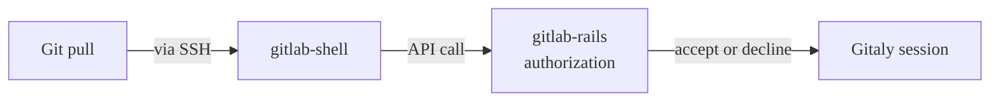
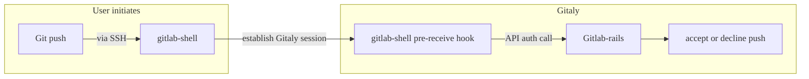
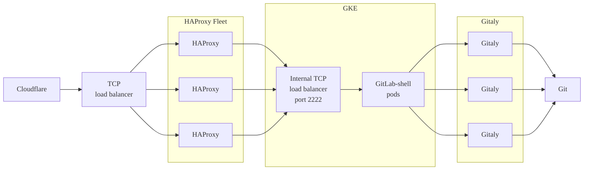
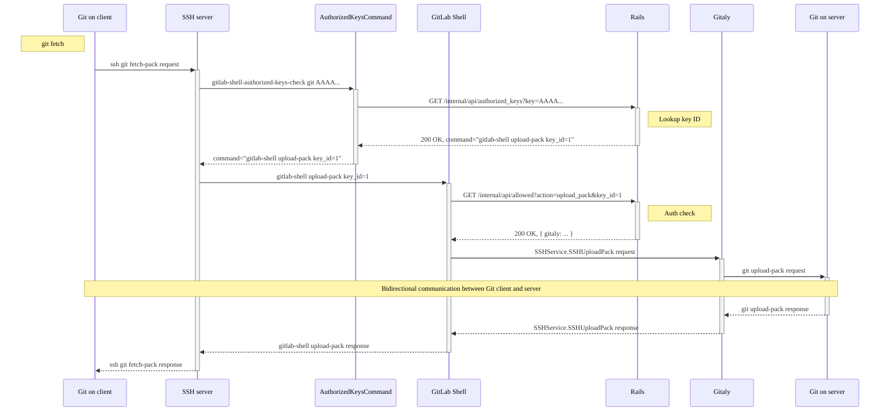

[](https://gitlab.com/gitlab-org/gitlab-shell/-/pipelines?ref=main) [](https://gitlab.com/gitlab-org/gitlab-shell/-/pipelines?ref=main) [](https://codeclimate.com/github/gitlabhq/gitlab-shell)

GitLab Shell handles Git SSH sessions for GitLab and modifies the list of authorized keys.
GitLab Shell is not a Unix shell nor a replacement for Bash or Zsh.

GitLab supports Git LFS authentication through SSH.

## Requirements

GitLab Shell is written in Go, and needs a Go compiler to build. It still requires
Ruby to build and test, but not to run.

GitLab Shell runs on `port 22` on a Linux package installation. To use a regular SSH
service, configure it on an alternative port.

Download and install the [current version of Go](https://go.dev/dl/).
We follow the [Go Release Policy](https://go.dev/doc/devel/release#policy)
and support:

- The current stable version.
- The previous two major versions.

### Versions

The two version files relevant to GitLab Shell:

- [Stable version](https://gitlab.com/gitlab-org/gitlab-shell/-/blob/main/VERSION)
- [Version deployed in GitLab SaaS](https://gitlab.com/gitlab-org/gitlab/-/blob/master/GITLAB_SHELL_VERSION)

GitLab team members can also monitor the `#announcements` internal Slack channel.

## How GitLab Shell works

When you access the GitLab server over SSH, GitLab Shell then:

1. Limits you to predefined Git commands (`git push`, `git pull`, `git fetch`).
1. Calls the GitLab Rails API to check if you are authorized, and what Gitaly server your repository is on.
1. Copies data back and forth between the SSH client and the Gitaly server.

If you access a GitLab server over HTTP(S) you end up in [`gitlab-workhorse`](../workhorse/_index.md).

### `git pull` over SSH



### `git push` over SSH

The `git push` command is not performed until after `gitlab-rails` accepts the push:



[Full feature list](features.md)

### Modifies `authorized_keys`

GitLab Shell modifies the `authorized_keys` file on the client machine.

## Contribute to GitLab Shell

To contribute to GitLab Shell:

1. Check if GitLab API access, and Redis with the internal API, can be reached: `make check`
1. Compile the `gitlab-shell` binaries, placing them into `bin/`: `make compile`
1. Run `make install` to build the `gitlab-shell` binaries and install. them onto the file system.
   The default location is `/usr/local`. To change it, set the `PREFIX` and `DESTDIR` environment variables.
1. To install GitLab from source on a single machine, run `make setup`.
   It compiles the GitLab Shell binaries, and ensures that various paths on the file system
   exist with the correct permissions. Do not run this command unless your installation method
   documentation instructs you to.

For more information, see
[CONTRIBUTING.md](https://gitlab.com/gitlab-org/gitlab-shell/-/blob/main/CONTRIBUTING.md).

### Run tests

When contributing, run tests:

1. Run tests with `bundle install` and `make test`.
1. Run Gofmt: `make verify`
1. Run both test and verify (the default Makefile target):

   ```shell
   bundle install
   make validate
   ```

1. If needed, configure Gitaly.

### Configure Gitaly for local testing

Some tests need a Gitaly server. The
[`docker-compose.yml`](https://gitlab.com/gitlab-org/gitlab-shell/-/blob/main/docker-compose.yml) file runs Gitaly on port 8075.
To tell the tests where Gitaly is, set `GITALY_CONNECTION_INFO`:

```plaintext
export GITALY_CONNECTION_INFO='{"address": "tcp://localhost:8075", "storage": "default"}'
make test
```

If no `GITALY_CONNECTION_INFO` is set, the test suite still runs, but any
tests requiring Gitaly are skipped. The tests always run in the CI environment.

## Rate limiting

GitLab Shell performs rate-limiting by user account and project for Git operations.
GitLab Shell accepts Git operation requests and then makes a call to the Rails
rate-limiter, backed by Redis. If the `user + project` exceeds the rate limit,
then GitLab Shell then drop further connection requests for that `user + project`.

The rate-limiter is applied at the Git command (plumbing) level. Each command has
a rate limit of 600 per minute. For example, `git push` has 600 per minute, and
`git pull` has another 600 per minute.

Because they are using the same plumbing command, `git-upload-pack`, `git pull`,
and `git clone` are in effect the same command for the purposes of rate-limiting.

Gitaly also has a rate-limiter in place, but calls are never made to Gitaly if
the rate limit is exceeded in GitLab Shell (Rails).

## Logs in GitLab Shell

In general, you can determine the structure, but not content, of a GitLab Shell
or `gitlab-sshd` session by inspecting the logs. Some guidelines:

- We use [`gitlab.com/gitlab-org/labkit/log`](https://pkg.go.dev/gitlab.com/gitlab-org/labkit/log)
  for logging.
- Always include a correlation ID.
- Log messages should be invariant and unique. Include accessory information in
  fields, using `log.WithField`, `log.WithFields`, or `log.WithError`.
- Log both success cases and error cases.
- Logging too much is better than not logging enough. If a message seems too
  verbose, consider reducing the log level before removing the message.

## GitLab SaaS

A diagram of the flow of `gitlab-shell` on GitLab.com:



## GitLab Shell architecture



## Related topics

- [LICENSE](https://gitlab.com/gitlab-org/gitlab-shell/-/blob/main/LICENSE)
- [Processes](process.md)
- [Using the GitLab Shell chart](https://docs.gitlab.com/charts/charts/gitlab/gitlab-shell/)
