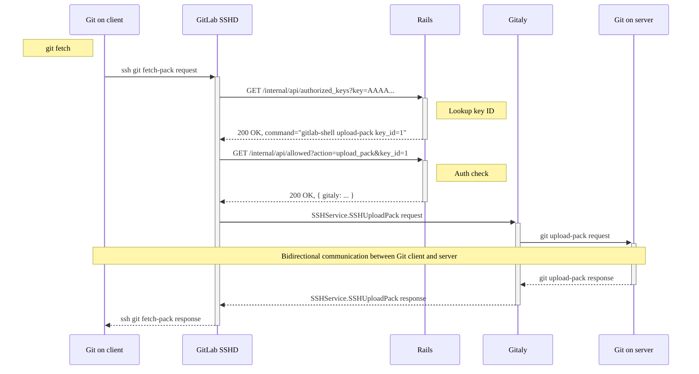

`gitlab-sshd` is a binary in [`gitlab-shell`](https://gitlab.com/gitlab-org/gitlab-shell)
which runs as a persistent SSH daemon. It is intended to replace `OpenSSH` on GitLab SaaS,
and eventually other cloud-native environments. Instead of running an `sshd` process,
we run a `gitlab-sshd` process that does the same job, in a more focused manner:

