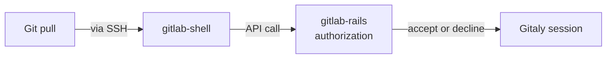
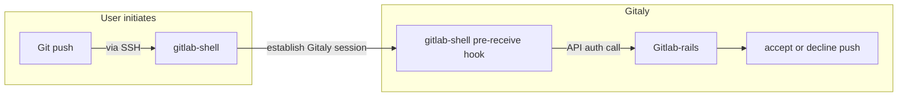
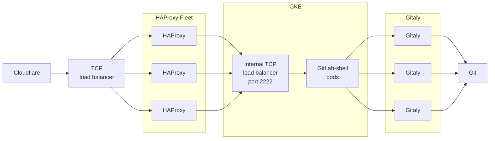

# GitLab Shell

GitLab Shell handles Git SSH sessions for GitLab and modifies the list of authorized keys.
GitLab Shell is not a Unix shell nor a replacement for Bash or Zsh.

GitLab supports Git LFS authentication through SSH.

## Requirements

GitLab Shell is written in Go, and needs a Go compiler to build. It still requires
Ruby to build and test, but not to run.

GitLab Shell runs on `port 22` on an Omnibus installation. To use a regular SSH
service, configure it on an alternative port.

Download and install the current version of Go from [golang.org](https://golang.org/dl/).
We follow the [Golang Release Policy](https://golang.org/doc/devel/release.html#policy)
and support:

- The current stable version.
- The previous two major versions.

## How GitLab Shell works

When you access the GitLab server over SSH, GitLab Shell then:

1. Limits you to predefined Git commands (`git push`, `git pull`, `git fetch`).
1. Calls the GitLab Rails API to check if you are authorized, and what Gitaly server your repository is on.
1. Copies data back and forth between the SSH client and the Gitaly server.

If you access a GitLab server over HTTP(S) you end up in [`gitlab-workhorse`](https://gitlab.com/gitlab-org/gitlab/tree/master/workhorse).

### `git pull` over SSH

### `git push` over SSH

The `git push` command is not performed until after `gitlab-rails` accepts the push:

[Full feature list](https://gitlab.com/gitlab-org/gitlab-shell/-/blob/main/doc/features.md)

### Modifies `authorized_keys`

GitLab Shell modifies the `authorized_keys` file on the client machine.

## Rate Limiting

GitLab Shell performs rate-limiting by user account and project for Git operations. GitLab Shell accepts Git operation requests and then makes a call to the Rails rate-limiter (backed by Redis). If the `user + project` exceeds the rate limit then GitLab Shell then drop further connection requests for that `user + project`.

The rate-limiter is applied at the Git command (plumbing) level. Each command has a rate limit of 600 per minute. For example, `git push` has 600 per minute, and `git pull` has another 600 per minute.

Because they are using the same plumbing command, `git-upload-pack`, `git pull` and `git clone` are in effect the same command for the purposes of rate-limiting.

Gitaly also has a rate-limiter in place, but calls are never made to Gitaly if the rate limit is exceeded in GitLab Shell (Rails).

## GitLab SaaS

A diagram of the flow of `gitlab-shell` on GitLab.com:

## Releasing

See [PROCESS.md](https://gitlab.com/gitlab-org/gitlab-shell/-/blob/main/PROCESS.md)

## Contributing

- See [CONTRIBUTING.md](https://gitlab.com/gitlab-org/gitlab-shell/-/blob/main/CONTRIBUTING.md).
- See the [beginner's guide](https://gitlab.com/gitlab-org/gitlab-shell/-/blob/main/doc/beginners_guide.md).

## License

See [LICENSE](https://gitlab.com/gitlab-org/gitlab-shell/-/blob/main/LICENSE).

## Related topics

- [Using the GitLab Shell chart](https://gitlab.com/gitlab-org/charts/gitlab/-/blob/master/doc/charts/gitlab/gitlab-shell/index.md)
