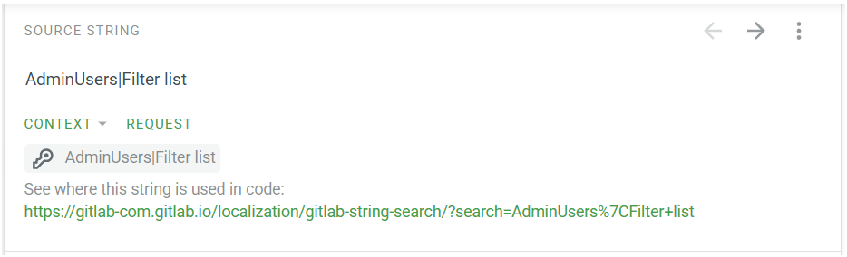
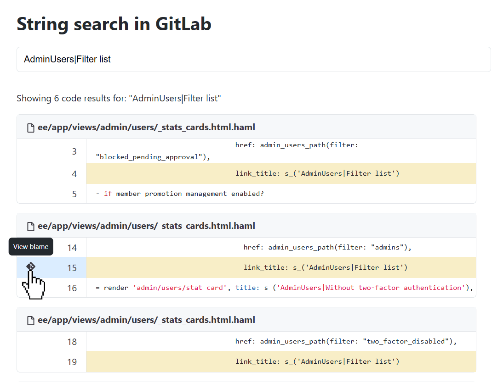

For managing the translation process, we use [Crowdin](https://crowdin.com).
To contribute translations at [`translate.gitlab.com`](https://translate.gitlab.com),
you must create a Crowdin account. You may create a new account or use any of their supported
sign-in services.

## Contributor recognition and rewards

GitLab recognizes and rewards translators on Crowdin for their contributions.
The GitLab contributor platform has a [leaderboard](https://contributors.gitlab.com/leaderboard),
[contributor level system](https://contributors.gitlab.com/docs/user-guide#contributor-levels),
and [rewards store](https://rewards.gitlab.com).

For your Crowdin contributions to be recognized by GitLab,
your Crowdin username must be mapped to your GitLab username:

- If you do not have a GitLab username, you can
  [sign up for a free account](https://gitlab.com/users/sign_up).
- Complete and submit [this form](https://docs.google.com/forms/d/15XDNFFLhbBJgB4U3u44yRwdiecRAe2ykNl0kRtPFkO0/edit?ts=68000e25)
  to map your Crowdin username to your GitLab username.

Crowdin translators earn points for the translations they submit.
These points combine with any other contributions to GitLab (merge requests,
issues, and community engagement) to help you level up and earn rewards credits.

For more information about the contributor platform,
see the [user guide](https://contributors.gitlab.com/docs/user-guide).

## Language selections

GitLab is being translated into many languages. To select a language to contribute to:

1. Find the language that you want to contribute to, in the
   [GitLab Crowdin project](https://crowdin.com/project/gitlab-ee).

   - If the language you want is available, proceed to the next step.
   - If the language you want is not available:
     1. Check the [Localization issues](https://gitlab.com/gitlab-org/gitlab/-/issues?scope=all&utf8=✓&state=all&label_name[]=group%3A%3Alocalization)
        to see if there is already an open request for that language. If an issue exists,
        you can add your support for the language in a comment.
     1. If there is no request for the language, create a new issue for the language.
        Notify our Crowdin administrators by including `@gitlab-com/localization/maintainers`
        in a comment or in the description of your issue.
   - After the issue and any merge requests are complete, restart this procedure.

1. View the list of files and folders. Select `gitlab.pot` to open the translation editor.

## Translation editor

The online translation editor is the easiest way to contribute translations.

- Strings for translation are listed in the left panel.
- Translations are entered into the central panel. Multiple translations are required for strings
  that contain plurals. The string to translate is shown in the above image with glossary terms
  highlighted. If the string to translate isn't clear, you can request context.

A glossary of common terms is available in the **Terms** tab in the right panel. In the **Comments**
tab, you can add comments to discuss a translation with the community.

Remember to **Save** each translation.

### Context

In Crowdin, each string contains a link that shows all instances of the string in the entire GitLab codebase.
When you translate a string, you can go to the relevant commit or merge request to get more context.

When you select the link, code search results appear for that string.
You can [view Git blame from code search](../../user/search/_index.md#view-git-blame-from-code-search)
to see the commits that added the string.
For a list of relevant merge requests, select a commit.

## General Translation Guidelines

Be sure to check the following guidelines before you translate any strings.

### Namespaced strings

A namespace precedes the string and is separated from it by a `|` (`namespace|string`). When you see
a namespace before an externalized string, you should remove the namespace from the final
translation. For example, in `OpenedNDaysAgo|Opened`, remove `OpenedNDaysAgo|`. If translating to
French, translate `OpenedNDaysAgo|Opened` to `Ouvert•e`, not `OpenedNDaysAgo|Ouvert•e`.

### Technical terms

You should treat some technical terms like proper nouns and not translate them. Technical terms that
should always be in English are noted in the glossary when using
[`translate.gitlab.com`](https://translate.gitlab.com).
This helps maintain a logical connection and consistency between tools (for example, a Git client)
and GitLab.

To find the list of technical terms:

1. Go to [`translate.gitlab.com`](https://translate.gitlab.com).
1. Select the language to translate.
1. Select **Glossary**.

### Formality

The level of formality used in software varies by language:

| Language | Formality | Example |
| -------- | --------- | ------- |
| French   | formal    | `vous` for `you` |
| German   | informal  | `du` for `you` |
| Spanish   | informal  | `tú` for `you` |

Refer to other translated strings and notes in the glossary to assist you in determining a suitable
level of formality.

### Inclusive language

[Diversity, inclusion, and belonging](https://handbook.gitlab.com/handbook/values/#diversity-inclusion)
are GitLab values. We ask you to avoid translations that exclude people based on their gender or
ethnicity. In languages that distinguish between a male and female form, use both or choose a
neutral formulation.

<!-- vale gitlab_base.Spelling = NO -->

For example, in German, the word _user_ can be translated into _Benutzer_ (male) or _Benutzerin_
(female). Therefore, _create a new user_ translates to _Benutzer(in) anlegen_.

<!-- vale gitlab_base.Spelling = YES -->

### Updating the glossary

To propose additions to the glossary,
[open an issue](https://gitlab.com/gitlab-org/gitlab/-/issues?scope=all&utf8=✓&state=all&label_name[]=Category%3AInternationalization).

## French translation guidelines

<!-- vale gitlab_base.Spelling = NO -->

In French, the _écriture inclusive_ is now over (see on [Legifrance](https://www.legifrance.gouv.fr/jorf/id/JORFTEXT000036068906/)).
To include both genders, write _Utilisateurs et utilisatrices_ instead of _Utilisateur·rice·s_. If
there is not enough space, use the male gender alone.

<!-- vale gitlab_base.Spelling = YES -->
