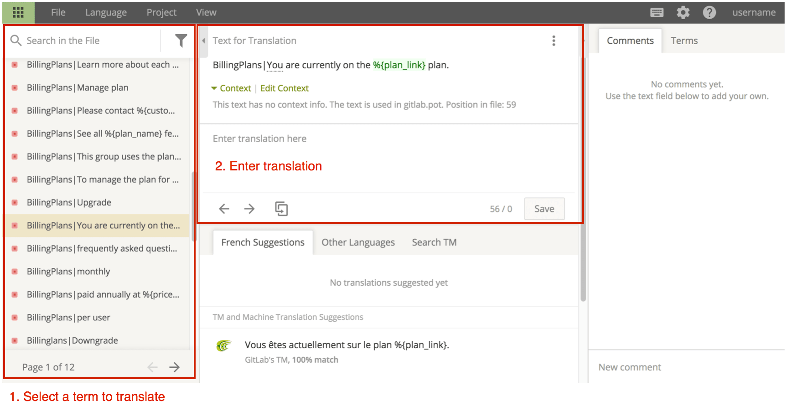

# Translating GitLab

For managing the translation process, we use [CrowdIn](https://crowdin.com).
To contribute translations at [`translate.gitlab.com`](https://translate.gitlab.com),
you must create a CrowdIn account. You may create a new account or use any of their supported
sign-in services.

## Language selections

GitLab is being translated into many languages. To select a language to contribute to:

1. Find the language that you want to contribute to, in the
   [GitLab CrowdIn project](https://crowdin.com/project/gitlab-ee).

   - If the language you want is available, proceed to the next step.
   - If the language you want is not available,
      [open an issue](https://gitlab.com/gitlab-org/gitlab/-/issues?scope=all&utf8=✓&state=all&label_name[]=Category%3AInternationalization).
      Notify our CrowdIn administrators by including `@gitlab-org/manage/import` in your issue.
   - After the issue and any merge requests are complete, restart this procedure.

1. View the list of files and folders. Select `gitlab.pot` to open the translation editor.

### Translation editor

The online translation editor is the easiest way to contribute translations.

- Strings for translation are listed in the left panel.
- Translations are entered into the central panel. Multiple translations are required for strings
  that contain plurals. The string to translate is shown in the above image with glossary terms
  highlighted. If the string to translate isn't clear, you can request context.

A glossary of common terms is available in the **Terms** tab in the right panel. In the **Comments**
tab, you can add comments to discuss a translation with the community.

Remember to **Save** each translation.

## General Translation Guidelines

Be sure to check the following guidelines before you translate any strings.

### Namespaced strings

When an externalized string is prepended with a namespace (for example,
`s_('OpenedNDaysAgo|Opened')`), the namespace should be removed from the final translation. For
example, in French, `OpenedNDaysAgo|Opened` is translated to `Ouvert•e`, not
`OpenedNDaysAgo|Ouvert•e`.

### Technical terms

You should treat some technical terms like proper nouns and not translate them. Technical terms that
should always be in English are noted in the glossary when using
[`translate.gitlab.com`](https://translate.gitlab.com).
This helps maintain a logical connection and consistency between tools (for example, a Git client)
and GitLab.

### Formality

The level of formality used in software varies by language:

| Language | Formality | Example |
| -------- | --------- | ------- |
| French   | formal    | `vous` for `you` |
| German   | informal  | `du` for `you` |

Refer to other translated strings and notes in the glossary to assist you in determining a suitable
level of formality.

### Inclusive language

[Diversity, inclusion, and belonging](https://about.gitlab.com/handbook/values/#diversity-inclusion)
are GitLab values. We ask you to avoid translations that exclude people based on their gender or
ethnicity. In languages that distinguish between a male and female form, use both or choose a
neutral formulation.

<!-- vale gitlab.Spelling = NO -->
For example, in German, the word _user_ can be translated into _Benutzer_ (male) or _Benutzerin_
(female). Therefore, _create a new user_ translates to _Benutzer(in) anlegen_.
<!-- vale gitlab.Spelling = YES -->

### Updating the glossary

To propose additions to the glossary, please
[open an issue](https://gitlab.com/gitlab-org/gitlab/-/issues?scope=all&utf8=✓&state=all&label_name[]=Category%3AInternationalization).

## French translation guidelines

<!-- vale gitlab.Spelling = NO -->
In French, the _écriture inclusive_ is now over (see on [Legifrance](https://www.legifrance.gouv.fr/jorf/id/JORFTEXT000036068906/)).
To include both genders, write _Utilisateurs et utilisatrices_ instead of _Utilisateur·rice·s_. If
there is not enough space, use the male gender alone.
<!-- vale gitlab.Spelling = YES -->
