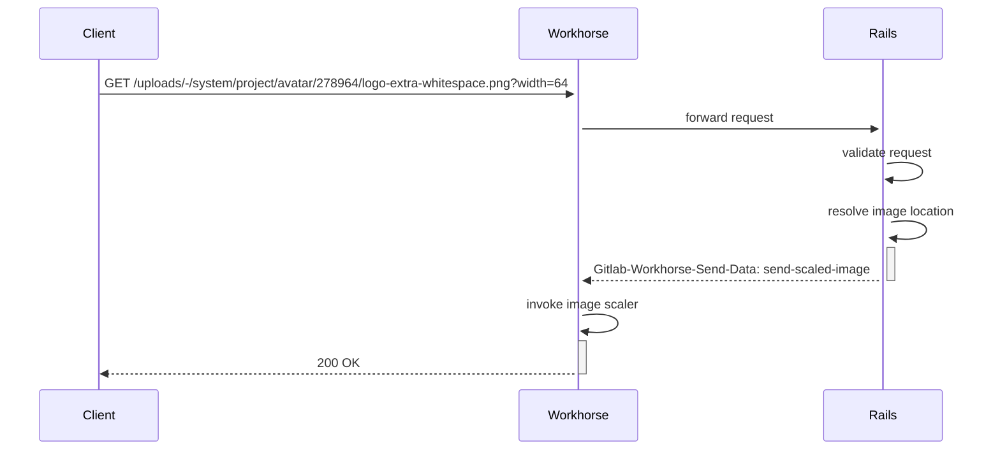

# Image scaling guide

This section contains a brief overview of the GitLab image scaler and how to work with it.

For a general introduction to the history of image scaling at GitLab, you might be interested in
[this Unfiltered blog post](https://about.gitlab.com/blog/2020/11/02/scaling-down-how-we-prototyped-an-image-scaler-at-gitlab/).

## Why image scaling?

Since version 13.6, GitLab scales down images on demand in order to reduce the page data footprint.
This both reduces the amount of data "on the wire", but also helps with rendering performance,
since the browser has less work to do.

## When do we scale images?

Generally, the image scaler is triggered whenever a client requests an image resource by adding
the `width` parameter to the query string. However, we only scale images of certain kinds and formats.
Whether we allow an image to be rescaled or not is decided by combination of hard-coded rules and configuration settings.

The hard-coded rules only permit:

- [Project, group and user avatars](https://gitlab.com/gitlab-org/gitlab/-/blob/fd08748862a5fe5c25b919079858146ea85843ae/app/controllers/concerns/send_file_upload.rb#L65-67)
- [PNGs or JPEGs](https://gitlab.com/gitlab-org/gitlab/-/blob/5dff8fa3814f2a683d8884f468cba1ec06a60972/lib/gitlab/file_type_detection.rb#L23)
- [Specific dimensions](https://gitlab.com/gitlab-org/gitlab/-/blob/5dff8fa3814f2a683d8884f468cba1ec06a60972/app/models/concerns/avatarable.rb#L6)

Furthermore, configuration in Workhorse can lead to the image scaler rejecting a request if:

- The image file is too large (controlled by [`max_filesize`](- we only rescale images that do not exceed a configured size in bytes (see [`max_filesize`](https://gitlab.com/gitlab-org/gitlab-workhorse/-/blob/67ab3a2985d2097392f93523ae1cffe0dbf01b31/config.toml.example#L17)))).
- Too many image scalers are already running (controlled by [`max_scaler_procs`](https://gitlab.com/gitlab-org/gitlab-workhorse/-/blob/67ab3a2985d2097392f93523ae1cffe0dbf01b31/config.toml.example#L16)).

For instance, here are two different URLs that serve the GitLab project avatar both in its
original size and scaled down to 64 pixels. Only the second request will trigger the image scaler:

- [`/uploads/-/system/project/avatar/278964/logo-extra-whitespace.png`](https://assets.gitlab-static.net/uploads/-/system/project/avatar/278964/logo-extra-whitespace.png)
- [`/uploads/-/system/project/avatar/278964/logo-extra-whitespace.png?width=64`](https://assets.gitlab-static.net/uploads/-/system/project/avatar/278964/logo-extra-whitespace.png?width=64)

## Where do we scale images?

Rails and Workhorse currently collaborate to rescale images. This is a common implementation and performance
pattern in GitLab: important business logic such as request authentication and validation
happens in Rails, whereas the "heavy lifting", scaling and serving the binary data, happens in Workhorse.

The overall request flow is as follows:

### Rails

Currently, image scaling is limited to `Upload` entities, specifically avatars as mentioned above.
Therefore, all image scaling related logic in Rails is currently found in the
[`send_file_upload`](https://gitlab.com/gitlab-org/gitlab/-/blob/master/app/controllers/concerns/send_file_upload.rb)
controller mixin. Upon receiving a request coming from a client through Workhorse, we check whether
it should trigger the image scaler as per the criteria mentioned above, and if so, render a special response
header field (`Gitlab-Workhorse-Send-Data`) with the necessary parameters for Workhorse to carry
out the scaling request. If Rails decides the request does not constitute a valid image scaling request,
we simply follow the path we take to serve any ordinary upload.

### Workhorse

Assuming Rails decided the request to be valid, Workhorse will take over. Upon receiving the `send-scaled-image`
instruction through the Rails response, a [special response injector](https://gitlab.com/gitlab-org/gitlab-workhorse/-/blob/master/internal/imageresizer/image_resizer.go)
will be invoked that knows how to rescale images. The only inputs it requires are the location of the image
(a path if the image resides in block storage, or a URL to remote storage otherwise) and the desired width.
Workhorse will handle the location transparently so Rails does not need to be concerned with where the image
actually resides.

Additionally, to request validation in Rails, Workhorse will run several pre-condition checks to ensure that
we can actually rescale the image, such as making sure we wouldn't outgrow our scaler process budget but also
if the file meets the configured maximum allowed size constraint (to keep memory consumption in check).

To actually scale the image, Workhorse will finally fork into a child process that performs the actual
scaling work, and stream the result back to the client.

#### Caching rescaled images

We currently do not store rescaled images anywhere; the scaler runs every time a smaller version is requested.
However, Workhorse implements standard conditional HTTP request strategies that allow us to skip the scaler
if the image in the client cache is up-to-date.
To that end we transmit a `Last-Modified` header field carrying the UTC
timestamp of the original image file and match it against the `If-Modified-Since` header field in client requests.
Only if the original image has changed and rescaling becomes necessary do we run the scaler again.
