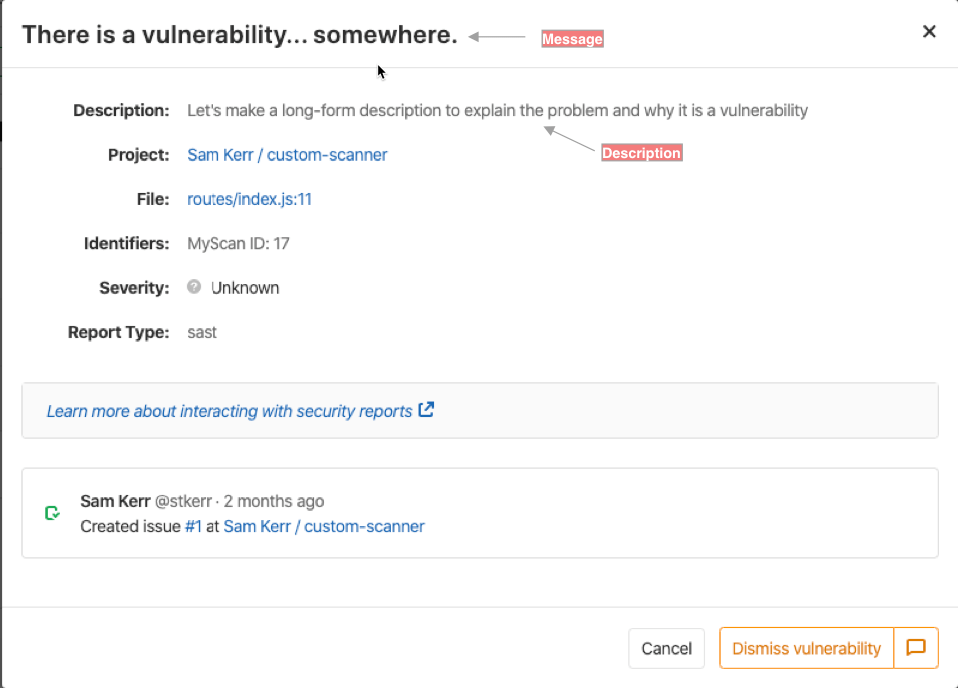

Integrating a security scanner into GitLab consists of providing end users
with a [CI/CD job definition](../../ci/jobs/_index.md)
they can add to their CI/CD configuration files to scan their GitLab projects.
This job should then output its results in a GitLab-specified format. These results are then
automatically presented in various places in GitLab, such as the Pipeline view, merge request
widget, and Security Dashboard.

The scanning job is usually based on a [Docker image](https://docs.docker.com/)
that contains the scanner and all its dependencies in a self-contained environment.

This page documents requirements and guidelines for writing CI/CD jobs that implement a security
scanner, as well as requirements and guidelines for the Docker image.

## Job definition

This section describes several important fields to add to the security scanner's job
definition file. Full documentation on these and other available fields can be viewed
in the [CI documentation](../../ci/yaml/_index.md#image).

### Name

For consistency, scanning jobs should be named after the scanner, in lower case.
The job name is suffixed after the type of scanning:

- `_dependency_scanning`
- `_container_scanning`
- `_dast`
- `_sast`

For instance, the dependency scanning job based on the "MySec" scanner would be named `mysec_dependency_scanning`.

### Image

The [`image`](../../ci/yaml/_index.md#image) keyword is used to specify
the [Docker image](../../ci/docker/using_docker_images.md#what-is-an-image)
containing the security scanner.

### Script

The [`script`](../../ci/yaml/_index.md#script) keyword
is used to specify the commands to run the scanner.
Because the `script` entry can't be left empty, it must be set to the command that performs the scan.
It is not possible to rely on the predefined `ENTRYPOINT` and `CMD` of the Docker image
to perform the scan automatically, without passing any command.

The [`before_script`](../../ci/yaml/_index.md#before_script)
should not be used in the job definition because users may rely on this to prepare their projects before performing the scan.
For instance, it is common practice to use `before_script` to install system libraries
a particular project needs before performing SAST or Dependency Scanning.

Similarly, [`after_script`](../../ci/yaml/_index.md#after_script)
should not be used in the job definition, because it may be overridden by users.

### Stage

For consistency, scanning jobs should belong to the `test` stage when possible.
The [`stage`](../../ci/yaml/_index.md#stage) keyword can be omitted because `test` is the default value.

### Fail-safe

By default, scanning jobs do not block the pipeline when they fail,
so the [`allow_failure`](../../ci/yaml/_index.md#allow_failure) parameter should be set to `true`.

### Artifacts

Scanning jobs must declare a report that corresponds to the type of scanning they perform,
using the [`artifacts:reports`](../../ci/yaml/_index.md#artifactsreports) keyword.
Valid reports are:

- `dependency_scanning`
- `container_scanning`
- `dast`
- `api_fuzzing`
- `coverage_fuzzing`
- `sast`

For example, here is the definition of a SAST job that generates a file named `gl-sast-report.json`,
and uploads it as a SAST report:

```yaml
mysec_sast:
  image: registry.gitlab.com/secure/mysec
  artifacts:
    reports:
      sast: gl-sast-report.json
```

`gl-sast-report.json` is an example file path but any other filename can be used. See
[the Output file section](#output-file) for more details. It's processed as a SAST report because
it's declared under the `reports:sast` key in the job definition, not because of the filename.

### Policies

Certain GitLab workflows, such as [AutoDevOps](../../topics/autodevops/cicd_variables.md#job-skipping-variables),
define CI/CD variables to indicate that given scans should be skipped. You can check for this by looking
for variables such as:

- `DEPENDENCY_SCANNING_DISABLED`
- `CONTAINER_SCANNING_DISABLED`
- `SAST_DISABLED`
- `DAST_DISABLED`

If appropriate based on the scanner type, you should then skip running the custom scanner.

GitLab also defines a `CI_PROJECT_REPOSITORY_LANGUAGES` variable, which provides the list of
languages in the repository. Depending on this value, your scanner may or may not do something different.
Language detection currently relies on the [`linguist`](https://github.com/github/linguist) Ruby gem.
See the [predefined CI/CD variables](../../ci/variables/predefined_variables.md).

#### Policy checking example

This example shows how to skip a custom Dependency Scanning job, `mysec_dependency_scanning`, unless
the project repository contains Java source code and the `dependency_scanning` feature is enabled:

```yaml
mysec_dependency_scanning:
  rules:
    - if: $DEPENDENCY_SCANNING_DISABLED == 'true'
      when: never
    - if: $GITLAB_FEATURES =~ /\bdependency_scanning\b/
      exists:
        - '**/*.java'
```

Any additional job policy should only be configured by users based on their needs.
For instance, predefined policies should not trigger the scanning job
for a particular branch or when a particular set of files changes.

## Docker image

The Docker image is a self-contained environment that combines
the scanner with all the libraries and tools it depends on.
Packaging your scanner into a Docker image makes its dependencies and configuration always present,
regardless of the individual machine the scanner runs on.

### Image size

Depending on the CI infrastructure,
the CI may have to fetch the Docker image every time the job runs.
For the scanning job to run fast and avoid wasting bandwidth, Docker images should be as small as
possible. You should aim for 50 MB or smaller. If that isn't possible, try to keep it below 1.46 GB,
which is the size of a DVD-ROM.

If the scanner requires a fully functional Linux environment,
it is recommended to use a [Debian](https://www.debian.org/intro/about) "slim" distribution or [Alpine Linux](https://www.alpinelinux.org/).
If possible, it is recommended to build the image from scratch, using the `FROM scratch` instruction,
and to compile the scanner with all the libraries it needs.
[Multi-stage builds](https://docs.docker.com/build/building/multi-stage/)
might also help with keeping the image small.

To keep an image size small, consider using [dive](https://github.com/wagoodman/dive#dive) to analyze layers in a Docker image to
identify where additional bloat might be originating from.

In some cases, it might be difficult to remove files from an image. When this occurs, consider using
[Zstandard](https://github.com/facebook/zstd)
to compress files or large directories. Zstandard offers many different compression levels that can
decrease the size of your image with very little impact to decompression speed. It may be helpful to
automatically decompress any compressed directories as soon as an image launches. You can accomplish
this by adding a step to the Docker image's `/etc/bashrc` or to a specific user's `$HOME/.bashrc`.
Remember to change the entry point to launch a bash login shell if you chose the latter option.

Here are some examples to get you started:

- <https://gitlab.com/gitlab-org/security-products/license-management/-/blob/0b976fcffe0a9b8e80587adb076bcdf279c9331c/config/install.sh#L168-170>
- <https://gitlab.com/gitlab-org/security-products/license-management/-/blob/0b976fcffe0a9b8e80587adb076bcdf279c9331c/config/.bashrc#L49>

### Image tag

As documented in the [Docker Official Images](https://github.com/docker-library/official-images#tags-and-aliases) project,
it is strongly encouraged that version number tags be given aliases which allows the user to easily refer to the "most recent" release of a particular series.
See also [Docker Tagging: Best practices for tagging and versioning Docker images](https://learn.microsoft.com/en-us/archive/blogs/stevelasker/docker-tagging-best-practices-for-tagging-and-versioning-docker-images).

### Permissions

To run a Docker container with non-root privileges the following user and group must be present in the container:

- User `gitlab` with user ID `1000`
- Group `gitlab` with group ID `1000`

## Command line

A scanner is a command-line tool that takes environment variables as inputs,
and generates a file that is uploaded as a report (based on the job definition).
It also generates text output on the standard output and standard error streams, and exits with a status code.

### Variables

All CI/CD variables are passed to the scanner as environment variables.
The scanned project is described by the [predefined CI/CD variables](../../ci/variables/_index.md).

#### SAST and Dependency Scanning

SAST and Dependency Scanning scanners must scan the files in the project directory, given by the `CI_PROJECT_DIR` CI/CD variable.

#### Container Scanning

To be consistent with the official Container Scanning for GitLab,
scanners must scan the Docker image whose name and tag are given by
`CI_APPLICATION_REPOSITORY` and `CI_APPLICATION_TAG`. If the `DOCKER_IMAGE`
CI/CD variable is provided, then the `CI_APPLICATION_REPOSITORY` and `CI_APPLICATION_TAG` variables
are ignored, and the image specified in the `DOCKER_IMAGE` variable is scanned instead.

If not provided, `CI_APPLICATION_REPOSITORY` should default to
`$CI_REGISTRY_IMAGE/$CI_COMMIT_REF_SLUG`, which is a combination of predefined CI/CD variables.
`CI_APPLICATION_TAG` should default to `CI_COMMIT_SHA`.

The scanner should sign in the Docker registry
using the variables `DOCKER_USER` and `DOCKER_PASSWORD`.
If these are not defined, then the scanner should use
`CI_REGISTRY_USER` and `CI_REGISTRY_PASSWORD` as default values.

#### Configuration files

While scanners may use `CI_PROJECT_DIR` to load specific configuration files,
it is recommended to expose configuration as CI/CD variables, not files.

### Output file

Like any artifact uploaded to GitLab CI/CD,
the Secure report generated by the scanner must be written in the project directory,
given by the `CI_PROJECT_DIR` CI/CD variable.

It is recommended to name the output file after the type of scanning, and to use `gl-` as a prefix.
Since all Secure reports are JSON files, it is recommended to use `.json` as a file extension.
For instance, a suggested filename for a Dependency Scanning report is `gl-dependency-scanning.json`.

The [`artifacts:reports`](../../ci/yaml/_index.md#artifactsreports) keyword
of the job definition must be consistent with the file path where the Security report is written.
For instance, if a Dependency Scanning analyzer writes its report to the CI project directory,
and if this report filename is `depscan.json`,
then `artifacts:reports:dependency_scanning` must be set to `depscan.json`.

### Exit code

Following the POSIX exit code standard, the scanner exits with either `0` for success or `1` for failure.
Success also includes the case when vulnerabilities are found.

When a CI job fails, security report results are not ingested by GitLab, even if the job
[allows failure](../../ci/yaml/_index.md#allow_failure). However, the report artifacts are still uploaded to GitLab and available
for [download in the pipeline security tab](../../user/application_security/vulnerability_report/pipeline.md#downloading-security-scan-results).

### Logging

The scanner should log error messages and warnings so that users can easily investigate
misconfiguration and integration issues by looking at the log of the CI scanning job.

Scanners may use [ANSI escape codes](https://en.wikipedia.org/wiki/ANSI_escape_code#Colors)
to colorize the messages they write to the Unix standard output and standard error streams.
We recommend using red to report errors, yellow for warnings, and green for notices.
Also, we recommend prefixing error messages with `[ERRO]`, warnings with `[WARN]`, and notices with `[INFO]`.

#### Logging level

The scanner should filter out a log message if its log level is lower than the
one set in the `SECURE_LOG_LEVEL` CI/CD variable. For instance, `info` and `warn`
messages should be skipped when `SECURE_LOG_LEVEL` is set to `error`. Accepted
values are as follows, listed from highest to lowest:

- `fatal`
- `error`
- `warn`
- `info`
- `debug`

It is recommended to use the `debug` level for verbose logging that could be
useful when debugging. The default value for `SECURE_LOG_LEVEL` should be set
to `info`.

When executing command lines, scanners should use the `debug` level to log the command line and its output.
If the command line fails, then it should be logged with the `error` log level;
this makes it possible to debug the problem without having to change the log level to `debug` and rerun the scanning job.

#### common `logutil` package

If you are using [go](https://go.dev/) and
[common](https://gitlab.com/gitlab-org/security-products/analyzers/common),
then it is suggested that you use [Logrus](https://github.com/Sirupsen/logrus)
and [common's `logutil` package](https://gitlab.com/gitlab-org/security-products/analyzers/common/-/tree/master/logutil)
to configure the formatter for [Logrus](https://github.com/Sirupsen/logrus).
See the [`logutil` README](https://gitlab.com/gitlab-org/security-products/analyzers/common/-/tree/master/logutil/README.md)

## Report

The report is a JSON document that combines vulnerabilities with possible remediations.

This documentation gives an overview of the report JSON format, recommendations, and examples to
help integrators set its fields.
The format is extensively described in the documentation of
[SAST](../../user/application_security/sast/_index.md#download-a-sast-report),
[DAST](../../user/application_security/dast/browser/_index.md),
[Dependency Scanning](../../user/application_security/dependency_scanning/_index.md#output),
and [Container Scanning](../../user/application_security/container_scanning/_index.md#reports-json-format)

You can find the schemas for these scanners here:

- [Container Scanning](https://gitlab.com/gitlab-org/security-products/security-report-schemas/-/blob/master/dist/container-scanning-report-format.json)
- [Coverage Fuzzing](https://gitlab.com/gitlab-org/security-products/security-report-schemas/-/blob/master/dist/coverage-fuzzing-report-format.json)
- [DAST](https://gitlab.com/gitlab-org/security-products/security-report-schemas/-/blob/master/dist/dast-report-format.json)
- [Dependency Scanning](https://gitlab.com/gitlab-org/security-products/security-report-schemas/-/blob/master/dist/dependency-scanning-report-format.json)
- [SAST](https://gitlab.com/gitlab-org/security-products/security-report-schemas/-/blob/master/dist/sast-report-format.json)
- [Secret Detection](https://gitlab.com/gitlab-org/security-products/security-report-schemas/-/blob/master/dist/secret-detection-report-format.json)

### Report validation

> - [Introduced](https://gitlab.com/gitlab-org/gitlab/-/issues/351000) in GitLab 15.0.

You must ensure that reports generated by the scanner pass validation against the schema version
declared in your reports. Reports that don't pass validation are not ingested by GitLab, and an
error message displays on the corresponding pipeline.

Reports that use a deprecated version of the secure report schema are ingested but cause a warning
message to display on the corresponding pipeline. If you see this warning, update your
analyzer to use the latest available schemas.

After the deprecation period for a schema version, the file is removed from GitLab. Reports that
declare removed versions are rejected, and an error message displays on the corresponding pipeline.

If a report uses a `PATCH` version that doesn't match any vendored schema version, it is validated against
the latest vendored `PATCH` version. For example, if a report version is 15.0.23 and the latest vendored
version is 15.0.6, the report is validated against version 15.0.6.

GitLab validates reports against security report JSON schemas
it reads from the [`gitlab-security_report_schemas`](https://rubygems.org/gems/gitlab-security_report_schemas)
gem. You can see which schema versions are supported in your GitLab version
by looking at the version of the gem in your GitLab installation. For example,
[GitLab 15.4](https://gitlab.com/gitlab-org/gitlab/-/blob/93a2a651a48bd03d9d84847e1cade19962ab4292/Gemfile#L431)
uses version `0.1.2.min15.0.0.max15.2.0`, which means it has versions in the range `15.0.0` and `15.2.0`.

To see the exact versions, read the [validate locally](#validate-locally) section.

#### Validate locally

Before running your analyzer in GitLab, you should validate the report produced by your analyzer to
ensure it complies with the declared schema version.

1. Install [`gitlab-security_report_schemas`](https://rubygems.org/gems/gitlab-security_report_schemas).
1. Run `security-report-schemas` to see what schema versions are supported.
1. Run `security-report-schemas <report.json>` to validate a report.

```shell
$ gem install gitlab-security_report_schemas -v 0.1.2.min15.0.0.max15.2.1
Successfully installed gitlab-security_report_schemas-0.1.2.min15.0.0.max15.2.1
Parsing documentation for gitlab-security_report_schemas-0.1.2.min15.0.0.max15.2.1
Done installing documentation for gitlab-security_report_schemas after 0 seconds
1 gem installed

$ security-report-schemas
SecurityReportSchemas 0.1.2.min15.0.0.max15.2.1.
Supported schema versions: ["15.0.0", "15.0.1", "15.0.2", "15.0.4", "15.0.5", "15.0.6", "15.0.7", "15.1.0", "15.1.1", "15.1.2", "15.1.3", "15.1.4", "15.2.0", "15.2.1"]

Usage: security-report-schemas REPORT_FILE_PATH [options]
    -r, --report_type=REPORT_TYPE    Override the report type
    -w, --warnings                   Prints the warning messages

$ security-report-schemas ~/Downloads/gl-dependency-scanning-report.json
Validating dependency_scanning v15.0.0 against schema v15.0.0
Content is invalid
* root is missing required keys: dependency_files
```

### Report Fields

#### Version

This field specifies which [Security Report Schemas](https://gitlab.com/gitlab-org/security-products/security-report-schemas) version you are using. For information about the versions to use, see [releases](https://gitlab.com/gitlab-org/security-products/security-report-schemas/-/releases).

GitLab validates your report against the version of the schema specified by this value.
The versions supported by GitLab can be found in
[`gitlab/ee/lib/ee/gitlab/ci/parsers/security/validators/schemas`](https://gitlab.com/gitlab-org/gitlab/-/tree/master/ee/lib/ee/gitlab/ci/parsers/security/validators/schemas).

#### Vulnerabilities

The `vulnerabilities` field of the report is an array of vulnerability objects.

##### ID

The `id` field is the unique identifier of the vulnerability.
It is used to reference a fixed vulnerability from a [remediation objects](#remediations).
We recommend that you generate a UUID and use it as the `id` field's value.

##### Category

The value of the `category` field matches the report type:

- `dependency_scanning`
- `container_scanning`
- `sast`
- `dast`

##### Scan

The `scan` field is an object that embeds meta information about the scan itself: the `analyzer`
and `scanner` that performed the scan, the `start_time` and `end_time` the scan executed,
and `status` of the scan (either "success" or "failure").

Both the `analyzer` and `scanner` fields are objects that embeds a human-readable `name` and a technical `id`.
The `id` should not collide with any other analyzers or scanners another integrator would provide.

##### Scan Primary Identifiers

The `scan.primary_identifiers` field is an optional field containing an array of
[primary identifiers](../../user/application_security/terminology/_index.md#primary-identifier)).
This is an exhaustive list of all rulesets for which the analyzer performed the scan.

Even when the [`Vulnerabilities`](#vulnerabilities) array for a given scan may be empty, this optional field
should contain the complete list of potential identifiers to inform the Rails application of which
rules were executed.

When populated, the Rails application [may automatically resolve previously detected vulnerabilities](../../user/application_security/iac_scanning/_index.md#automatic-vulnerability-resolution) as no
longer relevant when their primary identifier is not included.

##### Name, message, and description

The `name` and `message` fields contain a short description of the vulnerability.
The `description` field provides more details.

The `name` field is context-free and contains no information on where the vulnerability has been found,
whereas the `message` may repeat the location.

As a visual example, this screenshot highlights where these fields are used when viewing a
vulnerability as part of a pipeline view.



For instance, a `message` for a vulnerability
reported by Dependency Scanning gives information on the vulnerable dependency,
which is redundant with the `location` field of the vulnerability.
The `name` field is preferred but the `message` field is used
when the context/location cannot be removed from the title of the vulnerability.

To illustrate, here is an example vulnerability object reported by a Dependency Scanning scanner,
and where the `message` repeats the `location` field:

```json
{
    "location": {
        "dependency": {
            "package": {
            "name": "debug"
          }
        }
    },
    "name": "Regular Expression Denial of Service",
    "message": "Regular Expression Denial of Service in debug",
    "description": "The debug module is vulnerable to regular expression denial of service
        when untrusted user input is passed into the `o` formatter.
        It takes around 50k characters to block for 2 seconds making this a low severity issue."
}
```

The `description` might explain how the vulnerability works or give context about the exploit.
It should not repeat the other fields of the vulnerability object.
In particular, the `description` should not repeat the `location` (what is affected)
or the `solution` (how to mitigate the risk).

##### Solution

You can use the `solution` field to instruct users how to fix the identified vulnerability or to mitigate
the risk. End-users interact with this field, whereas GitLab automatically processes the
`remediations` objects.

##### Identifiers

The `identifiers` array describes the detected vulnerability. An identifier object's `type` and
`value` fields are used to [tell if two identifiers are the same](../../user/application_security/vulnerability_report/pipeline.md#deduplication-process).
The user interface uses the object's `name` and `url` fields to display the identifier.

We recommend that you use the identifiers the GitLab scanners already [define](https://gitlab.com/gitlab-org/security-products/analyzers/report/-/blob/main/identifier.go):

| Identifier | Type | Example value | Example name |
|------------|------|---------------|--------------|
| [CVE](https://cve.mitre.org/cve/) | `cve` | CVE-2019-10086 | CVE-2019-10086 |
| [CWE](https://cwe.mitre.org/data/index.html) | `cwe` | 1026 | CWE-1026 |
| [ELSA](https://linux.oracle.com/security/) | `elsa` | ELSA-2020-0085 | ELSA-2020-0085 |
| [OSVD](https://cve.mitre.org/data/refs/refmap/source-OSVDB.html) | `osvdb` | OSVDB-113928 | OSVDB-113928 |
| [OWASP](https://owasp.org/Top10/) | `owasp` | A01:2021 | A01:2021 - Broken Access Control |
| [RHSA](https://access.redhat.com/errata-search/#/) | `rhsa` | RHSA-2020:0111 | RHSA-2020:0111 |
| [USN](https://ubuntu.com/security/notices) | `usn` | USN-4234-1 | USN-4234-1 |
| [GHSA](https://github.com/advisories) | `ghsa` | GHSA-38jh-8h67-m7mj | GHSA-38jh-8h67-m7mj |
| [HACKERONE](https://hackerone.com/hacktivity/overview) | `hackerone` | 698789 | HACKERONE-698789 |

The generic identifiers listed above are defined in the [common library](https://gitlab.com/gitlab-org/security-products/analyzers/common),
which is shared by some of the analyzers that GitLab maintains. You can [contribute](https://gitlab.com/gitlab-org/security-products/analyzers/common/blob/master/issue/identifier.go)
new generic identifiers to if needed. Analyzers may also produce vendor-specific or product-specific
identifiers, which don't belong in the [common library](https://gitlab.com/gitlab-org/security-products/analyzers/common).

The first item of the `identifiers` array is called the
[primary identifier](../../user/application_security/terminology/_index.md#primary-identifier), and
it is used to
[track vulnerabilities](#tracking-and-merging-vulnerabilities) as new commits are pushed to the repository.

Not all vulnerabilities have CVEs, and a CVE can be identified multiple times. As a result, a CVE
isn't a stable identifier and you shouldn't assume it as such when tracking vulnerabilities.

The maximum number of identifiers for a vulnerability is set as 20. If a vulnerability has more than 20 identifiers,
the system saves only the first 20 of them. The vulnerabilities in the [Pipeline Security](../../user/application_security/vulnerability_report/pipeline.md#view-vulnerabilities-in-a-pipeline)
tab do not enforce this limit and all identifiers present in the report artifact are displayed.

#### Details

The `details` field is an object that supports many different content elements that are displayed when viewing vulnerability information. An example of the various data elements can be seen in the [security-reports repository](https://gitlab.com/gitlab-examples/security/security-reports/-/tree/master/samples/details-example).

#### Location

The `location` indicates where the vulnerability has been detected.
The format of the location depends on the type of scanning.

Internally GitLab extracts some attributes of the `location` to generate the **location fingerprint**,
which is used to track vulnerabilities
as new commits are pushed to the repository.
The attributes used to generate the location fingerprint also depend on the type of scanning.

##### Dependency Scanning

The `location` of a Dependency Scanning vulnerability is composed of a `dependency` and a `file`.
The `dependency` object describes the affected `package` and the dependency `version`.
`package` embeds the `name` of the affected library/module.
`file` is the path of the dependency file that declares the affected dependency.

For instance, here is the `location` object for a vulnerability affecting
version `4.0.11` of npm package [`handlebars`](https://www.npmjs.com/package/handlebars):

```json
{
    "file": "client/package.json",
    "dependency": {
        "package": {
            "name": "handlebars"
        },
        "version": "4.0.11"
    }
}
```

This affected dependency is listed in `client/package.json`,
a dependency file processed by npm or yarn.

The location fingerprint of a Dependency Scanning vulnerability
combines the `file` and the package `name`,
so these attributes are mandatory.
All other attributes are optional.

##### Container Scanning

Similar to Dependency Scanning,
the `location` of a Container Scanning vulnerability has a `dependency` and a `file`.
It also has an `operating_system` field.

For instance, here is the `location` object for a vulnerability affecting
version `2.50.3-2+deb9u1` of Debian package `glib2.0`:

```json
{
    "dependency": {
        "package": {
            "name": "glib2.0"
        },
    },
    "version": "2.50.3-2+deb9u1",
    "operating_system": "debian:9",
    "image": "registry.gitlab.com/example/app:latest"
}
```

The affected package is found when scanning the Docker image `registry.gitlab.com/example/app:latest`.
The Docker image is based on `debian:9` (Debian Stretch).

The location fingerprint of a Container Scanning vulnerability
combines the `operating_system` and the package `name`,
so these attributes are mandatory.
The `image` is also mandatory.
All other attributes are optional.

##### SAST

The `location` of a SAST vulnerability must have a `file` that gives the path of the affected file and
a `start_line` field with the affected line number.
It may also have an `end_line`, a `class`, and a `method`.

For instance, here is the `location` object for a security flaw found
at line `41` of `src/main/java/com/gitlab/example/App.java`,
in the `generateSecretToken` method of the `com.gitlab.security_products.tests.App` Java class:

```json
{
    "file": "src/main/java/com/gitlab/example/App.java",
    "start_line": 41,
    "end_line": 41,
    "class": "com.gitlab.security_products.tests.App",
    "method": "generateSecretToken1"
}
```

The location fingerprint of a SAST vulnerability
combines `file`, `start_line`, and `end_line`,
so these attributes are mandatory.
All other attributes are optional.

#### Tracking and merging vulnerabilities

Users may give feedback on a vulnerability:

- They may dismiss a vulnerability if it doesn't apply to their projects
- They may create an issue for a vulnerability if there's a possible threat

GitLab tracks vulnerabilities so that user feedback is not lost
when new Git commits are pushed to the repository.
Vulnerabilities are tracked using a
[`UUIDv5`](https://gitlab.com/gitlab-org/gitlab/-/blob/1272957c4a55e616569721febccb685c056ca1e4/ee/app/models/vulnerabilities/finding.rb#L364-368)
digest, which is generated by a `SHA-1` hash of four attributes:

- [Report type](#category)
- [Primary identifier](#identifiers)
- [Location fingerprint](#location)
- Project ID

Right now, GitLab cannot track a vulnerability if its location changes
as new Git commits are pushed, and this results in user feedback being lost.
For instance, user feedback on a SAST vulnerability is lost
if the affected file is renamed or the affected line moves down.
This is addressed in [issue #7586](https://gitlab.com/gitlab-org/gitlab/-/issues/7586).

See also [deduplication process](../../user/application_security/vulnerability_report/pipeline.md#deduplication-process).

##### Severity

The `severity` field describes how badly the vulnerability impacts the software.
The severity is used to sort the vulnerabilities in the security dashboard.

The severity ranges from `Info` to `Critical`, but it can also be `Unknown`.
Valid values are: `Unknown`, `Info`, `Low`, `Medium`, `High`, or `Critical`

`Unknown` values means that data is unavailable to determine it's actual value. Therefore, it may be `high`, `medium`, or `low`,
and needs to be investigated.

#### Remediations

The `remediations` field of the report is an array of remediation objects.
Each remediation describes a patch that can be applied to
[resolve](../../user/application_security/vulnerabilities/_index.md#resolve-a-vulnerability)
a set of vulnerabilities.

Here is an example of a report that contains remediations.

```json
{
    "vulnerabilities": [
        {
            "category": "dependency_scanning",
            "name": "Regular Expression Denial of Service",
            "id": "123e4567-e89b-12d3-a456-426655440000",
            "solution": "Upgrade to new versions.",
            "scanner": {
                "id": "gemnasium",
                "name": "Gemnasium"
            },
            "identifiers": [
                {
                  "type": "gemnasium",
                  "name": "Gemnasium-642735a5-1425-428d-8d4e-3c854885a3c9",
                  "value": "642735a5-1425-428d-8d4e-3c854885a3c9"
                }
            ]
        }
    ],
    "remediations": [
        {
            "fixes": [
                {
                    "id": "123e4567-e89b-12d3-a456-426655440000"
                }
            ],
            "summary": "Upgrade to new version",
            "diff": "ZGlmZiAtLWdpdCBhL3lhcm4ubG9jayBiL3lhcm4ubG9jawppbmRleCAwZWNjOTJmLi43ZmE0NTU0IDEwMDY0NAotLS0gYS95Y=="
        }
    ]
}
```

##### Summary

The `summary` field is an overview of how the vulnerabilities can be fixed. This field is required.

##### Fixed vulnerabilities

The `fixes` field is an array of objects that reference the vulnerabilities fixed by the
remediation. `fixes[].id` contains a fixed vulnerability's [unique identifier](#id). This field is required.

##### Diff

The `diff` field is a base64-encoded remediation code diff, compatible with
[`git apply`](https://git-scm.com/docs/git-format-patch#_discussion). This field is required.
