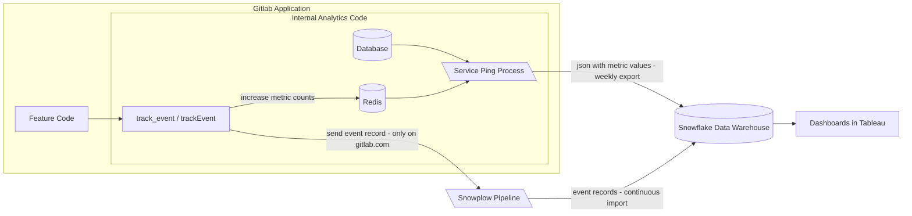

The internal analytics system provides the ability to track user behavior and system status for a GitLab instance
to inform customer success services and further product development.

These doc pages provide guides and information on how to leverage internal analytics capabilities of GitLab
when developing new features or instrumenting existing ones.

## Fundamental concepts

<div class="video-fallback">
  See the video about <a href="https://www.youtube.com/watch?v=GtFNXbjygWo">the concepts of events and metrics.</a>
</div>
<figure class="video-container">
  <iframe src="https://www.youtube-nocookie.com/embed/GtFNXbjygWo" frameborder="0" allowfullscreen> </iframe>
</figure>

Events and metrics are the foundation of the internal analytics system.
Understanding the difference between the two concepts is vital to using the system.

### Event

An event is a record of an action that happened within the GitLab instance.
An example action would be a user interaction like visiting the issue page or hovering the mouse cursor over the top navigation search.
Other actions can result from background system processing like scheduled pipeline succeeding or receiving API calls from 3rd party system.
Not every action is tracked and thereby turned into a recorded event automatically.
Instead, if an action helps draw out product insights and helps to make more educated business decisions, we can track an event when the action happens.
The produced event record, at the minimum, holds information that the action occurred,
but it can also contain additional details about the context that accompanied this action.
An example of context can be information about who performed the action or the state of the system at the time of the action.

### Metric

A single event record is not informative enough and might be caused by a coincidence.
We need to look for sets of events sharing common traits to have a foundation for analysis.
This is where metrics come into play. A metric is a calculation performed on pieces of information.
For example, a single event documenting a paid user visiting the feature's page after a new feature was released tells us nothing about the success of this new feature.
However, if we count the number of page view events happening in the week before the new feature release
and then compare it with the number of events for the week following the feature release,
we can derive insights about the increase in interest due to the release of the new feature.

This process leads to what we call a metric. An event-based metric counts the number of times an event occurred overall or in a specified time frame.
The same event can be used across different metrics and a metric can count either one or multiple events.
The count can but does not have to be based on a uniqueness criterion, such as only counting distinct users who performed an event.

Metrics do not have to be based on events. Metrics can also be observations about the state of a GitLab instance itself,
such as the value of a setting or the count of rows in a database table.

## Instrumentation

- To create an instrumentation plan, use this [template](https://gitlab.com/gitlab-org/gitlab/-/issues/new?issuable_template=Usage+Data+Instrumentation).
- To instrument an event-based metric, see the [internal event tracking quick start guide](internal_event_instrumentation/quick_start.md).
- To instrument a metric that observes the GitLab instances state, see [the metrics instrumentation](metrics/metrics_instrumentation.md).

## Data discovery

Event and metrics data is ultimately stored in our [Snowflake data warehouse](https://handbook.gitlab.com/handbook/business-technology/data-team/platform/snowflake/).
It can either be accessed directly via SQL in Snowflake for [ad-hoc analyses](https://handbook.gitlab.com/handbook/business-technology/data-team/platform/#snowflake-analyst) or visualized in our data visualization tool
[Tableau](https://handbook.gitlab.com/handbook/business-technology/data-team/platform/tableau/), which has access to Snowflake.
Both platforms need an access request ([Snowflake](https://handbook.gitlab.com/handbook/business-technology/data-team/platform/#warehouse-access), [Tableau](https://handbook.gitlab.com/handbook/business-technology/data-team/platform/tableau/#tableau-online-access)).

NOTE:
To track user interactions in the browser, Do-Not-Track (DNT) needs to be disabled. DNT is disabled by default for most browsers.

### Tableau

Tableau is a data visualization platform and allows building dashboards and GUI based discovery of events and metrics.
This method of discovery is most suited for users who are familiar with business intelligence tooling, basic verifications
and for creating persisted, shareable dashboards and visualizations.
Access to Tableau requires an [access request](https://handbook.gitlab.com/handbook/business-technology/data-team/platform/tableau/#tableau-online-access).

#### Checking events

Visit the [Snowplow event exploration dashboard](https://10az.online.tableau.com/#/site/gitlab/views/SnowplowEventExplorationLast30Days/SnowplowEventExplorationLast30D?:iid=1).
This dashboard shows you event counts as well as the most fired events.
You can scroll down to the "Structured Events Firing in Production Last 30 Days" chart and filter for your specific event action. The filter only works with exact names.

#### Checking metrics

You can visit the [Metrics exploration dashboard](https://10az.online.tableau.com/#/site/gitlab/views/PDServicePingExplorationDashboard/MetricsExploration).
On the side there is a filter for metric path which is the `key_path` of your metric and a filter for the installation ID including guidance on how to filter for GitLab.com.

#### Custom charts and dashboards

Within Tableau, more advanced charts, such as this [funnel analysis](https://10az.online.tableau.com/#/site/gitlab/views/SaaSRegistrationFunnel/RegistrationFunnelAnalyses) can be accomplished as well.
Custom charts and dashboards can be requested from the Product Data Insights team by creating an [issue in their project](https://gitlab.com/gitlab-data/product-analytics/-/issues/new?issuable_template=Ad%20Hoc%20Request).

### Snowflake

Snowflake allows direct querying of relevant tables in the warehouse within their UI with the [Snowflake SQL dialect](https://docs.snowflake.com/en/sql-reference-commands).
This method of discovery is most suited to users who are familiar with SQL and for quick and flexible checks whether data is correctly propagated.
Access to Snowflake requires an [access request](https://handbook.gitlab.com/handbook/business-technology/data-team/platform/#warehouse-access).

#### Querying events

The following example query returns the number of daily event occurrences for the `feature_used` event.

```sql
SELECT
  behavior_date,
  COUNT(*) as event_occurences
FROM prod.common_mart.mart_behavior_structured_event
WHERE event_action = 'feature_used'
AND behavior_date > '2023-08-01' --restricted minimum date for performance
AND app_id='gitlab' -- use gitlab for production events and gitlab-staging for events from staging
GROUP BY 1 ORDER BY 1 desc
```

For a list of other metrics tables refer to the [Data Models Cheat Sheet](https://handbook.gitlab.com/handbook/product/product-analysis/data-model-cheat-sheet/#commonly-used-data-models).

#### Querying metrics

The following example query returns all values reported for `count_distinct_user_id_from_feature_used_7d` within the last six months and the according `instance_id`:

```sql
SELECT
  date_trunc('week', ping_created_at),
  dim_instance_id,
  metric_value
FROM prod.common.fct_ping_instance_metric_rolling_6_months --model limited to last 6 months for performance
WHERE metrics_path = 'counts.users_visiting_dashboard_weekly' --set to metric of interest
ORDER BY ping_created_at DESC
```

For a list of other metrics tables refer to the [Data Models Cheat Sheet](https://handbook.gitlab.com/handbook/product/product-analysis/data-model-cheat-sheet/#commonly-used-data-models).

### Product Analytics

Internal Analytics is dogfooding the GitLab [Product Analytics](https://www.youtube.com/watch?v=i8Mze9lRZiY?) functionality, which allows you to visualize events as well.
The [Analytics Dashboards documentation](../../user/analytics/analytics_dashboards.md#create-a-dashboard-by-configuration) explains how to build custom visualizations and dashboards.
The custom dashboards accessible [within the GitLab project](https://gitlab.com/gitlab-org/gitlab/-/analytics/dashboards) are defined in a [separate repository](https://gitlab.com/gitlab-org/analytics-section/gitlab-com-dashboards).
It is possible to build dashboards based on events instrumented via the Internal events system. Only events emitted by the .com installation will be counted in those visualizations.

The [Product Analytics group's dashboard](https://gitlab.com/gitlab-org/analytics-section/gitlab-com-dashboards/-/blob/main/.gitlab/analytics/dashboards/product_analytics/product_analytics.yaml) can serve as inspiration on how to build charts based on individual events.

## Data availability

For GitLab there is an essential difference in analytics setup between GitLab.com and self-managed or GitLab Dedicated instances.

### Self-Managed and Dedicated

For Self-Managed and Dedicated instances only pre-computed metrics are available. These are computed once per week on a randomly chosen day and forwarded to our [version app](https://version.gitlab.com) via a process called Service Ping.
Only the metrics that were instrumented until the version the instance is running are available. For example, if a metric is instrumented during the development of version 16.9, it will be available on instances running versions equal to or bigger than 16.9 but not on instances running previous versions such as 16.8.
The received payloads are imported into our Data Warehouse once per day.

### GitLab.com

On our GitLab.com instance both individual events and pre-computed metrics are available for analysis. Additionally, page views are automatically instrumented.

#### Individual events & page views

Individual events and page views are forwarded directly to our collection infrastructure and from there into our data warehouse.
However, at this stage the data is in a raw format that is difficult to query. For this reason the data is cleaned and propagated through the warehouse until it is available in the tables and diagrams pointed out in the [data discovery section](#data-discovery).

The propagation process takes multiple hours to complete. The following diagram illustrates the availability of events:


[Source](https://lucid.app/lucidchart/fec2d72c-89d9-45a0-b40c-1d81ca13f671/edit?page=OCha14OI0mRw)

#### Pre-computed metrics

Metrics are computed once per week like on Self-Managed, with the only difference being that most of the computation takes place within the Warehouse rather than within the instance.
For GitLab.com this process is started on Monday morning and computes metrics for the time-frame from Sunday 23:59 UTC and this Sunday 23:59 UTC.

The following diagram illustrates the process:


[Source](https://lucid.app/lucidchart/fec2d72c-89d9-45a0-b40c-1d81ca13f671/edit?page=0_0)

## Data flow

On SaaS event records are directly sent to a collection system, called Snowplow, and imported into our data warehouse.
Self-managed and GitLab Dedicated instances record event counts locally. Every week, a process called Service Ping sends the current
values for all pre-defined and active metrics to our data warehouse. For GitLab.com, metrics are calculated directly in the data warehouse.

The following chart aims to illustrate this data flow:



## Data Privacy

GitLab only receives event counts or similarly aggregated information from self-managed instances. User identifiers for individual events on the SaaS version of GitLab are [pseudonymized](https://metrics.gitlab.com/identifiers/).
An exact description on what kind of data is being collected through the Internal Analytics system is given in our [handbook](https://handbook.gitlab.com/handbook/legal/privacy/customer-product-usage-information/).

## Contribution guidelines

- [Instrumenting features with internal analytics](review_guidelines.md)
- [Reviewing internal analytics contributions](review_guidelines.md#the-analytics-instrumentation-reviewer-should)
- [Contributing to the Internal Events CLI](cli_contribution_guidelines.md)
