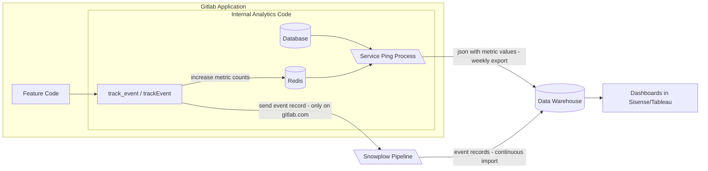

# Internal analytics

The internal analytics system provides the ability to track user behavior and system status for a GitLab instance
to inform customer success services and further product development.

These doc pages provide guides and information on how to leverage internal analytics capabilities of GitLab
when developing new features or instrumenting existing ones.

## Fundamental concepts

<div class="video-fallback">
  See the video about <a href="https://www.youtube.com/watch?v=GtFNXbjygWo">the concepts of events and metrics.</a>
</div>
<figure class="video_container">
  <iframe src="https://www.youtube-nocookie.com/embed/GtFNXbjygWo" frameborder="0" allowfullscreen="true"> </iframe>
</figure>

Events and metrics are the foundation of the internal analytics system.
Understanding the difference between the two concepts is vital to using the system.

### Event

An event is a record of an action that happened within the GitLab instance.
An example action would be a user interaction like visiting the issue page or hovering the mouse cursor over the top navigation search.
Other actions can result from background system processing like scheduled pipeline succeeding or receiving API calls from 3rd party system.
Not every action is tracked and thereby turned into a recorded event automatically.
Instead, if an action helps draw out product insights and helps to make more educated business decisions, we can track an event when the action happens.
The produced event record, at the minimum, holds information that the action occurred,
but it can also contain additional details about the context that accompanied this action.
An example of context can be information about who performed the action or the state of the system at the time of the action.

### Metric

A single event record is not informative enough and might be caused by a coincidence.
We need to look for sets of events sharing common traits to have a foundation for analysis.
This is where metrics come into play. A metric is a calculation performed on pieces of information.
For example, a single event documenting a paid user visiting the feature's page after a new feature was released tells us nothing about the success of this new feature.
However, if we count the number of page view events happening in the week before the new feature release
and then compare it with the number of events for the week following the feature release,
we can derive insights about the increase in interest due to the release of the new feature.

This process leads to what we call a metric. An event-based metric counts the number of times an event occurred overall or in a specified time frame.
The same event can be used across different metrics and a metric can count either one or multiple events.
The count can but does not have to be based on a uniqueness criterion, such as only counting distinct users who performed an event.

Metrics do not have to be based on events. Metrics can also be observations about the state of a GitLab instance itself,
such as the value of a setting or the count of rows in a database table.

## Instrumentation

- To instrument an event-based metric, see the [internal event tracking quick start guide](internal_event_instrumentation/quick_start.md).
- To instrument a metric that observes the GitLab instances state, see [the metrics instrumentation](metrics/metrics_instrumentation.md).

## Data availability

For GitLab there is an essential difference in analytics setup between SaaS and self-managed or GitLab Dedicated instances.
On our SaaS instance both individual events and pre-computed metrics are available for analysis.
Additionally for SaaS page views are automatically instrumented.
For self-managed only the metrics instrumenented on the version installed on the instance are available.

## Data discovery

The data visualization tools [Sisense](https://about.gitlab.com/handbook/business-technology/data-team/platform/sisensecdt/) and [Tableau](https://about.gitlab.com/handbook/business-technology/data-team/platform/tableau/),
which have access to our Data Warehouse, can be used to query the internal analytics data.

### Querying metrics

The following example query returns all values reported for `count_distinct_user_id_from_feature_used_7d` within the last six months and the according `instance_id`:

```sql
SELECT
  date_trunc('week', ping_created_at),
  dim_instance_id,
  metric_value
FROM common.fct_ping_instance_metric_rolling_6_months --model limited to last 6 months for performance
WHERE metrics_path = 'counts.users_visiting_dashboard_weekly' --set to metric of interest
ORDER BY ping_created_at DESC
```

For a list of other metrics tables refer to the [Data Models Cheat Sheet](https://about.gitlab.com/handbook/product/product-analysis/data-model-cheat-sheet/#commonly-used-data-models).

### Querying events

The following example query returns the number of daily event occurences for the `feature_used` event.

```sql
SELECT
  behavior_date,
  COUNT(*) as event_occurences
FROM common_mart.mart_behavior_structured_event
WHERE event_action = 'feature_used'
AND event_category = 'InternalEventTracking'
AND behavior_date > '2023-08-01' --restricted minimum date for performance
GROUP BY 1 ORDER BY 1 desc
```

For a list of other event tables refer to the [Data Models Cheat Sheet](https://about.gitlab.com/handbook/product/product-analysis/data-model-cheat-sheet/#commonly-used-data-models-2).

## Data flow

On SaaS event records are directly sent to a collection system, called Snowplow, and imported into our data warehouse.
Self-managed and GitLab Dedicated instances record event counts locally. Every week, a process called Service Ping sends the current
values for all pre-defined and active metrics to our data warehouse. For GitLab.com, metrics are calculated directly in the data warehouse.

The following chart aims to illustrate this data flow:



## Data Privacy

GitLab only receives event counts or similarly aggregated information from self-managed instances. User identifiers for individual events on the SaaS version of GitLab are [pseudonymized](https://metrics.gitlab.com/identifiers).
An exact description on what kind of data is being collected through the Internal Analytics system is given in our [handbook](https://about.gitlab.com/handbook/legal/privacy/customer-product-usage-information/).
