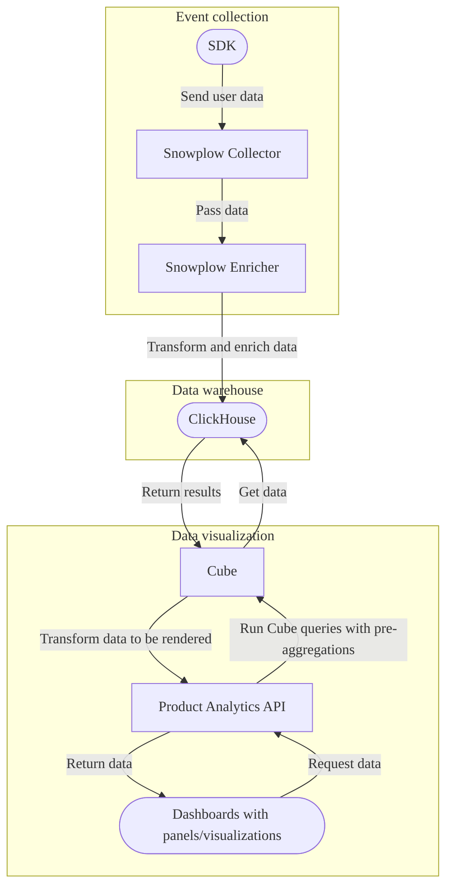

DETAILS:
**Tier:** Ultimate
**Offering:** GitLab.com, GitLab Self-Managed
**Status:** Beta

> - Introduced in GitLab 15.4 as an [experiment](../../policy/development_stages_support.md#experiment) feature [with a flag](../../administration/feature_flags.md) named `cube_api_proxy`. Disabled by default.
> - `cube_api_proxy` changed to reference only the [product analytics API](../../api/product_analytics.md) in GitLab 15.6.
> - `cube_api_proxy` removed and replaced with `product_analytics_internal_preview` in GitLab 15.10.
> - `product_analytics_internal_preview` replaced with `product_analytics_dashboards` in GitLab 15.11.
> - Snowplow integration [introduced](https://gitlab.com/gitlab-org/gitlab/-/issues/398253) in GitLab 15.11 [with a flag](../../administration/feature_flags.md) named `product_analytics_snowplow_support`. Disabled by default.
> - Snowplow integration feature flag `product_analytics_snowplow_support` [removed](https://gitlab.com/gitlab-org/gitlab/-/merge_requests/130228) in GitLab 16.4.
> - [Moved](https://gitlab.com/gitlab-org/gitlab/-/issues/414865) from GitLab Self-Managed to GitLab.com in 16.7.
> - Enabled in GitLab 16.7 as a [beta](../../policy/development_stages_support.md#beta) feature.
> - `product_analytics_dashboards` [enabled](https://gitlab.com/gitlab-org/gitlab/-/issues/398653) by default in GitLab 16.11.
> - Feature flag `product_analytics_dashboards` [removed](https://gitlab.com/gitlab-org/gitlab/-/issues/454059) in GitLab 17.1.
> - Funnels support removed in GitLab 17.4.
> - [Changed](https://gitlab.com/gitlab-org/gitlab/-/merge_requests/167192) to beta and feature flags `product_analytics_admin_settings` and [`product_analytics_features`](https://gitlab.com/gitlab-org/gitlab/-/merge_requests/167296) added in GitLab 17.5. Disabled by default.

FLAG:
The availability of this feature is controlled by a feature flag.
For more information, see the history.
This feature is not ready for production use.

The product analytics feature empowers you to track user behavior and gain insights into how your
applications are used and how users interact with your product.
By using the data collected with product analytics in GitLab, you can better understand your users,
identify friction points in funnels, make data-driven product decisions, and ultimately build better
products that drive user engagement and business growth.

<i class="fa fa-youtube-play youtube" aria-hidden="true"></i>
For an overview of the product analytics setup and functionality,
watch the [Product Analytics walkthrough videos](https://www.youtube.com/playlist?list=PL05JrBw4t0Kqfb4oLOFKkXxNrBJzDQ3sL&feature=shared).

For more information about the vision and development of product analytics, see the [group direction page](https://about.gitlab.com/direction/monitor/platform-insights/product-analytics/).
To leave feedback about product analytics bugs or functionality:

- Comment on [issue 391970](https://gitlab.com/gitlab-org/gitlab/-/issues/391970).
- Create an issue with the `group::platform insights` label.

## How product analytics works

Product analytics uses the following tools:

- [**Snowplow**](https://docs.snowplow.io/docs/) - A developer-first engine for collecting behavioral data and passing it through to ClickHouse.
- [**ClickHouse**](../../integration/clickhouse.md) - A database suited to store, query, and retrieve analytical data.
- [**Cube**](https://cube.dev/docs/product/introduction) - A universal semantic layer that provides an API to run queries against the data stored in ClickHouse.

The following diagram illustrates the product analytics flow:



## Enable product analytics

> - Introduced in GitLab 15.6 [with a flag](../../administration/feature_flags.md) named `cube_api_proxy`. Disabled by default.
> - Moved behind a [flag](../../administration/feature_flags.md) named `product_analytics_admin_settings` in GitLab 15.7. Disabled by default.
> - Feature flag `cube_api_proxy` removed and replaced with `product_analytics_internal_preview` in GitLab 15.10.
> - Feature flag `product_analytics_internal_preview` replaced with `product_analytics_dashboards` in GitLab 15.11.
> - Feature flag `product_analytics_admin_settings` [enabled](https://gitlab.com/gitlab-org/gitlab/-/issues/385602) by default in GitLab 16.11.
> - Feature flag `product_analytics_admin_settings` [removed](https://gitlab.com/gitlab-org/gitlab/-/issues/454342) in GitLab 17.1.

To track events in your project's applications,
you must enable and configure product analytics.

### Product analytics provider

Your GitLab instance connects to a product analytics provider.
A product analytics provider is the collection of services required to receive,
process, store and query your analytics data.

::Tabs

:::TabTitle GitLab-managed provider

DETAILS:
**Offering:** GitLab.com

On GitLab.com you can use a GitLab-managed provider offered only in the Google Cloud Platform zone `us-central-1`.

If GitLab manages your product analytics provider, then your analytics data is retained for one year.
You can request to delete your data at any time by [contacting support](https://about.gitlab.com/support/#contact-support).

:::TabTitle Self-managed provider

>[Introduced](https://gitlab.com/gitlab-org/gitlab/-/merge_requests/117804) in GitLab 16.0.

A self-managed product analytics provider is a deployed instance of the
[product analytics Helm charts](https://gitlab.com/gitlab-org/analytics-section/product-analytics/helm-charts).

On GitLab.com, the self-managed provider details are defined in [project-level settings](#project-level-settings).

On GitLab Self-Managed, you must define the self-managed analytics provider in [instance-level settings](#instance-level-settings).
If you need different providers for different projects, you can define additional analytics providers in [project-level settings](#project-level-settings).

::EndTabs

### Instance-level settings

**Offering:** GitLab Self-Managed

Prerequisites:

- You must have administrator access for the instance.

NOTE:
These instance-level settings are required to enable product analytics on GitLab Self-Managed,
and cascade to all projects by default.

To enable product analytics on your instance:

1. On the left sidebar, at the bottom, select **Admin**.
1. Select **Settings > Analytics**.
1. Enter the configuration values.
1. Select **Save changes**.

### Project-level settings

If you want to have a product analytics instance with a different configuration for your project,
you can override the instance-level settings defined by the administrator on a per-project basis.

Prerequisites:

- You must have at least the Maintainer role for the project or group the project belongs to.
- The project must be in a group namespace.

1. On the left sidebar, select **Search or go to** and find your project.
1. Select **Settings > Analytics**.
1. Expand **Data sources** and enter the configuration values.
1. Select **Save changes**.

## Onboard a GitLab project

> - Minimum required role [changed](https://gitlab.com/gitlab-org/gitlab/-/merge_requests/154089/) in GitLab 17.1.

Prerequisites:

- You must have at least the Maintainer role for the project or group the project belongs to.

Onboarding a GitLab project means preparing it to receive events that are used for product analytics.

To onboard a project:

1. On the left sidebar, select **Search or go to** and find your project.
1. Select **Analyze > Analytics dashboards**.
1. Under **Product analytics**, select **Set up**.

Then continue with the setup depending on the provider type.

::Tabs

:::TabTitle GitLab-managed provider

Prerequisites:

- You must have access to the [GitLab-managed provider](#product-analytics-provider).

1. Select the **I agree to event collection and processing in this region** checkbox.
1. Select **Connect GitLab-managed provider**.
1. Remove already configured project-level settings for a self-managed provider:
   1. Select **Go to analytics settings**.
   1. Expand **Data sources** and remove the configuration values.
   1. Select **Save changes**.
   1. Select **Analyze > Analytics dashboards**.
   1. Under **Product analytics**, select **Set up**.
   1. Select **Connect GitLab-managed provider**.

Your instance is being created, and the project onboarded.

:::TabTitle Self-managed provider

1. Select **Connect your own provider**.
1. Configure project-level settings for your self-managed provider:
   1. Select **Go to analytics settings**.
   1. Expand **Data sources** and enter the configuration values.
   1. Select **Save changes**.
   1. Select **Analyze > Analytics dashboards**.
   1. Under **Product analytics**, select **Set up**.
   1. Select **Connect your own provider**.

Your instance is being created, and the project onboarded.

::EndTabs

## Instrument your application

You can instrument code to collect data by using [tracking SDKs](../_index.md).

## Product analytics dashboards

> - Introduced in GitLab 15.5 [with a flag](../../administration/feature_flags.md) named `product_analytics_internal_preview`. Disabled by default.

Product analytics dashboards are a subset of dashboards under [Analytics dashboards](../../user/analytics/analytics_dashboards.md).

Specifically, product analytics dashboards and visualizations use the `cube_analytics` data type.
The `cube_analytics` data type connects to the Cube instance defined when [product analytics was enabled](#enable-product-analytics).
All filters and queries are sent to the Cube instance, and the returned data is processed by the
product analytics data source to be rendered by the appropriate visualizations.

Data table visualizations from `cube_analytics` have an additional configuration option for rendering `links`.
This option is an array of objects, each with `text` and `href` properties to specify the dimensions to be used in links.
If `href` contains multiple dimensions, values are joined into a single URL.
View an [example](https://gitlab.com/gitlab-org/gitlab/-/blob/master/ee/app/validators/json_schemas/analytics_visualization.json?ref_type=heads#L112).

When product analytics is enabled and onboarded, two built-in dashboards are available:

- **Audience** displays metrics related to traffic, such as the number of users and sessions.
- **Behavior** displays metrics related to user activity, such as the number of page views and events.

### Filling missing data

> - Introduced in GitLab 16.3 [with a flag](../../administration/feature_flags.md) named `product_analytics_dashboards`. Disabled by default.

When [exporting data](#raw-data-export) or [viewing dashboards](../../user/analytics/analytics_dashboards.md#view-project-dashboards),
if there is no data for a given day, the missing data is autofilled with `0`.

The autofill approach has both benefits and limitations.

- Benefits:
  - The visualization's day axis matches the selected date range, removing ambiguity about missing data.
  - Data exports have rows for the entire date range, making data analysis easier.
- Limitations:
  - The `day` [granularity](https://cube.dev/docs/product/apis-integrations/rest-api/query-format) must be used.
    All other granularities are not supported.
  - Only date ranges defined by the [`inDateRange`](https://cube.dev/docs/product/apis-integrations/rest-api/query-format#indaterange) filter are filled.
    - The date selector in the UI already uses this filter.
  - The filling of data ignores the query-defined limit. If you set a limit of 10 data points over 20 days, it
    returns 20 data points, with the missing data filled by `0`. [Issue 417231](https://gitlab.com/gitlab-org/gitlab/-/issues/417231) proposes a solution to this limitation.

## Raw data export

Exporting the raw event data from the underlying storage engine can help you debug and create datasets for data analysis.

Because Cube acts as an abstraction layer between the raw data and the API, the exported raw data has some caveats:

- Data is grouped by the selected dimensions. Therefore, the exported data might be incomplete, unless including both `utcTime` and `userAnonymousId`.
- Data is by default limited to 10,000 rows, but you can increase the limit to maximum 50,000 rows. If your dataset has more than 50,000 rows, you must paginate through the results by using the `limit` and `offset` parameters.
- Data is always returned in JSON format. If you need it in a different format, you need to convert the JSON to the required format using a scripting language of your choice.

[Issue 391683](https://gitlab.com/gitlab-org/gitlab/-/issues/391683) tracks efforts to implement a more scalable export solution.

### Export raw data with Cube queries

You can [query the raw data with the REST API](../../api/product_analytics.md#send-query-request-to-cube),
and convert the JSON output to any required format.

To export the raw data for a specific dimension, pass a list of dimensions to the `dimensions` key.
For example, the following query outputs the raw data for the attributes listed:

```json
POST /api/v4/projects/PROJECT_ID/product_analytics/request/load?queryType=multi

{
    "query":{
  "dimensions": [
    "TrackedEvents.docEncoding",
    "TrackedEvents.docHost",
    "TrackedEvents.docPath",
    "TrackedEvents.docSearch",
    "TrackedEvents.eventType",
    "TrackedEvents.localTzOffset",
    "TrackedEvents.pageTitle",
    "TrackedEvents.src",
    "TrackedEvents.utcTime",
    "TrackedEvents.vpSize"
  ],
  "order": {
    "TrackedEvents.apiKey": "asc"
  }
    }
}
```

If the request is successful, the returned JSON includes an array of rows of results.

## View product analytics usage quota

> - [Introduced](https://gitlab.com/gitlab-org/gitlab/-/issues/424153) in GitLab 16.6 [with a flag](../../administration/feature_flags.md) named `product_analytics_usage_quota`. Disabled by default.
> - [Generally available](https://gitlab.com/gitlab-org/gitlab/-/issues/427838) in GitLab 16.7. Feature flag `product_analytics_usage_quota` removed.

Product analytics usage quota is calculated from the number of events received from instrumented applications.

To view product analytics usage quota:

1. On the left sidebar, select **Search or go to** and find your group.
1. Select **Settings > Usage quota**.
1. Select the **Product analytics** tab.

The tab displays the monthly totals for the group and a breakdown of usage per project.
The current month displays events counted to date.

The usage quota excludes projects that are not onboarded with product analytics.

## Best practices

- Define key metrics and goals from the start. Decide what questions you want to answer so you know how to use collected data.
- Use event data from all stages of the user journey. This data provides a comprehensive view of the user experience.
- Build dashboards aligned with team needs. Different teams need different data insights.
- Review dashboards regularly. This way, you can verify customer outcomes, identify trends in data, and update visualizations.
- Export raw data periodically. Dashboards provide only an overview of a subset of data, so you should export the data for a deeper analysis.

## Troubleshooting

### No events are collected

Check your [instrumentation details](#enable-product-analytics),
and make sure product analytics is enabled and set up correctly.

### Access to product analytics is restricted

Check that you are connected to a [product analytics provider](#product-analytics-provider).
