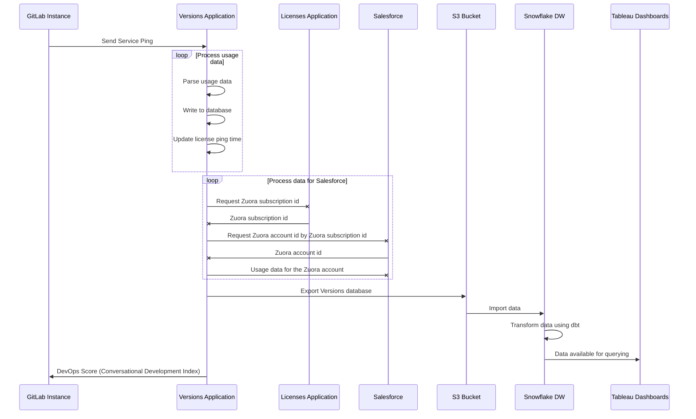

Service Ping is a GitLab process that collects and sends a weekly payload to GitLab.
The payload provides important high-level data that helps our product, support,
and sales teams understand how GitLab is used. The data helps to:

- Compare counts month over month (or week over week) to get a rough sense for how an instance uses
  different product features.
- Collect other facts that help us classify and understand GitLab installations.
- Calculate our stage monthly active users (SMAU), which helps to measure the success of our stages
  and features.

Service Ping information is not anonymous. It's linked to the instance's hostname, but does
not contain project names, usernames, or any other specific data.

Service Ping is enabled by default. However, you can [disable](../../../administration/settings/usage_statistics.md#enable-or-disable-service-ping) certain metrics on any self-managed instance. When Service Ping is enabled, GitLab gathers data from the other instances and can show your instance's usage statistics to your users.

## Service Ping terminology

We use the following terminology to describe the Service Ping components:

- **Service Ping**: the process that collects and generates a JSON payload.
- **Service Data**: the contents of the Service Ping JSON payload. This includes metrics.
- **Metrics**: primarily made up of row counts for different tables in an instance's database. Each
  metric has a corresponding [metric definition](../metrics/metrics_dictionary.md#metrics-definition-and-validation)
  in a YAML file.
- **MAU**: monthly active users.
- **WAU**: weekly active users.

### Known issues

- Service Ping delivers only [metrics](../_index.md#metric), not individual events.
- A metric has to be present and instrumented in the codebase for a GitLab version to be delivered in Service Pings for that version.

## Service Ping request flow

The following example shows a basic request/response flow between a GitLab instance, the Versions Application, the License Application, Salesforce, the GitLab S3 Bucket, the GitLab Snowflake Data Warehouse, and Tableau:



## How Service Ping works

1. The Service Ping [cron job](https://gitlab.com/gitlab-org/gitlab/-/blob/master/app/workers/gitlab_service_ping_worker.rb#L24) is set in Sidekiq to run weekly.
1. When the cron job runs, it calls [`Gitlab::Usage::ServicePingReport.for(output: :all_metrics_values)`](https://gitlab.com/gitlab-org/gitlab/-/blob/master/app/services/service_ping/submit_service.rb).
1. `Gitlab::Usage::ServicePingReport.for(output: :all_metrics_values)` [cascades down](https://gitlab.com/gitlab-org/gitlab/-/blob/master/lib/gitlab/usage_data.rb) to ~400+ other counter method calls.
1. The response of all methods calls are [merged together](https://gitlab.com/gitlab-org/gitlab/-/blob/master/lib/gitlab/usage_data.rb#L68) into a single JSON payload.
1. The JSON payload is then [posted to the Versions application](https://gitlab.com/gitlab-org/gitlab/-/blob/master/app/services/service_ping/submit_service.rb#L20)
   If a firewall exception is needed, the required URL depends on several things. If
   the hostname is `version.gitlab.com`, the protocol is `TCP`, and the port number is `443`,
   the required URL is <https://version.gitlab.com/>.
1. In case of an error, it will be reported to the Version application along with following pieces of information:

   - `uuid` - GitLab instance unique identifier
   - `hostname` - GitLab instance hostname
   - `version` - GitLab instance current versions
   - `elapsed` - Amount of time which passed since Service Ping report process started and moment of error occurrence
   - `message` - Error message

    ```ruby
    {
      "uuid"=>"02333324-1cd7-4c3b-a45b-a4993f05fb1d",
      "hostname"=>"127.0.0.1",
      "version"=>"14.7.0-pre",
      "elapsed"=>0.006946,
      "message"=>'PG::UndefinedColumn: ERROR:  column \"non_existent_attribute\" does not exist\nLINE 1: SELECT COUNT(non_existent_attribute) FROM \"issues\" /*applica...'
    }
    ```

1. Finally, the timing metadata information that is used for diagnostic purposes is submitted to the Versions application. It consists of a list of metric identifiers and the time it took to calculate the metrics:

   > - [Introduced](https://gitlab.com/gitlab-org/gitlab/-/merge_requests/37911) in GitLab 15.0 [with a flag](../../../user/feature_flags.md), enabled by default.
   > - [Generally available](https://gitlab.com/gitlab-org/gitlab/-/issues/295289) in GitLab 15.2. [Feature flag `measure_service_ping_metric_collection`](https://gitlab.com/gitlab-org/gitlab/-/issues/358128) removed.

```ruby
    {
      "metadata"=>
      {
        "uuid"=>"0000000-0000-0000-0000-000000000000",
        "metrics"=>
        [{"name"=>"version", "time_elapsed"=>1.1811964213848114e-05},
         {"name"=>"installation_type", "time_elapsed"=>0.00017242692410945892},
         {"name"=>"license_billable_users", "time_elapsed"=>0.009520471096038818},
         ....
         {"name"=>"counts.clusters_platforms_eks",
          "time_elapsed"=>0.05638605775311589},
         {"name"=>"counts.clusters_platforms_gke",
          "time_elapsed"=>0.40995341585949063},
         {"name"=>"counts.clusters_platforms_user",
          "time_elapsed"=>0.06410990096628666},
         {"name"=>"counts.clusters_management_project",
          "time_elapsed"=>0.24020783510059118}
        ]
      }
    }
```

### On a Geo secondary site

We also collect metrics specific to [Geo](../../../administration/geo/_index.md) secondary sites to send with Service Ping.

1. The [Geo secondary service ping cron job](https://gitlab.com/gitlab-org/gitlab/-/blob/master/ee/app/workers/geo/secondary_usage_data_cron_worker.rb) is set in Sidekiq to run weekly.
1. When the cron job runs, it calls [`SecondaryUsageData.update_metrics!`](https://gitlab.com/gitlab-org/gitlab/-/blob/master/ee/app/models/geo/secondary_usage_data.rb#L33). This collects the relevant metrics from Prometheus and stores the data in the Geo secondary tracking database for transmission to the primary site during a [Geo node status update](https://gitlab.com/gitlab-org/gitlab/-/blob/master/ee/app/models/geo_node_status.rb#L105).
1. Geo node status data is sent with the JSON payload in the process described above. The following is an example of the payload where each object in the array represents a Geo node:

   ```json
   [
     {
       "git_fetch_event_count_weekly"=>nil,
       "git_push_event_count_weekly"=>nil,
       ... other geo node status fields
     }
   ]
   ```

## Example Service Ping payload

The following is example content of the Service Ping payload.

```json
{
  "uuid": "0000000-0000-0000-0000-000000000000",
  "hostname": "example.com",
  "version": "12.10.0-pre",
  "installation_type": "omnibus-gitlab",
  "active_user_count": 999,
  "recorded_at": "2020-04-17T07:43:54.162+00:00",
  "edition": "EEU",
  "license_md5": "00000000000000000000000000000000",
  "license_sha256": "0000000000000000000000000000000000000000000000000000000000000000",
  "license_id": null,
  "historical_max_users": 999,
  "licensee": {
    "Name": "ABC, Inc.",
    "Email": "email@example.com",
    "Company": "ABC, Inc."
  },
  "license_user_count": 999,
  "license_starts_at": "2020-01-01",
  "license_expires_at": "2021-01-01",
  "license_plan": "ultimate",
  "license_add_ons": {
  },
  "license_trial": false,
  "counts": {
    "assignee_lists": 999,
    "boards": 999,
    "ci_builds": 999,
    ...
  },
  "container_registry_enabled": true,
  "dependency_proxy_enabled": false,
  "gitlab_shared_runners_enabled": true,
  "gravatar_enabled": true,
  "influxdb_metrics_enabled": true,
  "ldap_enabled": false,
  "mattermost_enabled": false,
  "omniauth_enabled": true,
  "prometheus_enabled": false,
  "prometheus_metrics_enabled": false,
  "reply_by_email_enabled": "incoming+%{key}@incoming.gitlab.com",
  "signup_enabled": true,
  "projects_with_expiration_policy_disabled": 999,
  "projects_with_expiration_policy_enabled": 999,
  ...
  "elasticsearch_enabled": true,
  "license_trial_ends_on": null,
  "geo_enabled": false,
  "git": {
    "version": {
      "major": 2,
      "minor": 26,
      "patch": 1
    }
  },
  "gitaly": {
    "version": "12.10.0-rc1-93-g40980d40",
    "servers": 56,
    "clusters": 14,
    "filesystems": [
      "EXT_2_3_4"
    ]
  },
  "gitlab_pages": {
    "enabled": true,
    "version": "1.17.0"
  },
  "container_registry_server": {
    "vendor": "gitlab",
    "version": "2.9.1-gitlab",
    "db_enabled": false
  },
  "database": {
    "adapter": "postgresql",
    "version": "9.6.15",
    "pg_system_id": 6842684531675334351,
    "flavor": "Cloud SQL for PostgreSQL"
  },
  "analytics_unique_visits": {
    "g_analytics_contribution": 999,
    ...
  },
  "usage_activity_by_stage": {
    "configure": {
      "project_clusters_enabled": 999,
      ...
    },
    "create": {
      "merge_requests": 999,
      ...
    },
    "manage": {
      "events": 999,
      ...
    },
    "monitor": {
      "clusters": 999,
      ...
    },
    "package": {
      "projects_with_packages": 999
    },
    "plan": {
      "issues": 999,
      ...
    },
    "release": {
      "deployments": 999,
      ...
    },
    "secure": {
      "user_container_scanning_jobs": 999,
      ...
    },
    "verify": {
      "ci_builds": 999,
      ...
    }
  },
  "usage_activity_by_stage_monthly": {
    "configure": {
      "project_clusters_enabled": 999,
      ...
    },
    "create": {
      "merge_requests": 999,
      ...
    },
    "manage": {
      "events": 999,
      ...
    },
    "monitor": {
      "clusters": 999,
      ...
    },
    "package": {
      "projects_with_packages": 999
    },
    "plan": {
      "issues": 999,
      ...
    },
    "release": {
      "deployments": 999,
      ...
    },
    "secure": {
      "user_container_scanning_jobs": 999,
      ...
    },
    "verify": {
      "ci_builds": 999,
      ...
    }
  },
  "topology": {
    "duration_s": 0.013836685999194742,
    "application_requests_per_hour": 4224,
    "query_apdex_weekly_average": 0.996,
    "failures": [],
    "nodes": [
      {
        "node_memory_total_bytes": 33269903360,
        "node_memory_utilization": 0.35,
        "node_cpus": 16,
        "node_cpu_utilization": 0.2,
        "node_uname_info": {
          "machine": "x86_64",
          "sysname": "Linux",
          "release": "4.19.76-linuxkit"
        },
        "node_services": [
          {
            "name": "web",
            "process_count": 16,
            "process_memory_pss": 233349888,
            "process_memory_rss": 788220927,
            "process_memory_uss": 195295487,
            "server": "puma"
          },
          {
            "name": "sidekiq",
            "process_count": 1,
            "process_memory_pss": 734080000,
            "process_memory_rss": 750051328,
            "process_memory_uss": 731533312
          },
          ...
        ],
        ...
      },
      ...
    ]
  }
}
```

## Export Service Ping data

Rake tasks exist to export Service Ping data in different formats.

- The Rake tasks export the raw SQL queries for `count`, `distinct_count`, `sum`.
- The Rake tasks export the Redis counter class or the line of the Redis block for `redis_usage_data`.
- The Rake tasks calculate the `alt_usage_data` metrics.

In the home directory of your local GitLab installation run the following Rake tasks for either the YAML or the JSON versions:

```shell
# for YAML export of SQL queries
bin/rake gitlab:usage_data:dump_sql_in_yaml

# for JSON export of SQL queries
bin/rake gitlab:usage_data:dump_sql_in_json

# for JSON export of Non SQL data
bin/rake gitlab:usage_data:dump_non_sql_in_json

# You may pipe the output into a file
bin/rake gitlab:usage_data:dump_sql_in_yaml > ~/Desktop/usage-metrics-2020-09-02.yaml
```

## Fallback values for Service Ping

We return fallback values in these cases:

| Case                        | Value |
|-----------------------------|-------|
| Deprecated Metric ([Removed with version 14.3](https://gitlab.com/gitlab-org/gitlab/-/issues/335894)) | -1000 |
| Timeouts, general failures  | -1    |
| Standard errors in counters | -2    |
| Histogram metrics failure   | { '-1' => -1 } |

## Monitoring

Service Ping reporting process state is monitored with [Tableau dashboard](https://10az.online.tableau.com/#/site/gitlab/workbooks/2327447/views).

## Related topics

- [Analytics Instrumentation Direction](https://about.gitlab.com/direction/monitor/analytics-instrumentation/)
- [Data Analysis Process](https://handbook.gitlab.com/handbook/business-technology/data-team/organization/analytics/#data-analysis-process)
- [Data for Product Managers](https://handbook.gitlab.com/handbook/business-technology/data-team/programs/data-for-product-managers/)
- [Data Infrastructure](https://handbook.gitlab.com/handbook/business-technology/data-team/platform/infrastructure/)
