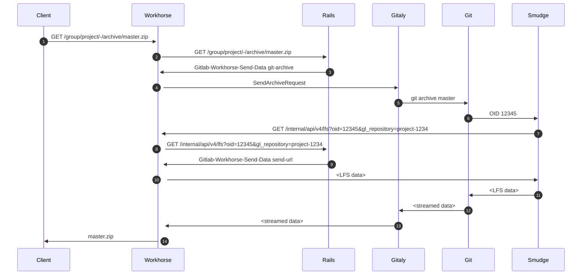

# Git LFS

## Deep Dive

In April 2019, Francisco Javier López hosted a Deep Dive (GitLab team members only: `https://gitlab.com/gitlab-org/create-stage/issues/1`)
on GitLab's [Git LFS](../topics/git/lfs/index.md) implementation to share his domain
specific knowledge with anyone who may work in this part of the code base in the future.
You can find the [recording on YouTube](https://www.youtube.com/watch?v=Yyxwcksr0Qc),
and the slides on [Google Slides](https://docs.google.com/presentation/d/1E-aw6-z0rYd0346YhIWE7E9A65zISL9iIMAOq2zaw9E/edit)
and in [PDF](https://gitlab.com/gitlab-org/create-stage/uploads/07a89257a140db067bdfb484aecd35e1/Git_LFS_Deep_Dive__Create_.pdf).
Everything covered in this deep dive was accurate as of GitLab 11.10, and while specific
details may have changed since then, it should still serve as a good introduction.

## Including LFS blobs in project archives

> [Introduced](https://gitlab.com/gitlab-org/gitlab/-/issues/15079) in GitLab 13.5.

The following diagram illustrates how GitLab resolves LFS files for project archives:

1. The user requests the project archive from the UI.
1. Workhorse forwards this request to Rails.
1. If the user is authorized to download the archive, Rails replies with
an HTTP header of `Gitlab-Workhorse-Send-Data` with a base64-encoded
JSON payload prefaced with `git-archive`. This payload includes the
`SendArchiveRequest` binary message, which is encoded again in base64.
1. Workhorse decodes the `Gitlab-Workhorse-Send-Data` payload. If the
archive already exists in the archive cache, Workhorse sends that
file. Otherwise, Workhorse sends the `SendArchiveRequest` to the
appropriate Gitaly server.
1. The Gitaly server will call `git archive <ref>` to begin generating
the Git archive on-the-fly. If the `include_lfs_blobs` flag is enabled,
Gitaly enables a custom LFS smudge filter via the `-c
filter.lfs.smudge=/path/to/gitaly-lfs-smudge` Git option.
1. When `git` identifies a possible LFS pointer using the
`.gitattributes` file, `git` calls `gitaly-lfs-smudge` and provides the
LFS pointer via the standard input. Gitaly provides `GL_PROJECT_PATH`
and `GL_INTERNAL_CONFIG` as environment variables to enable lookup of
the LFS object.
1. If a valid LFS pointer is decoded, `gitaly-lfs-smudge` makes an
internal API call to Workhorse to download the LFS object from GitLab.
1. Workhorse forwards this request to Rails. If the LFS object exists
and is associated with the project, Rails sends `ArchivePath` either
with a path where the LFS object resides (for local disk) or a
pre-signed URL (when object storage is enabled) via the
`Gitlab-Workhorse-Send-Data` HTTP header with a payload prefaced with
`send-url`.
1. Workhorse retrieves the file and send it to the `gitaly-lfs-smudge`
process, which writes the contents to the standard output.
1. `git` reads this output and sends it back to the Gitaly process.
1. Gitaly sends the data back to Rails.
1. The archive data is sent back to the client.

In step 7, the `gitaly-lfs-smudge` filter must talk to Workhorse, not to
Rails, or an invalid LFS blob will be saved. To support this, GitLab
13.5 [changed the default Omnibus configuration to have Gitaly talk to
the Workhorse](https://gitlab.com/gitlab-org/omnibus-gitlab/-/merge_requests/4592)
instead of Rails.

One side effect of this change: the correlation ID of the original
request is not preserved for the internal API requests made by Gitaly
(or `gitaly-lfs-smudge`), such as the one made in step 8. The
correlation IDs for those API requests will be random values until [this
Workhorse issue](https://gitlab.com/gitlab-org/gitlab-workhorse/-/issues/309) is
resolved.
