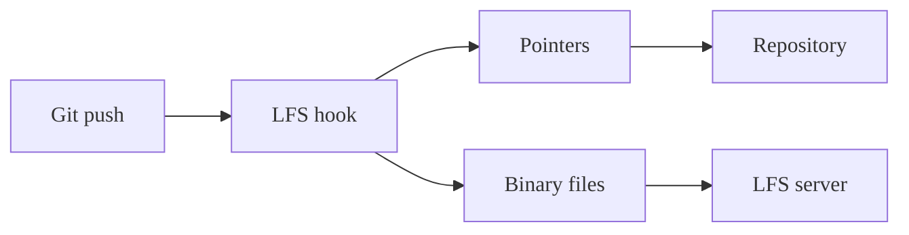
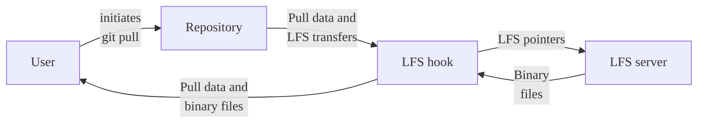
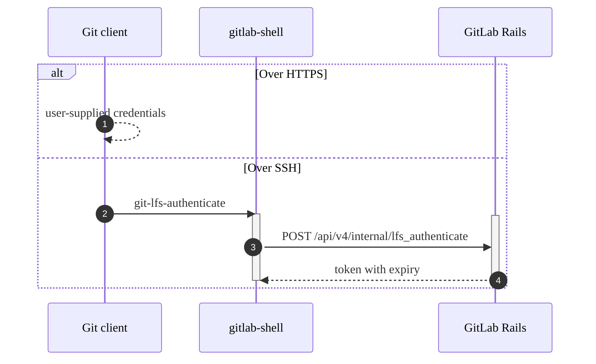
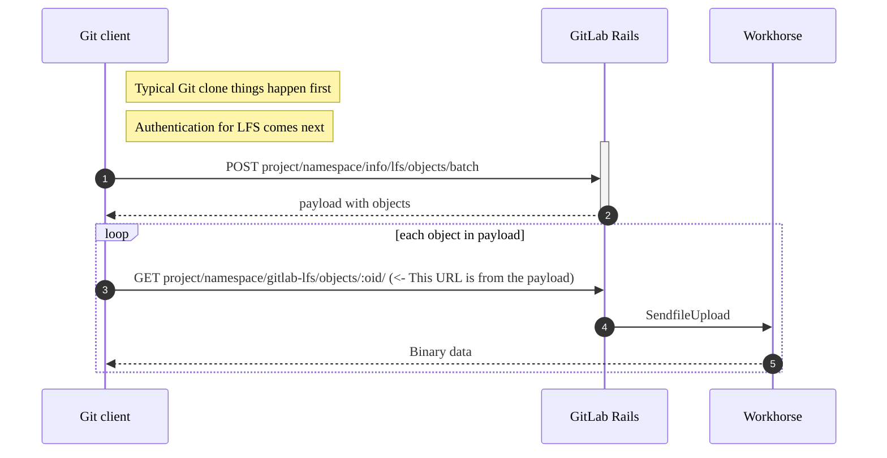
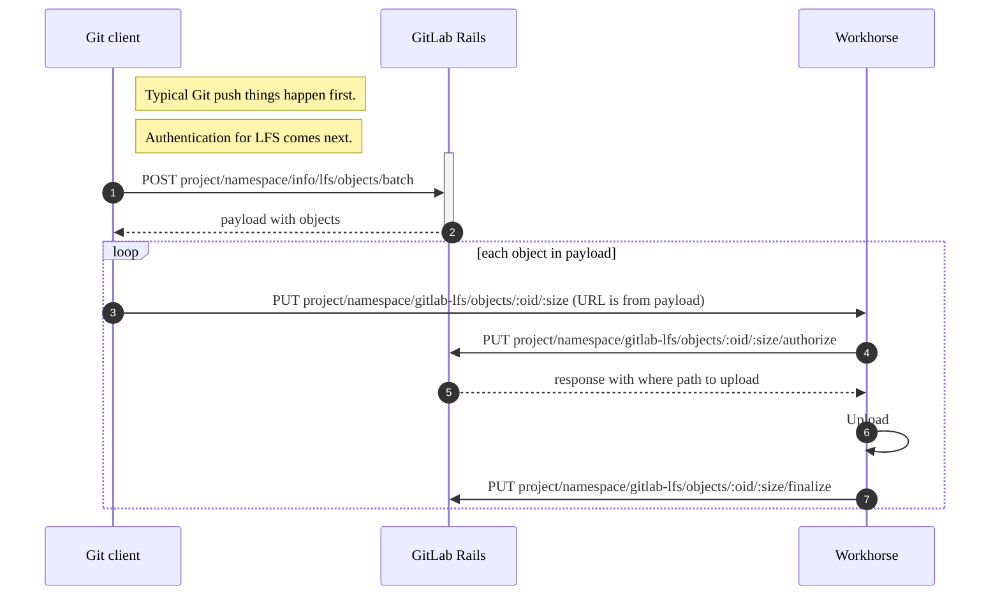
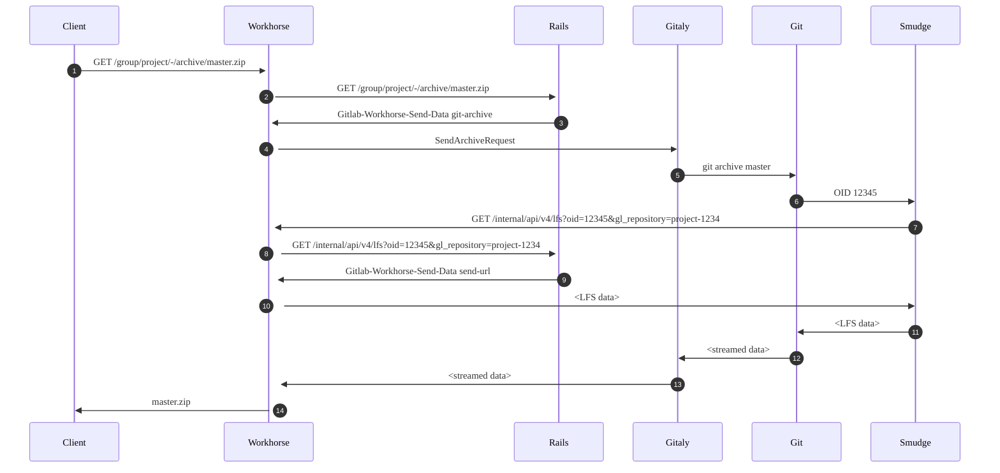

This page contains developer-centric information for GitLab team members. For the
user documentation, see [Git Large File Storage](../topics/git/lfs/_index.md).

This diagram is a high-level explanation of a Git `push` when Git LFS is in use:

This diagram is a high-level explanation of a Git `pull` when Git LFS is in use:

## Controllers and Services

### Repositories::GitHttpClientController

The methods for authentication defined here are inherited by all the other LFS controllers.

### Repositories::LfsApiController

#### `#batch`

After authentication the `batch` action is the first action called by the Git LFS
client during downloads and uploads (such as pull, push, and clone).

### Repositories::LfsStorageController

#### `#upload_authorize`

Provides payload to Workhorse including a path for Workhorse to save the file to. Could be remote object storage.

#### `#upload_finalize`

Handles requests from Workhorse that contain information on a file that workhorse already uploaded (see [this middleware](https://gitlab.com/gitlab-org/gitlab/-/blob/master/lib/gitlab/middleware/multipart.rb)) so that `gitlab` can either:

- Create an `LfsObject`.
- Connect an existing `LfsObject` to a project with an `LfsObjectsProject`.

### LfsObject and LfsObjectsProject

- Only one `LfsObject` is created for a file with a given `oid` (a SHA256 checksum of the file) and file size.
- `LfsObjectsProject` associate `LfsObject`s with `Project`s. They determine if a file can be accessed through a project.
- These objects are also used for calculating the amount of LFS storage a given project is using.
  For more information, see
  [`ProjectStatistics#update_lfs_objects_size`](https://gitlab.com/gitlab-org/gitlab/-/blob/master/app/models/project_statistics.rb#L82-84).

### Repositories::LfsLocksApiController

Handles the lock API for LFS. Delegates mostly to corresponding services:

- `Lfs::LockFileService`
- `Lfs::UnlockFileService`
- `Lfs::LocksFinderService`

These services create and delete `LfsFileLock`.

#### `#verify`

- This endpoint responds with a payload that allows a client to check if there are any files being pushed that have locks that belong to another user.
- A client-side `lfs.locksverify` configuration can be set so that the client aborts the push if locks exist that belong to another user.
- The existence of locks belonging to other users is also [validated on the server side](https://gitlab.com/gitlab-org/gitlab/-/blob/65f0c6e59121b62c9b0f89b810ef5186969bb4d2/lib/gitlab/checks/diff_check.rb#L69).

## Example authentication

1. Clients can be configured to store credentials in a few different ways.
   See the [Git LFS documentation on authentication](https://github.com/git-lfs/git-lfs/blob/bea0287cdd3acbc0aa9cdf67ae09b6843d3ffcf0/docs/api/authentication.md#git-credentials).
1. Running `gitlab-lfs-authenticate` on `gitlab-shell`. See the [Git LFS documentation concerning `gitlab-lfs-authenticate`](https://github.com/git-lfs/git-lfs/blob/bea0287cdd3acbc0aa9cdf67ae09b6843d3ffcf0/docs/api/server-discovery.md#ssh).
1. `gitlab-shell`makes a request to the GitLab API.
1. [Responding to shell with token](https://gitlab.com/gitlab-org/gitlab/-/blob/7a2f7a31a88b6085ea89b8ba188a4d92d5fada91/lib/api/internal/base.rb#L168) which is used in subsequent requests. See [Git LFS documentation concerning authentication](https://github.com/git-lfs/git-lfs/blob/bea0287cdd3acbc0aa9cdf67ae09b6843d3ffcf0/docs/api/authentication.md).

## Example clone

1. Git LFS requests to download files with authorization header from authorization.
1. `gitlab` responds with the list of objects and where to find them. See
   [LfsApiController#batch](https://gitlab.com/gitlab-org/gitlab/-/blob/7a2f7a31a88b6085ea89b8ba188a4d92d5fada91/app/controllers/repositories/lfs_api_controller.rb#L25).
1. Git LFS makes a request for each file for the `href` in the previous response. See
   [how downloads are handled with the basic transfer mode](https://github.com/git-lfs/git-lfs/blob/bea0287cdd3acbc0aa9cdf67ae09b6843d3ffcf0/docs/api/basic-transfers.md#downloads).
1. `gitlab` redirects to the remote URL if remote object storage is enabled. See
   [SendFileUpload](https://gitlab.com/gitlab-org/gitlab/-/blob/7a2f7a31a88b6085ea89b8ba188a4d92d5fada91/app/controllers/concerns/send_file_upload.rb#L4).

## Example push

1. Git LFS requests to upload files.
1. `gitlab` responds with the list of objects and uploads to find them. See
   [LfsApiController#batch](https://gitlab.com/gitlab-org/gitlab/-/blob/7a2f7a31a88b6085ea89b8ba188a4d92d5fada91/app/controllers/repositories/lfs_api_controller.rb#L27).
1. Git LFS makes a request for each file for the `href` in the previous response. See
   [how uploads are handled with the basic transfer mode](https://github.com/git-lfs/git-lfs/blob/bea0287cdd3acbc0aa9cdf67ae09b6843d3ffcf0/docs/api/basic-transfers.md#uploads).
1. `gitlab` responds with a payload including a path for Workhorse to save the file to.
   Could be remote object storage. See
   [LfsStorageController#upload_authorize](https://gitlab.com/gitlab-org/gitlab/-/blob/96250de93a410e278ef659a3d38b056f12024636/app/controllers/repositories/lfs_storage_controller.rb#L42).
1. Workhorse does the work of saving the file.
1. Workhorse makes a request to `gitlab` with information on the uploaded file so
   that `gitlab` can create an `LfsObject`. See
   [LfsStorageController#upload_finalize](https://gitlab.com/gitlab-org/gitlab/-/blob/96250de93a410e278ef659a3d38b056f12024636/app/controllers/repositories/lfs_storage_controller.rb#L51).

## Deep Dive

In April 2019, Francisco Javier López hosted a Deep Dive (GitLab team members only: `https://gitlab.com/gitlab-org/create-stage/-/issues/1`)
on the GitLab [Git LFS](../topics/git/lfs/_index.md) implementation to share domain-specific
knowledge with anyone who may work in this part of the codebase in the future.
You can find the <i class="fa fa-youtube-play youtube" aria-hidden="true"></i> [recording on YouTube](https://www.youtube.com/watch?v=Yyxwcksr0Qc),
and the slides on [Google Slides](https://docs.google.com/presentation/d/1E-aw6-z0rYd0346YhIWE7E9A65zISL9iIMAOq2zaw9E/edit)
and in [PDF](https://gitlab.com/gitlab-org/create-stage/uploads/07a89257a140db067bdfb484aecd35e1/Git_LFS_Deep_Dive__Create_.pdf).
This deep dive was accurate as of GitLab 11.10, and while specific
details may have changed, it should still serve as a good introduction.

## Including LFS blobs in project archives

The following diagram illustrates how GitLab resolves LFS files for project archives:

1. The user requests the project archive from the UI.
1. Workhorse forwards this request to Rails.
1. If the user is authorized to download the archive, Rails replies with
   an HTTP header of `Gitlab-Workhorse-Send-Data` with a base64-encoded
   JSON payload prefaced with `git-archive`. This payload includes the
   `SendArchiveRequest` binary message, which is encoded again in base64.
1. Workhorse decodes the `Gitlab-Workhorse-Send-Data` payload. If the
   archive already exists in the archive cache, Workhorse sends that
   file. Otherwise, Workhorse sends the `SendArchiveRequest` to the
   appropriate Gitaly server.
1. The Gitaly server calls `git archive <ref>` to begin generating
   the Git archive on-the-fly. If the `include_lfs_blobs` flag is enabled,
   Gitaly enables a custom LFS smudge filter with the `-c filter.lfs.smudge=/path/to/gitaly-lfs-smudge`
   Git option.
1. When `git` identifies a possible LFS pointer using the
   `.gitattributes` file, `git` calls `gitaly-lfs-smudge` and provides the
   LFS pointer through the standard input. Gitaly provides `GL_PROJECT_PATH`
   and `GL_INTERNAL_CONFIG` as environment variables to enable lookup of
   the LFS object.
1. If a valid LFS pointer is decoded, `gitaly-lfs-smudge` makes an
   internal API call to Workhorse to download the LFS object from GitLab.
1. Workhorse forwards this request to Rails. If the LFS object exists
   and is associated with the project, Rails sends `ArchivePath` either
   with a path where the LFS object resides (for local disk) or a
   pre-signed URL (when object storage is enabled) with the
   `Gitlab-Workhorse-Send-Data` HTTP header with a payload prefaced with
   `send-url`.
1. Workhorse retrieves the file and send it to the `gitaly-lfs-smudge`
   process, which writes the contents to the standard output.
1. `git` reads this output and sends it back to the Gitaly process.
1. Gitaly sends the data back to Rails.
1. The archive data is sent back to the client.

In step 7, the `gitaly-lfs-smudge` filter must talk to Workhorse, not to
Rails, or an invalid LFS blob is saved. To support this, GitLab
[changed the default Linux package configuration to have Gitaly talk to the Workhorse](https://gitlab.com/gitlab-org/omnibus-gitlab/-/merge_requests/4592)
instead of Rails.

One side effect of this change: the correlation ID of the original
request is not preserved for the internal API requests made by Gitaly
(or `gitaly-lfs-smudge`), such as the one made in step 8. The
correlation IDs for those API requests are random values until
[this Workhorse issue](https://gitlab.com/gitlab-org/gitlab-workhorse/-/issues/309) is
resolved.

## Related topics

- Blog post: [Getting started with Git LFS](https://about.gitlab.com/blog/2017/01/30/getting-started-with-git-lfs-tutorial/)
- User documentation: [Git Large File Storage (LFS)](../topics/git/lfs/_index.md)
- [GitLab Git Large File Storage (LFS) Administration](../administration/lfs/_index.md) for GitLab Self-Managed
